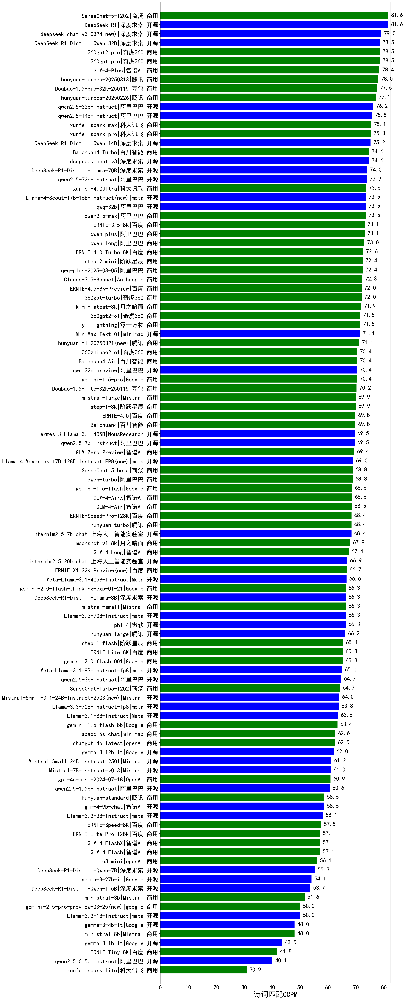

| 类别 | 大模型                         | 诗词匹配CCPM | 排名 |
|-----|------------------------------|---------|----|
|商用|SenseChat-5-1202|81.6|1|
|开源|DeepSeek-R1|81.6|2|
|商用|360gpt2-pro|78.5|3|
|开源|DeepSeek-R1-Distill-Qwen-32B|78.5|4|
|商用|360gpt-pro|78.5|5|
|商用|GLM-4-Plus|78.4|6|
|商用|hunyuan-turbos-20250313(new)|78.0|7|
|商用|Doubao-1.5-pro-32k-250115|77.6|8|
|商用|hunyuan-turbos-20250226(new)|77.1|9|
|开源|qwen2.5-32b-instruct|76.2|10|
|商用|abab7-chat-preview|76.2|11|
|开源|qwen2.5-14b-instruct|75.8|12|
|商用|xunfei-spark-max|75.4|13|
|商用|xunfei-spark-pro|75.3|14|
|开源|DeepSeek-R1-Distill-Qwen-14B|75.2|15|
|开源|deepseek-chat-v3|74.6|16|
|商用|Baichuan4-Turbo|74.6|17|
|开源|DeepSeek-R1-Distill-Llama-70B|74.0|18|
|开源|qwen2.5-72b-instruct|73.9|19|
|商用|gemini-2.0-flash-exp|73.6|20|
|商用|xunfei-4.0Ultra|73.6|21|
|商用|qwen2.5-max|73.5|22|
|开源|qwq-32b(new)|73.5|23|
|商用|ERNIE-3.5-8K|73.1|24|
|商用|qwen-plus|73.1|25|
|商用|qwen-long|73.0|26|
|商用|ERNIE-4.0-Turbo-8K|72.6|27|
|商用|step-2-mini(new)|72.4|28|
|商用|qwq-plus-2025-03-05(new)|72.4|29|
|商用|Claude-3.5-Sonnet|72.3|30|
|商用|ERNIE-4.5-8K-Preview(new)|72.0|31|
|商用|360gpt-turbo|72.0|32|
|商用|kimi-latest-8k|71.9|33|
|商用|360gpt2-o1|71.5|34|
|商用|yi-lightning|71.5|35|
|开源|MiniMax-Text-01|71.4|36|
|开源|qwq-32b-preview|70.4|37|
|商用|Baichuan4-Air|70.4|38|
|商用|360zhinao2-o1|70.4|39|
|商用|gemini-1.5-pro|70.4|40|
|商用|Doubao-1.5-lite-32k-250115|70.2|41|
|商用|step-1-8k|69.9|42|
|商用|mistral-large|69.9|43|
|商用|ERNIE-4.0|69.8|44|
|商用|Baichuan4|69.8|45|
|开源|qwen2.5-7b-instruct|69.5|46|
|开源|Hermes-3-Llama-3.1-405B|69.5|47|
|商用|GLM-Zero-Preview|69.4|48|
|商用|o1-mini|69.4|49|
|商用|SenseChat-5-beta|68.8|50|
|商用|qwen-turbo|68.8|51|
|商用|gemini-1.5-flash|68.6|52|
|商用|GLM-4-AirX|68.6|53|
|商用|GLM-4-Air|68.5|54|
|开源|internlm2_5-7b-chat|68.4|55|
|商用|hunyuan-turbo|68.4|56|
|商用|ERNIE-Speed-Pro-128K|68.4|57|
|开源|Llama-3.1-Nemotron-70B-Instruct-fp8|68.3|58|
|商用|moonshot-v1-8k|67.9|59|
|商用|GLM-4-Long|67.4|60|
|开源|internlm2_5-20b-chat|66.9|61|
|开源|Meta-Llama-3.1-405B-Instruct|66.6|62|
|商用|gemini-2.0-flash-thinking-exp-01-21|66.3|63|
|商用|mistral-small|66.3|64|
|开源|Llama-3.3-70B-Instruct|66.3|65|
|开源|phi-4|66.3|66|
|开源|DeepSeek-R1-Distill-Llama-8B|66.3|67|
|开源|hunyuan-large|66.2|68|
|商用|step-1-flash|65.4|69|
|商用|gemini-2.0-flash-001|65.3|70|
|商用|ERNIE-Lite-8K|65.3|71|
|开源|Meta-Llama-3.1-8B-Instruct-fp8|65.0|72|
|开源|gemma-2-27b-it|64.8|73|
|开源|qwen2.5-3b-instruct|64.7|74|
|商用|gemini-2.0-pro-exp-02-05|64.3|75|
|商用|SenseChat-Turbo-1202|64.3|76|
|开源|Llama-3.3-70B-Instruct-fp8|63.8|77|
|开源|Llama-3.1-8B-Instruct|63.6|78|
|商用|gemini-1.5-flash-8b|63.4|79|
|开源|gemma-2-9b-it|62.7|80|
|商用|abab6.5s-chat|62.6|81|
|商用|chatgpt-4o-latest|62.5|82|
|开源|gemma-3-12b-it(new)|62.0|83|
|开源|Mistral-Small-24B-Instruct-2501(new)|61.2|84|
|开源|Mistral-7B-Instruct-v0.3|61.0|85|
|商用|gpt-4o-mini-2024-07-18|60.9|86|
|开源|qwen2.5-1.5b-instruct|60.6|87|
|开源|Mistral-Nemo-Instruct-2407|60.2|88|
|开源|qwen2.5-math-72b-instruct|60.2|89|
|开源|glm-4-9b-chat|58.6|90|
|商用|hunyuan-standard|58.6|91|
|开源|Llama-3.2-3B-Instruct|58.1|92|
|商用|ERNIE-Speed-8K|57.5|93|
|商用|GLM-4-Flash|57.1|94|
|商用|GLM-4-FlashX|57.1|95|
|商用|ERNIE-Lite-Pro-128K|57.1|96|
|商用|o3-mini|56.1|97|
|开源|DeepSeek-R1-Distill-Qwen-7B|55.3|98|
|开源|gemma-3-27b-it(new)|54.1|99|
|开源|DeepSeek-R1-Distill-Qwen-1.5B|53.7|100|
|商用|ministral-3b|51.6|101|
|开源|Llama-3.2-1B-Instruct|50.0|102|
|开源|gemma-3-4b-it(new)|48.0|103|
|商用|ministral-8b|48.0|104|
|开源|gemma-3-1b-it(new)|43.5|105|
|商用|ERNIE-Tiny-8K|41.8|106|
|开源|qwen2.5-0.5b-instruct|40.1|107|
|商用|xunfei-spark-lite(new)|30.9|108|

