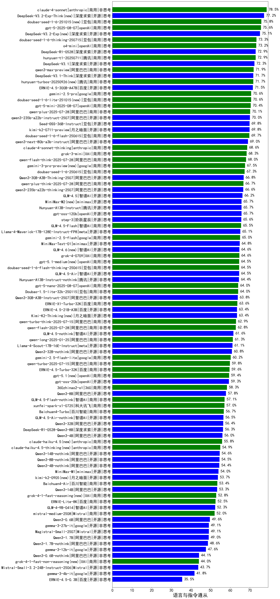

| 类别 | 大模型                         | 语言与指令遵从 | 排名 |
|-----|------------------------------|---------|----|
|商用|ERNIE-4.5-Turbo-32K(new)|85.4|1|
|商用|ERNIE-X1-Turbo-32K(new)|85.2|2|
|商用|ERNIE-4.5-8K-Preview|84.2|3|
|商用|claude-4-sonnet(new)|84.0|4|
|开源|DeepSeek-R1|83.4|5|
|商用|hunyuan-turbos-20250226|83.0|6|
|开源|DeepSeek-R1-0528(new)|82.9|7|
|商用|hunyuan-turbos-20250313|82.9|8|
|商用|Doubao-1.5-pro-32k-250115|82.8|9|
|开源|deepseek-chat-v3-0324|82.8|10|
|商用|claude-4-sonnet-thinking(new)|82.4|11|
|商用|Doubao-1.5-thinking-pro(new)|81.9|12|
|商用|o4-mini(new)|81.5|13|
|商用|hunyuan-turbo|81.5|14|
|开源|Qwen3-30B-A3B|80.7|15|
|商用|gemini-2.5-pro-preview-03-25|80.6|16|
|开源|Qwen3-235B-A22B|79.9|17|
|商用|Claude-3.5-Sonnet|79.9|18|
|商用|gemini-2.5-pro-preview-05-06(new)|79.8|19|
|商用|hunyuan-t1-20250321|79.3|20|
|开源|Qwen3-8B|79.2|21|
|商用|gpt-4.1(new)|79.1|22|
|商用|qwen2.5-max|79.0|23|
|开源|Qwen3-14B|78.8|24|
|商用|gemini-2.5-flash-preview-04-17|78.6|25|
|开源|hunyuan-large|77.7|26|
|开源|qwq-32b|77.4|27|
|开源|MiniMax-Text-01|77.0|28|
|商用|xunfei-spark-x1(new)|77.0|29|
|开源|Qwen3-4B|76.8|30|
|开源|GLM-4-32B-0414|76.8|31|
|商用|360gpt2-pro|76.7|32|
|开源|Llama-4-Maverick-17B-128E-Instruct-FP8|76.6|33|
|开源|Qwen3-32B|76.3|34|
|商用|qwq-plus-2025-03-05|76.3|35|
|商用|Doubao-1.5-lite-32k-250115|76.2|36|
|开源|DeepSeek-R1-0528-Qwen3-8B(new)|76.2|37|
|开源|GLM-Z1-32B-0414|76.1|38|
|商用|chatgpt-4o-latest|76.1|39|
|商用|GLM-Z1-Air|76.0|40|
|商用|GLM-4-Plus|76.0|41|
|商用|xunfei-spark-max|75.9|42|
|商用|ERNIE-3.5-8K|75.8|43|
|商用|xunfei-4.0Ultra|75.7|44|
|商用|SenseChat-5-1202|74.8|45|
|商用|GLM-Z1-AirX|74.7|46|
|商用|yi-lightning|74.3|47|
|商用|GLM-4-AirX|74.2|48|
|商用|gpt-4.1-mini(new)|74.1|49|
|商用|GLM-4-Air|74.0|50|
|开源|DeepSeek-R1-Distill-Qwen-32B|73.9|51|
|商用|kimi-latest-8k|73.8|52|
|开源|qwen2.5-32b-instruct|73.5|53|
|商用|gemini-2.5-flash-preview-05-20(new)|73.2|54|
|商用|SenseChat-5-beta|73.2|55|
|商用|qwen-plus|73.2|56|
|开源|qwen2.5-72b-instruct|73.1|57|
|开源|Qwen3-1.7B|73.1|58|
|开源|qwen2.5-14b-instruct|73.1|59|
|商用|hunyuan-standard|72.9|60|
|商用|xunfei-spark-pro|72.8|61|
|商用|360gpt-turbo|72.8|62|
|开源|Llama-4-Scout-17B-16E-Instruct|72.3|63|
|开源|DeepSeek-R1-Distill-Qwen-14B|72.1|64|
|商用|qwen-long|71.9|65|
|商用|GLM-4-Long|71.7|66|
|商用|step-2-mini|71.5|67|
|商用|360zhinao2-o1|71.4|68|
|开源|Meta-Llama-3.1-405B-Instruct|71.3|69|
|商用|GLM-Z1-FlashX|71.3|70|
|开源|Mistral-Small-3.1-24B-Instruct-2503|71.3|71|
|开源|Llama-3.3-70B-Instruct-fp8|71.1|72|
|开源|Llama-3.3-70B-Instruct|71.1|73|
|开源|GLM-4-9B-0414|71.0|74|
|商用|Baichuan4-Turbo|70.6|75|
|商用|mistral-large|70.5|76|
|商用|ERNIE-Speed-Pro-128K|70.2|77|
|开源|internlm2_5-7b-chat|70.1|78|
|开源|qwen2.5-7b-instruct|70.1|79|
|商用|SenseChat-Turbo-1202|69.8|80|
|开源|GLM-Z1-9B-0414|69.7|81|
|商用|GLM-Z1-Flash|69.6|82|
|开源|DeepSeek-R1-Distill-Llama-70B|69.5|83|
|商用|moonshot-v1-8k|69.2|84|
|商用|360gpt2-o1|69.1|85|
|商用|Baichuan4-Air|69.0|86|
|商用|qwen-turbo|68.9|87|
|商用|mistral-small|68.5|88|
|开源|phi-4|67.6|89|
|商用|ERNIE-Lite-Pro-128K|67.2|90|
|开源|Qwen3-0.6B|67.1|91|
|商用|gpt-4o-mini|66.9|92|
|开源|gemma-3-27b-it|66.0|93|
|商用|GLM-4-FlashX|65.7|94|
|开源|gemma-3-12b-it|65.5|95|
|商用|ERNIE-Lite-8K|65.3|96|
|商用|GLM-4-Flash|65.2|97|
|开源|GLM-Z1-Rumination-32B-0414|64.2|98|
|开源|qwen2.5-3b-instruct|62.1|99|
|商用|ERNIE-Speed-8K|61.3|100|
|开源|Meta-Llama-3.1-8B-Instruct-fp8|61.1|101|
|开源|DeepSeek-R1-Distill-Llama-8B|61.0|102|
|开源|Llama-3.1-8B-Instruct|60.6|103|
|商用|ministral-8b|59.7|104|
|开源|Llama-3.2-3B-Instruct|59.4|105|
|开源|DeepSeek-R1-Distill-Qwen-7B|58.4|106|
|开源|gemma-3-4b-it|53.6|107|
|开源|Llama-3.2-1B-Instruct|50.6|108|
|商用|ministral-3b|49.9|109|
|开源|qwen2.5-1.5b-instruct|47.4|110|
|商用|ERNIE-Tiny-8K|40.2|111|
|开源|qwen2.5-0.5b-instruct|37.0|112|
|商用|xunfei-spark-lite|36.5|113|

