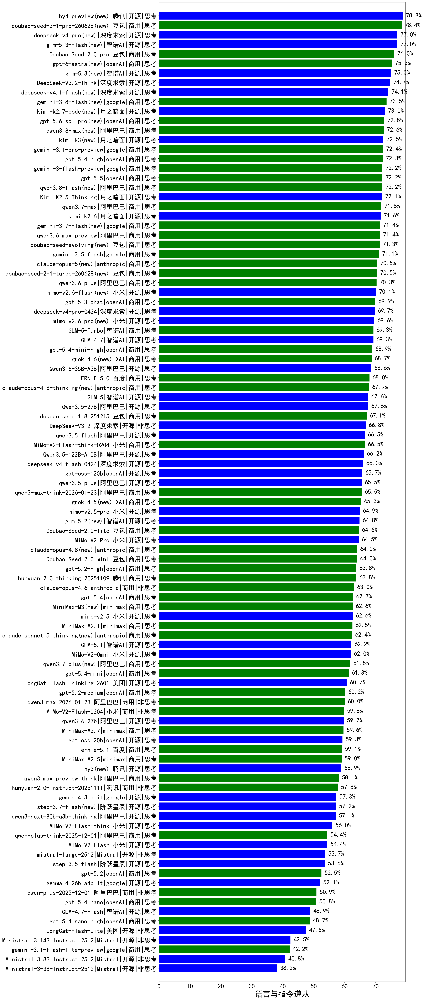

|类别|机构|大模型|【语言与指令遵从】准确率|平均耗时|平均消耗token|花费/千次（元）|排名（准确率）|
|---|---|-----|-------------------|-------|-----------|-----------|-----------|
|商用|豆包|doubao-seed-2-1-pro-260628(new)|78.4%|239s|7536|221.7|1|
|开源|深度求索|deepseek-v4-pro(new)|77.0%|138s|2401|61.1|2|
|开源|智谱AI|glm-5.3-flash(new)|77.0%|104s|3317|9.0|3|
|商用|豆包|Doubao-Seed-2.0-pro|76.0%|267s|1299|18.4|4|
|商用|openAI|gpt-6-astra(new)|75.3%|14s|342|71.3|5|
|开源|智谱AI|glm-5.3(new)|75.0%|229s|5845|160.9|6|
|开源|深度求索|DeepSeek-V3.2-Think|74.7%|131s|1366|4.0|7|
|商用|google|gemini-3.8-flash(new)|73.5%|20s|1332|63.7|8|
|开源|月之暗面|kimi-k2.7-code(new)|73.0%|44s|1558|39.5|9|
|商用|openAI|gpt-5.6-sol-pro(new)|72.8%|23s|3364|233.7|10|
|商用|阿里巴巴|qwen3.8-max(new)|72.6%|41s|1835|61.9|11|
|开源|月之暗面|kimi-k3(new)|72.5%|75s|1690|152.2|12|
|商用|google|gemini-3.1-pro-preview|72.4%|54s|3073|251.3|13|
|商用|openAI|gpt-5.4-high|72.3%|18s|787|67.4|14|
|商用|google|gemini-3-flash-preview|72.2%|69s|1364|26.4|15|
|商用|openAI|gpt-5.5|72.2%|8s|485|71.4|16|
|商用|阿里巴巴|qwen3.8-flash(new)|72.2%|41s|2118|5.4|17|
|开源|月之暗面|Kimi-K2.5-Thinking|72.1%|300s|1941|38.7|18|
|商用|阿里巴巴|qwen3.7-max|71.8%|33s|1862|63.8|19|
|开源|月之暗面|kimi-k2.6|71.6%|98s|1814|46.4|20|
|商用|google|gemini-3.7-flash(new)|71.4%|7s|814|18.3|21|
|商用|阿里巴巴|qwen3.6-max-preview|71.4%|55s|1722|86.9|22|
|商用|豆包|doubao-seed-evolving(new)|71.3%|211s|6971|204.8|23|
|商用|google|gemini-3.5-flash|71.1%|10s|1785|104.7|24|
|商用|anthropic|claude-opus-5(new)|70.5%|12s|846|115.2|25|
|商用|豆包|doubao-seed-2-1-turbo-260628(new)|70.5%|165s|6541|95.9|26|
|商用|阿里巴巴|qwen3.6-plus|70.3%|42s|1874|21.1|27|
|商用|openAI|gpt-5.3-chat|69.9%|19s|449|29.1|28|
|开源|深度求索|deepseek-v4-pro-0424|69.7%|34s|1055|23.8|29|
|商用|智谱AI|GLM-5-Turbo|69.3%|42s|1637|33.7|30|
|开源|智谱AI|GLM-4.7|69.3%|82s|3288|44.6|31|
|商用|openAI|gpt-5.4-mini-high|68.9%|33s|1050|28.5|32|
|商用|XAI|grok-4.6(new)|68.7%|227s|1977|73.2|33|
|开源|阿里巴巴|Qwen3.6-35B-A3B|68.6%|71s|1827|18.5|34|
|商用|百度|ERNIE-5.0|68.0%|137s|1834|41.8|35|
|商用|anthropic|claude-opus-4.8-thinking(new)|67.9%|14s|1051|151.2|36|
|开源|智谱AI|GLM-5|67.6%|106s|2511|43.3|37|
|开源|阿里巴巴|Qwen3.5-27B|67.6%|285s|3634|16.9|38|
|商用|豆包|doubao-seed-1-8-251215|67.1%|24s|698|4.3|39|
|开源|深度求索|DeepSeek-V3.2|66.8%|68s|388|1.0|40|
|商用|小米|MiMo-V2-Flash-think-0204|66.5%|710s|2255|4.5|41|
|开源|阿里巴巴|qwen3.5-flash|66.5%|316s|3753|7.3|42|
|开源|阿里巴巴|Qwen3.5-122B-A10B|66.2%|353s|3614|22.4|43|
|开源|深度求索|deepseek-v4-flash-0424|66.0%|26s|1000|1.9|44|
|开源|openAI|gpt-oss-120b|65.7%|129s|689|1.7|45|
|商用|阿里巴巴|qwen3-max-think-2026-01-23|65.5%|159s|3240|31.3|46|
|开源|阿里巴巴|qwen3.5-plus|65.5%|47s|3725|17.3|47|
|商用|XAI|grok-4.5(new)|65.3%|77s|1883|69.3|48|
|开源|小米|mimo-v2.5-pro|64.9%|32s|1755|31.4|49|
|开源|智谱AI|glm-5.2(new)|64.8%|111s|5013|137.6|50|
|商用|豆包|Doubao-Seed-2.0-lite|64.6%|250s|1230|3.9|51|
|开源|小米|MiMo-V2-Pro|64.5%|212s|1307|22.0|52|
|商用|豆包|Doubao-Seed-2.0-mini|64.0%|262s|1750|3.2|53|
|商用|anthropic|claude-opus-4.8(new)|64.0%|8s|543|62.2|54|
|商用|openAI|gpt-5.2-high|63.8%|12s|614|45.9|55|
|商用|腾讯|hunyuan-2.0-thinking-20251109|63.8%|14s|1262|4.7|56|
|商用|anthropic|claude-opus-4.6|63.0%|13s|569|66.6|57|
|商用|openAI|gpt-5.4|62.7%|7s|336|20.1|58|
|商用|minimax|MiniMax-M3(new)|62.6%|64s|1766|26.0|59|
|开源|小米|mimo-v2.5|62.6%|21s|1446|15.9|60|
|商用|minimax|MiniMax-M2.1|62.5%|74s|1577|12.2|61|
|商用|anthropic|claude-sonnet-5-thinking(new)|62.4%|17s|758|39.9|62|
|开源|智谱AI|GLM-5.1|62.2%|206s|2519|58.1|63|
|开源|小米|MiMo-V2-Omni|62.0%|253s|1389|15.1|64|
|商用|阿里巴巴|qwen3.7-plus(new)|61.8%|72s|3891|30.3|65|
|商用|openAI|gpt-5.4-mini|61.3%|31s|297|4.8|66|
|开源|美团|LongCat-Flash-Thinking-2601|60.7%|207s|2472|0.0|67|
|商用|openAI|gpt-5.2-medium|60.2%|8s|475|32.1|68|
|商用|阿里巴巴|qwen3-max-2026-01-23|60.0%|81s|506|4.0|69|
|商用|小米|MiMo-V2-Flash-0204|59.8%|166s|448|0.7|70|
|开源|阿里巴巴|qwen3.6-27b|59.7%|33s|2012|34.2|71|
|商用|minimax|MiniMax-M2.7|59.6%|48s|1940|15.3|72|
|开源|openAI|gpt-oss-20b|59.3%|146s|1324|1.4|73|
|商用|百度|ernie-5.1|59.1%|36s|996|15.8|74|
|商用|minimax|MiniMax-M2.5|59.0%|32s|1668|13.0|75|
|开源|腾讯|hy3(new)|58.9%|64s|350|1.0|76|
|商用|阿里巴巴|qwen3-max-preview-think|58.1%|148s|2388|54.7|77|
|商用|腾讯|hunyuan-2.0-instruct-20251111|57.8%|7s|500|0.8|78|
|开源|google|gemma-4-31b-it|57.3%|46s|380|0.8|79|
|开源|阶跃星辰|step-3.7-flash(new)|57.2%|28s|1634|12.3|80|
|开源|阿里巴巴|qwen3-next-80b-a3b-thinking|57.1%|138s|3657|14.2|81|
|开源|小米|MiMo-V2-Flash-think|56.0%|37s|2226|0.0|82|
|商用|阿里巴巴|qwen-plus-think-2025-12-01|54.4%|61s|2841|21.7|83|
|开源|小米|MiMo-V2-Flash|54.4%|27s|379|0.0|84|
|开源|Mistral|mistral-large-2512|53.7%|9s|464|3.6|85|
|开源|阶跃星辰|step-3.5-flash|53.6%|32s|2978|6.1|86|
|商用|openAI|gpt-5.2|52.5%|6s|308|15.5|87|
|开源|google|gemma-4-26b-a4b-it|52.1%|35s|442|0.9|88|
|商用|阿里巴巴|qwen-plus-2025-12-01|50.9%|20s|901|1.6|89|
|商用|openAI|gpt-5.4-nano|50.8%|23s|294|1.3|90|
|开源|智谱AI|GLM-4.7-Flash|48.9%|1098s|4518|0.0|91|
|商用|openAI|gpt-5.4-nano-high|48.7%|30s|630|4.2|92|
|开源|美团|LongCat-Flash-Lite|47.5%|153s|425|0.0|93|
|开源|Mistral|Ministral-3-14B-Instruct-2512|42.5%|14s|1116|1.6|94|
|商用|google|gemini-3.1-flash-lite-preview|42.2%|13s|362|2.5|95|
|开源|Mistral|Ministral-3-8B-Instruct-2512|40.8%|6s|493|0.5|96|
|开源|Mistral|Ministral-3-3B-Instruct-2512|38.2%|6s|473|0.3|97|

