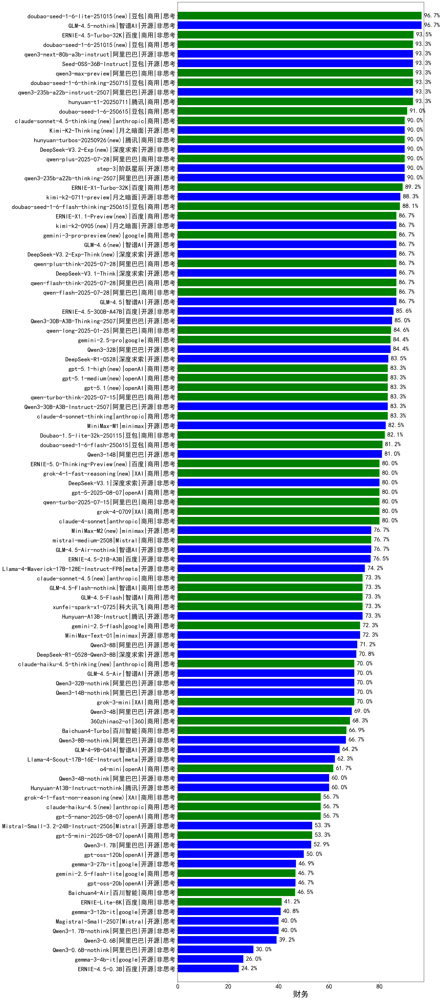

|类别|机构|大模型|【财务】准确率|平均耗时|平均消耗token|花费/千次（元）|排名（准确率）|
|---|---|-----|-------------------|-------|-----------|-----------|-----------|
|开源|智谱AI|GLM-4.5-nothink|96.7%|32s|1097|14.2|1|
|商用|腾讯|hunyuan-turbos-20250716|96.7%|31s|1592|3.0|2|
|商用|百度|ERNIE-4.5-Turbo-32K|93.5%|22s|586|1.7|3|
|商用|豆包|doubao-seed-1-6-thinking-250715|93.3%|35s|1751|13.2|4|
|商用|阿里巴巴|qwen3-max-preview(new)|93.3%|17s|775|16.6|5|
|开源|阿里巴巴|qwen3-next-80b-a3b-instruct(new)|93.3%|14s|850|3.1|6|
|商用|腾讯|hunyuan-t1-20250711|93.3%|41s|2480|9.5|7|
|开源|阿里巴巴|qwen3-235b-a22b-instruct-2507|93.3%|22s|928|6.8|8|
|开源|豆包|Seed-OSS-36B-Instruct(new)|93.3%|131s|3179|12.4|9|
|商用|豆包|Doubao-1.5-pro-32k-250115|92.0%|11s|446|0.8|10|
|商用|豆包|doubao-seed-1-6-250615|91.0%|86s|481|2.9|11|
|开源|阶跃星辰|step-3|90.0%|175s|3459|13.6|12|
|商用|阿里巴巴|qwen-plus-2025-07-28(new)|90.0%|32s|1196|2.3|13|
|开源|阿里巴巴|qwen3-235b-a22b-thinking-2507|90.0%|95s|2725|52.5|14|
|开源|华为|pangu-pro-moe|90.0%|100s|2039|7.8|15|
|商用|百度|ERNIE-X1-Turbo-32K|89.2%|160s|2595|10.1|16|
|开源|月之暗面|kimi-k2-0711-preview|88.3%|35s|547|7.7|17|
|商用|豆包|doubao-seed-1-6-flash-thinking-250615|88.1%|59s|1638|2.3|18|
|开源|深度求索|DeepSeek-V3.1-Think(new)|86.7%|98s|1948|22.6|19|
|商用|阿里巴巴|qwen-flash-think-2025-07-28|86.7%|26s|2814|4.1|20|
|开源|智谱AI|GLM-4.5|86.7%|99s|2801|38.2|21|
|商用|阿里巴巴|qwen-plus-think-2025-07-28(new)|86.7%|/|3345|26.0|22|
|商用|阿里巴巴|qwen-flash-2025-07-28|86.7%|16s|1511|2.1|23|
|开源|百度|ERNIE-4.5-300B-A47B|85.6%|26s|746|5.4|24|
|开源|阿里巴巴|Qwen3-30B-A3B-Thinking-2507|85.0%|78s|2750|7.5|25|
|开源|阿里巴巴|Qwen3-32B|84.4%|43s|1574|6.0|26|
|商用|google|gemini-2.5-pro|84.4%|32s|2608|182.5|27|
|开源|深度求索|deepseek-chat-v3-0324|84.2%|160s|801|5.9|28|
|商用|豆包|Doubao-1.5-lite-32k-250115|84.0%|7s|364|0.2|29|
|开源|深度求索|DeepSeek-R1-0528|83.5%|260s|2791|43.6|30|
|商用|阿里巴巴|qwen-turbo-think-2025-07-15(new)|83.3%|/|3930|11.5|31|
|开源|阿里巴巴|Qwen3-30B-A3B-Instruct-2507|83.3%|13s|1348|3.8|32|
|商用|anthropic|claude-4-sonnet-thinking|83.3%|57s|1142|111.5|33|
|开源|minimax|MiniMax-M1|83.1%|280s|4449|32.2|34|
|商用|阿里巴巴|qwen-long-2025-01-25|82.5%|62s|507|0.9|35|
|商用|豆包|doubao-seed-1-6-flash-250615|81.2%|14s|733|1.0|36|
|开源|阿里巴巴|Qwen3-14B|81.0%|52s|2680|5.2|37|
|开源|智谱AI|GLM-4-32B-0414|80.8%|23s|589|1.1|38|
|开源|深度求索|DeepSeek-V3.1(new)|80.0%|33s|665|7.2|39|
|商用|anthropic|claude-4-sonnet|80.0%|43s|569|49.1|40|
|商用|XAI|grok-4-0709|80.0%|305s|2981|315.4|41|
|商用|openAI|gpt-5-2025-08-07(new)|80.0%|32s|570|34.5|42|
|商用|阿里巴巴|qwen-turbo-2025-07-15|80.0%|12s|725|0.4|43|
|开源|深度求索|DeepSeek-R1-Distill-Qwen-32B|79.7%|67s|1720|2.2|44|
|开源|智谱AI|GLM-Z1-32B-0414|79.4%|172s|4353|17.1|45|
|开源|百度|ERNIE-4.5-21B-A3B|77.3%|40s|738|0.0|46|
|商用|Mistral|mistral-medium-2508(new)|76.7%|53s|702|8.5|47|
|开源|智谱AI|GLM-4.5-Air-nothink|76.7%|58s|3341|19.5|48|
|商用|科大讯飞|xunfei-4.0Ultra|75.8%|9s|273|19.2|49|
|商用|奇虎360|360gpt2-pro|75.7%|18s|445|1.8|50|
|商用|奇虎360|360gpt2-o1|75.1%|25s|583|25.9|51|
|商用|月之暗面|kimi-latest-8k|74.6%|15s|560|6.7|52|
|商用|科大讯飞|xunfei-spark-max|74.5%|9s|275|8.3|53|
|商用|智谱AI|GLM-4.5-Flash|73.3%|68s|3951|0.0|54|
|商用|智谱AI|GLM-4.5-Flash-nothink|73.3%|22s|1201|0.0|55|
|开源|腾讯|Hunyuan-A13B-Instruct|73.3%|69s|1457|5.6|56|
|商用|科大讯飞|xunfei-spark-x1-0725|73.3%|/|1802|21.6|57|
|商用|百川智能|Baichuan4-Turbo|73.2%|/|/|/|58|
|开源|meta|Llama-4-Maverick-17B-128E-Instruct-FP8|73.1%|9s|591|2.3|59|
|商用|奇虎360|360zhinao2-o1|72.9%|/|/|/|60|
|商用|google|gemini-2.5-flash|72.3%|13s|2289|39.8|61|
|商用|零一万物|yi-lightning|71.7%|/|/|/|62|
|开源|阿里巴巴|Qwen3-8B|71.0%|280s|8973|0.0|63|
|开源|深度求索|DeepSeek-R1-0528-Qwen3-8B|70.8%|305s|3428|0.0|64|
|开源|minimax|MiniMax-Text-01|70.4%|14s|965|7.7|65|
|开源|阿里巴巴|Qwen3-14B-nothink|70.0%|33s|986|1.8|66|
|开源|阿里巴巴|Qwen3-32B-nothink|70.0%|44s|741|2.6|67|
|商用|XAI|grok-3-mini|70.0%|230s|1448|5.1|68|
|开源|智谱AI|GLM-4.5-Air|70.0%|84s|4397|25.9|69|
|开源|阿里巴巴|Qwen3-4B|69.0%|31s|2163|6.2|70|
|开源|深度求索|DeepSeek-R1-Distill-Qwen-14B|68.1%|/|/|/|71|
|商用|百度|ERNIE-3.5-8K|67.0%|25s|573|1.0|72|
|商用|阶跃星辰|step-2-mini|64.9%|7s|443|0.8|73|
|开源|智谱AI|GLM-4-9B-0414|64.2%|12s|544|0.0|74|
|开源|阿里巴巴|Qwen3-8B-nothink|63.3%|80s|838|0.0|75|
|商用|科大讯飞|xunfei-spark-pro|62.8%|/|/|/|76|
|商用|openAI|o4-mini|61.7%|34s|1468|44.2|77|
|开源|meta|Llama-4-Scout-17B-16E-Instruct|60.6%|15s|660|1.3|78|
|开源|智谱AI|GLM-Z1-9B-0414|60.2%|124s|3911|0.0|79|
|开源|腾讯|Hunyuan-A13B-Instruct-nothink|60.0%|1058s|892|3.3|80|
|开源|阿里巴巴|Qwen3-4B-nothink|60.0%|24s|702|1.8|81|
|商用|openAI|gpt-5-nano-2025-08-07(new)|56.7%|29s|3042|8.5|82|
|商用|openAI|gpt-5-mini-2025-08-07(new)|53.3%|80s|1484|20.1|83|
|开源|Mistral|Mistral-Small-3.2-24B-Instruct-2506(new)|53.3%|64s|1320|2.7|84|
|商用|百川智能|Baichuan4-Air|53.3%|/|/|/|85|
|开源|阿里巴巴|Qwen3-1.7B|52.9%|28s|2558|7.4|86|
|开源|openAI|gpt-oss-120b(new)|50.0%|7s|1035|2.9|87|
|开源|openAI|gpt-oss-20b(new)|46.7%|93s|2815|3.1|88|
|商用|google|gemini-2.5-flash-lite|46.7%|21s|3986|11.3|89|
|开源|Google|gemma-3-27b-it|44.2%|/|/|/|90|
|商用|百度|ERNIE-Lite-8K|43.4%|/|/|/|91|
|开源|阿里巴巴|Qwen3-1.7B-nothink|40.0%|13s|639|1.6|92|
|开源|Mistral|Magistral-Small-2507(new)|40.0%|138s|8266|88.9|93|
|开源|阿里巴巴|Qwen3-0.6B|39.2%|15s|2461|7.1|94|
|商用|百度|ERNIE-Speed-8K|39.0%|/|/|/|95|
|开源|Google|gemma-3-12b-it|38.1%|/|/|/|96|
|开源|阿里巴巴|Qwen3-0.6B-nothink|30.0%|9s|366|0.8|97|
|开源|Google|gemma-3-4b-it|28.4%|/|/|/|98|
|商用|Mistral|ministral-8b|24.2%|/|/|/|99|
|开源|百度|ERNIE-4.5-0.3B|22.3%|39s|460|0.0|100|
|商用|Mistral|ministral-3b|21.4%|/|/|/|101|
|商用|科大讯飞|xunfei-spark-lite|19.4%|/|/|/|102|

