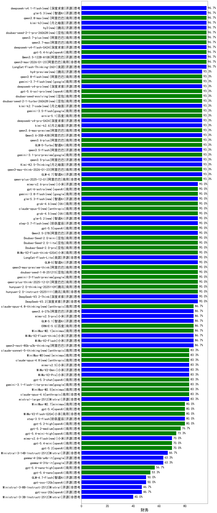

|类别|机构|大模型|【财务】准确率|平均耗时|平均消耗token|花费/千次（元）|排名（准确率）|
|---|---|-----|-------------------|-------|-----------|-----------|-----------|
|商用|阿里巴巴|qwen3.7-max|96.7%|52s|2839|99.7|1|
|开源|深度求索|deepseek-v4.1-flash(new)|96.7%|11s|1560|11.8|2|
|开源|美团|LongCat-Flash-Thinking-2601|96.7%|187s|3882|0.0|3|
|商用|阿里巴巴|qwen3-max-2026-01-23|96.7%|81s|807|7.2|4|
|开源|腾讯|hy3(new)|96.7%|97s|318|1.0|5|
|商用|openAI|gpt-5.4-high|96.7%|18s|941|88.8|6|
|商用|阿里巴巴|qwen3.7-plus(new)|96.7%|72s|3951|31.0|7|
|开源|深度求索|deepseek-v4-flash-0424|96.7%|49s|992|1.9|8|
|开源|智谱AI|glm-5.3(new)|96.7%|223s|3204|87.7|9|
|商用|豆包|doubao-seed-2-1-pro-260628(new)|96.7%|240s|8675|256.7|10|
|商用|阿里巴巴|qwen3.8-max(new)|96.7%|58s|2579|89.5|11|
|开源|月之暗面|kimi-k3(new)|96.7%|108s|985|84.9|12|
|开源|阿里巴巴|Qwen3.5-122B-A10B|96.7%|291s|3317|20.7|13|
|商用|google|gemini-3.7-flash(new)|93.3%|9s|859|20.2|14|
|商用|豆包|doubao-seed-evolving(new)|93.3%|208s|8263|244.4|15|
|商用|智谱AI|GLM-5-Turbo|93.3%|58s|2338|49.8|16|
|开源|月之暗面|Kimi-K2.5-Thinking|93.3%|424s|2739|56.0|17|
|商用|阿里巴巴|qwen3-max-think-2026-01-23|93.3%|163s|3592|35.1|18|
|开源|阿里巴巴|qwen3.5-plus|93.3%|45s|3679|17.2|19|
|商用|阿里巴巴|qwen3.8-flash(new)|93.3%|72s|2542|6.6|20|
|商用|google|gemini-3.1-pro-preview|93.3%|65s|1849|149.7|21|
|商用|豆包|doubao-seed-2-1-turbo-260628(new)|93.3%|152s|6393|94.1|22|
|开源|月之暗面|kimi-k2.7-code(new)|93.3%|41s|1171|29.7|23|
|商用|阿里巴巴|qwen3.6-max-preview|93.3%|62s|2007|103.7|24|
|开源|智谱AI|GLM-4.7|93.3%|60s|2748|37.4|25|
|商用|google|gemini-3.5-flash|93.3%|16s|1775|106.1|26|
|商用|百度|ernie-5.1|93.3%|39s|1585|27.1|27|
|开源|深度求索|deepseek-v4-pro-0424|93.3%|74s|1716|40.1|28|
|开源|腾讯|hy4-preview(new)|93.3%|72s|4441|78.7|29|
|开源|月之暗面|kimi-k2.6|93.3%|191s|3807|100.9|30|
|商用|阿里巴巴|qwen-plus-2025-12-01|93.3%|32s|1392|2.7|31|
|开源|阿里巴巴|qwen3.5-flash|93.3%|304s|4769|9.4|32|
|商用|openAI|gpt-5.6-sol-pro(new)|93.3%|16s|3780|303.1|33|
|开源|阿里巴巴|Qwen3.6-35B-A3B|93.3%|132s|2205|22.9|34|
|开源|深度求索|deepseek-v4-pro(new)|93.3%|252s|2046|52.2|35|
|商用|阿里巴巴|qwen3.6-plus|93.3%|46s|2039|23.4|36|
|开源|智谱AI|glm-5.3-flash(new)|90.0%|61s|2440|6.6|37|
|开源|智谱AI|glm-5.2(new)|90.0%|69s|2559|69.6|38|
|商用|XAI|grok-4.6(new)|90.0%|43s|2148|81.8|39|
|商用|openAI|gpt-5.5|90.0%|13s|574|100.6|40|
|开源|阶跃星辰|step-3.7-flash(new)|90.0%|89s|5089|40.5|41|
|开源|阿里巴巴|Qwen3.5-27B|90.0%|200s|3712|17.4|42|
|商用|anthropic|claude-opus-5(new)|90.0%|16s|1043|161.8|43|
|商用|豆包|Doubao-Seed-2.0-mini|90.0%|338s|2782|5.3|44|
|商用|豆包|Doubao-Seed-2.0-lite|90.0%|225s|1097|3.5|45|
|开源|深度求索|DeepSeek-V3.2|90.0%|54s|691|2.0|46|
|开源|深度求索|DeepSeek-V3.2-Think|90.0%|118s|2064|6.1|47|
|开源|小米|mimo-v2.6-pro(new)|90.0%|125s|5082|30.2|48|
|商用|腾讯|hunyuan-2.0-instruct-20251111|90.0%|9s|578|1.0|49|
|商用|腾讯|hunyuan-2.0-thinking-20251109|90.0%|17s|1476|5.7|50|
|商用|openAI|gpt-6-astra(new)|90.0%|13s|310|76.5|51|
|商用|阿里巴巴|qwen-plus-think-2025-12-01|90.0%|98s|2758|21.3|52|
|商用|XAI|grok-4.5(new)|90.0%|129s|2271|87.0|53|
|商用|google|gemini-3-flash-preview|90.0%|67s|2213|45.2|54|
|商用|豆包|doubao-seed-1-8-251215|90.0%|27s|845|5.7|55|
|商用|豆包|Doubao-Seed-2.0-pro|90.0%|224s|1074|15.3|56|
|商用|小米|MiMo-V2-Flash-think-0204|90.0%|792s|2987|6.1|57|
|商用|阿里巴巴|qwen3-max-preview-think|90.0%|175s|3327|77.8|58|
|商用|google|gemini-3.8-flash(new)|90.0%|18s|1046|50.3|59|
|开源|美团|LongCat-Flash-Lite|90.0%|365s|961|0.0|60|
|开源|智谱AI|GLM-5|90.0%|106s|2877|50.5|61|
|开源|小米|mimo-v2.5-pro|86.7%|58s|2586|49.4|62|
|开源|阿里巴巴|qwen3.6-27b|86.7%|38s|2385|41.4|63|
|开源|阿里巴巴|qwen3-next-80b-a3b-thinking|86.7%|105s|3277|12.8|64|
|开源|小米|MiMo-V2-Flash-think|86.7%|98s|3655|0.0|65|
|开源|小米|MiMo-V2-Flash|86.7%|73s|832|0.0|66|
|商用|百度|ERNIE-5.0|86.7%|229s|4324|102.1|67|
|开源|智谱AI|GLM-5.1|86.7%|181s|2484|57.9|68|
|商用|minimax|MiniMax-M2.1|86.7%|117s|3290|26.8|69|
|商用|anthropic|claude-opus-4.8-thinking(new)|86.7%|20s|1400|224.3|70|
|商用|minimax|MiniMax-M3(new)|83.3%|153s|5679|92.2|71|
|商用|anthropic|claude-sonnet-5-thinking(new)|83.3%|32s|2280|151.3|72|
|商用|google|gemini-3.1-flash-lite-preview|83.3%|22s|460|3.9|73|
|商用|anthropic|claude-opus-4.8(new)|83.3%|9s|593|83.2|74|
|开源|小米|mimo-v2.5|83.3%|52s|2741|34.5|75|
|开源|小米|MiMo-V2-Omni|83.3%|250s|2346|28.9|76|
|开源|小米|MiMo-V2-Pro|83.3%|248s|1499|26.6|77|
|商用|openAI|gpt-5.3-chat|83.3%|39s|564|45.5|78|
|商用|minimax|MiniMax-M2.5|83.3%|51s|2775|22.5|79|
|商用|anthropic|claude-opus-4.6|83.3%|18s|662|94.8|80|
|开源|Mistral|mistral-large-2512|83.3%|13s|689|6.3|81|
|商用|minimax|MiniMax-M2.7|80.0%|102s|4323|35.5|82|
|商用|openAI|gpt-5.4|80.0%|5s|367|28.5|83|
|商用|小米|MiMo-V2-Flash-0204|80.0%|424s|850|1.6|84|
|开源|阶跃星辰|step-3.5-flash|80.0%|38s|4688|9.7|85|
|商用|openAI|gpt-5.2-high|80.0%|24s|1106|100.0|86|
|商用|openAI|gpt-5.2-medium|76.7%|14s|650|54.6|87|
|商用|openAI|gpt-5.4-mini-high|73.3%|149s|1590|47.1|88|
|开源|小米|mimo-v2.6-flash(new)|70.0%|167s|3781|7.5|89|
|商用|openAI|gpt-5.4-mini|70.0%|26s|298|6.4|90|
|商用|openAI|gpt-5.2|70.0%|5s|270|16.9|91|
|开源|Mistral|Ministral-3-14B-Instruct-2512|66.7%|14s|904|1.3|92|
|开源|google|gemma-4-26b-a4b-it|63.3%|62s|810|2.0|93|
|开源|google|gemma-4-31b-it|63.3%|107s|673|1.7|94|
|商用|openAI|gpt-5.4-nano-high|56.7%|92s|1628|13.4|95|
|商用|openAI|gpt-5.4-nano|53.3%|78s|344|2.2|96|
|开源|智谱AI|GLM-4.7-Flash|50.0%|1240s|8236|0.0|97|
|开源|openAI|gpt-oss-120b|50.0%|7s|1035|2.9|98|
|开源|openAI|gpt-oss-20b|46.7%|93s|2815|3.1|99|
|开源|Mistral|Ministral-3-8B-Instruct-2512|46.7%|30s|3083|3.3|100|
|开源|Mistral|Ministral-3-3B-Instruct-2512|40.0%|34s|5641|4.0|101|

