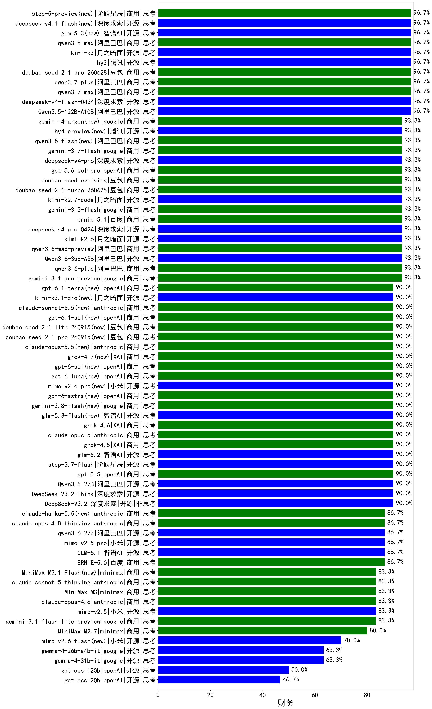

|类别|机构|大模型|【财务】准确率|平均耗时|平均消耗token|花费/千次（元）|排名（准确率）|
|---|---|-----|-------------------|-------|-----------|-----------|-----------|
|商用|豆包|doubao-seed-2-1-pro-260628|96.7%|240s|8675|256.7|1|
|商用|阶跃星辰|step-5-preview(new)|96.7%|41s|2924|57.2|2|
|商用|阿里巴巴|qwen3.7-max|96.7%|52s|2839|99.7|3|
|开源|深度求索|deepseek-v4.1-flash(new)|96.7%|11s|1560|11.8|4|
|商用|阿里巴巴|qwen3.7-plus|96.7%|72s|3951|31.0|5|
|商用|阿里巴巴|qwen3.8-max|96.7%|58s|2579|89.5|6|
|开源|智谱AI|glm-5.3(new)|96.7%|223s|3204|87.7|7|
|开源|深度求索|deepseek-v4-flash-0424|96.7%|49s|992|1.9|8|
|开源|阿里巴巴|Qwen3.5-122B-A10B|96.7%|291s|3317|20.7|9|
|开源|腾讯|hy3|96.7%|97s|318|1.0|10|
|开源|月之暗面|kimi-k3|96.7%|108s|985|84.9|11|
|商用|豆包|doubao-seed-evolving|93.3%|208s|8263|244.4|12|
|商用|google|gemini-3.7-flash|93.3%|9s|859|20.2|13|
|商用|阿里巴巴|qwen3.8-flash(new)|93.3%|72s|2542|6.6|14|
|开源|月之暗面|kimi-k2.7-code|93.3%|41s|1171|29.7|15|
|商用|openAI|gpt-5.6-sol-pro|93.3%|16s|3780|303.1|16|
|商用|google|gemini-3.5-flash|93.3%|16s|1775|106.1|17|
|商用|百度|ernie-5.1|93.3%|39s|1585|27.1|18|
|开源|腾讯|hy4-preview(new)|93.3%|72s|4441|78.7|19|
|商用|豆包|doubao-seed-2-1-turbo-260628|93.3%|152s|6393|94.1|20|
|开源|深度求索|deepseek-v4-pro|93.3%|252s|2046|52.2|21|
|开源|深度求索|deepseek-v4-pro-0424|93.3%|74s|1716|40.1|22|
|商用|阿里巴巴|qwen3.6-plus|93.3%|46s|2039|23.4|23|
|开源|月之暗面|kimi-k2.6|93.3%|191s|3807|100.9|24|
|商用|阿里巴巴|qwen3.6-max-preview|93.3%|62s|2007|103.7|25|
|开源|阿里巴巴|Qwen3.6-35B-A3B|93.3%|132s|2205|22.9|26|
|商用|google|gemini-4-argon(new)|93.3%|17s|566|64.2|27|
|商用|google|gemini-3.1-pro-preview|93.3%|65s|1849|149.7|28|
|开源|月之暗面|kimi-k3.1-pro(new)|90.0%|54s|2043|129.6|29|
|商用|XAI|grok-4.6|90.0%|43s|2148|81.8|30|
|商用|anthropic|claude-sonnet-5.5(new)|90.0%|7s|565|31.2|31|
|商用|openAI|gpt-6.1-sol(new)|90.0%|12s|292|14.0|32|
|商用|豆包|doubao-seed-2-1-lite-260915(new)|90.0%|27s|1370|3.4|33|
|商用|anthropic|claude-opus-5.5(new)|90.0%|29s|670|77.0|34|
|商用|豆包|doubao-seed-2-1-pro-260915(new)|90.0%|109s|2551|73.0|35|
|商用|openAI|gpt-6-luna(new)|90.0%|250s|607|1.8|36|
|开源|智谱AI|glm-5.3-flash(new)|90.0%|61s|2440|6.6|37|
|商用|google|gemini-3.8-flash(new)|90.0%|18s|1046|50.3|38|
|商用|XAI|grok-4.7(new)|90.0%|52s|4401|147.4|39|
|商用|openAI|gpt-6-astra(new)|90.0%|13s|310|76.5|40|
|商用|openAI|gpt-6-sol(new)|90.0%|244s|304|14.9|41|
|开源|小米|mimo-v2.6-pro(new)|90.0%|125s|5082|30.2|42|
|商用|openAI|gpt-6.1-terra(new)|90.0%|6s|331|8.4|43|
|商用|anthropic|claude-opus-5|90.0%|16s|1043|161.8|44|
|开源|深度求索|DeepSeek-V3.2|90.0%|54s|691|2.0|45|
|开源|智谱AI|glm-5.2|90.0%|69s|2559|69.6|46|
|开源|阶跃星辰|step-3.7-flash|90.0%|89s|5089|40.5|47|
|开源|深度求索|DeepSeek-V3.2-Think|90.0%|118s|2064|6.1|48|
|商用|openAI|gpt-5.5|90.0%|13s|574|100.6|49|
|商用|XAI|grok-4.5|90.0%|129s|2271|87.0|50|
|开源|阿里巴巴|Qwen3.5-27B|90.0%|200s|3712|17.4|51|
|商用|anthropic|claude-opus-4.8-thinking|86.7%|20s|1400|224.3|52|
|商用|anthropic|claude-haiku-5.5(new)|86.7%|8s|1014|3.1|53|
|开源|阿里巴巴|qwen3.6-27b|86.7%|38s|2385|41.4|54|
|商用|百度|ERNIE-5.0|86.7%|229s|4324|102.1|55|
|开源|小米|mimo-v2.5-pro|86.7%|58s|2586|49.4|56|
|开源|智谱AI|GLM-5.1|86.7%|181s|2484|57.9|57|
|商用|google|gemini-3.1-flash-lite-preview|83.3%|22s|460|3.9|58|
|商用|minimax|MiniMax-M3.1-Flash(new)|83.3%|54s|3453|13.0|59|
|开源|小米|mimo-v2.5|83.3%|52s|2741|34.5|60|
|商用|anthropic|claude-opus-4.8|83.3%|9s|593|83.2|61|
|商用|minimax|MiniMax-M3|83.3%|153s|5679|92.2|62|
|商用|anthropic|claude-sonnet-5-thinking|83.3%|32s|2280|151.3|63|
|商用|minimax|MiniMax-M2.7|80.0%|102s|4323|35.5|64|
|开源|小米|mimo-v2.6-flash(new)|70.0%|167s|3781|7.5|65|
|开源|google|gemma-4-31b-it|63.3%|107s|673|1.7|66|
|开源|google|gemma-4-26b-a4b-it|63.3%|62s|810|2.0|67|
|开源|openAI|gpt-oss-120b|50.0%|7s|1035|2.9|68|
|开源|openAI|gpt-oss-20b|46.7%|93s|2815|3.1|69|

