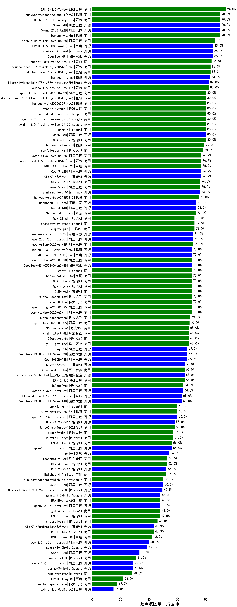

|类别|机构|大模型|【超声波医学主治医师】准确率|平均耗时|平均消耗token|花费/千次（元）|排名（准确率）|
|---|---|-----|-------------------|-------|-----------|-----------|-----------|
|商用|百度|ERNIE-4.5-Turbo-32K|100.0%|23s|562|1.6|1|
|开源|深度求索|deepseek-chat-v3-0324|90.0%|155s|356|2.5|2|
|开源|月之暗面|kimi-k2-0711-preview(new)|90.0%|31s|524|7.5|3|
|开源|阿里巴巴|Qwen3-235B-A22B-nothink|90.0%|25s|507|4.4|4|
|开源|阿里巴巴|Qwen3-4B|90.0%|11s|914|2.5|5|
|商用|阿里巴巴|qwen-plus-think-2025-04-28|90.0%|160s|2564|19.9|6|
|开源|百度|ERNIE-4.5-300B-A47B|85.0%|40s|326|2.1|7|
|商用|豆包|doubao-seed-1-6-flash-250615|85.0%|3s|304|0.3|8|
|商用|豆包|doubao-seed-1-6-250615|85.0%|72s|476|3.0|9|
|商用|智谱AI|GLM-Z1-AirX|85.0%|35s|1780|12.0|10|
|开源|minimax|MiniMax-M1|85.0%|313s|4565|35.2|11|
|商用|腾讯|hunyuan-turbos-20250604|85.0%|44s|461|0.8|12|
|商用|豆包|Doubao-1.5-lite-32k-250115|84.0%|7s|197|0.1|13|
|开源|腾讯|hunyuan-large|83.0%|14s|344|3.4|14|
|商用|豆包|Doubao-1.5-pro-32k-250115|82.0%|13s|360|0.6|15|
|开源|智谱AI|GLM-4.5-Air-nothink|80.0%|18s|960|5.4|16|
|开源|智谱AI|GLM-4.5-nothink|80.0%|19s|591|7.5|17|
|商用|智谱AI|GLM-4-Plus|80.0%|18s|318|1.6|18|
|开源|阿里巴巴|qwen3-235b-a22b-thinking-2507(new)|80.0%|165s|2859|55.8|19|
|商用|anthropic|claude-4-sonnet|80.0%|46s|600|53.9|20|
|商用|腾讯|hunyuan-t1-20250711(new)|80.0%|23s|1330|5.0|21|
|开源|华为|pangu-pro-moe|80.0%|61s|1058|4.0|22|
|商用|阿里巴巴|qwen-turbo-think-2025-04-28|80.0%|185s|2703|7.9|23|
|商用|openAI|o4-mini|80.0%|34s|1014|30.0|24|
|商用|智谱AI|GLM-Z1-Air|80.0%|45s|1638|0.8|25|
|开源|meta|Llama-4-Scout-17B-16E-Instruct|80.0%|8s|493|1.0|26|
|开源|智谱AI|GLM-Z1-32B-0414|80.0%|176s|2539|9.9|27|
|开源|阿里巴巴|Qwen3-235B-A22B|80.0%|100s|2565|25.0|28|
|商用|智谱AI|GLM-4.5-Flash-nothink|80.0%|19s|922|0.0|29|
|开源|openAI|gpt-oss-120b(new)|80.0%|4s|813|2.3|30|
|开源|openAI|gpt-oss-20b(new)|80.0%|8s|1525|1.6|31|
|商用|openAI|gpt-5-nano-2025-08-07(new)|80.0%|44s|2332|6.5|32|
|开源|阶跃星辰|step-3(new)|80.0%|99s|1932|7.5|33|
|开源|阿里巴巴|Qwen3-32B-nothink|80.0%|276s|634|2.3|34|
|商用|豆包|doubao-seed-1-6-thinking-250715(new)|80.0%|21s|1087|8.2|35|
|商用|科大讯飞|xunfei-spark-x1-0725(new)|80.0%|/|1285|15.4|36|
|商用|腾讯|hunyuan-standard|79.0%|/|/|/|37|
|商用|阿里巴巴|qwen2.5-max|76.0%|25s|504|4.2|38|
|开源|minimax|MiniMax-Text-01|76.0%|18s|924|7.4|39|
|开源|阿里巴巴|Qwen3-32B|75.0%|27s|1008|3.8|40|
|商用|豆包|doubao-seed-1-6-flash-thinking-250615|75.0%|122s|553|0.7|41|
|商用|百度|ERNIE-X1-Turbo-32K|75.0%|148s|1734|6.7|42|
|开源|阿里巴巴|Qwen3-14B|75.0%|28s|1175|2.2|43|
|商用|阶跃星辰|step-r1-v-mini|75.0%|55s|2435|18.9|44|
|商用|openAI|chatgpt-4o-latest|72.0%|/|/|/|45|
|商用|奇虎360|360gpt2-pro|72.0%|16s|295|1.2|46|
|开源|阿里巴巴|qwen2.5-72b-instruct|71.0%|17s|308|3.0|47|
|商用|阿里巴巴|qwen-long-2025-01-25|70.0%|191s|407|0.7|48|
|开源|阿里巴巴|Qwen3-8B|70.0%|178s|5167|0.0|49|
|开源|腾讯|Hunyuan-A13B-Instruct|70.0%|44s|1273|4.9|50|
|开源|深度求索|DeepSeek-R1-0528|70.0%|243s|1965|30.5|51|
|开源|智谱AI|GLM-4-32B-0414|70.0%|11s|404|0.8|52|
|商用|商汤|SenseChat-5-1202|70.0%|/|/|/|53|
|开源|meta|Llama-4-Maverick-17B-128E-Instruct-FP8|70.0%|7s|566|2.2|54|
|商用|智谱AI|GLM-4-Long|70.0%|13s|381|0.4|55|
|商用|科大讯飞|xunfei-4.0Ultra|70.0%|7s|137|9.6|56|
|商用|智谱AI|GLM-4-AirX|70.0%|12s|296|3.0|57|
|商用|科大讯飞|xunfei-spark-max|70.0%|7s|134|4.0|58|
|商用|openAI|gpt-4.1|70.0%|10s|366|16.9|59|
|开源|深度求索|DeepSeek-R1-0528-Qwen3-8B|70.0%|282s|1707|0.0|60|
|商用|google|gemini-2.5-flash|70.0%|10s|1857|32.3|61|
|开源|百度|ERNIE-4.5-21B-A3B|70.0%|6s|343|0.0|62|
|商用|科大讯飞|xunfei-spark-pro|69.0%|/|/|/|63|
|商用|阿里巴巴|qwq-plus-2025-03-05|68.5%|72s|3134|12.3|64|
|商用|奇虎360|360gpt-turbo|68.0%|/|/|/|65|
|商用|零一万物|yi-lightning|68.0%|/|/|/|66|
|商用|月之暗面|kimi-latest-8k|68.0%|23s|513|6.2|67|
|商用|奇虎360|360zhinao2-o1|68.0%|/|/|/|68|
|开源|阿里巴巴|qwq-32b|67.0%|61s|3115|18.4|69|
|开源|深度求索|DeepSeek-R1-Distill-Qwen-32B|67.0%|43s|747|0.9|70|
|开源|智谱AI|GLM-Z1-9B-0414|65.0%|161s|3412|0.0|71|
|开源|阿里巴巴|Qwen3-30B-A3B|65.0%|44s|2620|7.2|72|
|商用|google|gemini-2.5-flash-lite-preview-06-17|65.0%|2s|551|1.4|73|
|商用|google|gemini-2.5-pro|65.0%|35s|2796|197.4|74|
|商用|百度|ERNIE-3.5-8K|65.0%|27s|348|0.6|75|
|商用|百川智能|Baichuan4-Turbo|65.0%|/|/|/|76|
|开源|上海人工智能实验室|internlm2_5-7b-chat|65.0%|/|/|/|77|
|开源|阿里巴巴|qwen2.5-32b-instruct|64.0%|12s|286|1.4|78|
|商用|奇虎360|360gpt2-o1|64.0%|22s|372|15.7|79|
|开源|深度求索|DeepSeek-R1-Distill-Qwen-14B|63.0%|/|/|/|80|
|商用|openAI|gpt-5-mini-2025-08-07(new)|60.0%|82s|806|10.5|81|
|开源|阿里巴巴|Qwen3-30B-A3B-nothink|60.0%|16s|519|1.3|82|
|开源|阿里巴巴|qwen2.5-14b-instruct|60.0%|27s|287|0.7|83|
|商用|智谱AI|GLM-4.5-Flash(new)|60.0%|34s|1887|0.0|84|
|开源|阿里巴巴|Qwen3-0.6B-nothink|60.0%|9s|257|0.6|85|
|开源|智谱AI|GLM-4.5-Air(new)|60.0%|41s|2034|11.8|86|
|商用|openAI|gpt-5-2025-08-07(new)|60.0%|24s|379|22.2|87|
|开源|腾讯|Hunyuan-A13B-Instruct-nothink(new)|60.0%|15s|414|1.4|88|
|开源|阿里巴巴|Qwen3-14B-nothink|60.0%|14s|545|1.0|89|
|商用|阿里巴巴|qwen-plus-2025-07-14(new)|60.0%|16s|583|1.1|90|
|商用|openAI|gpt-4.1-mini|60.0%|11s|488|4.8|91|
|开源|阿里巴巴|Qwen3-30B-A3B-Thinking-2507(new)|60.0%|71s|3169|8.7|92|
|开源|智谱AI|GLM-4.5(new)|60.0%|68s|2086|28.5|93|
|商用|XAI|grok-3-mini|60.0%|132s|1242|4.4|94|
|商用|XAI|grok-4-0709|60.0%|255s|1437|148.7|95|
|商用|anthropic|claude-4-sonnet-thinking|60.0%|51s|1221|121.4|96|
|商用|Mistral|mistral-large|57.0%|/|/|/|97|
|商用|阶跃星辰|step-2-mini|57.0%|9s|341|0.6|98|
|商用|智谱AI|GLM-4-FlashX|56.0%|12s|351|0.0|99|
|开源|阿里巴巴|qwen2.5-7b-instruct|56.0%|7s|267|0.2|100|
|开源|智谱AI|GLM-4-9B-0414|55.0%|11s|473|0.0|101|
|商用|智谱AI|GLM-Z1-Flash|55.0%|24s|2617|0.0|102|
|开源|微软|phi-4|54.0%|/|/|/|103|
|商用|百川智能|Baichuan4-Air|52.0%|/|/|/|104|
|开源|Mistral|Mistral-Small-3.1-24B-Instruct-2503|50.0%|/|/|/|105|
|开源|阿里巴巴|Qwen3-1.7B|50.0%|21s|2123|6.1|106|
|开源|智谱AI|GLM-Z1-Rumination-32B-0414|50.0%|39s|1670|5.0|107|
|商用|OpenAI|gpt-4o-mini|48.0%|/|/|/|108|
|商用|百度|ERNIE-Lite-8K|48.0%|/|/|/|109|
|开源|Google|gemma-3-27b-it|48.0%|/|/|/|110|
|开源|阿里巴巴|qwen2.5-3b-instruct|48.0%|13s|306|0.2|111|
|商用|Mistral|mistral-small|46.0%|/|/|/|112|
|商用|百度|ERNIE-Speed-8K|42.2%|/|/|/|113|
|开源|阿里巴巴|qwen2.5-1.5b-instruct|40.0%|10s|183|0.0|114|
|商用|阿里巴巴|qwen-turbo-2025-07-15(new)|40.0%|8s|423|0.2|115|
|开源|阿里巴巴|Qwen3-4B-nothink|40.0%|16s|567|1.5|116|
|开源|阿里巴巴|Qwen3-8B-nothink|40.0%|27s|589|0.0|117|
|开源|阿里巴巴|qwen3-235b-a22b-instruct-2507(new)|40.0%|15s|624|4.5|118|
|开源|阿里巴巴|Qwen3-1.7B-nothink|40.0%|15s|545|1.4|119|
|开源|阿里巴巴|Qwen3-30B-A3B-Instruct-2507(new)|40.0%|5s|581|1.6|120|
|商用|智谱AI|GLM-Z1-FlashX|40.0%|36s|1843|0.3|121|
|开源|Google|gemma-3-12b-it|38.5%|/|/|/|122|
|开源|阿里巴巴|Qwen3-0.6B|35.0%|15s|1248|3.5|123|
|商用|Mistral|ministral-3b|31.0%|/|/|/|124|
|开源|阿里巴巴|qwen2.5-0.5b-instruct|29.0%|7s|315|0.0|125|
|开源|Google|gemma-3-4b-it|28.5%|/|/|/|126|
|商用|Mistral|ministral-8b|28.0%|/|/|/|127|
|商用|百度|ERNIE-Tiny-8K|22.0%|/|/|/|128|
|商用|科大讯飞|xunfei-spark-lite|17.7%|/|/|/|129|
|开源|百度|ERNIE-4.5-0.3B|15.0%|6s|415|0.0|130|

