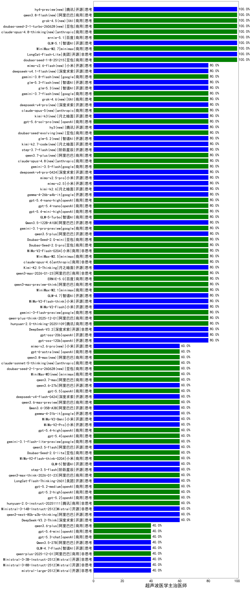

|类别|机构|大模型|【超声波医学主治医师】准确率|平均耗时|平均消耗token|花费/千次（元）|排名（准确率）|
|---|---|-----|-------------------|-------|-----------|-----------|-----------|
|商用|anthropic|claude-opus-4.8-thinking(new)|100.0%|12s|812|126.8|1|
|商用|百度|ernie-5.1|100.0%|58s|1325|23.0|2|
|商用|阿里巴巴|qwen3.8-flash(new)|100.0%|19s|1276|3.2|3|
|商用|豆包|doubao-seed-1-8-251215|100.0%|36s|696|4.8|4|
|开源|美团|LongCat-Flash-Lite|100.0%|48s|395|0.0|5|
|商用|豆包|doubao-seed-2-1-turbo-260628(new)|100.0%|124s|5246|77.4|6|
|商用|minimax|MiniMax-M2.7|100.0%|38s|1481|11.8|7|
|开源|智谱AI|GLM-5.1|100.0%|75s|1811|42.2|8|
|商用|XAI|grok-4.5(new)|100.0%|118s|1556|57.8|9|
|开源|月之暗面|kimi-k2.6|80.0%|81s|1496|39.0|10|
|开源|深度求索|deepseek-v4-pro-0424|80.0%|38s|811|18.7|11|
|开源|小米|mimo-v2.5-pro|80.0%|33s|1485|26.7|12|
|开源|小米|mimo-v2.5|80.0%|32s|1540|18.1|13|
|开源|google|gemma-4-26b-a4b-it|80.0%|21s|625|1.6|14|
|商用|anthropic|claude-opus-4.8(new)|80.0%|8s|559|82.5|15|
|商用|openAI|gpt-5.4-nano-high|80.0%|9s|542|4.1|16|
|商用|openAI|gpt-5.4-nano|80.0%|167s|325|2.2|17|
|商用|openAI|gpt-5.4-mini-high|80.0%|51s|1089|31.9|18|
|开源|openAI|gpt-oss-20b|80.0%|8s|1525|1.6|19|
|开源|阿里巴巴|Qwen3.5-122B-A10B|80.0%|158s|3341|21.0|20|
|商用|google|gemini-3.5-flash|80.0%|8s|1527|92.3|21|
|开源|openAI|gpt-oss-120b|80.0%|4s|813|2.3|22|
|商用|阿里巴巴|qwen3.7-plus(new)|80.0%|19s|935|7.0|23|
|商用|anthropic|claude-opus-5(new)|80.0%|15s|799|124.4|24|
|商用|google|gemini-3.8-flash(new)|80.0%|10s|805|39.2|25|
|开源|智谱AI|glm-5.3-flash(new)|80.0%|136s|5936|16.5|26|
|开源|智谱AI|glm-5.3(new)|80.0%|49s|1856|50.4|27|
|商用|google|gemini-3.7-flash(new)|80.0%|6s|830|20.2|28|
|商用|XAI|grok-4.6(new)|80.0%|40s|1874|71.2|29|
|开源|深度求索|deepseek-v4-pro(new)|80.0%|41s|1408|35.4|30|
|开源|月之暗面|kimi-k3(new)|80.0%|35s|742|62.5|31|
|开源|阶跃星辰|step-3.7-flash(new)|80.0%|146s|3210|25.5|32|
|商用|openAI|gpt-5.6-sol-pro(new)|80.0%|16s|3846|322.4|33|
|开源|腾讯|hy3(new)|80.0%|59s|269|0.9|34|
|商用|豆包|doubao-seed-evolving(new)|80.0%|212s|6627|196.3|35|
|开源|智谱AI|glm-5.2(new)|80.0%|53s|2098|57.2|36|
|开源|月之暗面|kimi-k2.7-code(new)|80.0%|104s|1529|39.9|37|
|开源|阿里巴巴|qwen3.5-plus|80.0%|34s|2295|10.7|38|
|商用|google|gemini-3.1-pro-preview|80.0%|69s|1562|127.8|39|
|商用|智谱AI|GLM-5-Turbo|80.0%|37s|1417|30.0|40|
|商用|豆包|Doubao-Seed-2.0-mini|80.0%|584s|2818|5.4|41|
|商用|minimax|MiniMax-M2.5|80.0%|34s|1895|15.3|42|
|商用|百度|ERNIE-5.0|80.0%|219s|2517|59.4|43|
|商用|minimax|MiniMax-M2.1|80.0%|85s|1188|9.3|44|
|商用|阿里巴巴|qwen3-max-2026-01-23|80.0%|69s|605|5.5|45|
|开源|智谱AI|GLM-4.7|80.0%|74s|2972|40.9|46|
|开源|月之暗面|Kimi-K2.5-Thinking|80.0%|322s|1610|32.7|47|
|开源|小米|MiMo-V2-Flash-think|80.0%|45s|2408|0.0|48|
|开源|小米|MiMo-V2-Flash|80.0%|7s|542|0.0|49|
|商用|google|gemini-3-flash-preview|80.0%|104s|1278|25.9|50|
|商用|anthropic|claude-opus-4.6|80.0%|12s|727|111.7|51|
|商用|阿里巴巴|qwen-plus-think-2025-12-01|80.0%|67s|2991|23.4|52|
|商用|阿里巴巴|qwen3-max-preview-think|80.0%|246s|3095|72.9|53|
|商用|小米|MiMo-V2-Flash-0204|80.0%|145s|648|1.2|54|
|商用|腾讯|hunyuan-2.0-thinking-20251109|80.0%|19s|628|2.3|55|
|商用|豆包|Doubao-Seed-2.0-pro|80.0%|195s|925|13.4|56|
|开源|深度求索|DeepSeek-V3.2|80.0%|46s|366|1.0|57|
|商用|阿里巴巴|qwen3.7-max|60.0%|21s|1123|38.7|58|
|商用|openAI|gpt-5.2-high|60.0%|17s|603|52.1|59|
|商用|openAI|gpt-5.2-medium|60.0%|13s|499|41.7|60|
|商用|豆包|doubao-seed-2-1-pro-260628(new)|60.0%|223s|7528|223.3|61|
|商用|openAI|gpt-5.2|60.0%|7s|256|17.6|62|
|商用|腾讯|hunyuan-2.0-instruct-20251111|60.0%|8s|418|0.7|63|
|商用|阿里巴巴|qwen3.8-max(new)|60.0%|75s|3251|114.4|64|
|开源|Mistral|Ministral-3-14B-Instruct-2512|60.0%|13s|555|0.8|65|
|开源|阿里巴巴|qwen3-next-80b-a3b-thinking|60.0%|187s|3907|15.4|66|
|开源|深度求索|DeepSeek-V3.2-Think|60.0%|48s|1393|4.1|67|
|商用|minimax|MiniMax-M3(new)|60.0%|25s|674|8.4|68|
|商用|anthropic|claude-sonnet-5-thinking(new)|60.0%|19s|1143|73.9|69|
|开源|阿里巴巴|qwen3.6-27b|60.0%|41s|2053|35.9|70|
|开源|智谱AI|GLM-5|60.0%|130s|2489|43.9|71|
|开源|小米|MiMo-V2-Omni|60.0%|689s|1807|21.8|72|
|商用|豆包|Doubao-Seed-2.0-lite|60.0%|223s|983|3.2|73|
|商用|google|gemini-3.1-flash-lite-preview|60.0%|5s|426|3.8|74|
|商用|openAI|gpt-5.4|60.0%|5s|371|31.1|75|
|商用|openAI|gpt-5.4-high|60.0%|17s|801|76.2|76|
|商用|小米|MiMo-V2-Flash-think-0204|60.0%|1282s|2324|4.8|77|
|开源|美团|LongCat-Flash-Thinking-2601|60.0%|197s|3355|0.0|78|
|开源|小米|MiMo-V2-Pro|60.0%|373s|1312|23.1|79|
|商用|openAI|gpt-6-astra(new)|60.0%|18s|317|85.9|80|
|开源|深度求索|deepseek-v4-flash-0424|60.0%|47s|695|1.3|81|
|开源|阶跃星辰|step-3.5-flash|60.0%|17s|1965|4.0|82|
|开源|阿里巴巴|Qwen3.6-35B-A3B|60.0%|109s|1762|18.4|83|
|商用|阿里巴巴|qwen3.6-max-preview|60.0%|51s|1625|84.5|84|
|开源|阿里巴巴|qwen3.5-flash|60.0%|209s|2990|5.8|85|
|商用|阿里巴巴|qwen3-max-think-2026-01-23|60.0%|146s|3948|38.9|86|
|开源|google|gemma-4-31b-it|60.0%|69s|562|1.4|87|
|商用|openAI|gpt-5.5|60.0%|42s|970|187.8|88|
|商用|openAI|gpt-5.3-chat|40.0%|7s|461|37.4|89|
|开源|阿里巴巴|Qwen3.5-27B|40.0%|388s|3618|17.1|90|
|开源|Mistral|mistral-large-2512|40.0%|15s|577|5.5|91|
|商用|阿里巴巴|qwen3.6-plus|40.0%|67s|1342|15.4|92|
|开源|Mistral|Ministral-3-8B-Instruct-2512|40.0%|15s|590|0.6|93|
|开源|Mistral|Ministral-3-3B-Instruct-2512|40.0%|13s|652|0.5|94|
|商用|openAI|gpt-5.4-mini|40.0%|11s|262|5.9|95|
|商用|阿里巴巴|qwen-plus-2025-12-01|40.0%|26s|1041|2.0|96|
|开源|智谱AI|GLM-4.7-Flash|40.0%|359s|2600|0.0|97|

