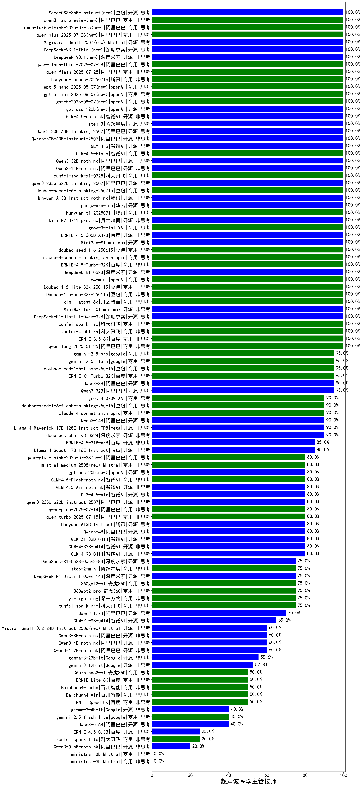

|类别|机构|大模型|【超声波医学主管技师】准确率|平均耗时|平均消耗token|花费/千次（元）|排名（准确率）|
|---|---|-----|-------------------|-------|-----------|-----------|-----------|
|商用|阿里巴巴|qwen-plus-think-2025-12-01(new)|100.0%|35s|1498|11.4|1|
|商用|openAI|gpt-5-mini-2025-08-07|100.0%|20s|739|9.7|2|
|商用|XAI|grok-4-1-fast-reasoning(new)|100.0%|15s|1470|4.7|3|
|开源|openAI|gpt-oss-120b|100.0%|4s|631|1.7|4|
|商用|google|gemini-3-pro-preview(new)|100.0%|14s|1535|125.9|5|
|开源|月之暗面|kimi-k2-0905(new)|100.0%|115s|288|3.6|6|
|开源|智谱AI|GLM-4.5-nothink|100.0%|19s|557|7.0|7|
|开源|阶跃星辰|step-3|100.0%|71s|1290|5.0|8|
|开源|阿里巴巴|Qwen3-30B-A3B-Thinking-2507|100.0%|73s|2042|5.5|9|
|开源|阿里巴巴|Qwen3-30B-A3B-Instruct-2507|100.0%|3s|440|1.2|10|
|开源|智谱AI|GLM-4.5|100.0%|56s|1551|21.0|11|
|商用|智谱AI|GLM-4.5-Flash|100.0%|27s|1230|0.0|12|
|开源|阿里巴巴|Qwen3-32B-nothink|100.0%|143s|492|1.7|13|
|开源|阿里巴巴|Qwen3-14B-nothink|100.0%|26s|511|0.9|14|
|商用|anthropic|claude-sonnet-4.5-thinking(new)|100.0%|19s|1277|127.4|15|
|商用|百度|ERNIE-X1.1-Preview(new)|100.0%|112s|496|1.8|16|
|商用|百度|ERNIE-5.0-Thinking-Preview(new)|100.0%|136s|1241|28.8|17|
|商用|科大讯飞|xunfei-spark-x1-0725|100.0%|/|784|9.4|18|
|开源|阿里巴巴|qwen3-235b-a22b-thinking-2507|100.0%|75s|1298|24.6|19|
|商用|openAI|gpt-5-2025-08-07|100.0%|20s|298|16.7|20|
|商用|openAI|gpt-5-nano-2025-08-07|100.0%|39s|1685|4.7|21|
|商用|anthropic|claude-opus-4.5(new)|100.0%|13s|726|114.7|22|
|商用|阿里巴巴|qwen-flash-2025-07-28|100.0%|7s|454|0.6|23|
|商用|豆包|doubao-seed-1-6-251015(new)|100.0%|13s|620|4.3|24|
|开源|智谱AI|GLM-4.6(new)|100.0%|54s|2127|29.0|25|
|商用|腾讯|hunyuan-turbos-20250926(new)|100.0%|14s|579|1.0|26|
|开源|深度求索|DeepSeek-V3.2-Exp-Think(new)|100.0%|36s|701|2.0|27|
|开源|深度求索|DeepSeek-V3.2-Exp(new)|100.0%|467s|298|0.8|28|
|开源|阿里巴巴|qwen3-next-80b-a3b-instruct|100.0%|7s|603|2.2|29|
|开源|豆包|Seed-OSS-36B-Instruct|100.0%|79s|1279|5.0|30|
|商用|阿里巴巴|qwen3-max-preview|100.0%|8s|383|7.8|31|
|商用|阿里巴巴|qwen-turbo-think-2025-07-15|100.0%|/|1573|4.5|32|
|开源|月之暗面|Kimi-K2-Thinking(new)|100.0%|150s|1071|16.4|33|
|商用|阿里巴巴|qwen-plus-2025-07-28|100.0%|12s|420|0.8|34|
|商用|openAI|gpt-5.1(new)|100.0%|83s|201|9.1|35|
|开源|Mistral|Magistral-Small-2507|100.0%|63s|4770|51.2|36|
|商用|openAI|gpt-5.1-medium(new)|100.0%|144s|542|33.3|37|
|开源|深度求索|DeepSeek-V3.1-Think|100.0%|38s|739|8.4|38|
|开源|深度求索|DeepSeek-V3.1|100.0%|21s|314|3.3|39|
|商用|阿里巴巴|qwen-flash-think-2025-07-28|100.0%|15s|1597|2.3|40|
|开源|minimax|MiniMax-M2(new)|100.0%|42s|1249|9.9|41|
|商用|豆包|doubao-seed-1-6-thinking-250715|100.0%|21s|847|6.3|42|
|开源|腾讯|Hunyuan-A13B-Instruct-nothink|100.0%|15s|357|1.2|43|
|商用|豆包|doubao-seed-1-6-250615|100.0%|83s|518|3.4|44|
|商用|阿里巴巴|qwen-plus-2025-12-01(new)|100.0%|16s|702|1.3|45|
|商用|阿里巴巴|qwen-plus-think-2025-12-01(new)|100.0%|35s|1498|11.4|46|
|商用|阿里巴巴|qwen-plus-2025-12-01(new)|100.0%|16s|702|1.3|47|
|商用|豆包|Doubao-1.5-lite-32k-250115|100.0%|1s|148|0.1|48|
|商用|腾讯|hunyuan-2.0-thinking-20251109(new)|100.0%|4s|472|1.7|49|
|商用|腾讯|hunyuan-2.0-instruct-20251111(new)|100.0%|6s|306|0.5|50|
|开源|Mistral|mistral-large-2512(new)|100.0%|10s|473|4.4|51|
|开源|阿里巴巴|qwen3-next-80b-a3b-thinking(new)|100.0%|132s|1823|7.1|52|
|开源|深度求索|DeepSeek-V3.2-Think(new)|100.0%|19s|601|1.7|53|
|商用|openAI|o4-mini|100.0%|32s|792|23.1|54|
|开源|深度求索|DeepSeek-R1-0528|100.0%|206s|1489|23.0|55|
|开源|深度求索|DeepSeek-V3.2(new)|100.0%|30s|251|0.7|56|
|商用|anthropic|claude-4-sonnet-thinking|100.0%|44s|1040|102.8|57|
|商用|百度|ERNIE-4.5-Turbo-32K|100.0%|23s|557|1.6|58|
|商用|豆包|doubao-seed-1-6-lite-251015(new)|100.0%|29s|619|1.3|59|
|开源|minimax|MiniMax-M1|100.0%|44s|1172|6.2|60|
|商用|腾讯|hunyuan-t1-20250711|100.0%|17s|947|3.5|61|
|商用|openAI|gpt-5-nano-high(new)|100.0%|1040s|3684|10.5|62|
|开源|月之暗面|kimi-k2-0711-preview|100.0%|29s|514|7.4|63|
|商用|XAI|grok-3-mini|100.0%|148s|1010|3.5|64|
|开源|百度|ERNIE-4.5-300B-A47B|100.0%|13s|317|2.1|65|
|商用|百度|ERNIE-X1-Turbo-32K|95.0%|57s|1283|4.9|66|
|商用|google|gemini-2.5-pro|95.0%|26s|2203|154.8|67|
|商用|google|gemini-2.5-flash|95.0%|9s|1615|28.0|68|
|开源|阿里巴巴|Qwen3-8B|95.0%|608s|14894|0.0|69|
|商用|豆包|doubao-seed-1-6-flash-250615|95.0%|4s|330|0.4|70|
|开源|阿里巴巴|Qwen3-32B|95.0%|33s|1404|5.4|71|
|开源|meta|Llama-4-Maverick-17B-128E-Instruct-FP8|90.0%|9s|559|2.2|72|
|商用|XAI|grok-4-0709|90.0%|275s|1118|114.6|73|
|开源|meta|Llama-4-Scout-17B-16E-Instruct|90.0%|9s|564|1.1|74|
|商用|豆包|doubao-seed-1-6-flash-thinking-250615|90.0%|5s|496|0.6|75|
|商用|anthropic|claude-4-sonnet|90.0%|42s|591|54.1|76|
|开源|阿里巴巴|Qwen3-14B|90.0%|20s|695|1.3|77|
|开源|百度|ERNIE-4.5-21B-A3B|85.0%|56s|342|0.0|78|
|开源|Mistral|Ministral-3-14B-Instruct-2512(new)|80.0%|13s|489|0.7|79|
|商用|anthropic|claude-haiku-4.5-thinking(new)|80.0%|43s|1695|57.2|80|
|开源|Mistral|Ministral-3-8B-Instruct-2512(new)|80.0%|12s|555|0.6|81|
|商用|anthropic|claude-sonnet-4.5(new)|80.0%|12s|564|52.5|82|
|商用|openAI|gpt-5-mini-high(new)|80.0%|84s|1993|27.8|83|
|商用|openAI|gpt-5.2(new)|80.0%|5s|236|16.2|84|
|商用|openAI|gpt-5.1-high(new)|80.0%|147s|719|45.9|85|
|商用|阿里巴巴|qwen3-max-2025-09-23(new)|80.0%|53s|403|8.3|86|
|商用|阿里巴巴|qwen-long-2025-01-25|80.0%|76s|333|0.6|87|
|商用|阿里巴巴|qwen-plus-think-2025-07-28|80.0%|/|1972|15.2|88|
|开源|智谱AI|GLM-4.5-Air|80.0%|24s|1178|6.7|89|
|开源|minimax|MiniMax-Text-01|80.0%|10s|896|6.3|90|
|开源|智谱AI|GLM-4-9B-0414|80.0%|10s|501|0.0|91|
|开源|阿里巴巴|Qwen3-4B|80.0%|17s|1595|4.6|92|
|商用|阿里巴巴|qwen-turbo-2025-07-15|80.0%|7s|343|0.2|93|
|开源|阿里巴巴|qwen3-235b-a22b-instruct-2507|80.0%|10s|421|2.9|94|
|开源|腾讯|Hunyuan-A13B-Instruct|80.0%|31s|997|3.8|95|
|开源|智谱AI|GLM-4.5-Air-nothink|80.0%|13s|897|5.0|96|
|开源|openAI|gpt-oss-20b|80.0%|13s|1276|1.4|97|
|商用|Mistral|mistral-medium-2508|80.0%|477s|470|5.7|98|
|商用|智谱AI|GLM-4.5-Flash-nothink|80.0%|18s|952|0.0|99|
|开源|深度求索|DeepSeek-R1-0528-Qwen3-8B|75.0%|260s|1658|0.0|100|
|开源|阿里巴巴|Qwen3-1.7B|70.0%|20s|2216|6.4|101|
|开源|google|gemma-3-27b-it|65.0%|/|/|/|102|
|开源|Mistral|Ministral-3-3B-Instruct-2512(new)|60.0%|10s|547|0.4|103|
|开源|Mistral|Mistral-Small-3.2-24B-Instruct-2506|60.0%|27s|486|0.9|104|
|开源|阿里巴巴|Qwen3-1.7B-nothink|60.0%|10s|441|1.1|105|
|开源|阿里巴巴|Qwen3-4B-nothink|60.0%|31s|506|1.3|106|
|商用|anthropic|claude-haiku-4.5(new)|60.0%|10s|605|18.6|107|
|开源|google|gemma-3-12b-it|50.0%|/|/|/|108|
|商用|百川智能|Baichuan4-Turbo|50.0%|/|/|/|109|
|商用|百度|ERNIE-Lite-8K|50.0%|/|/|/|110|
|商用|360|360zhinao2-o1|50.0%|/|/|/|111|
|商用|百川智能|Baichuan4-Air|50.0%|/|/|/|112|
|开源|google|gemma-3-4b-it|45.0%|/|/|/|113|
|商用|google|gemini-2.5-flash-lite|40.0%|28s|13184|38.1|114|
|开源|阿里巴巴|Qwen3-0.6B|40.0%|7s|1507|4.3|115|
|开源|阿里巴巴|Qwen3-8B-nothink|40.0%|157s|588|0.0|116|
|商用|XAI|grok-4-1-fast-non-reasoning(new)|40.0%|7s|766|2.2|117|
|开源|百度|ERNIE-4.5-0.3B|25.0%|56s|397|0.0|118|
|开源|阿里巴巴|Qwen3-0.6B-nothink|20.0%|9s|247|0.5|119|

