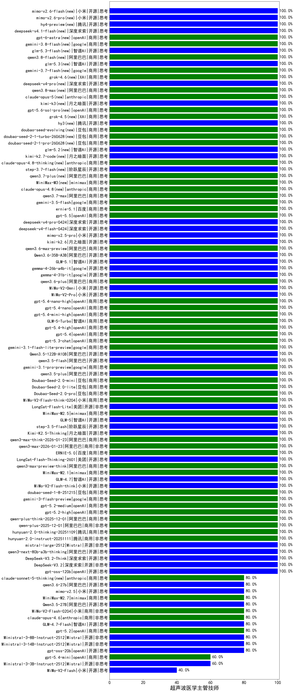

|类别|机构|大模型|【超声波医学主管技师】准确率|平均耗时|平均消耗token|花费/千次（元）|排名（准确率）|
|---|---|-----|-------------------|-------|-----------|-----------|-----------|
|开源|openAI|gpt-oss-120b|100.0%|4s|631|1.7|1|
|商用|阿里巴巴|qwen3.7-plus|100.0%|19s|844|6.3|2|
|商用|豆包|doubao-seed-evolving|100.0%|193s|4059|119.3|3|
|商用|豆包|doubao-seed-2-1-turbo-260628|100.0%|73s|2969|43.3|4|
|商用|豆包|doubao-seed-2-1-pro-260628|100.0%|133s|4551|134.0|5|
|开源|智谱AI|glm-5.2|100.0%|37s|1530|41.4|6|
|开源|月之暗面|kimi-k2.7-code|100.0%|71s|652|16.3|7|
|商用|anthropic|claude-opus-4.8-thinking|100.0%|11s|694|107.4|8|
|开源|阶跃星辰|step-3.7-flash|100.0%|85s|1307|10.1|9|
|商用|minimax|MiniMax-M3|100.0%|26s|577|6.8|10|
|商用|XAI|grok-4.5|100.0%|109s|1721|64.8|11|
|商用|anthropic|claude-opus-4.8|100.0%|13s|547|81.7|12|
|商用|阿里巴巴|qwen3.7-max|100.0%|18s|834|28.3|13|
|商用|google|gemini-3.5-flash|100.0%|8s|1274|76.7|14|
|商用|百度|ernie-5.1|100.0%|18s|743|12.5|15|
|商用|openAI|gpt-5.5|100.0%|21s|332|55.1|16|
|开源|深度求索|deepseek-v4-pro-0424|100.0%|14s|415|9.2|17|
|开源|深度求索|deepseek-v4-flash-0424|100.0%|24s|597|1.1|18|
|开源|腾讯|hy3|100.0%|51s|196|0.6|19|
|商用|openAI|gpt-5.6-sol-pro|100.0%|13s|2845|196.4|20|
|商用|阿里巴巴|qwen3.6-max-preview|100.0%|39s|1316|67.9|21|
|商用|google|gemini-3.8-flash(new)|100.0%|45s|683|33.0|22|
|商用|openAI|gpt-6-sol(new)|100.0%|208s|192|8.8|23|
|商用|openAI|gpt-6-luna(new)|100.0%|426s|348|1.0|24|
|开源|小米|mimo-v2.6-flash(new)|100.0%|60s|680|1.3|25|
|开源|小米|mimo-v2.6-pro(new)|100.0%|42s|1639|9.6|26|
|开源|腾讯|hy4-preview(new)|100.0%|25s|1208|20.8|27|
|开源|深度求索|deepseek-v4.1-flash(new)|100.0%|5s|406|2.7|28|
|商用|openAI|gpt-6-astra(new)|100.0%|7s|209|49.8|29|
|开源|智谱AI|glm-5.3-flash(new)|100.0%|25s|883|2.3|30|
|开源|月之暗面|kimi-k3(new)|100.0%|63s|715|60.0|31|
|商用|阿里巴巴|qwen3.8-flash(new)|100.0%|11s|484|1.1|32|
|开源|智谱AI|glm-5.3(new)|100.0%|28s|837|22.0|33|
|商用|google|gemini-3.7-flash(new)|100.0%|6s|960|23.8|34|
|商用|XAI|grok-4.6(new)|100.0%|46s|1568|58.3|35|
|开源|深度求索|deepseek-v4-pro(new)|100.0%|13s|401|8.3|36|
|商用|阿里巴巴|qwen3.8-max(new)|100.0%|37s|498|15.3|37|
|商用|anthropic|claude-opus-5(new)|100.0%|13s|683|105.5|38|
|开源|小米|mimo-v2.5-pro|100.0%|19s|938|15.3|39|
|开源|月之暗面|kimi-k2.6|100.0%|396s|1026|26.4|40|
|开源|阿里巴巴|Qwen3.6-35B-A3B|100.0%|104s|1317|13.6|41|
|商用|minimax|MiniMax-M2.5|100.0%|18s|765|5.8|42|
|商用|google|gemini-3.1-pro-preview|100.0%|25s|1205|97.8|43|
|开源|阿里巴巴|qwen3.5-plus|100.0%|18s|1468|6.8|44|
|商用|豆包|Doubao-Seed-2.0-mini|100.0%|300s|1111|2.0|45|
|商用|豆包|Doubao-Seed-2.0-lite|100.0%|110s|609|1.9|46|
|商用|豆包|Doubao-Seed-2.0-pro|100.0%|127s|636|8.8|47|
|商用|小米|MiMo-V2-Flash-think-0204|100.0%|440s|966|1.9|48|
|开源|美团|LongCat-Flash-Lite|100.0%|70s|458|0.0|49|
|开源|智谱AI|GLM-5|100.0%|42s|1510|26.2|50|
|开源|阿里巴巴|Qwen3.5-122B-A10B|100.0%|79s|1845|11.4|51|
|开源|阶跃星辰|step-3.5-flash|100.0%|17s|1394|2.8|52|
|开源|月之暗面|Kimi-K2.5-Thinking|100.0%|198s|1201|24.1|53|
|商用|阿里巴巴|qwen3-max-think-2026-01-23|100.0%|274s|1680|16.2|54|
|商用|阿里巴巴|qwen3-max-2026-01-23|100.0%|115s|419|3.6|55|
|商用|百度|ERNIE-5.0|100.0%|59s|1072|24.7|56|
|开源|深度求索|DeepSeek-V3.2-Think|100.0%|19s|601|1.7|57|
|开源|深度求索|DeepSeek-V3.2|100.0%|30s|251|0.7|58|
|开源|阿里巴巴|qwen3.5-flash|100.0%|86s|2190|4.3|59|
|商用|XAI|grok-4.7(new)|100.0%|38s|3516|111.1|60|
|商用|google|gemini-3.1-flash-lite-preview|100.0%|6s|381|3.4|61|
|商用|openAI|gpt-5.4-nano|100.0%|10s|297|2.0|62|
|开源|智谱AI|GLM-5.1|100.0%|137s|1171|26.9|63|
|开源|google|gemma-4-26b-a4b-it|100.0%|43s|577|1.5|64|
|开源|google|gemma-4-31b-it|100.0%|19s|596|1.5|65|
|商用|阿里巴巴|qwen3.6-plus|100.0%|29s|1288|14.8|66|
|开源|小米|MiMo-V2-Omni|100.0%|157s|1201|13.3|67|
|开源|小米|MiMo-V2-Pro|100.0%|48s|1192|20.6|68|
|商用|openAI|gpt-5.4-nano-high|100.0%|18s|440|3.2|69|
|商用|openAI|gpt-5.4-mini-high|100.0%|13s|674|19.1|70|
|商用|智谱AI|GLM-5-Turbo|100.0%|51s|1121|23.5|71|
|商用|openAI|gpt-5.4-high|100.0%|9s|516|46.9|72|
|商用|openAI|gpt-5.4|100.0%|19s|277|21.8|73|
|商用|openAI|gpt-5.3-chat|100.0%|44s|373|29.4|74|
|商用|小米|MiMo-V2-Flash-0204|80.0%|374s|549|1.0|75|
|开源|openAI|gpt-oss-20b|80.0%|13s|1276|1.4|76|
|商用|minimax|MiniMax-M2.7|80.0%|32s|1209|9.5|77|
|商用|anthropic|claude-opus-4.6|80.0%|24s|630|96.0|78|
|开源|阿里巴巴|qwen3.6-27b|80.0%|27s|1610|27.9|79|
|开源|阿里巴巴|Qwen3.5-27B|80.0%|300s|2342|10.9|80|
|开源|小米|mimo-v2.5|80.0%|35s|1636|19.4|81|
|商用|anthropic|claude-sonnet-5-thinking|80.0%|26s|742|46.4|82|
|商用|openAI|gpt-5.4-mini|60.0%|56s|257|5.9|83|

