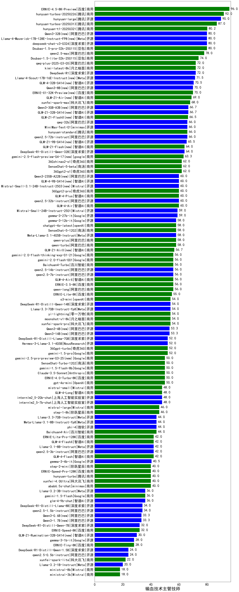

| 类别 | 大模型                         | 输血技术主管技师 | 排名 |
|-----|------------------------------|---------|----|
|商用|ERNIE-4.5-8K-Preview|96.0|1|
|商用|hunyuan-turbos-20250226|92.0|2|
|开源|hunyuan-large|90.0|3|
|商用|hunyuan-turbos-20250313|87.0|4|
|商用|hunyuan-t1-20250321|80.2|5|
|开源|Llama-4-Maverick-17B-128E-Instruct-FP8|80.0|6|
|开源|Qwen3-32B(new)|80.0|7|
|商用|Doubao-1.5-pro-32k-250115|80.0|8|
|开源|deepseek-chat-v3-0324|80.0|9|
|商用|qwen2.5-max|78.0|10|
|商用|Doubao-1.5-lite-32k-250115|74.0|11|
|商用|xunfei-spark-x1(new)|73.0|12|
|开源|DeepSeek-R1|72.0|13|
|商用|qwq-plus-2025-03-05|72.0|14|
|商用|kimi-latest-8k|72.0|15|
|开源|Llama-4-Scout-17B-16E-Instruct|71.5|16|
|开源|GLM-4-32B-0414(new)|70.5|17|
|商用|ERNIE-X1-32K-Preview|70.0|18|
|开源|Qwen3-8B(new)|70.0|19|
|商用|GLM-Z1-Air(new)|69.0|20|
|商用|xunfei-spark-max|68.0|21|
|开源|Qwen3-30B-A3B(new)|66.7|22|
|开源|GLM-Z1-32B-0414(new)|66.7|23|
|商用|GLM-Z1-FlashX(new)|66.5|24|
|开源|qwq-32b|66.0|25|
|开源|MiniMax-Text-01|66.0|26|
|商用|hunyuan-standard|66.0|27|
|开源|qwen2.5-72b-instruct|66.0|28|
|开源|GLM-Z1-9B-0414(new)|65.5|29|
|开源|DeepSeek-R1-Distill-Qwen-32B|64.0|30|
|商用|GLM-Z1-Flash(new)|64.0|31|
|商用|gemini-2.5-flash-preview-04-17(new)|63.3|32|
|商用|360zhinao2-o1|62.0|33|
|商用|360gpt2-o1|62.0|34|
|商用|SenseChat-5-beta|62.0|35|
|开源|GLM-4-9B-0414(new)|60.0|36|
|商用|GLM-4-Air|60.0|37|
|商用|GLM-4-Plus|60.0|38|
|商用|360gpt2-pro|60.0|39|
|开源|qwen2.5-32b-instruct|60.0|40|
|开源|Mistral-Small-3.1-24B-Instruct-2503|60.0|41|
|开源|Qwen3-235B-A22B(new)|60.0|42|
|开源|gemma-3-27b-it|59.0|43|
|商用|qwen-plus|58.0|44|
|开源|Meta-Llama-3.1-405B-Instruct|58.0|45|
|开源|gemma-3-12b-it|58.0|46|
|商用|chatgpt-4o-latest|58.0|47|
|商用|qwen-turbo|58.0|48|
|商用|SenseChat-5-1202|58.0|49|
|商用|GLM-Z1-AirX(new)|56.7|50|
|商用|qwen-long|56.0|51|
|商用|ERNIE-3.5-8K|56.0|52|
|商用|gemini-2.0-flash-001|56.0|53|
|开源|qwen2.5-14b-instruct|56.0|54|
|开源|qwen2.5-7b-instruct|56.0|55|
|商用|GLM-4-AirX|56.0|56|
|商用|Baichuan4-Turbo|56.0|57|
|商用|ERNIE-Lite-8K|55.0|58|
|商用|o3-mini|54.0|59|
|开源|DeepSeek-R1-Distill-Qwen-14B|54.0|60|
|商用|yi-lightning|54.0|61|
|商用|moonshot-v1-8k|54.0|62|
|商用|xunfei-spark-pro|54.0|63|
|开源|Llama-3.3-70B-Instruct-fp8|54.0|64|
|开源|Qwen3-4B(new)|53.3|65|
|开源|Qwen3-14B(new)|53.3|66|
|开源|DeepSeek-R1-Distill-Llama-70B|52.0|67|
|商用|360gpt-turbo|52.0|68|
|商用|gpt-4o-mini|50.0|69|
|商用|Claude-3.5-Sonnet|50.0|70|
|商用|ERNIE-4.0-Turbo-8K|50.0|71|
|商用|gemini-2.5-pro-preview-03-25(new)|50.0|72|
|商用|SenseChat-Turbo-1202|50.0|73|
|商用|mistral-small|48.0|74|
|开源|internlm2_5-7b-chat|48.0|75|
|开源|internlm2_5-20b-chat|48.0|76|
|商用|GLM-4-Long|48.0|77|
|商用|mistral-large|46.0|78|
|开源|phi-4|44.0|79|
|开源|Meta-Llama-3.1-8B-Instruct-fp8|44.0|80|
|开源|Llama-3.3-70B-Instruct|44.0|81|
|商用|Baichuan4-Air|44.0|82|
|开源|qwen2.5-3b-instruct|42.0|83|
|商用|GLM-4-FlashX|42.0|84|
|商用|ERNIE-Lite-Pro-128K|42.0|85|
|开源|Llama-3.1-8B-Instruct|42.0|86|
|商用|GLM-4-Flash|42.0|87|
|开源|gemma-3-4b-it|40.5|88|
|商用|abab6.5s-chat|40.0|89|
|商用|xunfei-4.0Ultra|40.0|90|
|商用|ERNIE-Speed-Pro-128K|40.0|91|
|商用|step-2-mini|40.0|92|
|商用|hunyuan-turbo|40.0|93|
|开源|glm-4-9b-chat|36.0|94|
|开源|Llama-3.2-3B-Instruct|36.0|95|
|开源|qwen2.5-1.5b-instruct|34.0|96|
|开源|DeepSeek-R1-Distill-Llama-8B|34.0|97|
|开源|Qwen3-0.6B(new)|33.3|98|
|开源|Qwen3-1.7B(new)|33.3|99|
|开源|DeepSeek-R1-Distill-Qwen-7B|32.0|100|
|商用|ERNIE-Speed-8K|32.0|101|
|开源|GLM-Z1-Rumination-32B-0414(new)|30.0|102|
|商用|ERNIE-Tiny-8K|28.0|103|
|开源|qwen2.5-0.5b-instruct|24.0|104|
|开源|DeepSeek-R1-Distill-Qwen-1.5B|24.0|105|
|商用|xunfei-spark-lite|22.0|106|
|开源|Llama-3.2-1B-Instruct|20.0|107|
|商用|ministral-3b|18.0|108|
|商用|ministral-8b|18.0|109|

