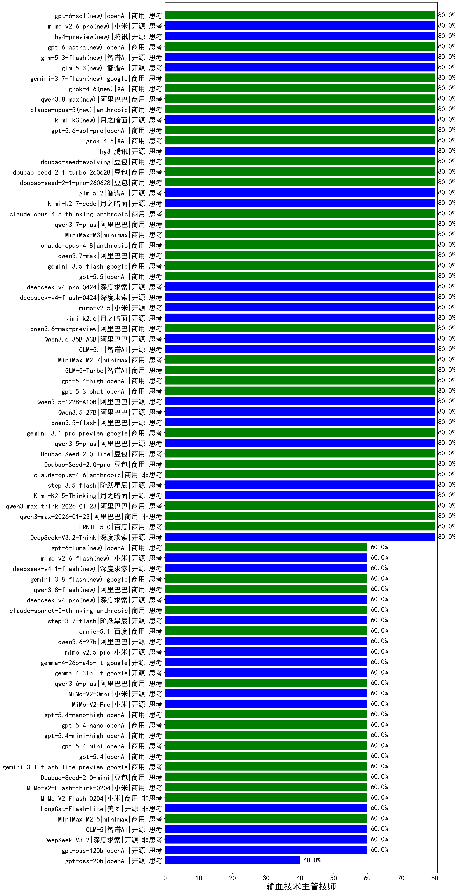

|类别|机构|大模型|【输血技术主管技师】准确率|平均耗时|平均消耗token|花费/千次（元）|排名（准确率）|
|---|---|-----|-------------------|-------|-----------|-----------|-----------|
|商用|腾讯|hunyuan-2.0-instruct-20251111|100.0%|10s|349|0.6|1|
|商用|智谱AI|GLM-5-Turbo|80.0%|46s|1136|23.6|2|
|商用|阿里巴巴|qwen3.6-max-preview|80.0%|51s|1593|82.1|3|
|商用|阿里巴巴|qwen3.7-max|80.0%|23s|1212|41.5|4|
|商用|google|gemini-3.5-flash|80.0%|10s|1759|106.3|5|
|商用|openAI|gpt-5.5|80.0%|6s|334|54.2|6|
|开源|深度求索|deepseek-v4-pro-0424|80.0%|29s|639|14.4|7|
|开源|深度求索|deepseek-v4-flash-0424|80.0%|17s|494|0.9|8|
|开源|小米|mimo-v2.5|80.0%|15s|1128|12.1|9|
|开源|月之暗面|kimi-k2.6|80.0%|63s|1080|27.6|10|
|开源|阿里巴巴|Qwen3.6-35B-A3B|80.0%|106s|1760|18.2|11|
|商用|minimax|MiniMax-M3(new)|80.0%|15s|501|5.4|12|
|开源|智谱AI|GLM-5.1|80.0%|195s|1483|34.2|13|
|商用|minimax|MiniMax-M2.7|80.0%|19s|863|6.6|14|
|商用|openAI|gpt-5.4-high|80.0%|11s|488|43.2|15|
|商用|openAI|gpt-5.3-chat|80.0%|4s|357|27.2|16|
|开源|阿里巴巴|Qwen3.5-122B-A10B|80.0%|325s|2657|16.5|17|
|开源|阿里巴巴|Qwen3.5-27B|80.0%|174s|2990|14.0|18|
|开源|阿里巴巴|qwen3.5-flash|80.0%|388s|3500|6.8|19|
|商用|anthropic|claude-opus-4.8(new)|80.0%|12s|499|71.8|20|
|商用|阿里巴巴|qwen3.7-plus(new)|80.0%|37s|1753|13.5|21|
|开源|阿里巴巴|qwen3.5-plus|80.0%|45s|3467|16.3|22|
|商用|anthropic|claude-opus-4.8-thinking(new)|80.0%|23s|660|100.1|23|
|开源|智谱AI|glm-5.3-flash(new)|80.0%|24s|951|2.5|24|
|开源|智谱AI|glm-5.3(new)|80.0%|23s|804|20.9|25|
|商用|google|gemini-3.7-flash(new)|80.0%|10s|1058|26.0|26|
|商用|XAI|grok-4.6(new)|80.0%|24s|1034|35.6|27|
|商用|阿里巴巴|qwen3.8-max(new)|80.0%|41s|2052|70.9|28|
|商用|anthropic|claude-opus-5(new)|80.0%|12s|647|97.7|29|
|开源|月之暗面|kimi-k3(new)|80.0%|30s|532|40.8|30|
|商用|openAI|gpt-5.6-sol-pro(new)|80.0%|13s|2943|209.8|31|
|商用|XAI|grok-4.5(new)|80.0%|148s|1011|34.6|32|
|开源|腾讯|hy3(new)|80.0%|58s|218|0.6|33|
|商用|豆包|doubao-seed-evolving(new)|80.0%|352s|5510|162.3|34|
|商用|豆包|doubao-seed-2-1-turbo-260628(new)|80.0%|135s|5535|81.5|35|
|商用|豆包|doubao-seed-2-1-pro-260628(new)|80.0%|96s|4440|130.2|36|
|开源|智谱AI|glm-5.2(new)|80.0%|30s|1263|33.7|37|
|开源|月之暗面|kimi-k2.7-code(new)|80.0%|15s|426|9.9|38|
|商用|google|gemini-3.1-pro-preview|80.0%|79s|2391|197.7|39|
|商用|openAI|gpt-6-astra(new)|80.0%|14s|249|61.5|40|
|商用|openAI|gpt-5.2-high|80.0%|5s|314|23.3|41|
|商用|阿里巴巴|qwen-plus-think-2025-12-01|80.0%|54s|2193|16.9|42|
|商用|豆包|Doubao-Seed-2.0-lite|80.0%|163s|751|2.3|43|
|商用|百度|ERNIE-5.0|80.0%|260s|2482|58.2|44|
|商用|阿里巴巴|qwen3-max-2026-01-23|80.0%|61s|663|6.0|45|
|开源|小米|MiMo-V2-Flash|80.0%|20s|461|0.0|46|
|商用|阿里巴巴|qwen3-max-think-2026-01-23|80.0%|305s|2496|24.3|47|
|开源|月之暗面|Kimi-K2.5-Thinking|80.0%|287s|1469|29.5|48|
|开源|阶跃星辰|step-3.5-flash|80.0%|12s|1102|2.2|49|
|商用|anthropic|claude-opus-4.6|80.0%|10s|624|92.9|50|
|商用|openAI|gpt-5.2-medium|80.0%|11s|273|19.2|51|
|商用|阿里巴巴|qwen3-max-preview-think|80.0%|99s|2675|62.5|52|
|开源|深度求索|DeepSeek-V3.2-Think|80.0%|36s|1150|3.4|53|
|商用|豆包|Doubao-Seed-2.0-pro|80.0%|280s|1146|16.7|54|
|开源|Mistral|Ministral-3-14B-Instruct-2512|80.0%|12s|586|0.8|55|
|商用|openAI|gpt-5.2|60.0%|3s|195|11.5|56|
|开源|智谱AI|GLM-4.7|60.0%|59s|2178|29.6|57|
|开源|小米|MiMo-V2-Flash-think|60.0%|34s|2910|0.0|58|
|开源|阶跃星辰|step-3.7-flash(new)|60.0%|26s|2255|17.7|59|
|商用|google|gemini-3.8-flash(new)|60.0%|13s|910|44.2|60|
|开源|深度求索|DeepSeek-V3.2|60.0%|98s|276|0.8|61|
|商用|阿里巴巴|qwen3.8-flash(new)|60.0%|90s|5478|14.5|62|
|开源|阿里巴巴|qwen3-next-80b-a3b-thinking|60.0%|67s|3055|11.9|63|
|商用|阿里巴巴|qwen-plus-2025-12-01|60.0%|20s|879|1.6|64|
|开源|Mistral|mistral-large-2512|60.0%|11s|443|4.0|65|
|开源|深度求索|deepseek-v4-pro(new)|60.0%|59s|712|16.5|66|
|商用|豆包|doubao-seed-1-8-251215|60.0%|27s|682|4.6|67|
|商用|google|gemini-3-flash-preview|60.0%|123s|1627|33.1|68|
|商用|minimax|MiniMax-M2.1|60.0%|151s|862|6.5|69|
|商用|腾讯|hunyuan-2.0-thinking-20251109|60.0%|15s|831|3.1|70|
|商用|anthropic|claude-sonnet-5-thinking(new)|60.0%|10s|552|32.5|71|
|商用|豆包|Doubao-Seed-2.0-mini|60.0%|540s|2301|4.4|72|
|开源|阿里巴巴|qwen3.6-27b|60.0%|27s|1800|31.1|73|
|开源|智谱AI|GLM-4.7-Flash|60.0%|302s|1646|0.0|74|
|商用|openAI|gpt-5.4-nano-high|60.0%|10s|431|3.1|75|
|商用|小米|MiMo-V2-Flash-think-0204|60.0%|552s|3344|6.9|76|
|商用|google|gemini-3.1-flash-lite-preview|60.0%|12s|307|2.5|77|
|商用|小米|MiMo-V2-Flash-0204|60.0%|124s|542|1.0|78|
|商用|openAI|gpt-5.4|60.0%|5s|271|20.5|79|
|开源|美团|LongCat-Flash-Lite|60.0%|440s|423|0.0|80|
|商用|openAI|gpt-5.4-mini|60.0%|8s|187|3.5|81|
|商用|openAI|gpt-5.4-mini-high|60.0%|161s|696|19.5|82|
|商用|百度|ernie-5.1|60.0%|20s|853|14.2|83|
|商用|openAI|gpt-5.4-nano|60.0%|136s|256|1.6|84|
|商用|minimax|MiniMax-M2.5|60.0%|28s|1285|10.1|85|
|开源|小米|MiMo-V2-Pro|60.0%|406s|1093|18.3|86|
|开源|小米|MiMo-V2-Omni|60.0%|364s|1439|16.4|87|
|商用|阿里巴巴|qwen3.6-plus|60.0%|34s|1652|18.9|88|
|开源|google|gemma-4-31b-it|60.0%|97s|536|1.3|89|
|开源|google|gemma-4-26b-a4b-it|60.0%|81s|526|1.3|90|
|开源|智谱AI|GLM-5|60.0%|62s|2188|38.3|91|
|开源|小米|mimo-v2.5-pro|60.0%|13s|977|15.8|92|
|开源|美团|LongCat-Flash-Thinking-2601|60.0%|240s|2992|0.0|93|
|开源|openAI|gpt-oss-120b|60.0%|48s|440|1.1|94|
|开源|Mistral|Ministral-3-3B-Instruct-2512|40.0%|13s|486|0.3|95|
|开源|openAI|gpt-oss-20b|40.0%|8s|633|0.6|96|
|开源|Mistral|Ministral-3-8B-Instruct-2512|20.0%|13s|610|0.7|97|

