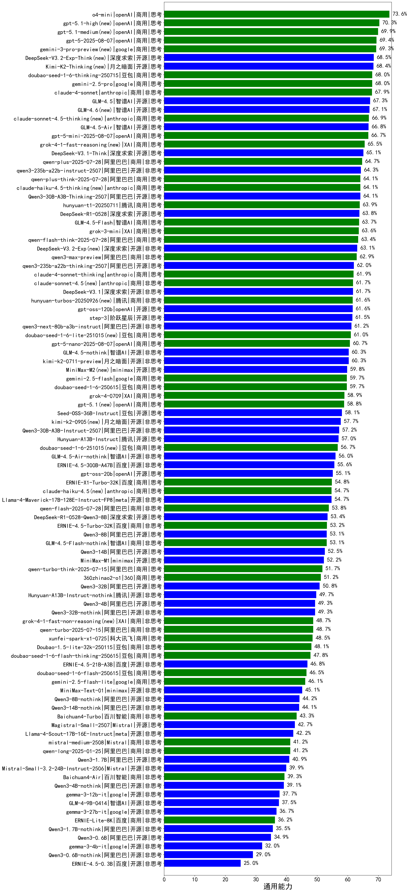

|类别|机构|大模型|【通用能力】准确率|平均耗时|平均消耗token|花费/千次（元）|排名（准确率）|
|---|---|-----|-------------------|-------|-----------|-----------|-----------|
|商用|openAI|o4-mini|73.6%|39s|1682|46.8|1|
|商用|openAI|gpt-5.1-high(new)|70.3%|121s|3272|210.3|2|
|商用|openAI|gpt-5.1-medium(new)|69.9%|147s|1876|111.2|3|
|商用|openAI|gpt-5-2025-08-07|69.4%|102s|793|37.5|4|
|商用|google|gemini-3-pro-preview(new)|69.3%|67s|3725|288.4|5|
|开源|月之暗面|Kimi-K2-Thinking(new)|68.9%|334s|5894|90.4|6|
|商用|腾讯|hunyuan-2.0-thinking-20251109(new)|68.7%|34s|3542|13.2|7|
|开源|深度求索|DeepSeek-V3.2-Exp-Think(new)|68.5%|282s|2758|8.0|8|
|开源|深度求索|DeepSeek-V3.2-Think(new)|68.4%|158s|3368|9.8|9|
|商用|豆包|doubao-seed-1-6-thinking-250715|68.0%|18s|2672|18.8|10|
|商用|google|gemini-2.5-pro|68.0%|96s|2998|195.0|11|
|商用|anthropic|claude-4-sonnet|67.9%|47s|585|42.0|12|
|开源|智谱AI|GLM-4.5|67.3%|117s|3685|48.3|13|
|开源|智谱AI|GLM-4.6(new)|67.1%|62s|3090|39.9|14|
|商用|anthropic|claude-sonnet-4.5-thinking(new)|66.9%|42s|3442|333.7|15|
|开源|智谱AI|GLM-4.5-Air|66.8%|127s|4158|23.0|16|
|商用|openAI|gpt-5-mini-2025-08-07|66.7%|110s|1630|19.7|17|
|商用|openAI|gpt-5.2-high(new)|66.5%|53s|1638|111.6|18|
|商用|百度|ERNIE-5.0-Thinking-Preview(new)|66.1%|332s|4109|91.6|19|
|商用|XAI|grok-4-1-fast-reasoning(new)|65.5%|62s|3176|10.2|20|
|开源|深度求索|DeepSeek-V3.1-Think|65.1%|138s|3020|34.0|21|
|商用|阿里巴巴|qwen-plus-2025-07-28|64.7%|117s|1311|2.2|22|
|开源|阿里巴巴|qwen3-235b-a22b-instruct-2507|64.3%|61s|1340|8.6|23|
|商用|阿里巴巴|qwen3-max-2025-09-23(new)|64.3%|172s|1475|28.2|24|
|商用|openAI|gpt-5-mini-high(new)|64.3%|465s|4306|57.9|25|
|商用|阿里巴巴|qwen-plus-think-2025-07-28|64.1%|/|3948|29.1|26|
|商用|anthropic|claude-haiku-4.5-thinking(new)|64.1%|45s|5131|172.0|27|
|开源|阿里巴巴|Qwen3-30B-A3B-Thinking-2507|64.1%|128s|3698|9.6|28|
|商用|腾讯|hunyuan-t1-20250711|63.9%|101s|3512|12.8|29|
|开源|深度求索|DeepSeek-R1-0528|63.8%|214s|3766|58.9|30|
|商用|智谱AI|GLM-4.5-Flash|63.7%|85s|4124|0.0|31|
|商用|XAI|grok-3-mini|63.6%|181s|1771|6.0|32|
|商用|阿里巴巴|qwen-flash-think-2025-07-28|63.4%|96s|3612|4.9|33|
|商用|腾讯|hunyuan-2.0-instruct-20251111(new)|63.1%|12s|1202|1.9|34|
|开源|深度求索|DeepSeek-V3.2-Exp(new)|63.1%|213s|891|2.4|35|
|商用|openAI|gpt-5.2-medium(new)|63.0%|45s|1204|88.9|36|
|商用|阿里巴巴|qwen3-max-preview|62.9%|94s|1147|21.3|37|
|开源|阿里巴巴|qwen3-235b-a22b-thinking-2507|62.0%|180s|3912|66.7|38|
|商用|anthropic|claude-4-sonnet-thinking|61.9%|53s|1036|90.3|39|
|商用|anthropic|claude-sonnet-4.5(new)|61.7%|8s|801|49.1|40|
|开源|深度求索|DeepSeek-V3.1|61.7%|31s|830|7.7|41|
|商用|腾讯|hunyuan-turbos-20250926(new)|61.6%|30s|1504|2.5|42|
|开源|openAI|gpt-oss-120b|61.6%|102s|1322|3.4|43|
|开源|阶跃星辰|step-3|61.5%|224s|3988|15.2|44|
|商用|百度|ERNIE-X1.1-Preview(new)|61.4%|215s|3617|13.3|45|
|开源|阿里巴巴|qwen3-next-80b-a3b-instruct|61.2%|113s|1448|4.7|46|
|开源|阿里巴巴|qwen3-next-80b-a3b-thinking(new)|61.0%|153s|5020|18.9|47|
|商用|豆包|doubao-seed-1-6-lite-251015(new)|61.0%|102s|1966|3.8|48|
|商用|openAI|gpt-5-nano-2025-08-07|60.7%|99s|2919|7.7|49|
|商用|阿里巴巴|qwen-plus-think-2025-12-01(new)|60.5%|91s|4044|29.5|50|
|开源|智谱AI|GLM-4.5-nothink|60.3%|90s|1374|15.9|51|
|开源|月之暗面|kimi-k2-0711-preview|60.3%|96s|1303|17.5|52|
|开源|minimax|MiniMax-M2(new)|59.8%|57s|3149|24.2|53|
|开源|深度求索|DeepSeek-V3.2(new)|59.8%|85s|1130|3.1|54|
|商用|anthropic|claude-opus-4.5(new)|59.8%|18s|1281|165.6|55|
|商用|google|gemini-2.5-flash|59.7%|61s|2922|47.3|56|
|商用|豆包|doubao-seed-1-6-250615|59.7%|/|746|3.2|57|
|商用|openAI|gpt-5-nano-high(new)|59.3%|497s|7889|22.0|58|
|商用|XAI|grok-4-0709|58.9%|270s|2695|268.0|59|
|商用|openAI|gpt-5.1(new)|58.8%|178s|576|18.9|60|
|开源|豆包|Seed-OSS-36B-Instruct|58.1%|263s|3412|12.8|61|
|商用|阿里巴巴|qwen-plus-2025-12-01(new)|58.0%|38s|1882|3.3|62|
|开源|月之暗面|kimi-k2-0905(new)|57.7%|79s|1311|16.9|63|
|开源|阿里巴巴|Qwen3-30B-A3B-Instruct-2507|57.2%|79s|1462|3.6|64|
|开源|腾讯|Hunyuan-A13B-Instruct|57.0%|144s|2735|9.9|65|
|商用|豆包|doubao-seed-1-6-251015(new)|56.7%|69s|1637|10.0|66|
|开源|智谱AI|GLM-4.5-Air-nothink|56.0%|91s|1924|10.0|67|
|开源|百度|ERNIE-4.5-300B-A47B|55.6%|145s|673|3.3|68|
|开源|openAI|gpt-oss-20b|55.1%|183s|2289|2.3|69|
|商用|百度|ERNIE-X1-Turbo-32K|54.8%|366s|3060|11.1|70|
|商用|anthropic|claude-haiku-4.5(new)|54.7%|16s|837|17.2|71|
|开源|meta|Llama-4-Maverick-17B-128E-Instruct-FP8|54.7%|7s|583|2.0|72|
|商用|openAI|gpt-5.2(new)|54.5%|7s|582|27.0|73|
|商用|阿里巴巴|qwen-flash-2025-07-28|53.8%|82s|1481|1.8|74|
|开源|深度求索|DeepSeek-R1-0528-Qwen3-8B|53.4%|500s|4677|0.0|75|
|商用|百度|ERNIE-4.5-Turbo-32K|53.2%|93s|792|1.7|76|
|开源|阿里巴巴|Qwen3-8B|53.1%|147s|4442|0.0|77|
|商用|智谱AI|GLM-4.5-Flash-nothink|53.1%|40s|1928|0.0|78|
|开源|阿里巴巴|Qwen3-14B|52.5%|119s|3316|6.2|79|
|开源|minimax|MiniMax-M1|52.2%|193s|4637|33.5|80|
|商用|阿里巴巴|qwen-turbo-think-2025-07-15|51.7%|/|3436|9.4|81|
|商用|360|360zhinao2-o1|51.2%|/|/|nan|82|
|开源|阿里巴巴|Qwen3-32B|50.8%|117s|2695|9.8|83|
|开源|腾讯|Hunyuan-A13B-Instruct-nothink|49.7%|485s|687|1.7|84|
|开源|Mistral|mistral-large-2512(new)|49.6%|13s|994|7.5|85|
|开源|阿里巴巴|Qwen3-4B|49.3%|69s|2287|6.0|86|
|开源|阿里巴巴|Qwen3-32B-nothink|49.3%|124s|812|2.2|87|
|商用|XAI|grok-4-1-fast-non-reasoning(new)|48.7%|69s|731|1.5|88|
|商用|阿里巴巴|qwen-turbo-2025-07-15|48.7%|73s|846|0.4|89|
|商用|科大讯飞|xunfei-spark-x1-0725|48.5%|/|2587|31.0|90|
|商用|豆包|Doubao-1.5-lite-32k-250115|48.1%|5s|508|0.2|91|
|商用|豆包|doubao-seed-1-6-flash-thinking-250615|47.8%|/|2487|3.2|92|
|开源|百度|ERNIE-4.5-21B-A3B|46.8%|78s|976|0.2|93|
|商用|豆包|doubao-seed-1-6-flash-250615|46.5%|/|782|0.7|94|
|商用|google|gemini-2.5-flash-lite|46.1%|71s|3554|9.5|95|
|开源|minimax|MiniMax-Text-01|45.1%|11s|1018|7.4|96|
|开源|阿里巴巴|Qwen3-8B-nothink|44.2%|34s|944|0.0|97|
|开源|阿里巴巴|Qwen3-14B-nothink|44.1%|65s|984|1.4|98|
|开源|Mistral|Ministral-3-14B-Instruct-2512(new)|44.1%|21s|2105|3.0|99|
|商用|百川智能|Baichuan4-Turbo|43.3%|/|/|/|100|
|开源|Mistral|Magistral-Small-2507|42.7%|248s|6833|71.6|101|
|开源|meta|Llama-4-Scout-17B-16E-Instruct|42.2%|8s|553|0.9|102|
|商用|Mistral|mistral-medium-2508|41.2%|194s|872|8.3|103|
|商用|阿里巴巴|qwen-long-2025-01-25|41.2%|56s|497|0.7|104|
|开源|Mistral|Ministral-3-8B-Instruct-2512(new)|41.1%|13s|1731|1.9|105|
|开源|阿里巴巴|Qwen3-1.7B|40.9%|61s|2996|8.1|106|
|开源|Mistral|Mistral-Small-3.2-24B-Instruct-2506|39.9%|154s|1494|2.7|107|
|商用|百川智能|Baichuan4-Air|39.3%|/|/|/|108|
|开源|阿里巴巴|Qwen3-4B-nothink|39.1%|115s|883|1.7|109|
|开源|Mistral|Ministral-3-3B-Instruct-2512(new)|38.5%|15s|2277|1.6|110|
|开源|google|gemma-3-12b-it|37.7%|/|/|/|111|
|开源|智谱AI|GLM-4-9B-0414|37.5%|7s|500|0.0|112|
|开源|google|gemma-3-27b-it|36.7%|/|/|/|113|
|商用|百度|ERNIE-Lite-8K|36.2%|/|/|nan|114|
|开源|阿里巴巴|Qwen3-1.7B-nothink|35.5%|59s|799|1.4|115|
|开源|阿里巴巴|Qwen3-0.6B|34.9%|37s|1671|4.2|116|
|开源|google|gemma-3-4b-it|32.0%|/|/|/|117|
|开源|阿里巴巴|Qwen3-0.6B-nothink|29.0%|81s|565|0.7|118|
|开源|百度|ERNIE-4.5-0.3B|25.0%|83s|739|0.0|119|

