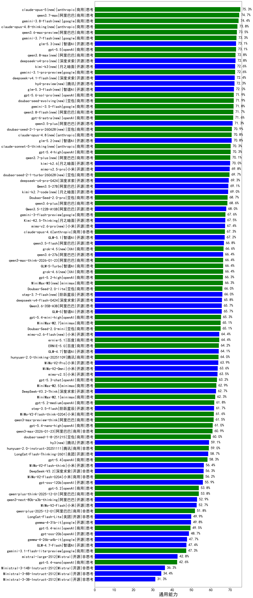

|类别|机构|大模型|【通用能力】准确率|平均耗时|平均消耗token|花费/千次（元）|排名（准确率）|
|---|---|-----|-------------------|-------|-----------|-----------|-----------|
|商用|anthropic|claude-opus-5(new)|75.3%|17s|1593|214.4|1|
|商用|阿里巴巴|qwen3.7-max|74.7%|66s|4017|135.0|2|
|商用|google|gemini-3.8-flash(new)|74.4%|20s|2323|104.8|3|
|商用|anthropic|claude-opus-4.8-thinking|73.8%|23s|2129|308.3|4|
|商用|阿里巴巴|qwen3.6-max-preview|73.5%|91s|3455|168.5|5|
|商用|google|gemini-3.7-flash(new)|73.3%|13s|1660|35.0|6|
|开源|智谱AI|glm-5.3(new)|73.1%|179s|6353|171.0|7|
|商用|openAI|gpt-5.5|73.1%|17s|1130|175.3|8|
|商用|阿里巴巴|qwen3.8-max(new)|72.8%|80s|4014|134.0|9|
|开源|深度求索|deepseek-v4-pro(new)|72.8%|164s|4875|124.4|10|
|开源|月之暗面|kimi-k3(new)|72.6%|84s|2440|211.7|11|
|商用|google|gemini-3.1-pro-preview|72.6%|64s|4324|339.4|12|
|开源|深度求索|deepseek-v4.1-flash(new)|72.4%|36s|3752|27.9|13|
|开源|腾讯|hy4-preview(new)|72.3%|108s|7741|135.2|14|
|开源|智谱AI|glm-5.3-flash(new)|72.0%|150s|6023|16.2|15|
|商用|openAI|gpt-5.6-sol-pro|71.9%|28s|5586|443.2|16|
|商用|豆包|doubao-seed-evolving|71.9%|288s|11507|334.6|17|
|商用|google|gemini-3.5-flash|71.8%|15s|3383|191.7|18|
|商用|阿里巴巴|qwen3.8-flash(new)|71.7%|71s|4980|12.6|19|
|商用|openAI|gpt-6-astra(new)|71.6%|16s|342|125.7|20|
|开源|阿里巴巴|qwen3.5-plus|71.3%|71s|6301|28.6|21|
|商用|豆包|doubao-seed-2-1-pro-260628|70.9%|301s|11894|346.2|22|
|商用|anthropic|claude-opus-4.8|70.8%|10s|991|109.1|23|
|开源|智谱AI|glm-5.2|70.8%|121s|5563|148.8|24|
|商用|anthropic|claude-sonnet-5-thinking|70.3%|21s|1909|107.9|25|
|商用|openAI|gpt-5.4-high|70.3%|28s|1673|144.7|26|
|商用|阿里巴巴|qwen3.7-plus|70.1%|99s|5696|43.2|27|
|开源|月之暗面|kimi-k2.6|70.0%|211s|4958|127.3|28|
|开源|小米|mimo-v2.5-pro|69.8%|69s|4331|81.9|29|
|商用|豆包|doubao-seed-2-1-turbo-260628|69.7%|221s|10334|149.7|30|
|开源|深度求索|deepseek-v4-pro-0424|69.3%|79s|3204|72.9|31|
|开源|阿里巴巴|Qwen3.5-27B|69.1%|299s|6766|30.8|32|
|开源|月之暗面|kimi-k2.7-code|69.0%|66s|2372|57.4|33|
|商用|豆包|Doubao-Seed-2.0-pro|68.7%|358s|2066|27.3|34|
|商用|openAI|gpt-6-sol(new)|68.7%|181s|330|34.3|35|
|商用|阿里巴巴|qwen3.6-plus|68.6%|84s|5034|56.4|36|
|开源|阿里巴巴|Qwen3.5-122B-A10B|68.0%|393s|6591|39.9|37|
|开源|月之暗面|Kimi-K2.5-Thinking|67.5%|361s|4684|92.9|38|
|开源|小米|mimo-v2.6-pro(new)|67.4%|111s|5261|30.4|39|
|商用|anthropic|claude-opus-4.6|67.3%|13s|861|89.4|40|
|开源|智谱AI|GLM-5.1|67.2%|191s|4210|94.9|41|
|开源|阿里巴巴|qwen3.5-flash|66.8%|363s|6370|12.0|42|
|商用|XAI|grok-4.5|66.6%|102s|3927|149.8|43|
|商用|openAI|gpt-6-luna(new)|66.5%|223s|535|3.6|44|
|开源|阿里巴巴|qwen3.6-27b|66.4%|84s|5936|100.8|45|
|商用|阿里巴巴|qwen3-max-think-2026-01-23|66.4%|230s|5156|48.5|46|
|商用|智谱AI|GLM-5-Turbo|66.4%|59s|3659|74.7|47|
|商用|XAI|grok-4.6(new)|66.4%|171s|3942|150.4|48|
|商用|minimax|MiniMax-M3|66.3%|130s|3169|47.1|49|
|商用|豆包|Doubao-Seed-2.0-lite|66.0%|319s|2353|7.1|50|
|开源|阶跃星辰|step-3.7-flash|66.0%|60s|6591|51.1|51|
|开源|深度求索|deepseek-v4-flash-0424|65.8%|60s|3628|6.9|52|
|开源|阿里巴巴|Qwen3.6-35B-A3B|65.7%|80s|5418|54.9|53|
|开源|智谱AI|GLM-5|65.7%|146s|4307|72.8|54|
|商用|openAI|gpt-5.4-mini-high|65.3%|65s|3330|95.6|55|
|商用|minimax|MiniMax-M2.7|65.1%|110s|5348|42.7|56|
|商用|豆包|Doubao-Seed-2.0-mini|65.1%|312s|4397|8.0|57|
|开源|小米|mimo-v2.6-flash(new)|64.4%|165s|4322|8.2|58|
|商用|百度|ernie-5.1|64.4%|58s|2400|37.5|59|
|商用|百度|ERNIE-5.0|64.2%|251s|4904|110.7|60|
|开源|小米|MiMo-V2-Pro|63.9%|237s|3817|71.2|61|
|开源|小米|MiMo-V2-Omni|63.6%|290s|3725|45.0|62|
|开源|小米|mimo-v2.5|63.5%|42s|3957|48.2|63|
|商用|openAI|gpt-5.3-chat|63.2%|23s|938|61.5|64|
|商用|minimax|MiniMax-M2.5|62.9%|65s|4312|34.0|65|
|开源|深度求索|DeepSeek-V3.2-Think|62.7%|158s|3368|9.8|66|
|开源|阶跃星辰|step-3.5-flash|61.7%|44s|6021|12.2|67|
|商用|小米|MiMo-V2-Flash-think-0204|61.6%|706s|5134|10.2|68|
|商用|openAI|gpt-5.4-nano-high|61.0%|93s|2546|17.7|69|
|商用|阿里巴巴|qwen3-max-2026-01-23|60.9%|104s|1468|11.7|70|
|开源|腾讯|hy3|59.1%|64s|883|2.5|71|
|商用|openAI|gpt-5.4|58.3%|7s|677|40.1|72|
|开源|深度求索|DeepSeek-V3.2|56.3%|85s|1130|3.1|73|
|商用|小米|MiMo-V2-Flash-0204|56.2%|214s|1133|1.8|74|
|开源|openAI|gpt-oss-120b|55.9%|102s|1322|3.4|75|
|开源|美团|LongCat-Flash-Lite|49.9%|157s|1576|0.0|76|
|开源|google|gemma-4-31b-it|49.8%|76s|757|1.4|77|
|商用|openAI|gpt-5.4-mini|49.5%|32s|508|6.7|78|
|开源|openAI|gpt-oss-20b|48.7%|184s|2288|2.3|79|
|开源|google|gemma-4-26b-a4b-it|47.7%|39s|858|1.6|80|
|商用|google|gemini-3.1-flash-lite-preview|47.3%|11s|694|3.7|81|
|商用|openAI|gpt-5.4-nano|42.6%|37s|539|2.1|82|

