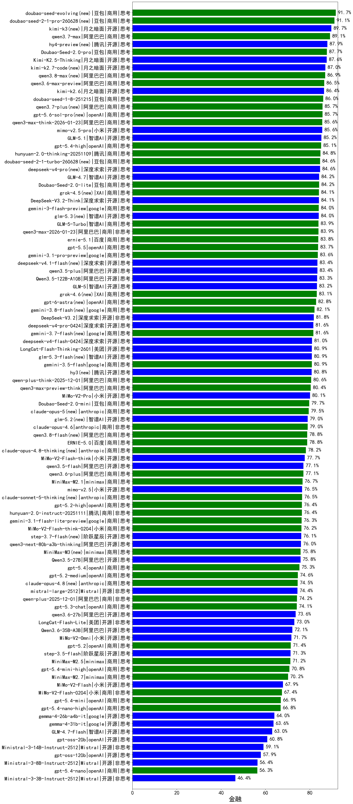

|类别|机构|大模型|【金融】准确率|平均耗时|平均消耗token|花费/千次（元）|排名（准确率）|
|---|---|-----|-------------------|-------|-----------|-----------|-----------|
|商用|豆包|doubao-seed-evolving(new)|91.7%|211s|7403|218.9|1|
|商用|豆包|doubao-seed-2-1-pro-260628(new)|91.1%|248s|8033|237.8|2|
|开源|月之暗面|kimi-k3(new)|89.7%|81s|1019|89.1|3|
|商用|阿里巴巴|qwen3.7-max|89.1%|28s|1432|49.4|4|
|开源|腾讯|hy4-preview(new)|87.9%|52s|3212|56.7|5|
|商用|豆包|Doubao-Seed-2.0-pro|87.7%|231s|1083|15.6|6|
|开源|月之暗面|Kimi-K2.5-Thinking|87.6%|317s|1972|40.0|7|
|开源|月之暗面|kimi-k2.7-code(new)|87.0%|37s|1161|29.7|8|
|商用|阿里巴巴|qwen3.8-max(new)|86.9%|32s|1419|48.0|9|
|商用|阿里巴巴|qwen3.6-max-preview|86.5%|53s|1691|87.2|10|
|开源|月之暗面|kimi-k2.6|86.4%|106s|2104|55.1|11|
|商用|豆包|doubao-seed-1-8-251215|86.0%|25s|719|4.8|12|
|商用|阿里巴巴|qwen3.7-plus(new)|85.7%|33s|1783|13.7|13|
|商用|openAI|gpt-5.6-sol-pro(new)|85.7%|28s|3540|281.9|14|
|商用|阿里巴巴|qwen3-max-think-2026-01-23|85.6%|171s|3277|32.0|15|
|开源|小米|mimo-v2.5-pro|85.6%|33s|1717|31.4|16|
|开源|智谱AI|GLM-5.1|85.2%|143s|1713|39.6|17|
|商用|openAI|gpt-5.4-high|85.1%|17s|826|77.7|18|
|商用|腾讯|hunyuan-2.0-thinking-20251109|84.8%|13s|1087|4.1|19|
|商用|豆包|doubao-seed-2-1-turbo-260628(new)|84.6%|196s|7316|108.2|20|
|开源|深度求索|deepseek-v4-pro(new)|84.6%|105s|1746|44.3|21|
|开源|智谱AI|GLM-4.7|84.2%|58s|2385|32.5|22|
|商用|豆包|Doubao-Seed-2.0-lite|84.2%|200s|982|3.1|23|
|商用|XAI|grok-4.5(new)|84.1%|83s|1749|65.3|24|
|开源|深度求索|DeepSeek-V3.2-Think|84.1%|102s|1453|4.3|25|
|商用|google|gemini-3-flash-preview|84.0%|63s|1476|29.8|26|
|开源|智谱AI|glm-5.3(new)|84.0%|81s|3379|92.8|27|
|商用|智谱AI|GLM-5-Turbo|83.9%|45s|1729|36.6|28|
|商用|阿里巴巴|qwen3-max-2026-01-23|83.9%|64s|576|5.1|29|
|商用|百度|ernie-5.1|83.8%|35s|1134|19.2|30|
|商用|openAI|gpt-5.5|83.7%|12s|703|129.7|31|
|商用|google|gemini-3.1-pro-preview|83.6%|40s|1537|124.3|32|
|开源|深度求索|deepseek-v4.1-flash(new)|83.4%|18s|1614|12.3|33|
|开源|阿里巴巴|qwen3.5-plus|83.4%|37s|3010|14.1|34|
|开源|阿里巴巴|Qwen3.5-122B-A10B|83.3%|275s|2889|18.0|35|
|开源|智谱AI|GLM-5|83.2%|96s|2253|39.4|36|
|商用|XAI|grok-4.6(new)|83.1%|107s|1683|62.5|37|
|商用|openAI|gpt-6-astra(new)|82.8%|11s|282|69.9|38|
|商用|google|gemini-3.8-flash(new)|82.1%|18s|831|39.7|39|
|开源|深度求索|DeepSeek-V3.2|81.8%|55s|407|1.1|40|
|开源|深度求索|deepseek-v4-pro-0424|81.6%|47s|1260|29.3|41|
|商用|google|gemini-3.7-flash(new)|81.6%|7s|765|18.1|42|
|开源|深度求索|deepseek-v4-flash-0424|81.0%|35s|1138|2.2|43|
|开源|美团|LongCat-Flash-Thinking-2601|80.9%|188s|2915|0.0|44|
|开源|智谱AI|glm-5.3-flash(new)|80.9%|75s|2599|7.1|45|
|商用|google|gemini-3.5-flash|80.9%|10s|1520|90.9|46|
|开源|腾讯|hy3(new)|80.8%|61s|273|0.8|47|
|商用|阿里巴巴|qwen-plus-think-2025-12-01|80.6%|70s|2686|20.8|48|
|商用|阿里巴巴|qwen3-max-preview-think|80.4%|170s|2452|57.1|49|
|开源|小米|MiMo-V2-Pro|80.1%|188s|1853|34.2|50|
|商用|豆包|Doubao-Seed-2.0-mini|79.7%|368s|2294|4.3|51|
|商用|anthropic|claude-opus-5(new)|79.5%|13s|788|118.6|52|
|商用|anthropic|claude-opus-4.6|79.0%|15s|583|82.5|53|
|开源|智谱AI|glm-5.2(new)|79.0%|58s|2132|57.9|54|
|商用|百度|ERNIE-5.0|78.8%|190s|2766|65.0|55|
|商用|阿里巴巴|qwen3.8-flash(new)|78.8%|55s|2550|6.6|56|
|商用|anthropic|claude-opus-4.8-thinking(new)|78.2%|16s|898|137.8|57|
|开源|小米|MiMo-V2-Flash-think|77.7%|75s|2645|0.0|58|
|开源|阿里巴巴|qwen3.5-flash|77.1%|293s|3675|7.2|59|
|商用|阿里巴巴|qwen3.6-plus|77.1%|46s|1810|20.8|60|
|商用|minimax|MiniMax-M2.1|76.7%|114s|3132|25.6|61|
|开源|小米|mimo-v2.5|76.5%|87s|1942|23.5|62|
|商用|anthropic|claude-sonnet-5-thinking(new)|76.5%|17s|1100|69.3|63|
|商用|openAI|gpt-5.2-high|76.4%|18s|783|68.8|64|
|商用|腾讯|hunyuan-2.0-instruct-20251111|76.4%|6s|421|0.7|65|
|商用|google|gemini-3.1-flash-lite-preview|76.3%|17s|393|3.3|66|
|商用|小米|MiMo-V2-Flash-think-0204|76.2%|691s|2319|4.7|67|
|开源|阶跃星辰|step-3.7-flash(new)|76.1%|63s|3303|26.2|68|
|开源|阿里巴巴|qwen3-next-80b-a3b-thinking|76.0%|120s|3049|11.9|69|
|商用|minimax|MiniMax-M3(new)|75.8%|54s|1831|27.6|70|
|开源|阿里巴巴|Qwen3.5-27B|75.8%|248s|3127|14.6|71|
|商用|openAI|gpt-5.4|75.3%|4s|275|19.9|72|
|商用|openAI|gpt-5.2-medium|74.6%|8s|461|36.9|73|
|商用|anthropic|claude-opus-4.8(new)|74.5%|9s|526|72.8|74|
|开源|Mistral|mistral-large-2512|74.4%|11s|520|4.7|75|
|商用|阿里巴巴|qwen-plus-2025-12-01|74.2%|24s|950|1.8|76|
|商用|openAI|gpt-5.3-chat|74.1%|28s|417|32.1|77|
|开源|阿里巴巴|qwen3.6-27b|73.6%|29s|1834|31.7|78|
|开源|美团|LongCat-Flash-Lite|73.0%|229s|592|0.0|79|
|开源|阿里巴巴|Qwen3.6-35B-A3B|72.1%|138s|1808|18.7|80|
|开源|小米|MiMo-V2-Omni|71.7%|205s|1689|19.9|81|
|商用|openAI|gpt-5.2|71.4%|5s|227|13.6|82|
|开源|阶跃星辰|step-3.5-flash|71.3%|28s|2986|6.1|83|
|商用|minimax|MiniMax-M2.5|71.2%|38s|1921|15.4|84|
|商用|openAI|gpt-5.4-mini-high|70.8%|58s|1272|37.4|85|
|商用|minimax|MiniMax-M2.7|70.2%|54s|2247|18.2|86|
|开源|小米|MiMo-V2-Flash|67.9%|46s|591|0.0|87|
|商用|小米|MiMo-V2-Flash-0204|67.4%|234s|578|1.1|88|
|商用|openAI|gpt-5.4-mini|66.9%|39s|246|5.1|89|
|商用|openAI|gpt-5.4-nano-high|66.8%|46s|883|7.0|90|
|开源|google|gemma-4-26b-a4b-it|64.0%|51s|599|1.5|91|
|开源|google|gemma-4-31b-it|63.6%|79s|532|1.3|92|
|开源|智谱AI|GLM-4.7-Flash|63.0%|1276s|6073|0.0|93|
|开源|openAI|gpt-oss-20b|60.8%|67s|1540|1.7|94|
|开源|Mistral|Ministral-3-14B-Instruct-2512|59.1%|10s|725|1.0|95|
|开源|openAI|gpt-oss-120b|57.9%|24s|696|1.9|96|
|开源|Mistral|Ministral-3-8B-Instruct-2512|56.4%|19s|1746|1.9|97|
|商用|openAI|gpt-5.4-nano|56.3%|32s|255|1.5|98|
|开源|Mistral|Ministral-3-3B-Instruct-2512|46.4%|13s|1680|1.2|99|

