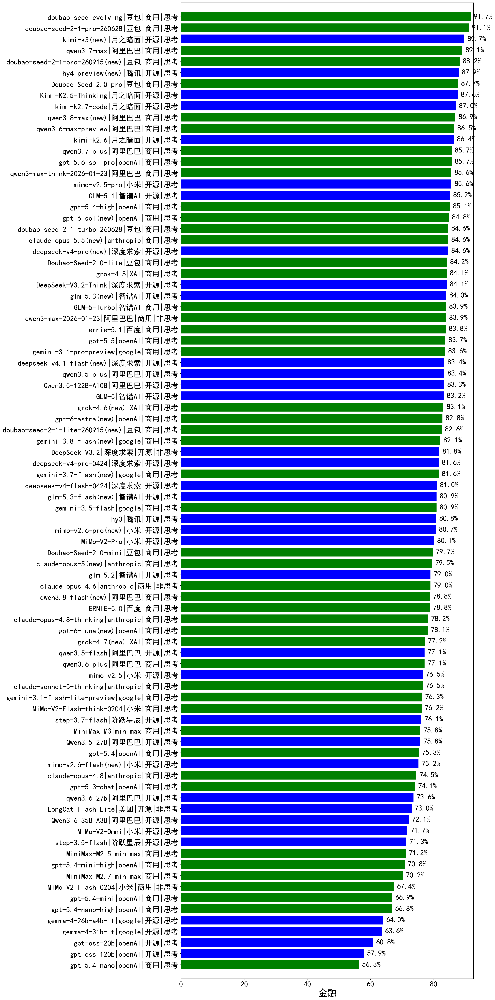

|类别|机构|大模型|【金融】准确率|平均耗时|平均消耗token|花费/千次（元）|排名（准确率）|
|---|---|-----|-------------------|-------|-----------|-----------|-----------|
|商用|豆包|doubao-seed-evolving|91.7%|211s|7403|218.9|1|
|商用|豆包|doubao-seed-2-1-pro-260628|91.1%|248s|8033|237.8|2|
|开源|月之暗面|kimi-k3(new)|89.7%|81s|1019|89.1|3|
|商用|阿里巴巴|qwen3.7-max|89.1%|28s|1432|49.4|4|
|商用|豆包|doubao-seed-2-1-pro-260915(new)|88.2%|69s|1672|47.0|5|
|开源|腾讯|hy4-preview(new)|87.9%|52s|3212|56.7|6|
|商用|豆包|Doubao-Seed-2.0-pro|87.7%|231s|1083|15.6|7|
|开源|月之暗面|Kimi-K2.5-Thinking|87.6%|317s|1972|40.0|8|
|开源|月之暗面|kimi-k2.7-code|87.0%|37s|1161|29.7|9|
|商用|阿里巴巴|qwen3.8-max(new)|86.9%|32s|1419|48.0|10|
|商用|阿里巴巴|qwen3.6-max-preview|86.5%|53s|1691|87.2|11|
|开源|月之暗面|kimi-k2.6|86.4%|106s|2104|55.1|12|
|商用|阿里巴巴|qwen3.7-plus|85.7%|33s|1783|13.7|13|
|商用|openAI|gpt-5.6-sol-pro|85.7%|28s|3540|281.9|14|
|商用|阿里巴巴|qwen3-max-think-2026-01-23|85.6%|171s|3277|32.0|15|
|开源|小米|mimo-v2.5-pro|85.6%|33s|1717|31.4|16|
|开源|智谱AI|GLM-5.1|85.2%|143s|1713|39.6|17|
|商用|openAI|gpt-5.4-high|85.1%|17s|826|77.7|18|
|商用|openAI|gpt-6-sol(new)|84.8%|245s|283|14.1|19|
|商用|豆包|doubao-seed-2-1-turbo-260628|84.6%|196s|7316|108.2|20|
|开源|深度求索|deepseek-v4-pro(new)|84.6%|105s|1746|44.3|21|
|商用|anthropic|claude-opus-5.5(new)|84.6%|23s|660|76.8|22|
|商用|豆包|Doubao-Seed-2.0-lite|84.2%|200s|982|3.1|23|
|商用|XAI|grok-4.5|84.1%|83s|1749|65.3|24|
|开源|深度求索|DeepSeek-V3.2-Think|84.1%|102s|1453|4.3|25|
|开源|智谱AI|glm-5.3(new)|84.0%|81s|3379|92.8|26|
|商用|智谱AI|GLM-5-Turbo|83.9%|45s|1729|36.6|27|
|商用|阿里巴巴|qwen3-max-2026-01-23|83.9%|64s|576|5.1|28|
|商用|百度|ernie-5.1|83.8%|35s|1134|19.2|29|
|商用|openAI|gpt-5.5|83.7%|12s|703|129.7|30|
|商用|google|gemini-3.1-pro-preview|83.6%|40s|1537|124.3|31|
|开源|深度求索|deepseek-v4.1-flash(new)|83.4%|18s|1614|12.3|32|
|开源|阿里巴巴|qwen3.5-plus|83.4%|37s|3010|14.1|33|
|开源|阿里巴巴|Qwen3.5-122B-A10B|83.3%|275s|2889|18.0|34|
|开源|智谱AI|GLM-5|83.2%|96s|2253|39.4|35|
|商用|XAI|grok-4.6(new)|83.1%|107s|1683|62.5|36|
|商用|openAI|gpt-6-astra(new)|82.8%|11s|282|69.9|37|
|商用|豆包|doubao-seed-2-1-lite-260915(new)|82.6%|64s|1569|4.0|38|
|商用|google|gemini-3.8-flash(new)|82.1%|18s|831|39.7|39|
|开源|深度求索|DeepSeek-V3.2|81.8%|55s|407|1.1|40|
|开源|深度求索|deepseek-v4-pro-0424|81.6%|47s|1260|29.3|41|
|商用|google|gemini-3.7-flash(new)|81.6%|7s|765|18.1|42|
|开源|深度求索|deepseek-v4-flash-0424|81.0%|35s|1138|2.2|43|
|商用|google|gemini-3.5-flash|80.9%|10s|1520|90.9|44|
|开源|智谱AI|glm-5.3-flash(new)|80.9%|75s|2599|7.1|45|
|开源|腾讯|hy3|80.8%|61s|273|0.8|46|
|开源|小米|mimo-v2.6-pro(new)|80.7%|68s|2193|12.9|47|
|开源|小米|MiMo-V2-Pro|80.1%|188s|1853|34.2|48|
|商用|豆包|Doubao-Seed-2.0-mini|79.7%|368s|2294|4.3|49|
|商用|anthropic|claude-opus-5(new)|79.5%|13s|788|118.6|50|
|商用|anthropic|claude-opus-4.6|79.0%|15s|583|82.5|51|
|开源|智谱AI|glm-5.2|79.0%|58s|2132|57.9|52|
|商用|百度|ERNIE-5.0|78.8%|190s|2766|65.0|53|
|商用|阿里巴巴|qwen3.8-flash(new)|78.8%|55s|2550|6.6|54|
|商用|anthropic|claude-opus-4.8-thinking|78.2%|16s|898|137.8|55|
|商用|openAI|gpt-6-luna(new)|78.1%|262s|572|1.7|56|
|商用|XAI|grok-4.7(new)|77.2%|54s|4530|153.1|57|
|开源|阿里巴巴|qwen3.5-flash|77.1%|293s|3675|7.2|58|
|商用|阿里巴巴|qwen3.6-plus|77.1%|46s|1810|20.8|59|
|开源|小米|mimo-v2.5|76.5%|87s|1942|23.5|60|
|商用|anthropic|claude-sonnet-5-thinking|76.5%|17s|1100|69.3|61|
|商用|google|gemini-3.1-flash-lite-preview|76.3%|17s|393|3.3|62|
|商用|小米|MiMo-V2-Flash-think-0204|76.2%|691s|2319|4.7|63|
|开源|阶跃星辰|step-3.7-flash|76.1%|63s|3303|26.2|64|
|商用|minimax|MiniMax-M3|75.8%|54s|1831|27.6|65|
|开源|阿里巴巴|Qwen3.5-27B|75.8%|248s|3127|14.6|66|
|商用|openAI|gpt-5.4|75.3%|4s|275|19.9|67|
|开源|小米|mimo-v2.6-flash(new)|75.2%|113s|1796|3.5|68|
|商用|anthropic|claude-opus-4.8|74.5%|9s|526|72.8|69|
|商用|openAI|gpt-5.3-chat|74.1%|28s|417|32.1|70|
|开源|阿里巴巴|qwen3.6-27b|73.6%|29s|1834|31.7|71|
|开源|美团|LongCat-Flash-Lite|73.0%|229s|592|0.0|72|
|开源|阿里巴巴|Qwen3.6-35B-A3B|72.1%|138s|1808|18.7|73|
|开源|小米|MiMo-V2-Omni|71.7%|205s|1689|19.9|74|
|开源|阶跃星辰|step-3.5-flash|71.3%|28s|2986|6.1|75|
|商用|minimax|MiniMax-M2.5|71.2%|38s|1921|15.4|76|
|商用|openAI|gpt-5.4-mini-high|70.8%|58s|1272|37.4|77|
|商用|minimax|MiniMax-M2.7|70.2%|54s|2247|18.2|78|
|商用|小米|MiMo-V2-Flash-0204|67.4%|234s|578|1.1|79|
|商用|openAI|gpt-5.4-mini|66.9%|39s|246|5.1|80|
|商用|openAI|gpt-5.4-nano-high|66.8%|46s|883|7.0|81|
|开源|google|gemma-4-26b-a4b-it|64.0%|51s|599|1.5|82|
|开源|google|gemma-4-31b-it|63.6%|79s|532|1.3|83|
|开源|openAI|gpt-oss-20b|60.8%|67s|1540|1.7|84|
|开源|openAI|gpt-oss-120b|57.9%|24s|696|1.9|85|
|商用|openAI|gpt-5.4-nano|56.3%|32s|255|1.5|86|

