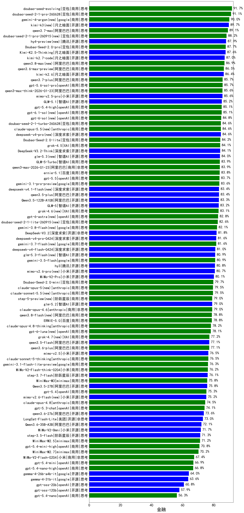

|类别|机构|大模型|【金融】准确率|平均耗时|平均消耗token|花费/千次（元）|排名（准确率）|
|---|---|-----|-------------------|-------|-----------|-----------|-----------|
|商用|豆包|doubao-seed-evolving|91.7%|211s|7403|218.9|1|
|商用|豆包|doubao-seed-2-1-pro-260628|91.1%|248s|8033|237.8|2|
|开源|月之暗面|kimi-k3.1-pro(new)|90.0%|48s|1581|98.7|3|
|商用|google|gemini-4-argon(new)|90.0%|21s|430|46.8|4|
|开源|月之暗面|kimi-k3|89.7%|81s|1019|89.1|5|
|商用|阿里巴巴|qwen3.7-max|89.1%|28s|1432|49.4|6|
|商用|豆包|doubao-seed-2-1-pro-260915(new)|88.2%|69s|1672|47.0|7|
|开源|腾讯|hy4-preview(new)|87.9%|52s|3212|56.7|8|
|开源|月之暗面|kimi-k2.7-code|87.0%|37s|1161|29.7|9|
|商用|阿里巴巴|qwen3.8-max|86.9%|32s|1419|48.0|10|
|商用|阿里巴巴|qwen3.6-max-preview|86.5%|53s|1691|87.2|11|
|开源|月之暗面|kimi-k2.6|86.4%|106s|2104|55.1|12|
|商用|阿里巴巴|qwen3.7-plus|85.7%|33s|1783|13.7|13|
|商用|openAI|gpt-5.6-sol-pro|85.7%|28s|3540|281.9|14|
|开源|小米|mimo-v2.5-pro|85.6%|33s|1717|31.4|15|
|开源|智谱AI|GLM-5.1|85.2%|143s|1713|39.6|16|
|商用|openAI|gpt-6.1-sol(new)|85.1%|14s|258|12.3|17|
|商用|openAI|gpt-6-sol(new)|84.8%|245s|283|14.1|18|
|商用|豆包|doubao-seed-2-1-turbo-260628|84.6%|196s|7316|108.2|19|
|开源|深度求索|deepseek-v4-pro|84.6%|105s|1746|44.3|20|
|商用|anthropic|claude-opus-5.5(new)|84.6%|23s|660|76.8|21|
|商用|XAI|grok-4.5|84.1%|83s|1749|65.3|22|
|开源|深度求索|DeepSeek-V3.2-Think|84.1%|102s|1453|4.3|23|
|开源|智谱AI|glm-5.3(new)|84.0%|81s|3379|92.8|24|
|商用|百度|ernie-5.1|83.8%|35s|1134|19.2|25|
|商用|openAI|gpt-5.5|83.7%|12s|703|129.7|26|
|商用|google|gemini-3.1-pro-preview|83.6%|40s|1537|124.3|27|
|开源|深度求索|deepseek-v4.1-flash(new)|83.4%|18s|1614|12.3|28|
|开源|阿里巴巴|Qwen3.5-122B-A10B|83.3%|275s|2889|18.0|29|
|商用|XAI|grok-4.6|83.1%|107s|1683|62.5|30|
|商用|openAI|gpt-6-astra(new)|82.8%|11s|282|69.9|31|
|商用|豆包|doubao-seed-2-1-lite-260915(new)|82.6%|64s|1569|4.0|32|
|商用|google|gemini-3.8-flash(new)|82.1%|18s|831|39.7|33|
|开源|深度求索|DeepSeek-V3.2|81.8%|55s|407|1.1|34|
|开源|深度求索|deepseek-v4-pro-0424|81.6%|47s|1260|29.3|35|
|商用|google|gemini-3.7-flash|81.6%|7s|765|18.1|36|
|开源|深度求索|deepseek-v4-flash-0424|81.0%|35s|1138|2.2|37|
|开源|智谱AI|glm-5.3-flash(new)|80.9%|75s|2599|7.1|38|
|商用|google|gemini-3.5-flash|80.9%|10s|1520|90.9|39|
|开源|腾讯|hy3|80.8%|61s|273|0.8|40|
|开源|小米|mimo-v2.6-pro(new)|80.7%|68s|2193|12.9|41|
|商用|anthropic|claude-opus-5|79.5%|13s|788|118.6|42|
|商用|anthropic|claude-sonnet-5.5(new)|79.5%|16s|607|34.7|43|
|商用|阶跃星辰|step-5-preview(new)|79.0%|36s|2205|43.0|44|
|开源|智谱AI|glm-5.2|79.0%|58s|2132|57.9|45|
|商用|百度|ERNIE-5.0|78.8%|190s|2766|65.0|46|
|商用|阿里巴巴|qwen3.8-flash(new)|78.8%|55s|2550|6.6|47|
|商用|anthropic|claude-opus-4.8-thinking|78.2%|16s|898|137.8|48|
|商用|openAI|gpt-6-luna(new)|78.1%|262s|572|1.7|49|
|商用|XAI|grok-4.7(new)|77.2%|54s|4530|153.1|50|
|商用|阿里巴巴|qwen3.6-plus|77.1%|46s|1810|20.8|51|
|开源|小米|mimo-v2.5|76.5%|87s|1942|23.5|52|
|商用|anthropic|claude-sonnet-5-thinking|76.5%|17s|1100|69.3|53|
|商用|google|gemini-3.1-flash-lite-preview|76.3%|17s|393|3.3|54|
|开源|阶跃星辰|step-3.7-flash|76.1%|63s|3303|26.2|55|
|商用|minimax|MiniMax-M3|75.8%|54s|1831|27.6|56|
|开源|阿里巴巴|Qwen3.5-27B|75.8%|248s|3127|14.6|57|
|开源|小米|mimo-v2.6-flash(new)|75.2%|113s|1796|3.5|58|
|商用|anthropic|claude-opus-4.8|74.5%|9s|526|72.8|59|
|开源|阿里巴巴|qwen3.6-27b|73.6%|29s|1834|31.7|60|
|开源|阿里巴巴|Qwen3.6-35B-A3B|72.1%|138s|1808|18.7|61|
|商用|anthropic|claude-haiku-5.5(new)|71.9%|10s|833|2.5|62|
|商用|minimax|MiniMax-M2.7|70.2%|54s|2247|18.2|63|
|商用|minimax|MiniMax-M3.1-Flash(new)|68.7%|42s|2060|7.4|64|
|开源|google|gemma-4-26b-a4b-it|64.0%|51s|599|1.5|65|
|开源|google|gemma-4-31b-it|63.6%|79s|532|1.3|66|
|开源|openAI|gpt-oss-20b|60.8%|67s|1540|1.7|67|
|开源|openAI|gpt-oss-120b|57.9%|24s|696|1.9|68|

