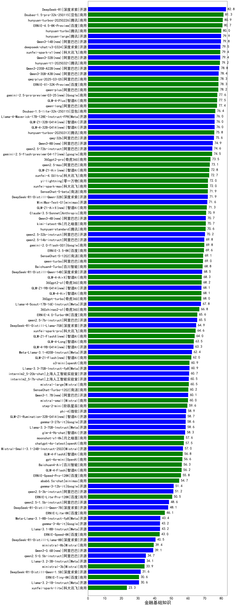

|类别|机构|大模型|【金融基础知识】准确率|平均耗时|平均消耗token|花费/千次（元）|排名（准确率）|
|---|---|-----|-------------------|-------|-----------|-----------|-----------|
|商用|百度|ERNIE-4.5-Turbo-32K|85.1%|22s|568|1.6|1|
|商用|百度|ERNIE-X1-Turbo-32K|84.5%|151s|2371|9.3|2|
|开源|月之暗面|kimi-k2-0711-preview|84.4%|38s|555|8.0|3|
|商用|豆包|doubao-seed-1-6-250615|84.3%|103s|478|3.0|4|
|商用|豆包|doubao-seed-1-6-thinking-250715|84.0%|33s|1614|12.3|5|
|开源|百度|ERNIE-4.5-300B-A47B|83.1%|28s|612|4.4|6|
|开源|深度求索|DeepSeek-R1-0528|83.0%|247s|2418|37.8|7|
|商用|豆包|doubao-seed-1-6-flash-thinking-250615|82.3%|15s|1299|1.8|8|
|开源|minimax|MiniMax-M1|81.6%|190s|3124|21.7|9|
|商用|腾讯|hunyuan-t1-20250711|81.6%|33s|2057|7.9|10|
|商用|豆包|Doubao-1.5-pro-32k-250115|81.3%|12s|461|0.8|11|
|开源|阿里巴巴|Qwen3-14B|80.9%|32s|1301|2.5|12|
|开源|深度求索|deepseek-chat-v3-0324|80.9%|127s|557|4.0|13|
|商用|腾讯|hunyuan-turbos-20250716|80.8%|23s|1114|2.1|14|
|商用|google|gemini-2.5-pro|80.5%|34s|2402|168.9|15|
|开源|阿里巴巴|Qwen3-32B|80.1%|49s|1971|7.6|16|
|开源|阿里巴巴|qwen3-235b-a22b-instruct-2507|80.0%|22s|805|5.9|17|
|商用|阿里巴巴|qwen-plus-2025-07-14|80.0%|19s|894|1.7|18|
|商用|科大讯飞|xunfei-spark-x1-0725|80.0%|/|1497|18.0|19|
|开源|华为|pangu-pro-moe|79.2%|96s|1839|7.1|20|
|商用|XAI|grok-4-0709|78.8%|271s|2010|211.5|21|
|开源|阿里巴巴|Qwen3-30B-A3B-Thinking-2507(new)|78.8%|69s|2702|7.4|22|
|开源|阿里巴巴|qwen3-235b-a22b-thinking-2507|78.4%|97s|2817|54.3|23|
|开源|深度求索|DeepSeek-V3.1-Think(new)|78.4%|67s|1324|15.3|24|
|商用|豆包|doubao-seed-1-6-flash-250615|78.4%|9s|565|0.7|25|
|商用|阿里巴巴|qwen-long-2025-01-25|77.4%|58s|424|0.7|26|
|开源|meta|Llama-4-Maverick-17B-128E-Instruct-FP8|77.4%|8s|556|2.2|27|
|开源|智谱AI|GLM-Z1-32B-0414|77.3%|171s|2766|10.8|28|
|开源|深度求索|DeepSeek-V3.1(new)|76.8%|23s|428|4.5|29|
|开源|智谱AI|GLM-4-32B-0414|76.4%|20s|525|1.0|30|
|商用|豆包|Doubao-1.5-lite-32k-250115|76.4%|6s|331|0.2|31|
|商用|google|gemini-2.5-flash|76.2%|11s|1935|33.7|32|
|商用|阿里巴巴|qwen-turbo-2025-07-15|76.0%|8s|466|0.3|33|
|商用|anthropic|claude-4-sonnet-thinking|76.0%|53s|1129|111.7|34|
|开源|阿里巴巴|Qwen3-32B-nothink|75.2%|83s|588|2.1|35|
|商用|智谱AI|GLM-4.5-Flash-nothink|75.2%|31s|1596|0.0|36|
|开源|智谱AI|GLM-4.5(new)|75.2%|76s|2431|33.2|37|
|商用|阿里巴巴|qwen-flash-think-2025-07-28|74.4%|30s|2732|4.0|38|
|商用|智谱AI|GLM-4.5-Flash(new)|74.4%|46s|2519|0.0|39|
|商用|openAI|gpt-5-2025-08-07(new)|74.4%|25s|402|23.4|40|
|开源|智谱AI|GLM-4.5-nothink|73.6%|37s|1292|17.1|41|
|商用|XAI|grok-3-mini|73.6%|232s|1114|3.9|42|
|商用|奇虎360|360gpt2-pro|73.5%|12s|301|1.2|43|
|商用|anthropic|claude-4-sonnet|73.2%|44s|539|47.5|44|
|开源|阶跃星辰|step-3(new)|72.8%|149s|2684|10.5|45|
|开源|智谱AI|GLM-4.5-Air(new)|72.8%|51s|2604|15.2|46|
|商用|科大讯飞|xunfei-4.0Ultra|72.7%|9s|257|18.0|47|
|开源|阿里巴巴|Qwen3-4B|72.6%|39s|2789|8.1|48|
|商用|零一万物|yi-lightning|72.0%|/|/|/|49|
|商用|科大讯飞|xunfei-spark-max|72.0%|9s|260|7.8|50|
|开源|深度求索|DeepSeek-R1-Distill-Qwen-32B|71.9%|85s|1497|1.9|51|
|开源|minimax|MiniMax-Text-01|71.6%|13s|910|7.3|52|
|开源|腾讯|Hunyuan-A13B-Instruct|71.4%|79s|1605|6.2|53|
|开源|智谱AI|GLM-4.5-Air-nothink|71.2%|26s|1600|9.1|54|
|开源|深度求索|DeepSeek-R1-0528-Qwen3-8B|71.0%|341s|2627|0.0|55|
|商用|月之暗面|kimi-latest-8k|70.7%|17s|525|6.3|56|
|开源|阿里巴巴|Qwen3-8B|70.6%|59s|3156|0.0|57|
|商用|阿里巴巴|qwen-flash-2025-07-28|70.4%|11s|947|1.3|58|
|商用|google|gemini-2.5-flash-lite(new)|70.4%|7s|1452|4.0|59|
|开源|智谱AI|GLM-Z1-9B-0414|69.8%|96s|3537|0.0|60|
|开源|阿里巴巴|Qwen3-30B-A3B-Instruct-2507(new)|69.6%|8s|908|2.5|61|
|开源|openAI|gpt-oss-120b(new)|69.6%|44s|743|2.0|62|
|商用|百度|ERNIE-3.5-8K|69.6%|22s|463|0.8|63|
|开源|百度|ERNIE-4.5-21B-A3B|69.5%|26s|696|0.0|64|
|商用|百川智能|Baichuan4-Turbo|68.8%|/|/|/|65|
|开源|阿里巴巴|Qwen3-14B-nothink|68.8%|18s|667|1.2|66|
|开源|meta|Llama-4-Scout-17B-16E-Instruct|68.7%|10s|599|1.2|67|
|开源|深度求索|DeepSeek-R1-Distill-Qwen-14B|68.5%|/|/|/|68|
|商用|奇虎360|360gpt2-o1|68.2%|25s|597|27.0|69|
|开源|阿里巴巴|Qwen3-4B-nothink|68.0%|18s|530|1.3|70|
|商用|奇虎360|360zhinao2-o1|66.8%|/|/|/|71|
|商用|openAI|o4-mini|66.4%|33s|1011|30.0|72|
|商用|科大讯飞|xunfei-spark-pro|64.6%|/|/|/|73|
|开源|腾讯|Hunyuan-A13B-Instruct-nothink|64.0%|378s|531|1.9|74|
|商用|openAI|gpt-5-mini-2025-08-07(new)|64.0%|72s|966|12.8|75|
|开源|智谱AI|GLM-4-9B-0414|63.8%|11s|481|0.0|76|
|商用|openAI|gpt-5-nano-2025-08-07(new)|63.2%|75s|2128|5.9|77|
|开源|阿里巴巴|Qwen3-8B-nothink|62.4%|48s|579|0.0|78|
|开源|阿里巴巴|Qwen3-1.7B|60.6%|24s|2111|6.1|79|
|开源|openAI|gpt-oss-20b(new)|60.0%|68s|1287|1.4|80|
|商用|阶跃星辰|step-2-mini|59.6%|6s|375|0.7|81|
|开源|Google|gemma-3-27b-it|58.6%|/|/|/|82|
|商用|百川智能|Baichuan4-Air|56.3%|/|/|/|83|
|开源|阿里巴巴|Qwen3-1.7B-nothink|52.8%|11s|490|1.2|84|
|开源|Google|gemma-3-12b-it|51.4%|/|/|/|85|
|商用|百度|ERNIE-Lite-8K|46.1%|/|/|/|86|
|开源|Google|gemma-3-4b-it|43.2%|/|/|/|87|
|商用|百度|ERNIE-Speed-8K|43.0%|/|/|/|88|
|商用|Mistral|ministral-8b|39.4%|/|/|/|89|
|开源|阿里巴巴|Qwen3-0.6B|38.6%|14s|2211|6.4|90|
|商用|Mistral|ministral-3b|33.9%|/|/|/|91|
|开源|阿里巴巴|Qwen3-0.6B-nothink|31.2%|9s|301|0.7|92|
|开源|百度|ERNIE-4.5-0.3B|30.7%|19s|423|0.0|93|
|商用|科大讯飞|xunfei-spark-lite|23.3%|/|/|/|94|

