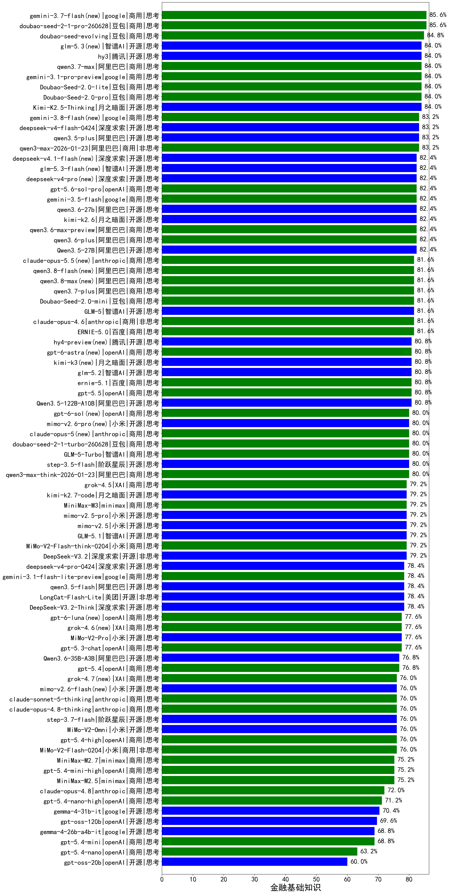

|类别|机构|大模型|【金融基础知识】准确率|平均耗时|平均消耗token|花费/千次（元）|排名（准确率）|
|---|---|-----|-------------------|-------|-----------|-----------|-----------|
|商用|豆包|doubao-seed-2-1-pro-260628|85.6%|243s|8937|265.1|1|
|商用|google|gemini-3.7-flash(new)|85.6%|11s|731|17.4|2|
|商用|豆包|doubao-seed-evolving|84.8%|285s|9233|274.0|3|
|商用|阿里巴巴|qwen3.7-max|84.0%|33s|1631|56.7|4|
|商用|豆包|Doubao-Seed-2.0-pro|84.0%|243s|1189|17.4|5|
|开源|腾讯|hy3|84.0%|49s|324|1.1|6|
|开源|月之暗面|Kimi-K2.5-Thinking|84.0%|358s|2420|49.5|7|
|开源|智谱AI|glm-5.3(new)|84.0%|33s|3957|109.1|8|
|商用|google|gemini-3.1-pro-preview|84.0%|58s|1881|154.1|9|
|商用|豆包|Doubao-Seed-2.0-lite|84.0%|230s|1061|3.4|10|
|开源|深度求索|deepseek-v4-flash-0424|83.2%|36s|1439|2.8|11|
|商用|google|gemini-3.8-flash(new)|83.2%|24s|807|38.8|12|
|开源|阿里巴巴|qwen3.5-plus|83.2%|38s|3026|14.2|13|
|商用|豆包|doubao-seed-2-1-lite-260915(new)|83.2%|35s|1542|4.0|14|
|商用|阿里巴巴|qwen3-max-2026-01-23|83.2%|69s|796|7.3|15|
|开源|深度求索|deepseek-v4.1-flash(new)|82.4%|15s|1494|11.3|16|
|商用|google|gemini-3.5-flash|82.4%|12s|1712|103.4|17|
|开源|阿里巴巴|qwen3.6-27b|82.4%|30s|1894|32.8|18|
|开源|月之暗面|kimi-k2.6|82.4%|150s|2519|66.4|19|
|开源|阿里巴巴|Qwen3.5-27B|82.4%|269s|3468|16.3|20|
|商用|阿里巴巴|qwen3.6-max-preview|82.4%|55s|1784|92.6|21|
|开源|智谱AI|glm-5.3-flash(new)|82.4%|91s|2963|8.1|22|
|商用|阿里巴巴|qwen3.6-plus|82.4%|40s|1723|19.8|23|
|商用|openAI|gpt-5.6-sol-pro|82.4%|30s|3313|255.4|24|
|开源|深度求索|deepseek-v4-pro(new)|82.4%|144s|1848|47.1|25|
|商用|阿里巴巴|qwen3.8-max(new)|81.6%|53s|2272|78.9|26|
|商用|阿里巴巴|qwen3.7-plus|81.6%|41s|2196|17.1|27|
|商用|豆包|doubao-seed-2-1-pro-260915(new)|81.6%|72s|2031|57.9|28|
|商用|anthropic|claude-opus-5.5(new)|81.6%|26s|637|74.7|29|
|商用|百度|ERNIE-5.0|81.6%|205s|2639|62.0|30|
|商用|阿里巴巴|qwen3.8-flash(new)|81.6%|57s|2402|6.2|31|
|商用|豆包|Doubao-Seed-2.0-mini|81.6%|367s|2471|4.7|32|
|开源|智谱AI|GLM-5|81.6%|81s|2457|43.1|33|
|商用|anthropic|claude-opus-4.6|81.6%|15s|631|92.3|34|
|商用|openAI|gpt-6-astra(new)|80.8%|12s|278|70.2|35|
|开源|阿里巴巴|Qwen3.5-122B-A10B|80.8%|286s|3241|20.3|36|
|商用|百度|ernie-5.1|80.8%|37s|1286|22.0|37|
|商用|openAI|gpt-5.5|80.8%|11s|507|89.5|38|
|开源|智谱AI|glm-5.2|80.8%|54s|2245|61.1|39|
|开源|腾讯|hy4-preview(new)|80.8%|78s|4262|75.6|40|
|开源|月之暗面|kimi-k3(new)|80.8%|62s|1017|89.3|41|
|商用|豆包|doubao-seed-2-1-turbo-260628|80.0%|230s|7802|115.5|42|
|开源|阶跃星辰|step-3.5-flash|80.0%|33s|3443|7.1|43|
|商用|openAI|gpt-6-sol(new)|80.0%|220s|247|11.9|44|
|商用|智谱AI|GLM-5-Turbo|80.0%|54s|2016|43.0|45|
|商用|阿里巴巴|qwen3-max-think-2026-01-23|80.0%|162s|3405|33.4|46|
|开源|小米|mimo-v2.6-pro(new)|80.0%|90s|2228|13.1|47|
|商用|anthropic|claude-opus-5(new)|80.0%|14s|784|119.4|48|
|商用|minimax|MiniMax-M3|79.2%|62s|1876|28.5|49|
|开源|月之暗面|kimi-k2.7-code|79.2%|41s|1293|33.3|50|
|商用|XAI|grok-4.5|79.2%|85s|2296|88.5|51|
|开源|小米|mimo-v2.5-pro|79.2%|43s|2513|48.1|52|
|商用|小米|MiMo-V2-Flash-think-0204|79.2%|673s|2506|5.1|53|
|开源|深度求索|DeepSeek-V3.2|79.2%|74s|454|1.3|54|
|开源|小米|mimo-v2.5|79.2%|48s|2017|24.6|55|
|开源|智谱AI|GLM-5.1|79.2%|169s|2120|49.4|56|
|开源|深度求索|DeepSeek-V3.2-Think|78.4%|141s|1669|4.9|57|
|开源|阿里巴巴|qwen3.5-flash|78.4%|293s|3815|7.5|58|
|开源|深度求索|deepseek-v4-pro-0424|78.4%|69s|2143|50.5|59|
|商用|google|gemini-3.1-flash-lite-preview|78.4%|16s|421|3.7|60|
|开源|美团|LongCat-Flash-Lite|78.4%|243s|687|0.0|61|
|开源|小米|MiMo-V2-Pro|77.6%|166s|1413|25.1|62|
|商用|openAI|gpt-6-luna(new)|77.6%|291s|541|1.6|63|
|商用|XAI|grok-4.6(new)|77.6%|192s|2166|83.0|64|
|商用|openAI|gpt-5.3-chat|77.6%|18s|409|31.8|65|
|商用|openAI|gpt-5.4|76.8%|8s|285|21.5|66|
|开源|阿里巴巴|Qwen3.6-35B-A3B|76.8%|71s|1967|20.5|67|
|商用|openAI|gpt-5.4-high|76.0%|19s|759|71.3|68|
|开源|小米|mimo-v2.6-flash(new)|76.0%|133s|2592|5.1|69|
|商用|小米|MiMo-V2-Flash-0204|76.0%|211s|667|1.3|70|
|开源|小米|MiMo-V2-Omni|76.0%|176s|1972|23.9|71|
|商用|XAI|grok-4.7(new)|76.0%|69s|5420|190.7|72|
|商用|anthropic|claude-sonnet-5-thinking|76.0%|22s|1297|83.7|73|
|商用|anthropic|claude-opus-4.8-thinking|76.0%|16s|1035|163.3|74|
|开源|阶跃星辰|step-3.7-flash|76.0%|66s|3961|31.5|75|
|商用|openAI|gpt-5.4-mini-high|75.2%|43s|1083|31.6|76|
|商用|minimax|MiniMax-M2.5|75.2%|36s|1911|15.4|77|
|商用|minimax|MiniMax-M2.7|75.2%|51s|2113|17.1|78|
|商用|anthropic|claude-opus-4.8|72.0%|9s|550|78.5|79|
|商用|openAI|gpt-5.4-nano-high|71.2%|46s|768|6.0|80|
|开源|google|gemma-4-31b-it|70.4%|84s|594|1.5|81|
|开源|openAI|gpt-oss-120b|69.6%|44s|743|2.0|82|
|商用|openAI|gpt-5.4-mini|68.8%|38s|250|5.3|83|
|开源|google|gemma-4-26b-a4b-it|68.8%|47s|702|1.8|84|
|商用|openAI|gpt-5.4-nano|63.2%|45s|266|1.6|85|
|开源|openAI|gpt-oss-20b|60.0%|68s|1287|1.4|86|

