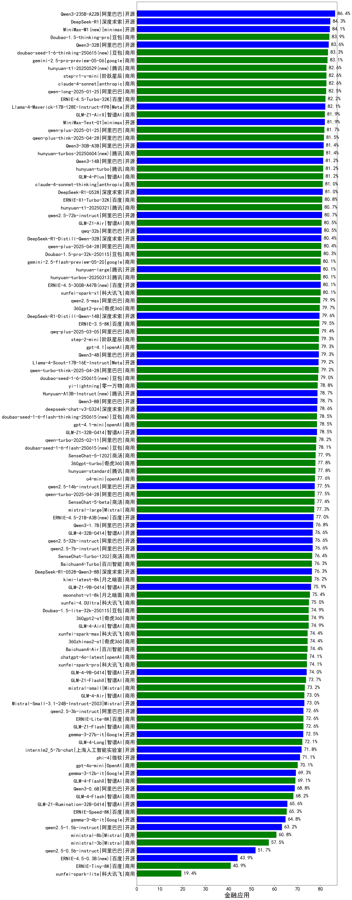

|类别|机构|大模型|【金融应用】准确率|平均耗时|平均消耗token|花费/千次（元）|排名（准确率）|
|---|---|-----|-------------------|-------|-----------|-----------|-----------|
|开源|阿里巴巴|qwen3-235b-a22b-thinking-2507|87.0%|83s|1825|33.8|1|
|商用|google|gemini-3-pro-preview(new)|86.4%|43s|1354|104.5|2|
|商用|anthropic|claude-opus-4.5(new)|85.6%|12s|589|71.7|3|
|商用|google|gemini-3-flash-preview(new)|85.6%|65s|970|17.9|4|
|开源|minimax|MiniMax-Text-01|85.4%|11s|911|7.3|5|
|商用|anthropic|claude-sonnet-4.5-thinking(new)|85.3%|16s|1221|110.0|6|
|开源|阿里巴巴|qwen3-235b-a22b-instruct-2507|85.3%|7s|432|2.6|7|
|商用|阿里巴巴|qwen3-max-preview|84.7%|7s|426|7.6|8|
|商用|阿里巴巴|qwen3-max-2025-09-23(new)|84.7%|201s|402|7.0|9|
|商用|阿里巴巴|qwen-plus-think-2025-07-28|84.5%|/|1777|13.2|10|
|商用|anthropic|claude-sonnet-4.5(new)|84.5%|10s|554|40.0|11|
|开源|meta|Llama-4-Maverick-17B-128E-Instruct-FP8|84.0%|7s|514|1.8|12|
|商用|阿里巴巴|qwen-plus-think-2025-12-01(new)|83.9%|44s|1770|13.1|13|
|商用|openAI|gpt-5.2-high(new)|83.9%|6s|333|18.7|14|
|商用|XAI|grok-4-0709|83.9%|261s|980|93.9|15|
|商用|百度|ERNIE-X1.1-Preview(new)|83.6%|109s|805|2.8|16|
|商用|阿里巴巴|qwen-plus-2025-07-28|83.6%|8s|426|0.7|17|
|开源|深度求索|DeepSeek-V3.2-Think(new)|83.6%|108s|811|2.3|18|
|商用|anthropic|claude-4-sonnet|83.5%|42s|545|38.0|19|
|开源|阿里巴巴|Qwen3-32B|83.1%|17s|648|2.1|20|
|商用|豆包|doubao-seed-1-6-thinking-250715|83.1%|13s|779|5.2|21|
|商用|科大讯飞|xunfei-spark-x1-0725|83.1%|/|668|8.0|22|
|开源|深度求索|DeepSeek-V3.1|83.1%|14s|316|2.7|23|
|商用|腾讯|hunyuan-2.0-thinking-20251109(new)|83.1%|10s|724|2.5|24|
|商用|openAI|gpt-5.1-medium(new)|83.1%|124s|376|16.4|25|
|商用|豆包|doubao-seed-1-6-251015(new)|83.1%|34s|566|3.3|26|
|商用|豆包|doubao-seed-1-6-lite-251015(new)|83.1%|25s|529|0.9|27|
|开源|阿里巴巴|qwen3-next-80b-a3b-thinking(new)|83.1%|112s|2277|8.7|28|
|商用|openAI|gpt-5.1-high(new)|83.1%|77s|562|29.6|29|
|商用|阿里巴巴|qwen-plus-2025-12-01(new)|83.1%|14s|618|1.1|30|
|开源|智谱AI|GLM-4.7(new)|83.1%|/|/|/|31|
|商用|阿里巴巴|qwen-long-2025-01-25|82.8%|48s|329|0.4|32|
|商用|anthropic|claude-4-sonnet-thinking|82.2%|47s|1014|89.0|33|
|开源|智谱AI|GLM-4.5-nothink|82.2%|20s|684|8.0|34|
|开源|小米|MiMo-V2-Flash-think(new)|82.2%|74s|1470|0.0|35|
|开源|深度求索|DeepSeek-V3.2-Exp(new)|82.2%|213s|309|0.8|36|
|开源|深度求索|DeepSeek-V3.2-Exp-Think(new)|82.2%|173s|804|2.3|37|
|商用|腾讯|hunyuan-turbos-20250926(new)|82.2%|9s|478|0.7|38|
|商用|百度|ERNIE-5.0-Thinking-Preview(new)|82.2%|139s|1054|23.0|39|
|开源|阿里巴巴|Qwen3-14B-nothink|82.2%|13s|458|0.7|40|
|开源|阿里巴巴|Qwen3-14B|81.9%|18s|886|1.6|41|
|商用|XAI|grok-3-mini|81.8%|167s|997|3.4|42|
|开源|月之暗面|kimi-k2-0711-preview|81.8%|11s|303|3.3|43|
|开源|minimax|MiniMax-M1|81.7%|105s|1915|11.7|44|
|商用|百度|ERNIE-4.5-Turbo-32K|81.7%|12s|360|0.9|45|
|商用|google|gemini-2.5-pro|81.5%|25s|1706|114.2|46|
|开源|月之暗面|Kimi-K2-Thinking(new)|81.4%|96s|1345|20.0|47|
|开源|阿里巴巴|Qwen3-30B-A3B-Thinking-2507|81.4%|44s|1652|4.3|48|
|开源|豆包|Seed-OSS-36B-Instruct|81.4%|63s|998|3.6|49|
|商用|XAI|grok-4-1-fast-reasoning(new)|81.4%|58s|1025|3.0|50|
|开源|深度求索|DeepSeek-V3.2(new)|81.4%|52s|286|0.7|51|
|商用|腾讯|hunyuan-t1-20250711|81.4%|19s|1448|4.6|52|
|商用|豆包|doubao-seed-1-8-251215(new)|81.1%|18s|518|2.8|53|
|开源|月之暗面|kimi-k2-0905(new)|81.1%|54s|324|3.4|54|
|商用|google|gemini-2.5-flash|81.1%|7s|1325|21.6|55|
|开源|深度求索|DeepSeek-V3.1-Think|80.6%|41s|849|9.1|56|
|开源|智谱AI|GLM-4.6(new)|80.6%|37s|1667|21.8|57|
|开源|Mistral|mistral-large-2512(new)|80.6%|10s|533|4.2|58|
|开源|阿里巴巴|qwen3-next-80b-a3b-instruct|80.6%|9s|492|1.5|59|
|商用|百度|ERNIE-X1-Turbo-32K|80.6%|57s|1200|4.4|60|
|开源|深度求索|DeepSeek-R1-0528|80.4%|194s|1473|22.0|61|
|开源|百度|ERNIE-4.5-300B-A47B|79.9%|10s|293|1.5|62|
|开源|阿里巴巴|Qwen3-4B|79.8%|11s|766|1.9|63|
|商用|openAI|gpt-5.2-medium(new)|79.7%|5s|312|16.7|64|
|开源|阶跃星辰|step-3|79.7%|78s|1599|6.0|65|
|开源|Mistral|Ministral-3-14B-Instruct-2512(new)|79.7%|14s|1101|1.6|66|
|商用|阿里巴巴|qwen-turbo-think-2025-07-15|79.7%|/|1406|3.8|67|
|开源|阿里巴巴|Qwen3-8B|79.6%|27s|889|0.0|68|
|开源|智谱AI|GLM-4.5|79.5%|48s|1577|20.6|69|
|商用|anthropic|claude-haiku-4.5(new)|78.9%|14s|598|14.5|70|
|商用|腾讯|hunyuan-2.0-instruct-20251111(new)|78.9%|6s|400|0.6|71|
|商用|阿里巴巴|qwen-flash-think-2025-07-28|78.9%|15s|1557|2.1|72|
|商用|openAI|gpt-5-mini-high(new)|78.9%|456s|1367|17.7|73|
|开源|腾讯|Hunyuan-A13B-Instruct|78.7%|37s|795|2.8|74|
|商用|豆包|doubao-seed-1-6-250615|78.5%|94s|357|1.6|75|
|开源|meta|Llama-4-Scout-17B-16E-Instruct|78.4%|8s|493|0.9|76|
|商用|豆包|doubao-seed-1-6-flash-250615|78.1%|2s|355|0.3|77|
|商用|openAI|gpt-5-2025-08-07|78.1%|25s|372|16.9|78|
|商用|openAI|gpt-5.1(new)|78.1%|201s|249|7.4|79|
|开源|minimax|MiniMax-M2(new)|78.1%|28s|983|7.2|80|
|开源|阿里巴巴|Qwen3-32B-nothink|78.1%|53s|470|1.4|81|
|商用|XAI|grok-4-1-fast-non-reasoning(new)|78.1%|39s|541|1.3|82|
|商用|Mistral|mistral-medium-2508|78.1%|142s|521|5.1|83|
|商用|智谱AI|GLM-4.5-Flash-nothink|77.8%|13s|708|0.0|84|
|商用|智谱AI|GLM-4.5-Flash|77.8%|27s|1611|0.0|85|
|商用|openAI|o4-mini|77.6%|28s|586|14.8|86|
|商用|豆包|doubao-seed-1-6-flash-thinking-250615|77.2%|10s|573|0.6|87|
|商用|openAI|gpt-5.2(new)|77.2%|5s|248|10.3|88|
|商用|anthropic|claude-haiku-4.5-thinking(new)|77.2%|38s|1471|45.3|89|
|开源|小米|MiMo-V2-Flash(new)|77.2%|73s|369|0.0|90|
|开源|百度|ERNIE-4.5-21B-A3B|76.7%|30s|335|0.0|91|
|开源|阿里巴巴|Qwen3-1.7B|76.5%|10s|1074|2.8|92|
|开源|深度求索|DeepSeek-R1-0528-Qwen3-8B|76.5%|385s|1177|0.0|93|
|开源|智谱AI|GLM-4.5-Air-nothink|76.4%|8s|717|3.6|94|
|商用|openAI|gpt-5-nano-high(new)|76.4%|433s|2529|6.9|95|
|开源|Mistral|Magistral-Small-2507|76.4%|286s|3363|35.0|96|
|商用|openAI|gpt-5-nano-2025-08-07|76.4%|58s|1154|2.9|97|
|商用|百川智能|Baichuan4-Turbo|76.3%|/|/|/|98|
|开源|阿里巴巴|Qwen3-8B-nothink|75.6%|45s|431|0.0|99|
|商用|阿里巴巴|qwen-turbo-2025-07-15|75.6%|6s|329|0.2|100|
|开源|Mistral|Mistral-Small-3.2-24B-Instruct-2506|75.6%|276s|517|0.8|101|
|开源|阿里巴巴|Qwen3-30B-A3B-Instruct-2507|75.6%|3s|485|1.1|102|
|商用|阿里巴巴|qwen-flash-2025-07-28|75.3%|6s|457|0.5|103|
|开源|智谱AI|GLM-4-9B-0414|74.9%|7s|363|0.0|104|
|商用|google|gemini-2.5-flash-lite|74.7%|4s|527|1.2|105|
|开源|openAI|gpt-oss-120b|74.7%|16s|526|1.2|106|
|商用|openAI|gpt-5-mini-2025-08-07|74.7%|48s|631|7.1|107|
|开源|智谱AI|GLM-4.5-Air|74.7%|31s|1576|8.7|108|
|商用|百川智能|Baichuan4-Air|74.5%|/|/|/|109|
|商用|豆包|Doubao-1.5-lite-32k-250115|74.5%|4s|259|0.1|110|
|商用|360|360zhinao2-o1|74.3%|/|/|/|111|
|开源|Mistral|Ministral-3-8B-Instruct-2512(new)|73.9%|13s|1146|1.2|112|
|开源|阿里巴巴|Qwen3-4B-nothink|73.9%|16s|419|0.8|113|
|开源|google|gemma-3-27b-it|72.6%|/|/|/|114|
|开源|openAI|gpt-oss-20b|72.2%|45s|616|0.5|115|
|商用|百度|ERNIE-Lite-8K|71.3%|/|/|/|116|
|开源|google|gemma-3-12b-it|71.0%|/|/|/|117|
|开源|Mistral|Ministral-3-3B-Instruct-2512(new)|69.7%|7s|588|0.4|118|
|开源|阿里巴巴|Qwen3-0.6B|69.6%|6s|869|2.2|119|
|开源|腾讯|Hunyuan-A13B-Instruct-nothink|68.9%|560s|348|1.0|120|
|开源|google|gemma-3-4b-it|64.7%|/|/|/|121|
|开源|阿里巴巴|Qwen3-1.7B-nothink|63.1%|10s|413|0.8|122|
|开源|阿里巴巴|Qwen3-0.6B-nothink|58.1%|8s|240|0.3|123|
|开源|百度|ERNIE-4.5-0.3B|40.6%|30s|306|0.0|124|

