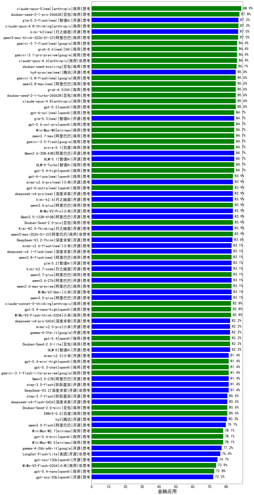

|类别|机构|大模型|【金融应用】准确率|平均耗时|平均消耗token|花费/千次（元）|排名（准确率）|
|---|---|-----|-------------------|-------|-----------|-----------|-----------|
|商用|anthropic|claude-opus-5(new)|88.9%|11s|708|91.5|1|
|商用|豆包|doubao-seed-2-1-pro-260628|87.8%|132s|3526|101.3|2|
|开源|智谱AI|glm-5.3-flash(new)|87.2%|74s|2203|5.9|3|
|商用|anthropic|claude-opus-4.8-thinking|87.2%|10s|602|73.0|4|
|开源|月之暗面|kimi-k3(new)|87.0%|55s|818|65.4|5|
|商用|阿里巴巴|qwen3-max-think-2026-01-23|87.0%|123s|2095|19.8|6|
|商用|anthropic|claude-opus-4.6|86.4%|13s|526|59.5|7|
|商用|google|gemini-3.7-flash(new)|86.4%|7s|525|10.6|8|
|商用|google|gemini-3.1-pro-preview|86.4%|37s|956|70.6|9|
|商用|XAI|grok-4.6(new)|86.4%|175s|1217|41.3|10|
|商用|豆包|doubao-seed-evolving|86.1%|128s|3526|101.3|11|
|商用|XAI|grok-4.5|85.6%|76s|1207|40.9|12|
|开源|腾讯|hy4-preview(new)|85.6%|45s|2414|41.7|13|
|商用|豆包|doubao-seed-2-1-turbo-260628|85.6%|109s|2611|36.9|14|
|商用|anthropic|claude-opus-4.8|85.6%|7s|545|63.0|15|
|商用|google|gemini-3.8-flash(new)|85.6%|16s|560|23.0|16|
|商用|阿里巴巴|qwen3.8-max(new)|85.6%|14s|521|14.5|17|
|商用|openAI|gpt-5.5|85.6%|6s|320|38.4|18|
|商用|openAI|gpt-5.4-high|84.7%|8s|461|34.1|19|
|开源|智谱AI|glm-5.3(new)|84.7%|104s|1475|38.5|20|
|商用|智谱AI|GLM-5-Turbo|84.7%|27s|893|17.4|21|
|开源|智谱AI|GLM-5.1|84.7%|115s|993|21.4|22|
|商用|openAI|gpt-5.6-sol-pro|84.7%|15s|2612|139.2|23|
|商用|百度|ernie-5.1|84.7%|20s|665|9.9|24|
|商用|google|gemini-3.5-flash|84.7%|7s|974|53.3|25|
|商用|阿里巴巴|qwen3.7-max|84.7%|15s|666|20.6|26|
|商用|minimax|MiniMax-M3|84.7%|25s|795|9.6|27|
|商用|openAI|gpt-6-sol(new)|84.7%|213s|238|7.4|28|
|开源|阿里巴巴|Qwen3.6-35B-A3B|84.7%|102s|1299|12.8|29|
|商用|阿里巴巴|qwen3.6-plus|83.9%|34s|1234|13.4|30|
|开源|小米|MiMo-V2-Pro|83.9%|201s|1056|16.8|31|
|开源|月之暗面|kimi-k2.6|83.9%|47s|965|23.4|32|
|开源|阿里巴巴|Qwen3.5-122B-A10B|83.9%|194s|1851|11.1|33|
|商用|openAI|gpt-6-luna(new)|83.9%|213s|308|0.6|34|
|商用|阿里巴巴|qwen3-max-2026-01-23|83.9%|88s|429|3.2|35|
|开源|月之暗面|Kimi-K2.5-Thinking|83.9%|200s|1034|19.5|36|
|商用|豆包|Doubao-Seed-2.0-pro|83.9%|162s|823|10.7|37|
|商用|openAI|gpt-6-astra(new)|83.9%|8s|242|38.6|38|
|开源|深度求索|deepseek-v4-pro(new)|83.9%|73s|638|13.4|39|
|开源|小米|mimo-v2.6-pro(new)|83.9%|25s|836|4.6|40|
|开源|深度求索|DeepSeek-V3.2-Think|83.6%|108s|811|2.3|41|
|开源|深度求索|deepseek-v4.1-flash(new)|83.1%|10s|712|4.7|42|
|开源|月之暗面|kimi-k2.7-code|83.1%|18s|490|10.6|43|
|开源|小米|mimo-v2.6-flash(new)|83.1%|69s|578|1.0|44|
|开源|阿里巴巴|qwen3.6-27b|83.1%|21s|1346|22.1|45|
|商用|阿里巴巴|qwen3.7-plus|83.1%|18s|962|6.9|46|
|开源|智谱AI|glm-5.2|83.1%|32s|989|24.9|47|
|商用|阿里巴巴|qwen3.6-max-preview|83.1%|38s|1272|62.4|48|
|开源|阿里巴巴|qwen3.5-plus|83.1%|24s|1914|8.6|49|
|商用|阿里巴巴|qwen3.8-flash(new)|83.1%|27s|508|1.0|50|
|开源|小米|MiMo-V2-Omni|83.1%|234s|1167|12.0|51|
|商用|小米|MiMo-V2-Flash-think-0204|82.8%|558s|1396|2.7|52|
|商用|anthropic|claude-sonnet-5-thinking|82.8%|12s|622|30.7|53|
|商用|openAI|gpt-5.4-nano-high|82.8%|28s|351|1.9|54|
|商用|XAI|grok-4.7(new)|82.2%|23s|2478|65.3|55|
|开源|小米|mimo-v2.5-pro|82.2%|21s|1055|16.7|56|
|开源|智谱AI|GLM-5|82.2%|76s|1350|22.4|57|
|开源|google|gemma-4-31b-it|82.2%|42s|404|0.8|58|
|商用|豆包|Doubao-Seed-2.0-lite|82.2%|104s|640|1.7|59|
|商用|openAI|gpt-5.4|82.2%|4s|272|14.1|60|
|开源|深度求索|deepseek-v4-pro-0424|82.2%|22s|504|10.5|61|
|商用|openAI|gpt-5.3-chat|81.4%|17s|316|16.8|62|
|商用|google|gemini-3.1-flash-lite-preview|81.4%|10s|360|2.4|63|
|开源|深度求索|DeepSeek-V3.2|81.4%|52s|286|0.7|64|
|开源|小米|mimo-v2.5|81.4%|22s|1088|10.9|65|
|开源|阶跃星辰|step-3.5-flash|81.4%|14s|1191|2.3|66|
|商用|openAI|gpt-5.4-mini-high|81.4%|40s|452|9.9|67|
|开源|阿里巴巴|Qwen3.5-27B|81.4%|185s|1967|8.9|68|
|商用|百度|ERNIE-5.0|80.6%|118s|1115|24.5|69|
|商用|豆包|Doubao-Seed-2.0-mini|80.6%|168s|1049|1.8|70|
|开源|阶跃星辰|step-3.7-flash|80.6%|22s|1096|7.9|71|
|开源|深度求索|deepseek-v4-flash-0424|80.6%|18s|487|0.8|72|
|开源|腾讯|hy3|80.3%|83s|263|0.6|73|
|开源|阿里巴巴|qwen3.5-flash|79.7%|220s|2147|4.0|74|
|商用|openAI|gpt-5.4-mini|78.1%|31s|255|3.7|75|
|商用|minimax|MiniMax-M2.7|78.1%|20s|869|6.3|76|
|商用|minimax|MiniMax-M2.5|78.1%|17s|885|6.4|77|
|开源|google|gemma-4-26b-a4b-it|77.2%|41s|480|1.0|78|
|开源|美团|LongCat-Flash-Lite|76.4%|164s|389|0.0|79|
|开源|openAI|gpt-oss-120b|74.7%|16s|526|1.2|80|
|商用|小米|MiMo-V2-Flash-0204|73.9%|173s|425|0.7|81|
|商用|openAI|gpt-5.4-nano|72.8%|18s|259|1.1|82|
|开源|openAI|gpt-oss-20b|72.2%|45s|616|0.5|83|

