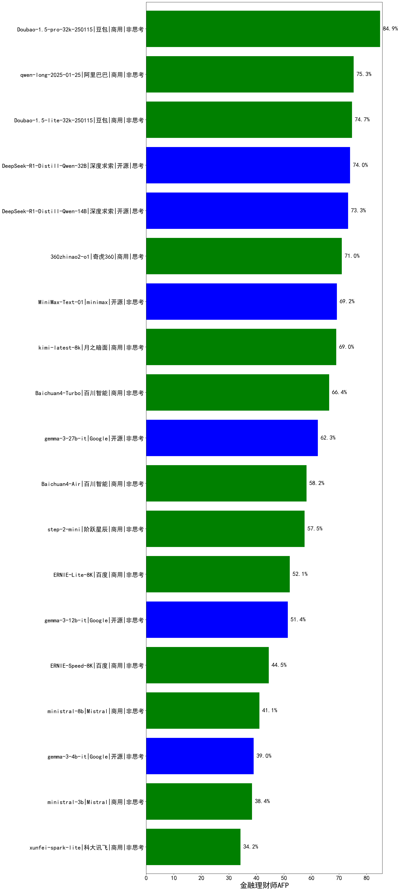

|类别|机构|大模型|【金融理财师AFP】准确率|平均耗时|平均消耗token|花费/千次（元）|排名（准确率）|
|---|---|-----|-------------------|-------|-----------|-----------|-----------|
|商用|阿里巴巴|qwq-plus-2025-03-05|87.0%|104s|4624|18.2|1|
|商用|豆包|Doubao-1.5-pro-32k-250115|84.9%|14s|595|1.0|2|
|开源|阿里巴巴|qwq-32b|82.0%|103s|4115|24.2|3|
|开源|腾讯|hunyuan-large|78.8%|18s|1226|9.0|4|
|商用|阿里巴巴|qwen2.5-max|77.4%|23s|728|6.0|5|
|商用|奇虎360|360gpt2-o1|76.0%|40s|1075|47.9|6|
|商用|阿里巴巴|qwen-long-2025-01-25|75.3%|20s|967|1.7|7|
|商用|奇虎360|360gpt2-pro|74.7%|18s|530|2.1|8|
|商用|豆包|Doubao-1.5-lite-32k-250115|74.7%|10s|511|0.3|9|
|开源|深度求索|DeepSeek-R1-Distill-Qwen-32B|74.0%|71s|2682|3.4|10|
|开源|深度求索|DeepSeek-R1-Distill-Qwen-14B|73.3%|/|/|/|11|
|商用|商汤|SenseChat-5-1202|72.0%|/|/|/|12|
|商用|奇虎360|360zhinao2-o1|71.0%|/|/|/|13|
|开源|阿里巴巴|qwen2.5-72b-instruct|71.0%|18s|499|4.8|14|
|商用|零一万物|yi-lightning|70.5%|/|/|/|15|
|开源|minimax|MiniMax-Text-01|69.2%|15s|1021|8.2|16|
|商用|月之暗面|kimi-latest-8k|69.0%|21s|641|7.7|17|
|商用|Mistral|mistral-large|68.0%|/|/|/|18|
|商用|openAI|chatgpt-4o-latest|68.0%|/|/|/|19|
|商用|奇虎360|360gpt-turbo|67.8%|/|/|/|20|
|商用|科大讯飞|xunfei-spark-pro|67.1%|/|/|/|21|
|商用|腾讯|hunyuan-standard|66.4%|/|/|/|22|
|商用|百川智能|Baichuan4-Turbo|66.4%|/|/|/|23|
|商用|百度|ERNIE-3.5-8K|66.4%|25s|662|1.2|24|
|开源|阿里巴巴|qwen2.5-32b-instruct|65.8%|12s|446|2.1|25|
|开源|阿里巴巴|qwen2.5-14b-instruct|65.1%|20s|631|1.6|26|
|商用|科大讯飞|xunfei-spark-max|65.0%|15s|442|13.3|27|
|商用|科大讯飞|xunfei-4.0Ultra|64.0%|16s|449|31.4|28|
|开源|Google|gemma-3-27b-it|62.3%|/|/|/|29|
|开源|阿里巴巴|qwen2.5-7b-instruct|61.6%|18s|622|0.5|30|
|商用|Mistral|mistral-small|58.9%|/|/|/|31|
|商用|百川智能|Baichuan4-Air|58.2%|/|/|/|32|
|商用|阶跃星辰|step-2-mini|57.5%|10s|647|1.1|33|
|商用|OpenAI|gpt-4o-mini|56.8%|/|/|/|34|
|开源|微软|phi-4|55.5%|/|/|/|35|
|开源|上海人工智能实验室|internlm2_5-7b-chat|53.4%|/|/|/|36|
|商用|百度|ERNIE-Lite-8K|52.1%|/|/|/|37|
|开源|Google|gemma-3-12b-it|51.4%|/|/|/|38|
|商用|智谱AI|GLM-4-FlashX|48.6%|12s|584|0.1|39|
|开源|阿里巴巴|qwen2.5-3b-instruct|45.2%|14s|718|0.6|40|
|商用|百度|ERNIE-Speed-8K|44.5%|/|/|/|41|
|商用|Mistral|ministral-8b|41.1%|/|/|/|42|
|开源|Google|gemma-3-4b-it|39.0%|/|/|/|43|
|商用|Mistral|ministral-3b|38.4%|/|/|/|44|
|商用|科大讯飞|xunfei-spark-lite|34.2%|/|/|/|45|
|开源|阿里巴巴|qwen2.5-1.5b-instruct|33.6%|14s|406|0.0|46|
|开源|阿里巴巴|qwen2.5-0.5b-instruct|31.5%|7s|432|0.0|47|
|商用|百度|ERNIE-Tiny-8K|26.7%|/|/|/|48|
|商用|智谱AI|GLM-4-AirX|nan%|8s|503|4.5|49|
|商用|智谱AI|GLM-4-Long|nan%|12s|528|0.6|50|
|商用|智谱AI|GLM-4-Plus|nan%|13s|497|2.5|51|
|开源|深度求索|deepseek-chat-v3-0324|nan%|195s|1089|8.0|52|
|开源|meta|Llama-4-Scout-17B-16E-Instruct|nan%|20s|1067|2.1|53|
|开源|meta|Llama-4-Maverick-17B-128E-Instruct-FP8|nan%|12s|751|2.9|54|
|开源|Mistral|Mistral-Small-3.1-24B-Instruct-2503|nan%|/|/|/|55|
|商用|智谱AI|GLM-Z1-Flash|nan%|36s|1976|0.0|56|
|商用|智谱AI|GLM-Z1-FlashX|nan%|46s|1950|0.6|57|
|商用|智谱AI|GLM-Z1-Air|nan%|50s|1823|1.0|58|
|商用|智谱AI|GLM-Z1-AirX|nan%|29s|3282|18.8|59|
|开源|智谱AI|GLM-4-9B-0414|nan%|12s|758|0.0|60|
|开源|智谱AI|GLM-Z1-9B-0414|nan%|133s|5115|0.0|61|
|开源|智谱AI|GLM-4-32B-0414|nan%|100s|1056|2.0|62|
|开源|智谱AI|GLM-Z1-32B-0414|nan%|316s|4379|17.1|63|
|开源|智谱AI|GLM-Z1-Rumination-32B-0414|nan%|107s|3766|13.3|64|
|开源|阿里巴巴|Qwen3-235B-A22B|nan%|194s|3185|30.8|65|
|开源|阿里巴巴|Qwen3-32B|nan%|24s|1116|4.1|66|
|开源|阿里巴巴|Qwen3-30B-A3B|nan%|87s|5266|14.5|67|
|开源|阿里巴巴|Qwen3-14B|nan%|100s|4983|9.8|68|
|开源|阿里巴巴|Qwen3-8B|nan%|277s|7229|0.0|69|
|开源|阿里巴巴|Qwen3-4B|nan%|30s|2206|6.3|70|
|开源|阿里巴巴|Qwen3-1.7B|nan%|62s|6104|18.0|71|
|开源|阿里巴巴|Qwen3-0.6B|nan%|18s|1961|5.5|72|
|商用|openAI|gpt-4.1|nan%|14s|723|35.1|73|
|商用|openAI|gpt-4.1-mini|nan%|16s|1211|12.7|74|
|商用|openAI|o4-mini|nan%|45s|1968|59.0|75|
|开源|深度求索|DeepSeek-R1-0528|nan%|309s|4862|76.4|76|
|商用|百度|ERNIE-4.5-Turbo-32K|nan%|50s|835|2.4|77|
|商用|百度|ERNIE-X1-Turbo-32K|nan%|164s|3709|14.5|78|
|开源|深度求索|DeepSeek-R1-0528-Qwen3-8B|nan%|338s|6440|0.0|79|
|商用|anthropic|claude-4-sonnet|nan%|99s|856|73.8|80|
|商用|anthropic|claude-4-sonnet-thinking|nan%|105s|1538|148.0|81|
|商用|阶跃星辰|step-r1-v-mini|nan%|129s|4453|34.8|82|
|商用|腾讯|hunyuan-turbos-20250604|nan%|39s|1822|3.4|83|
|商用|豆包|doubao-seed-1-6-flash-250615|nan%|112s|1323|1.8|84|
|商用|豆包|doubao-seed-1-6-flash-thinking-250615|nan%|140s|3888|5.6|85|
|商用|豆包|doubao-seed-1-6-250615|nan%|114s|745|4.8|86|
|商用|阿里巴巴|qwen-plus-think-2025-04-28|nan%|281s|4037|31.3|87|
|商用|阿里巴巴|qwen-turbo-think-2025-04-28|nan%|182s|5242|15.4|88|
|开源|minimax|MiniMax-M1|nan%|293s|4372|33.4|89|
|开源|百度|ERNIE-4.5-0.3B|nan%|5s|641|0.0|90|
|开源|百度|ERNIE-4.5-21B-A3B|nan%|19s|1477|0.0|91|
|开源|百度|ERNIE-4.5-300B-A47B|nan%|38s|851|6.0|92|
|开源|腾讯|Hunyuan-A13B-Instruct|nan%|136s|3338|13.0|93|
|商用|google|gemini-2.5-flash|nan%|14s|2974|51.6|94|
|商用|google|gemini-2.5-flash-lite-preview-06-17|nan%|9s|2812|7.8|95|
|商用|XAI|grok-4-0709|nan%|383s|3049|319.2|96|
|商用|XAI|grok-3-mini|nan%|155s|2206|7.8|97|
|商用|google|gemini-2.5-pro|nan%|33s|3119|217.1|98|
|开源|月之暗面|kimi-k2-0711-preview(new)|nan%|136s|1248|18.5|99|
|开源|阿里巴巴|Qwen3-235B-A22B-nothink|nan%|68s|1004|8.9|100|
|商用|腾讯|hunyuan-t1-20250711(new)|nan%|106s|7105|27.9|101|
|开源|华为|pangu-pro-moe|nan%|172s|4295|16.8|102|
|商用|阿里巴巴|qwen-turbo-2025-07-15(new)|nan%|31s|1673|1.0|103|
|商用|阿里巴巴|qwen-plus-2025-07-14(new)|nan%|34s|2379|4.6|104|
|开源|腾讯|Hunyuan-A13B-Instruct-nothink(new)|nan%|25s|759|2.6|105|
|开源|阿里巴巴|qwen3-235b-a22b-instruct-2507(new)|nan%|46s|1886|14.2|106|
|商用|豆包|doubao-seed-1-6-thinking-250715(new)|nan%|124s|4936|38.4|107|
|开源|阿里巴巴|qwen3-235b-a22b-thinking-2507(new)|nan%|348s|5784|113.0|108|
|商用|科大讯飞|xunfei-spark-x1-0725(new)|nan%|/|7872|94.5|109|
|开源|阿里巴巴|Qwen3-0.6B-nothink|nan%|19s|667|1.6|110|
|开源|阿里巴巴|Qwen3-1.7B-nothink|nan%|12s|1245|3.3|111|
|开源|阿里巴巴|Qwen3-4B-nothink|nan%|23s|1107|2.9|112|
|开源|阿里巴巴|Qwen3-8B-nothink|nan%|59s|1309|0.0|113|
|开源|阿里巴巴|Qwen3-14B-nothink|nan%|22s|1409|2.6|114|
|开源|阿里巴巴|Qwen3-30B-A3B-nothink|nan%|41s|2054|5.4|115|
|开源|阿里巴巴|Qwen3-32B-nothink|nan%|25s|909|3.2|116|
|商用|智谱AI|GLM-4.5-Flash(new)|nan%|141s|8338|0.0|117|
|开源|智谱AI|GLM-4.5-Air(new)|nan%|130s|8116|48.0|118|
|开源|智谱AI|GLM-4.5(new)|nan%|288s|5820|80.0|119|
|开源|阿里巴巴|Qwen3-30B-A3B-Instruct-2507(new)|nan%|30s|3143|9.1|120|
|开源|阿里巴巴|Qwen3-30B-A3B-Thinking-2507(new)|nan%|171s|7555|20.8|121|
|开源|阶跃星辰|step-3(new)|nan%|436s|8562|33.9|122|
|开源|智谱AI|GLM-4.5-nothink|nan%|60s|1836|24.2|123|
|开源|智谱AI|GLM-4.5-Air-nothink|nan%|28s|1767|9.9|124|
|商用|智谱AI|GLM-4.5-Flash-nothink|nan%|33s|1673|0.0|125|
|开源|openAI|gpt-oss-120b(new)|nan%|14s|1766|5.2|126|
|开源|openAI|gpt-oss-20b(new)|nan%|330s|11085|12.7|127|
|商用|openAI|gpt-5-2025-08-07(new)|nan%|71s|839|0.0|128|
|商用|openAI|gpt-5-mini-2025-08-07(new)|nan%|31s|2530|34.7|129|
|商用|openAI|gpt-5-nano-2025-08-07(new)|nan%|44s|8248|23.5|130|

