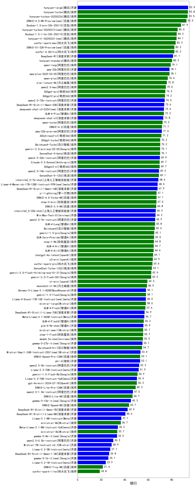

|类别|机构|大模型|【银行】准确率|平均耗时|平均消耗token|花费/千次（元）|排名（准确率）|
|---|---|-----|-------------------|-------|-----------|-----------|-----------|
|商用|阿里巴巴|qwen-plus-2025-07-28|100.0%|8s|338|0.6|1|
|商用|腾讯|hunyuan-turbos-20250926(new)|100.0%|9s|428|0.7|2|
|商用|百度|ERNIE-4.5-Turbo-32K|96.7%|19s|494|1.4|3|
|开源|月之暗面|kimi-k2-0905(new)|93.3%|61s|273|3.4|4|
|商用|google|gemini-3-pro-preview(new)|93.3%|59s|1387|113.3|5|
|商用|豆包|doubao-seed-1-6-thinking-250715|93.3%|13s|1066|8.0|6|
|开源|阿里巴巴|qwen3-235b-a22b-instruct-2507|93.3%|8s|351|2.4|7|
|商用|豆包|Doubao-1.5-lite-32k-250115|90.0%|6s|229|0.1|8|
|商用|豆包|doubao-seed-1-6-flash-250615|90.0%|4s|360|0.4|9|
|商用|豆包|doubao-seed-1-6-flash-thinking-250615|88.3%|8s|677|0.8|10|
|开源|openAI|gpt-oss-20b|86.7%|109s|1009|1.1|11|
|商用|阿里巴巴|qwen3-max-preview|86.7%|7s|357|7.3|12|
|开源|深度求索|DeepSeek-V3.2-Exp(new)|86.7%|49s|278|0.8|13|
|开源|智谱AI|GLM-4.5|86.7%|45s|1367|18.4|14|
|开源|百度|ERNIE-4.5-300B-A47B|86.7%|22s|392|2.7|15|
|商用|腾讯|hunyuan-t1-20250711|86.7%|16s|994|3.7|16|
|商用|阿里巴巴|qwen-plus-think-2025-07-28|86.7%|/|2088|16.2|17|
|开源|月之暗面|kimi-k2-0711-preview|86.7%|11s|243|3.1|18|
|开源|深度求索|DeepSeek-V3.1-Think|86.7%|39s|765|8.7|19|
|开源|深度求索|DeepSeek-V3.2-Exp-Think(new)|86.7%|102s|702|2.0|20|
|开源|阿里巴巴|qwen3-235b-a22b-thinking-2507|86.7%|53s|2340|45.5|21|
|商用|豆包|doubao-seed-1-6-250615|86.7%|49s|314|1.8|22|
|开源|阶跃星辰|step-3|86.7%|91s|1789|7.0|23|
|商用|百度|ERNIE-X1-Turbo-32K|86.7%|70s|1526|5.9|24|
|商用|豆包|doubao-seed-1-6-lite-251015(new)|86.7%|81s|657|1.4|25|
|商用|百度|ERNIE-X1.1-Preview(new)|86.7%|90s|488|1.8|26|
|开源|智谱AI|GLM-4.6(new)|86.7%|56s|1800|24.5|27|
|商用|豆包|doubao-seed-1-6-251015(new)|86.7%|5s|573|3.9|28|
|商用|anthropic|claude-sonnet-4.5-thinking(new)|86.7%|18s|1254|124.5|29|
|开源|月之暗面|Kimi-K2-Thinking(new)|86.7%|95s|1287|19.8|30|
|开源|阿里巴巴|Qwen3-32B|86.7%|34s|1144|4.4|31|
|开源|阿里巴巴|Qwen3-14B|86.7%|24s|855|1.6|32|
|商用|阿里巴巴|qwen-long-2025-01-25|83.3%|8s|286|0.5|33|
|开源|深度求索|DeepSeek-R1-0528|81.7%|220s|1750|27.2|34|
|商用|openAI|gpt-5.1-high(new)|80.0%|153s|762|49.3|35|
|开源|深度求索|DeepSeek-V3.1|80.0%|16s|261|2.6|36|
|商用|anthropic|claude-4-sonnet-thinking|80.0%|73s|1467|149.3|37|
|开源|豆包|Seed-OSS-36B-Instruct|80.0%|60s|1129|4.3|38|
|商用|google|gemini-2.5-pro|80.0%|24s|2037|143.4|39|
|开源|阿里巴巴|qwen3-next-80b-a3b-instruct|80.0%|8s|362|1.2|40|
|开源|智谱AI|GLM-4.5-Air-nothink|80.0%|16s|841|4.7|41|
|商用|openAI|gpt-5.1-medium(new)|80.0%|168s|410|24.2|42|
|商用|XAI|grok-4-1-fast-reasoning(new)|80.0%|82s|877|2.6|43|
|商用|阿里巴巴|qwen-turbo-think-2025-07-15|80.0%|/|2062|6.0|44|
|开源|阿里巴巴|Qwen3-32B-nothink|80.0%|59s|389|1.3|45|
|商用|anthropic|claude-sonnet-4.5(new)|80.0%|7s|506|45.6|46|
|开源|minimax|MiniMax-M1|78.3%|137s|2233|14.7|47|
|开源|阿里巴巴|Qwen3-8B|76.7%|903s|16050|0.0|48|
|商用|XAI|grok-4-0709|76.7%|258s|941|96.0|49|
|商用|阿里巴巴|qwen-flash-think-2025-07-28|73.3%|31s|2013|2.9|50|
|开源|阿里巴巴|Qwen3-30B-A3B-Thinking-2507|73.3%|61s|2231|6.1|51|
|商用|智谱AI|GLM-4.5-Flash-nothink|73.3%|18s|896|0.0|52|
|商用|Mistral|mistral-medium-2508|73.3%|66s|382|4.4|53|
|开源|Mistral|Mistral-Small-3.2-24B-Instruct-2506|73.3%|160s|482|0.9|54|
|开源|智谱AI|GLM-4.5-nothink|73.3%|24s|818|10.7|55|
|开源|minimax|MiniMax-M2(new)|73.3%|25s|1193|9.4|56|
|商用|百度|ERNIE-5.0-Thinking-Preview(new)|73.3%|225s|1030|23.7|57|
|商用|anthropic|claude-4-sonnet|73.3%|58s|516|45.9|58|
|商用|百川智能|Baichuan4-Turbo|73.3%|/|/|/|59|
|商用|360|360zhinao2-o1|73.3%|/|/|/|60|
|开源|阿里巴巴|Qwen3-8B-nothink|73.3%|66s|394|0.0|61|
|商用|科大讯飞|xunfei-spark-x1-0725|73.3%|/|828|9.9|62|
|商用|openAI|o4-mini|73.3%|31s|686|19.9|63|
|开源|腾讯|Hunyuan-A13B-Instruct|71.7%|43s|914|3.5|64|
|开源|minimax|MiniMax-Text-01|70.0%|11s|887|7.1|65|
|开源|百度|ERNIE-4.5-21B-A3B|70.0%|51s|421|0.0|66|
|开源|meta|Llama-4-Maverick-17B-128E-Instruct-FP8|70.0%|7s|460|1.8|67|
|开源|阿里巴巴|Qwen3-4B|70.0%|19s|1362|3.9|68|
|开源|深度求索|DeepSeek-R1-0528-Qwen3-8B|70.0%|272s|1611|0.0|69|
|开源|智谱AI|GLM-4.5-Air|66.7%|18s|910|5.1|70|
|开源|阿里巴巴|Qwen3-30B-A3B-Instruct-2507|66.7%|5s|351|0.9|71|
|商用|google|gemini-2.5-flash|66.7%|9s|1522|26.5|72|
|商用|openAI|gpt-5.1(new)|66.7%|163s|165|6.9|73|
|商用|anthropic|claude-haiku-4.5-thinking(new)|66.7%|28s|2373|81.6|74|
|开源|智谱AI|GLM-4-9B-0414|66.7%|8s|390|0.0|75|
|开源|阿里巴巴|Qwen3-14B-nothink|66.7%|10s|385|0.7|76|
|商用|XAI|grok-3-mini|66.7%|200s|838|2.9|77|
|商用|阿里巴巴|qwen-turbo-2025-07-15|66.7%|7s|286|0.2|78|
|商用|智谱AI|GLM-4.5-Flash|66.7%|19s|1024|0.0|79|
|开源|Mistral|Magistral-Small-2507|66.7%|118s|5565|59.8|80|
|商用|openAI|gpt-5-2025-08-07|66.7%|16s|289|16.4|81|
|开源|阿里巴巴|Qwen3-4B-nothink|66.7%|13s|323|0.8|82|
|商用|阿里巴巴|qwen-flash-2025-07-28|66.7%|18s|366|0.5|83|
|商用|百川智能|Baichuan4-Air|63.3%|/|/|/|84|
|开源|meta|Llama-4-Scout-17B-16E-Instruct|63.3%|7s|468|0.9|85|
|开源|google|gemma-3-27b-it|60.0%|/|/|/|86|
|商用|XAI|grok-4-1-fast-non-reasoning(new)|60.0%|29s|496|1.3|87|
|商用|anthropic|claude-haiku-4.5(new)|60.0%|12s|549|16.4|88|
|商用|openAI|gpt-5-mini-2025-08-07|60.0%|42s|641|8.3|89|
|商用|openAI|gpt-5-nano-2025-08-07|60.0%|54s|1198|3.3|90|
|商用|google|gemini-2.5-flash-lite|60.0%|2s|376|0.9|91|
|开源|阿里巴巴|Qwen3-1.7B|56.7%|17s|1608|4.6|92|
|开源|阿里巴巴|Qwen3-1.7B-nothink|53.3%|9s|332|0.8|93|
|开源|openAI|gpt-oss-120b|53.3%|7s|489|1.3|94|
|开源|腾讯|Hunyuan-A13B-Instruct-nothink|53.3%|14s|335|1.1|95|
|商用|百度|ERNIE-Lite-8K|51.7%|/|/|/|96|
|开源|google|gemma-3-12b-it|50.0%|/|/|/|97|
|开源|阿里巴巴|Qwen3-0.6B|43.3%|9s|1386|4.0|98|
|开源|google|gemma-3-4b-it|35.0%|/|/|/|99|
|开源|百度|ERNIE-4.5-0.3B|30.0%|57s|365|0.0|100|
|开源|阿里巴巴|Qwen3-0.6B-nothink|26.7%|8s|191|0.4|101|

