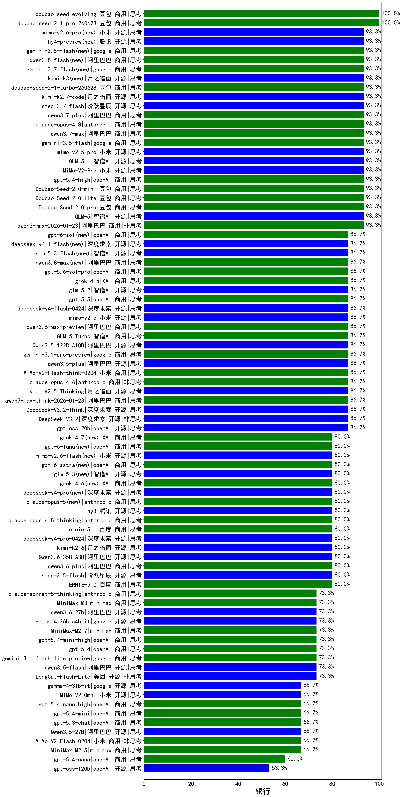

|类别|机构|大模型|【银行】准确率|平均耗时|平均消耗token|花费/千次（元）|排名（准确率）|
|---|---|-----|-------------------|-------|-----------|-----------|-----------|
|商用|豆包|doubao-seed-evolving|100.0%|107s|3923|115.1|1|
|商用|豆包|doubao-seed-2-1-pro-260628|100.0%|132s|4583|134.9|2|
|开源|阶跃星辰|step-3.7-flash|93.3%|14s|1187|9.1|3|
|商用|google|gemini-3.7-flash(new)|93.3%|5s|674|16.2|4|
|开源|月之暗面|kimi-k2.7-code|93.3%|26s|565|14.0|5|
|商用|openAI|gpt-5.4-high|93.3%|18s|679|64.5|6|
|商用|阿里巴巴|qwen3.8-flash(new)|93.3%|18s|1182|3.0|7|
|开源|智谱AI|GLM-5.1|93.3%|126s|1137|26.2|8|
|商用|google|gemini-3.8-flash(new)|93.3%|12s|594|28.3|9|
|开源|小米|mimo-v2.5-pro|93.3%|18s|1018|17.0|10|
|商用|豆包|Doubao-Seed-2.0-mini|93.3%|253s|1202|2.2|11|
|开源|小米|MiMo-V2-Pro|93.3%|56s|965|15.9|12|
|商用|豆包|Doubao-Seed-2.0-pro|93.3%|232s|1041|15.2|13|
|商用|豆包|Doubao-Seed-2.0-lite|93.3%|162s|793|2.5|14|
|开源|腾讯|hy4-preview(new)|93.3%|27s|1553|27.0|15|
|开源|小米|mimo-v2.6-pro(new)|93.3%|51s|572|3.2|16|
|商用|阿里巴巴|qwen3.7-plus|93.3%|15s|756|5.6|17|
|商用|anthropic|claude-opus-4.8|93.3%|7s|373|50.5|18|
|商用|阿里巴巴|qwen3-max-2026-01-23|93.3%|63s|338|2.9|19|
|商用|阿里巴巴|qwen3.7-max|93.3%|17s|770|26.1|20|
|商用|google|gemini-3.5-flash|93.3%|7s|1128|67.4|21|
|商用|豆包|doubao-seed-2-1-turbo-260628|93.3%|165s|5459|80.6|22|
|开源|智谱AI|GLM-5|93.3%|61s|1375|23.9|23|
|开源|月之暗面|kimi-k3(new)|93.3%|151s|580|46.9|24|
|开源|openAI|gpt-oss-20b|86.7%|109s|1009|1.1|25|
|商用|阿里巴巴|qwen3.6-max-preview|86.7%|42s|1403|72.7|26|
|开源|小米|mimo-v2.5|86.7%|17s|1082|11.7|27|
|开源|深度求索|deepseek-v4-flash-0424|86.7%|22s|538|1.0|28|
|开源|智谱AI|glm-5.2|86.7%|30s|1226|32.9|29|
|商用|XAI|grok-4.5|86.7%|58s|983|33.7|30|
|商用|openAI|gpt-5.5|86.7%|7s|369|63.8|31|
|商用|openAI|gpt-5.6-sol-pro|86.7%|33s|2990|219.7|32|
|商用|智谱AI|GLM-5-Turbo|86.7%|26s|1115|23.5|33|
|商用|阿里巴巴|qwen3.8-max(new)|86.7%|23s|981|32.8|34|
|商用|google|gemini-3.1-pro-preview|86.7%|22s|1121|90.6|35|
|开源|深度求索|DeepSeek-V3.2|86.7%|99s|249|0.7|36|
|开源|深度求索|DeepSeek-V3.2-Think|86.7%|22s|685|2.0|37|
|商用|openAI|gpt-6-sol(new)|86.7%|313s|203|9.8|38|
|商用|阿里巴巴|qwen3-max-think-2026-01-23|86.7%|90s|2613|25.6|39|
|开源|月之暗面|Kimi-K2.5-Thinking|86.7%|204s|871|17.2|40|
|商用|anthropic|claude-opus-4.6|86.7%|12s|518|75.5|41|
|商用|小米|MiMo-V2-Flash-think-0204|86.7%|575s|1139|2.3|42|
|开源|阿里巴巴|qwen3.5-plus|86.7%|34s|2674|12.6|43|
|开源|深度求索|deepseek-v4.1-flash(new)|86.7%|5s|575|4.1|44|
|开源|阿里巴巴|Qwen3.5-122B-A10B|86.7%|174s|2167|13.5|45|
|开源|智谱AI|glm-5.3-flash(new)|86.7%|44s|1770|4.8|46|
|商用|anthropic|claude-opus-5(new)|80.0%|11s|588|88.1|47|
|商用|openAI|gpt-6-astra(new)|80.0%|9s|206|50.5|48|
|开源|小米|mimo-v2.6-flash(new)|80.0%|20s|609|1.1|49|
|商用|openAI|gpt-6-luna(new)|80.0%|244s|413|1.2|50|
|开源|腾讯|hy3|80.0%|46s|191|0.6|51|
|开源|智谱AI|glm-5.3(new)|80.0%|80s|3037|83.6|52|
|商用|XAI|grok-4.6(new)|80.0%|236s|1022|35.4|53|
|开源|深度求索|deepseek-v4-pro(new)|80.0%|27s|920|22.3|54|
|开源|月之暗面|kimi-k2.6|80.0%|54s|1170|30.3|55|
|商用|XAI|grok-4.7(new)|80.0%|26s|2446|66.2|56|
|商用|anthropic|claude-opus-4.8-thinking|80.0%|14s|618|93.3|57|
|开源|阿里巴巴|Qwen3.6-35B-A3B|80.0%|105s|1341|13.9|58|
|商用|百度|ERNIE-5.0|80.0%|126s|1321|30.7|59|
|商用|阿里巴巴|qwen3.6-plus|80.0%|40s|1361|15.6|60|
|开源|阶跃星辰|step-3.5-flash|80.0%|13s|1153|2.3|61|
|商用|百度|ernie-5.1|80.0%|18s|702|11.7|62|
|开源|深度求索|deepseek-v4-pro-0424|80.0%|16s|494|11.1|63|
|商用|anthropic|claude-sonnet-5-thinking|73.3%|10s|615|37.1|64|
|开源|阿里巴巴|qwen3.5-flash|73.3%|206s|2741|5.4|65|
|开源|google|gemma-4-26b-a4b-it|73.3%|34s|490|1.2|66|
|开源|阿里巴巴|qwen3.6-27b|73.3%|23s|1406|24.3|67|
|开源|美团|LongCat-Flash-Lite|73.3%|117s|306|0.0|68|
|商用|minimax|MiniMax-M2.7|73.3%|27s|1027|8.0|69|
|商用|minimax|MiniMax-M3|73.3%|19s|606|7.3|70|
|商用|openAI|gpt-5.4-mini-high|73.3%|92s|556|15.5|71|
|商用|openAI|gpt-5.4|73.3%|5s|221|16.4|72|
|商用|google|gemini-3.1-flash-lite-preview|73.3%|20s|305|2.6|73|
|商用|minimax|MiniMax-M2.5|66.7%|19s|990|7.7|74|
|商用|小米|MiMo-V2-Flash-0204|66.7%|146s|376|0.7|75|
|商用|openAI|gpt-5.4-mini|66.7%|27s|207|4.5|76|
|开源|阿里巴巴|Qwen3.5-27B|66.7%|321s|2425|11.4|77|
|商用|openAI|gpt-5.3-chat|66.7%|22s|296|22.3|78|
|开源|小米|MiMo-V2-Omni|66.7%|318s|1205|13.4|79|
|开源|google|gemma-4-31b-it|66.7%|103s|453|1.1|80|
|商用|openAI|gpt-5.4-nano-high|66.7%|19s|371|2.7|81|
|商用|openAI|gpt-5.4-nano|60.0%|26s|190|1.1|82|
|开源|openAI|gpt-oss-120b|53.3%|7s|489|1.3|83|

