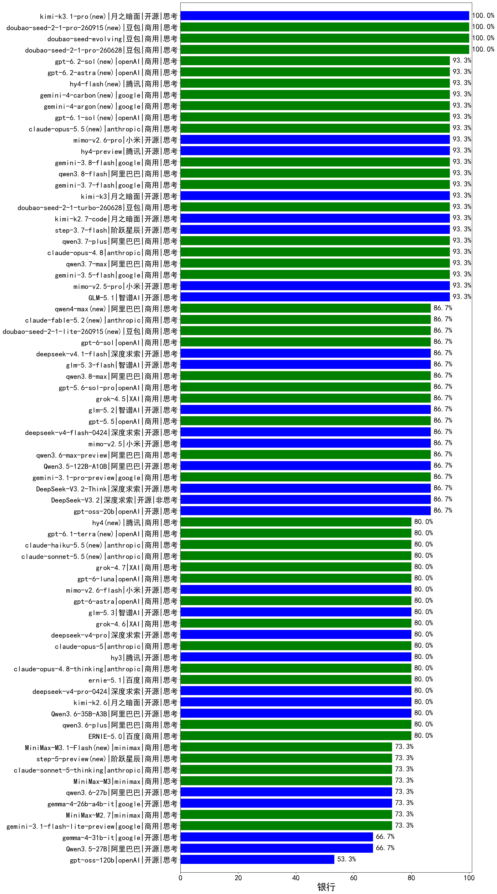

|类别|机构|大模型|【银行】准确率|平均耗时|平均消耗token|花费/千次（元）|排名（准确率）|
|---|---|-----|-------------------|-------|-----------|-----------|-----------|
|商用|豆包|doubao-seed-evolving|100.0%|107s|3923|115.1|1|
|商用|豆包|doubao-seed-2-1-pro-260628|100.0%|132s|4583|134.9|2|
|开源|月之暗面|kimi-k3.1-pro(new)|100.0%|29s|880|52.2|3|
|商用|豆包|doubao-seed-2-1-pro-260915(new)|100.0%|49s|1278|35.7|4|
|商用|openAI|gpt-6.2-sol(new)|93.3%|4s|203|9.9|5|
|开源|月之暗面|kimi-k2.7-code|93.3%|26s|565|14.0|6|
|开源|阶跃星辰|step-3.7-flash|93.3%|14s|1187|9.1|7|
|商用|阿里巴巴|qwen3.7-plus|93.3%|15s|756|5.6|8|
|开源|月之暗面|kimi-k3|93.3%|151s|580|46.9|9|
|商用|anthropic|claude-opus-4.8|93.3%|7s|373|50.5|10|
|商用|阿里巴巴|qwen3.7-max|93.3%|17s|770|26.1|11|
|商用|google|gemini-3.5-flash|93.3%|7s|1128|67.4|12|
|商用|google|gemini-3.7-flash|93.3%|5s|674|16.2|13|
|商用|阿里巴巴|qwen3.8-flash|93.3%|18s|1182|3.0|14|
|商用|google|gemini-3.8-flash|93.3%|12s|594|28.3|15|
|开源|小米|mimo-v2.5-pro|93.3%|18s|1018|17.0|16|
|商用|豆包|doubao-seed-2-1-turbo-260628|93.3%|165s|5459|80.6|17|
|开源|腾讯|hy4-preview|93.3%|27s|1553|27.0|18|
|商用|openAI|gpt-6.1-sol(new)|93.3%|6s|187|8.8|19|
|商用|openAI|gpt-6.2-astra(new)|93.3%|5s|192|36.4|20|
|商用|腾讯|hy4-flash(new)|93.3%|19s|1044|2.0|21|
|商用|google|gemini-4-carbon(new)|93.3%|26s|841|107.2|22|
|开源|小米|mimo-v2.6-pro|93.3%|51s|572|3.2|23|
|商用|google|gemini-4-argon(new)|93.3%|26s|372|41.4|24|
|商用|anthropic|claude-opus-5.5(new)|93.3%|13s|648|78.6|25|
|开源|智谱AI|GLM-5.1|93.3%|126s|1137|26.2|26|
|商用|豆包|doubao-seed-2-1-lite-260915(new)|86.7%|28s|479|1.1|27|
|商用|阿里巴巴|qwen3.8-max|86.7%|23s|981|32.8|28|
|商用|anthropic|claude-fable-5.2(new)|86.7%|39s|492|113.6|29|
|开源|智谱AI|glm-5.3-flash|86.7%|44s|1770|4.8|30|
|商用|openAI|gpt-5.6-sol-pro|86.7%|33s|2990|219.7|31|
|商用|阿里巴巴|qwen4-max(new)|86.7%|23s|494|13.2|32|
|开源|openAI|gpt-oss-20b|86.7%|109s|1009|1.1|33|
|商用|openAI|gpt-6-sol|86.7%|313s|203|9.8|34|
|开源|深度求索|deepseek-v4.1-flash|86.7%|5s|575|4.1|35|
|商用|XAI|grok-4.5|86.7%|58s|983|33.7|36|
|开源|小米|mimo-v2.5|86.7%|17s|1082|11.7|37|
|商用|google|gemini-3.1-pro-preview|86.7%|22s|1121|90.6|38|
|开源|深度求索|deepseek-v4-flash-0424|86.7%|22s|538|1.0|39|
|商用|openAI|gpt-5.5|86.7%|7s|369|63.8|40|
|开源|深度求索|DeepSeek-V3.2-Think|86.7%|22s|685|2.0|41|
|开源|深度求索|DeepSeek-V3.2|86.7%|99s|249|0.7|42|
|开源|阿里巴巴|Qwen3.5-122B-A10B|86.7%|174s|2167|13.5|43|
|开源|智谱AI|glm-5.2|86.7%|30s|1226|32.9|44|
|商用|阿里巴巴|qwen3.6-max-preview|86.7%|42s|1403|72.7|45|
|商用|anthropic|claude-sonnet-5.5(new)|80.0%|7s|545|32.1|46|
|商用|openAI|gpt-6.1-terra(new)|80.0%|5s|337|9.6|47|
|商用|腾讯|hy4(new)|80.0%|36s|1797|31.4|48|
|商用|阿里巴巴|qwen3.6-plus|80.0%|40s|1361|15.6|49|
|开源|小米|mimo-v2.6-flash|80.0%|20s|609|1.1|50|
|商用|百度|ERNIE-5.0|80.0%|126s|1321|30.7|51|
|商用|XAI|grok-4.7|80.0%|26s|2446|66.2|52|
|开源|腾讯|hy3|80.0%|46s|191|0.6|53|
|商用|openAI|gpt-6-luna|80.0%|244s|413|1.2|54|
|开源|阿里巴巴|Qwen3.6-35B-A3B|80.0%|105s|1341|13.9|55|
|开源|月之暗面|kimi-k2.6|80.0%|54s|1170|30.3|56|
|商用|openAI|gpt-6-astra|80.0%|9s|206|50.5|57|
|开源|深度求索|deepseek-v4-pro-0424|80.0%|16s|494|11.1|58|
|开源|智谱AI|glm-5.3|80.0%|80s|3037|83.6|59|
|商用|XAI|grok-4.6|80.0%|236s|1022|35.4|60|
|开源|深度求索|deepseek-v4-pro|80.0%|27s|920|22.3|61|
|商用|百度|ernie-5.1|80.0%|18s|702|11.7|62|
|商用|anthropic|claude-opus-5|80.0%|11s|588|88.1|63|
|商用|anthropic|claude-opus-4.8-thinking|80.0%|14s|618|93.3|64|
|商用|anthropic|claude-haiku-5.5(new)|80.0%|13s|656|2.0|65|
|商用|minimax|MiniMax-M3.1-Flash(new)|73.3%|12s|791|2.4|66|
|商用|anthropic|claude-sonnet-5-thinking|73.3%|10s|615|37.1|67|
|商用|google|gemini-3.1-flash-lite-preview|73.3%|20s|305|2.6|68|
|商用|minimax|MiniMax-M2.7|73.3%|27s|1027|8.0|69|
|商用|阶跃星辰|step-5-preview(new)|73.3%|29s|2168|42.5|70|
|开源|google|gemma-4-26b-a4b-it|73.3%|34s|490|1.2|71|
|开源|阿里巴巴|qwen3.6-27b|73.3%|23s|1406|24.3|72|
|商用|minimax|MiniMax-M3|73.3%|19s|606|7.3|73|
|开源|阿里巴巴|Qwen3.5-27B|66.7%|321s|2425|11.4|74|
|开源|google|gemma-4-31b-it|66.7%|103s|453|1.1|75|
|开源|openAI|gpt-oss-120b|53.3%|7s|489|1.3|76|

