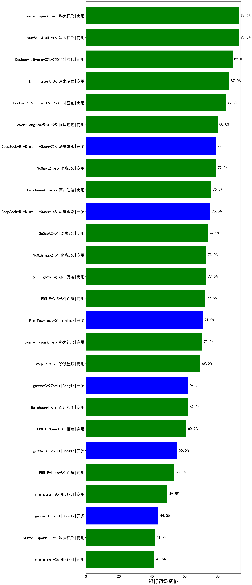

|类别|机构|大模型|【银行初级资格】准确率|平均耗时|平均消耗token|排名（准确率）|
|---|---|-----|-------------------|-------|-----------|------------|
|商用|腾讯|hunyuan-turbo|97.0%|19s|867|1|
|开源|腾讯|hunyuan-large|94.5%|13s|903|2|
|商用|科大讯飞|xunfei-4.0Ultra|93.0%|8s|131|3|
|商用|科大讯飞|xunfei-spark-max|93.0%|7s|131|4|
|商用|豆包|Doubao-1.5-pro-32k-250115|89.0%|11s|350|5|
|商用|月之暗面|kimi-latest-8k|87.0%|21s|435|6|
|商用|腾讯|hunyuan-standard|85.5%|/|/|7|
|商用|豆包|Doubao-1.5-lite-32k-250115|85.0%|7s|227|8|
|开源|阿里巴巴|qwq-32b|83.0%|48s|1775|9|
|商用|阿里巴巴|qwq-plus-2025-03-05|83.0%|40s|1812|10|
|开源|深度求索|DeepSeek-R1|82.0%|/|/|11|
|商用|阿里巴巴|qwen-long-2025-01-25|80.0%|14s|383|12|
|开源|阿里巴巴|qwen2.5-72b-instruct|79.0%|16s|239|13|
|开源|深度求索|DeepSeek-R1-Distill-Qwen-32B|79.0%|32s|810|14|
|商用|奇虎360|360gpt2-pro|79.0%|14s|210|15|
|商用|阿里巴巴|qwen2.5-max|78.5%|19s|375|16|
|商用|奇虎360|360gpt-turbo|78.0%|/|/|17|
|开源|阿里巴巴|qwen2.5-14b-instruct|78.0%|7s|309|18|
|商用|商汤|SenseChat-5-beta|76.0%|17s|288|19|
|商用|商汤|SenseChat-5-1202|76.0%|/|/|20|
|商用|百川智能|Baichuan4-Turbo|76.0%|/|/|21|
|开源|深度求索|DeepSeek-R1-Distill-Qwen-14B|75.5%|/|/|22|
|商用|openAI|chatgpt-4o-latest|75.0%|/|/|23|
|开源|阿里巴巴|qwen2.5-32b-instruct|74.5%|12s|227|24|
|商用|奇虎360|360gpt2-o1|74.0%|17s|342|25|
|商用|奇虎360|360zhinao2-o1|73.0%|/|/|26|
|开源|上海人工智能实验室|internlm2_5-7b-chat|73.0%|/|/|27|
|商用|零一万物|yi-lightning|73.0%|/|/|28|
|商用|百度|ERNIE-3.5-8K|72.5%|23s|447|29|
|商用|商汤|SenseChat-Turbo-1202|72.5%|/|/|30|
|商用|智谱AI|GLM-4-Flash|71.5%|9s|226|31|
|开源|minimax|MiniMax-Text-01|71.0%|12s|865|32|
|商用|科大讯飞|xunfei-spark-pro|70.5%|/|/|33|
|开源|阿里巴巴|qwen2.5-7b-instruct|70.0%|6s|275|34|
|商用|阶跃星辰|step-2-mini|69.5%|65s|415|35|
|商用|Mistral|mistral-small|68.0%|/|/|36|
|商用|月之暗面|moonshot-v1-8k|66.5%|/|/|37|
|商用|Mistral|mistral-large|66.0%|/|/|38|
|商用|智谱AI|GLM-4-FlashX|65.5%|7s|227|39|
|商用|OpenAI|gpt-4o-mini|65.5%|/|/|40|
|开源|微软|phi-4|63.5%|/|/|41|
|开源|Google|gemma-3-27b-it|62.0%|/|/|42|
|商用|百川智能|Baichuan4-Air|62.0%|/|/|43|
|开源|阿里巴巴|qwen2.5-3b-instruct|61.5%|14s|426|44|
|商用|百度|ERNIE-Speed-8K|60.9%|/|/|45|
|开源|阿里巴巴|qwen2.5-1.5b-instruct|56.5%|9s|293|46|
|开源|Google|gemma-3-12b-it|55.5%|/|/|47|
|商用|百度|ERNIE-Lite-8K|53.5%|/|/|48|
|商用|Mistral|ministral-8b|49.5%|/|/|49|
|开源|Google|gemma-3-4b-it|44.0%|/|/|50|
|开源|阿里巴巴|qwen2.5-0.5b-instruct|43.5%|18s|314|51|
|商用|科大讯飞|xunfei-spark-lite|41.9%|/|/|52|
|商用|Mistral|ministral-3b|41.5%|/|/|53|
|商用|百度|ERNIE-Tiny-8K|32.5%|/|/|54|
|商用|智谱AI|GLM-4-Air|nan%|14s|215|55|
|商用|智谱AI|GLM-4-AirX|nan%|5s|248|56|
|商用|智谱AI|GLM-4-Long|nan%|11s|245|57|
|商用|智谱AI|GLM-4-Plus|nan%|14s|265|58|
|开源|深度求索|deepseek-chat-v3-0324|nan%|140s|322|59|
|开源|meta|Llama-4-Scout-17B-16E-Instruct|nan%|42s|484|60|
|开源|meta|Llama-4-Maverick-17B-128E-Instruct-FP8|nan%|10s|491|61|
|开源|Mistral|Mistral-Small-3.1-24B-Instruct-2503|nan%|/|/|62|
|商用|智谱AI|GLM-Z1-Flash|nan%|30s|1783|63|
|商用|智谱AI|GLM-Z1-FlashX|nan%|18s|1193|64|
|商用|智谱AI|GLM-Z1-Air|nan%|53s|1355|65|
|商用|智谱AI|GLM-Z1-AirX|nan%|27s|1190|66|
|开源|智谱AI|GLM-4-9B-0414|nan%|8s|358|67|
|开源|智谱AI|GLM-Z1-9B-0414|nan%|51s|1969|68|
|开源|智谱AI|GLM-4-32B-0414|nan%|52s|287|69|
|开源|智谱AI|GLM-Z1-32B-0414|nan%|68s|1301|70|
|开源|智谱AI|GLM-Z1-Rumination-32B-0414|nan%|24s|1199|71|
|开源|阿里巴巴|Qwen3-235B-A22B|nan%|41s|1376|72|
|开源|阿里巴巴|Qwen3-32B|nan%|45s|1352|73|
|开源|阿里巴巴|Qwen3-30B-A3B|nan%|27s|1869|74|
|开源|阿里巴巴|Qwen3-14B|nan%|22s|1192|75|
|开源|阿里巴巴|Qwen3-8B|nan%|144s|3974|76|
|开源|阿里巴巴|Qwen3-4B|nan%|9s|805|77|
|开源|阿里巴巴|Qwen3-1.7B|nan%|17s|1205|78|
|开源|阿里巴巴|Qwen3-0.6B|nan%|5s|1066|79|
|商用|科大讯飞|xunfei-spark-x1|nan%|36s|1076|80|
|商用|豆包|Doubao-1.5-thinking-pro|nan%|361s|743|81|
|商用|openAI|gpt-4.1|nan%|11s|281|82|
|商用|openAI|gpt-4.1-mini|nan%|8s|248|83|
|商用|openAI|o4-mini|nan%|30s|518|84|
|开源|深度求索|DeepSeek-R1-0528|nan%|215s|1644|85|
|商用|百度|ERNIE-4.5-Turbo-32K|nan%|19s|482|86|
|商用|百度|ERNIE-X1-Turbo-32K|nan%|54s|1218|87|
|商用|google|gemini-2.5-flash-preview-05-20|nan%|47s|1285|88|
|商用|google|gemini-2.5-pro-preview-05-06|nan%|45s|1525|89|
|开源|深度求索|DeepSeek-R1-0528-Qwen3-8B|nan%|301s|1372|90|
|商用|anthropic|claude-4-sonnet|nan%|87s|478|91|
|商用|anthropic|claude-4-sonnet-thinking|nan%|108s|1270|92|
|商用|阶跃星辰|step-r1-v-mini|nan%|193s|1397|93|
|商用|腾讯|hunyuan-turbos-20250604(new)|nan%|75s|468|94|
|商用|腾讯|hunyuan-t1-20250529|nan%|14s|801|95|
|商用|豆包|doubao-seed-1-6-flash-250615(new)|nan%|3s|326|96|
|商用|豆包|doubao-seed-1-6-flash-thinking-250615(new)|nan%|5s|573|97|
|商用|豆包|doubao-seed-1-6-250615(new)|nan%|7s|454|98|
|商用|豆包|doubao-seed-1-6-thinking-250615(new)|nan%|303s|1198|99|
|商用|阿里巴巴|qwen-plus-2025-04-28|nan%|170s|428|100|
|商用|阿里巴巴|qwen-plus-think-2025-04-28|nan%|193s|1251|101|
|商用|阿里巴巴|qwen-turbo-2025-04-28|nan%|6s|413|102|
|商用|阿里巴巴|qwen-turbo-think-2025-04-28|nan%|216s|1697|103|
|开源|minimax|MiniMax-M1(new)|nan%|182s|2719|104|
|开源|百度|ERNIE-4.5-0.3B(new)|nan%|58s|355|105|
|开源|百度|ERNIE-4.5-21B-A3B(new)|nan%|56s|406|106|
|开源|百度|ERNIE-4.5-300B-A47B(new)|nan%|13s|407|107|
|开源|腾讯|Hunyuan-A13B-Instruct(new)|nan%|26s|668|108|
|商用|google|gemini-2.5-pro(new)|nan%|20s|1816|109|
|商用|google|gemini-2.5-flash(new)|nan%|10s|1417|110|
|商用|google|gemini-2.5-flash-lite-preview-06-17(new)|nan%|6s|988|111|

