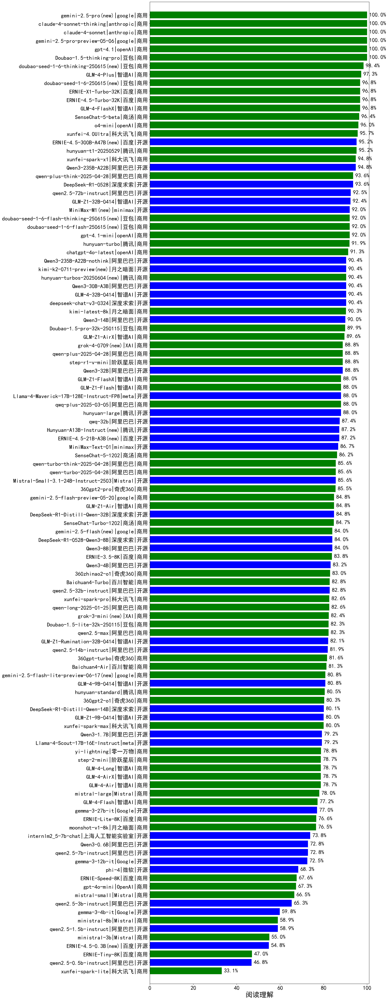

|类别|机构|大模型|【阅读理解】准确率|平均耗时|平均消耗token|花费/千次（元）|排名（准确率）|
|---|---|-----|-------------------|-------|-----------|-----------|-----------|
|商用|anthropic|claude-4-sonnet|100.0%|46s|706|39.7|1|
|商用|anthropic|claude-4-sonnet-thinking|100.0%|44s|1076|80.0|2|
|商用|openAI|gpt-4.1|100.0%|12s|518|18.5|3|
|商用|豆包|doubao-seed-1-6-thinking-250715(new)|98.4%|3s|1494|7.8|4|
|商用|智谱AI|GLM-4-Plus|97.3%|6s|919|4.6|5|
|商用|google|gemini-2.5-pro|96.8%|27s|2914|173.2|6|
|商用|百度|ERNIE-X1-Turbo-32K|96.8%|205s|1785|5.7|7|
|商用|智谱AI|GLM-4-FlashX|96.8%|3s|722|0.1|8|
|商用|豆包|doubao-seed-1-6-250615|96.8%|129s|1090|2.6|9|
|商用|百度|ERNIE-4.5-Turbo-32K|96.8%|38s|663|0.9|10|
|商用|阿里巴巴|qwen-plus-2025-07-14(new)|96.8%|12s|1139|1.6|11|
|商用|openAI|o4-mini|96.0%|17s|733|17.1|12|
|商用|科大讯飞|xunfei-4.0Ultra|95.7%|3s|572|40.0|13|
|开源|百度|ERNIE-4.5-300B-A47B|95.2%|7s|622|1.7|14|
|开源|阿里巴巴|qwen3-235b-a22b-thinking-2507(new)|95.2%|43s|2643|42.7|15|
|开源|阿里巴巴|qwen3-235b-a22b-instruct-2507(new)|95.2%|16s|1171|6.0|16|
|开源|阿里巴巴|Qwen3-235B-A22B|94.8%|269s|2120|17.5|17|
|商用|科大讯飞|xunfei-spark-x1-0725(new)|94.7%|/|1271|15.3|18|
|开源|阿里巴巴|Qwen3-30B-A3B-Thinking-2507(new)|93.6%|61s|3241|7.9|19|
|开源|深度求索|DeepSeek-R1-0528|93.6%|129s|2585|33.6|20|
|商用|阿里巴巴|qwen-plus-think-2025-04-28|93.6%|21s|1919|11.3|21|
|开源|阿里巴巴|qwen2.5-72b-instruct|92.5%|7s|523|2.9|22|
|开源|智谱AI|GLM-Z1-32B-0414|92.4%|134s|1851|6.5|23|
|商用|豆包|doubao-seed-1-6-flash-250615|92.0%|2s|1129|0.6|24|
|开源|minimax|MiniMax-M1|92.0%|68s|5875|42.9|25|
|商用|腾讯|hunyuan-t1-20250711(new)|92.0%|34s|2468|8.2|26|
|商用|豆包|doubao-seed-1-6-flash-thinking-250615|92.0%|2s|1719|1.4|27|
|商用|openAI|gpt-4.1-mini|92.0%|5s|393|2.2|28|
|商用|openAI|chatgpt-4o-latest|91.3%|/|/|/|29|
|商用|智谱AI|GLM-4.5-Flash(new)|90.4%|35s|2516|0.0|30|
|开源|阿里巴巴|Qwen3-235B-A22B-nothink|90.4%|26s|984|5.6|31|
|商用|腾讯|hunyuan-turbos-20250604|90.4%|33s|838|1.0|32|
|开源|智谱AI|GLM-4-32B-0414|90.4%|30s|641|1.2|33|
|开源|深度求索|deepseek-chat-v3-0324|90.4%|144s|440|2.3|34|
|开源|阿里巴巴|Qwen3-30B-A3B|90.4%|112s|2346|5.7|35|
|开源|华为|pangu-pro-moe|90.4%|64s|1687|5.1|36|
|开源|智谱AI|GLM-4.5-Air(new)|90.4%|34s|2555|12.6|37|
|开源|月之暗面|kimi-k2-0711-preview(new)|90.4%|19s|775|6.6|38|
|商用|月之暗面|kimi-latest-8k|90.3%|15s|609|7.3|39|
|开源|阿里巴巴|Qwen3-14B|90.0%|65s|2372|4.1|40|
|商用|豆包|Doubao-1.5-pro-32k-250115|89.9%|7s|773|0.9|41|
|商用|智谱AI|GLM-Z1-AirX|89.6%|25s|2245|12.9|42|
|开源|阿里巴巴|Qwen3-32B|88.8%|53s|1453|4.5|43|
|开源|智谱AI|GLM-4.5-nothink|88.8%|25s|1311|12.5|44|
|商用|阶跃星辰|step-r1-v-mini|88.8%|59s|1923|12.2|45|
|商用|XAI|grok-4-0709|88.8%|470s|1790|145.9|46|
|开源|阿里巴巴|Qwen3-30B-A3B-Instruct-2507(new)|88.8%|8s|1242|2.5|47|
|开源|智谱AI|GLM-4.5(new)|88.8%|52s|2561|30.1|48|
|商用|阿里巴巴|qwq-plus-2025-03-05|88.0%|30s|1746|5.9|49|
|商用|智谱AI|GLM-Z1-Flash|88.0%|35s|3216|0.0|50|
|开源|腾讯|hunyuan-large|88.0%|7s|2485|12.1|51|
|开源|meta|Llama-4-Maverick-17B-128E-Instruct-FP8|88.0%|8s|854|2.4|52|
|商用|智谱AI|GLM-Z1-FlashX|88.0%|26s|1637|0.6|53|
|开源|阿里巴巴|qwq-32b|87.4%|27s|1842|9.2|54|
|商用|阿里巴巴|qwen-turbo-2025-07-15(new)|87.2%|9s|950|0.4|55|
|开源|智谱AI|GLM-4.5-Air-nothink|87.2%|10s|1174|4.3|56|
|开源|阶跃星辰|step-3(new)|87.2%|104s|2494|8.7|57|
|商用|openAI|gpt-5-mini-2025-08-07(new)|87.2%|37s|1517|13.2|58|
|开源|腾讯|Hunyuan-A13B-Instruct|87.2%|50s|2122|6.9|59|
|开源|百度|ERNIE-4.5-21B-A3B|87.2%|61s|799|0.0|60|
|商用|openAI|gpt-5-2025-08-07(new)|87.2%|42s|1026|31.0|61|
|开源|阿里巴巴|Qwen3-14B-nothink|87.2%|16s|1090|1.3|62|
|开源|minimax|MiniMax-Text-01|86.7%|6s|1025|8.2|63|
|商用|商汤|SenseChat-5-1202|86.2%|/|/|/|64|
|开源|Mistral|Mistral-Small-3.1-24B-Instruct-2503|85.6%|/|/|/|65|
|商用|阿里巴巴|qwen-turbo-think-2025-04-28|85.6%|62s|2472|5.9|66|
|商用|奇虎360|360gpt2-pro|85.5%|5s|618|1.5|67|
|开源|阿里巴巴|Qwen3-8B-nothink|85.2%|21s|999|0.0|68|
|开源|深度求索|DeepSeek-R1-Distill-Qwen-32B|84.8%|28s|840|1.1|69|
|商用|智谱AI|GLM-Z1-Air|84.8%|55s|1843|0.9|70|
|商用|智谱AI|GLM-4.5-Flash-nothink|84.0%|15s|1095|0.0|71|
|商用|google|gemini-2.5-flash|84.0%|11s|2704|39.4|72|
|开源|深度求索|DeepSeek-R1-0528-Qwen3-8B|84.0%|379s|1963|0.0|73|
|开源|阿里巴巴|Qwen3-8B|84.0%|84s|3068|0.0|74|
|商用|百度|ERNIE-3.5-8K|83.8%|7s|303|0.4|75|
|开源|阿里巴巴|Qwen3-4B|83.2%|37s|1389|3.0|76|
|开源|腾讯|Hunyuan-A13B-Instruct-nothink(new)|83.2%|616s|777|1.5|77|
|商用|奇虎360|360zhinao2-o1|83.0%|/|/|/|78|
|商用|百川智能|Baichuan4-Turbo|82.8%|/|/|/|79|
|开源|阿里巴巴|qwen2.5-32b-instruct|82.8%|3s|614|1.6|80|
|商用|科大讯飞|xunfei-spark-pro|82.6%|/|/|/|81|
|商用|阿里巴巴|qwen-long-2025-01-25|82.6%|122s|417|0.5|82|
|商用|XAI|grok-3-mini|82.4%|120s|1709|5.4|83|
|开源|阿里巴巴|Qwen3-30B-A3B-nothink|82.4%|17s|1010|1.6|84|
|开源|阿里巴巴|Qwen3-32B-nothink|82.4%|28s|975|2.2|85|
|商用|豆包|Doubao-1.5-lite-32k-250115|82.3%|4s|712|0.3|86|
|商用|阿里巴巴|qwen2.5-max|82.3%|7s|635|2.8|87|
|开源|智谱AI|GLM-Z1-Rumination-32B-0414|82.1%|45s|2048|5.9|88|
|开源|阿里巴巴|qwen2.5-14b-instruct|81.9%|2s|389|0.7|89|
|商用|奇虎360|360gpt-turbo|81.6%|/|/|/|90|
|商用|百川智能|Baichuan4-Air|81.3%|/|/|/|91|
|商用|google|gemini-2.5-flash-lite-preview-06-17|80.8%|2s|983|1.5|92|
|开源|智谱AI|GLM-4-9B-0414|80.8%|7s|718|0.0|93|
|商用|腾讯|hunyuan-standard|80.5%|/|/|/|94|
|商用|奇虎360|360gpt2-o1|80.3%|12s|619|19.0|95|
|开源|深度求索|DeepSeek-R1-Distill-Qwen-14B|80.1%|/|/|/|96|
|开源|智谱AI|GLM-Z1-9B-0414|80.0%|159s|2540|0.0|97|
|商用|科大讯飞|xunfei-spark-max|80.0%|3s|558|16.8|98|
|开源|meta|Llama-4-Scout-17B-16E-Instruct|79.2%|3s|411|0.5|99|
|开源|openAI|gpt-oss-120b(new)|79.2%|4s|1482|2.9|100|
|开源|openAI|gpt-oss-20b(new)|79.2%|230s|1849|1.5|101|
|开源|阿里巴巴|Qwen3-1.7B|79.2%|28s|2189|5.4|102|
|商用|零一万物|yi-lightning|78.8%|/|/|/|103|
|商用|智谱AI|GLM-4-AirX|78.7%|4s|537|5.4|104|
|商用|阶跃星辰|step-2-mini|78.7%|5s|378|0.5|105|
|商用|智谱AI|GLM-4-Long|78.7%|6s|531|0.5|106|
|商用|Mistral|mistral-large|78.0%|/|/|/|107|
|开源|阿里巴巴|Qwen3-4B-nothink|77.6%|10s|881|1.1|108|
|开源|Google|gemma-3-27b-it|77.0%|/|/|/|109|
|商用|百度|ERNIE-Lite-8K|76.6%|/|/|/|110|
|开源|阿里巴巴|Qwen3-1.7B-nothink|75.6%|10s|983|1.4|111|
|开源|上海人工智能实验室|internlm2_5-7b-chat|73.8%|/|/|/|112|
|商用|openAI|gpt-5-nano-2025-08-07(new)|72.8%|23s|2895|6.6|113|
|开源|阿里巴巴|qwen2.5-7b-instruct|72.8%|9s|376|0.2|114|
|开源|阿里巴巴|Qwen3-0.6B|72.8%|26s|1193|2.4|115|
|开源|Google|gemma-3-12b-it|72.5%|/|/|/|116|
|开源|微软|phi-4|68.3%|/|/|/|117|
|商用|百度|ERNIE-Speed-8K|67.6%|/|/|/|118|
|商用|OpenAI|gpt-4o-mini|67.3%|/|/|/|119|
|商用|Mistral|mistral-small|66.5%|/|/|/|120|
|开源|阿里巴巴|Qwen3-0.6B-nothink|66.4%|8s|716|0.6|121|
|开源|阿里巴巴|qwen2.5-3b-instruct|65.3%|10s|379|0.2|122|
|开源|Google|gemma-3-4b-it|59.8%|/|/|/|123|
|开源|阿里巴巴|qwen2.5-1.5b-instruct|58.9%|11s|346|0.0|124|
|商用|Mistral|ministral-8b|58.9%|/|/|/|125|
|商用|Mistral|ministral-3b|55.0%|/|/|/|126|
|开源|百度|ERNIE-4.5-0.3B|54.8%|2s|738|0.0|127|
|商用|百度|ERNIE-Tiny-8K|47.0%|/|/|/|128|
|开源|阿里巴巴|qwen2.5-0.5b-instruct|46.8%|9s|369|0.0|129|
|商用|科大讯飞|xunfei-spark-lite|33.1%|/|/|/|130|

