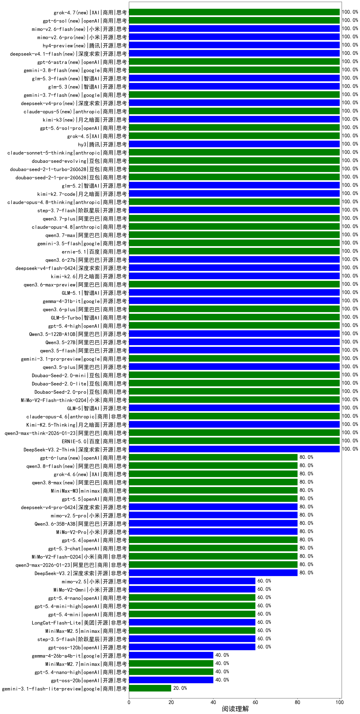

|类别|机构|大模型|【阅读理解】准确率|平均耗时|平均消耗token|花费/千次（元）|排名（准确率）|
|---|---|-----|-------------------|-------|-----------|-----------|-----------|
|开源|月之暗面|kimi-k2.6|100.0%|134s|4321|104.0|1|
|商用|anthropic|claude-opus-4.8|100.0%|9s|1695|125.5|2|
|商用|豆包|doubao-seed-2-1-pro-260628|100.0%|99s|6114|165.2|3|
|开源|智谱AI|glm-5.2|100.0%|54s|2809|65.0|4|
|开源|月之暗面|kimi-k2.7-code|100.0%|86s|3339|77.5|5|
|商用|anthropic|claude-opus-4.8-thinking|100.0%|15s|1972|174.1|6|
|开源|阶跃星辰|step-3.7-flash|100.0%|16s|2971|19.6|7|
|商用|阿里巴巴|qwen3.7-plus|100.0%|97s|5688|41.5|8|
|商用|阿里巴巴|qwen3.7-max|100.0%|33s|2501|74.1|9|
|商用|豆包|doubao-seed-evolving|100.0%|196s|7195|197.6|10|
|商用|google|gemini-3.5-flash|100.0%|11s|2674|127.7|11|
|商用|百度|ernie-5.1|100.0%|44s|2456|33.3|12|
|开源|阿里巴巴|qwen3.6-27b|100.0%|38s|2851|41.4|13|
|开源|深度求索|deepseek-v4-flash-0424|100.0%|15s|1348|2.0|14|
|商用|阿里巴巴|qwen3.6-max-preview|100.0%|62s|2885|125.9|15|
|开源|智谱AI|GLM-5.1|100.0%|163s|2936|58.3|16|
|商用|豆包|doubao-seed-2-1-turbo-260628|100.0%|200s|8462|117.8|17|
|商用|anthropic|claude-sonnet-5-thinking|100.0%|25s|1731|52.8|18|
|商用|阿里巴巴|qwen3.6-plus|100.0%|54s|3196|31.7|19|
|开源|智谱AI|glm-5.3-flash(new)|100.0%|51s|2914|6.8|20|
|开源|小米|mimo-v2.6-flash(new)|100.0%|297s|2081|3.4|21|
|开源|小米|mimo-v2.6-pro(new)|100.0%|40s|2301|11.6|22|
|开源|腾讯|hy4-preview(new)|100.0%|114s|9824|168.8|23|
|开源|深度求索|deepseek-v4.1-flash(new)|100.0%|10s|1434|7.4|24|
|商用|openAI|gpt-6-astra(new)|100.0%|16s|1109|128.6|25|
|商用|google|gemini-3.8-flash(new)|100.0%|12s|1604|51.6|26|
|开源|智谱AI|glm-5.3(new)|100.0%|71s|3700|89.9|27|
|开源|腾讯|hy3|100.0%|90s|1129|2.6|28|
|商用|google|gemini-3.7-flash(new)|100.0%|4s|1465|22.2|29|
|开源|深度求索|deepseek-v4-pro(new)|100.0%|148s|2906|65.2|30|
|商用|anthropic|claude-opus-5(new)|100.0%|11s|1806|145.1|31|
|开源|月之暗面|kimi-k3(new)|100.0%|97s|3113|255.7|32|
|商用|openAI|gpt-5.6-sol-pro|100.0%|106s|7047|430.2|33|
|商用|XAI|grok-4.5|100.0%|56s|3152|105.7|34|
|开源|google|gemma-4-31b-it|100.0%|131s|1127|1.7|35|
|商用|openAI|gpt-6-sol(new)|100.0%|244s|1065|22.6|36|
|商用|google|gemini-3.1-pro-preview|100.0%|56s|4363|316.6|37|
|开源|月之暗面|Kimi-K2.5-Thinking|100.0%|588s|3380|60.5|38|
|商用|anthropic|claude-opus-4.6|100.0%|12s|1885|158.8|39|
|商用|小米|MiMo-V2-Flash-think-0204|100.0%|610s|3622|6.6|40|
|商用|豆包|Doubao-Seed-2.0-pro|100.0%|230s|1609|16.0|41|
|商用|豆包|Doubao-Seed-2.0-lite|100.0%|210s|1679|3.8|42|
|商用|豆包|Doubao-Seed-2.0-mini|100.0%|384s|2320|3.3|43|
|开源|阿里巴巴|qwen3.5-plus|100.0%|61s|5088|21.8|44|
|开源|阿里巴巴|qwen3.5-flash|100.0%|472s|6304|11.4|45|
|开源|阿里巴巴|Qwen3.5-27B|100.0%|326s|6165|26.8|46|
|开源|阿里巴巴|Qwen3.5-122B-A10B|100.0%|435s|5446|31.1|47|
|商用|openAI|gpt-5.4-high|100.0%|59s|2216|151.5|48|
|商用|智谱AI|GLM-5-Turbo|100.0%|70s|2215|37.2|49|
|开源|智谱AI|GLM-5|100.0%|106s|4857|77.9|50|
|商用|阿里巴巴|qwen3-max-think-2026-01-23|100.0%|217s|3975|34.2|51|
|商用|百度|ERNIE-5.0|100.0%|161s|1808|32.1|52|
|开源|深度求索|DeepSeek-V3.2-Think|100.0%|78s|2976|8.3|53|
|开源|小米|mimo-v2.5-pro|80.0%|70s|3047|50.3|54|
|商用|阿里巴巴|qwen3.8-max(new)|80.0%|28s|2045|56.8|55|
|开源|小米|MiMo-V2-Pro|80.0%|186s|2518|39.2|56|
|商用|小米|MiMo-V2-Flash-0204|80.0%|116s|1263|1.6|57|
|开源|阿里巴巴|Qwen3.6-35B-A3B|80.0%|119s|3191|28.5|58|
|商用|openAI|gpt-6-luna(new)|80.0%|315s|1448|2.5|59|
|开源|深度求索|DeepSeek-V3.2|80.0%|33s|891|2.0|60|
|商用|阿里巴巴|qwen3.8-flash(new)|80.0%|44s|3278|7.5|61|
|商用|阿里巴巴|qwen3-max-2026-01-23|80.0%|176s|1657|11.1|62|
|开源|深度求索|deepseek-v4-pro-0424|80.0%|30s|1721|33.4|63|
|商用|openAI|gpt-5.5|80.0%|9s|1449|141.9|64|
|商用|openAI|gpt-5.3-chat|80.0%|10s|1367|54.4|65|
|商用|openAI|gpt-5.4|80.0%|6s|1187|43.5|66|
|商用|XAI|grok-4.6(new)|80.0%|557s|2783|90.2|67|
|商用|minimax|MiniMax-M3|80.0%|67s|2607|33.7|68|
|开源|阶跃星辰|step-3.5-flash|60.0%|20s|3671|6.8|69|
|开源|小米|MiMo-V2-Omni|60.0%|148s|2008|17.2|70|
|商用|minimax|MiniMax-M2.5|60.0%|67s|4091|30.1|71|
|开源|美团|LongCat-Flash-Lite|60.0%|426s|1336|0.0|72|
|商用|openAI|gpt-5.4-mini|60.0%|16s|1181|12.8|73|
|商用|openAI|gpt-5.4-mini-high|60.0%|104s|2941|68.3|74|
|商用|openAI|gpt-5.4-nano|60.0%|73s|1145|3.2|75|
|开源|小米|mimo-v2.5|60.0%|49s|2617|25.7|76|
|开源|openAI|gpt-oss-120b|60.0%|173s|1634|3.1|77|
|开源|google|gemma-4-26b-a4b-it|40.0%|89s|1267|2.1|78|
|商用|openAI|gpt-5.4-nano-high|40.0%|16s|1759|8.6|79|
|开源|openAI|gpt-oss-20b|40.0%|349s|2300|1.9|80|
|商用|minimax|MiniMax-M2.7|40.0%|51s|2714|18.6|81|
|商用|google|gemini-3.1-flash-lite-preview|20.0%|2s|1096|4.7|82|

