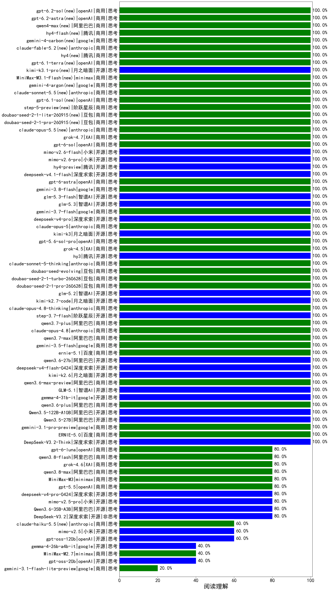

|类别|机构|大模型|【阅读理解】准确率|平均耗时|平均消耗token|花费/千次（元）|排名（准确率）|
|---|---|-----|-------------------|-------|-----------|-----------|-----------|
|商用|anthropic|claude-sonnet-5-thinking|100.0%|25s|1731|52.8|1|
|开源|小米|mimo-v2.6-flash(new)|100.0%|297s|2081|3.4|2|
|开源|腾讯|hy3|100.0%|90s|1129|2.6|3|
|商用|XAI|grok-4.5|100.0%|56s|3152|105.7|4|
|商用|openAI|gpt-5.6-sol-pro|100.0%|106s|7047|430.2|5|
|开源|月之暗面|kimi-k3|100.0%|97s|3113|255.7|6|
|商用|anthropic|claude-opus-5|100.0%|11s|1806|145.1|7|
|开源|深度求索|deepseek-v4-pro|100.0%|148s|2906|65.2|8|
|商用|google|gemini-3.7-flash|100.0%|4s|1465|22.2|9|
|开源|智谱AI|glm-5.3(new)|100.0%|71s|3700|89.9|10|
|开源|智谱AI|glm-5.3-flash(new)|100.0%|51s|2914|6.8|11|
|商用|google|gemini-3.8-flash(new)|100.0%|12s|1604|51.6|12|
|商用|openAI|gpt-6-astra(new)|100.0%|16s|1109|128.6|13|
|开源|深度求索|deepseek-v4.1-flash(new)|100.0%|10s|1434|7.4|14|
|开源|腾讯|hy4-preview(new)|100.0%|114s|9824|168.8|15|
|开源|小米|mimo-v2.6-pro(new)|100.0%|40s|2301|11.6|16|
|商用|openAI|gpt-6-sol(new)|100.0%|244s|1065|22.6|17|
|商用|豆包|doubao-seed-2-1-turbo-260628|100.0%|200s|8462|117.8|18|
|商用|XAI|grok-4.7(new)|100.0%|86s|7408|255.4|19|
|商用|anthropic|claude-opus-5.5(new)|100.0%|29s|1773|111.1|20|
|商用|豆包|doubao-seed-2-1-pro-260915(new)|100.0%|89s|3061|73.6|21|
|商用|豆包|doubao-seed-2-1-lite-260915(new)|100.0%|83s|5155|12.5|22|
|商用|阶跃星辰|step-5-preview(new)|100.0%|46s|4239|76.2|23|
|商用|openAI|gpt-6.1-sol(new)|100.0%|5s|1091|24.4|24|
|商用|anthropic|claude-sonnet-5.5(new)|100.0%|9s|1637|46.1|25|
|商用|google|gemini-4-argon(new)|100.0%|8s|1072|65.0|26|
|商用|minimax|MiniMax-M3.1-Flash(new)|100.0%|18s|1713|4.4|27|
|开源|月之暗面|kimi-k3.1-pro(new)|100.0%|57s|2498|131.6|28|
|商用|openAI|gpt-6.1-terra(new)|100.0%|5s|1082|11.9|29|
|商用|腾讯|hy4(new)|100.0%|67s|3874|61.7|30|
|商用|anthropic|claude-fable-5.2(new)|100.0%|17s|1792|227.8|31|
|商用|google|gemini-4-carbon(new)|100.0%|22s|1512|126.7|32|
|商用|豆包|doubao-seed-evolving|100.0%|196s|7195|197.6|33|
|商用|腾讯|hy4-flash(new)|100.0%|12s|2931|4.9|34|
|商用|豆包|doubao-seed-2-1-pro-260628|100.0%|99s|6114|165.2|35|
|开源|阿里巴巴|Qwen3.5-27B|100.0%|326s|6165|26.8|36|
|开源|月之暗面|kimi-k2.6|100.0%|134s|4321|104.0|37|
|开源|智谱AI|GLM-5.1|100.0%|163s|2936|58.3|38|
|开源|google|gemma-4-31b-it|100.0%|131s|1127|1.7|39|
|开源|智谱AI|glm-5.2|100.0%|54s|2809|65.0|40|
|开源|深度求索|deepseek-v4-flash-0424|100.0%|15s|1348|2.0|41|
|商用|阿里巴巴|qwen3.6-plus|100.0%|54s|3196|31.7|42|
|开源|阿里巴巴|Qwen3.5-122B-A10B|100.0%|435s|5446|31.1|43|
|开源|阿里巴巴|qwen3.6-27b|100.0%|38s|2851|41.4|44|
|商用|百度|ernie-5.1|100.0%|44s|2456|33.3|45|
|商用|google|gemini-3.5-flash|100.0%|11s|2674|127.7|46|
|商用|阿里巴巴|qwen3.7-max|100.0%|33s|2501|74.1|47|
|商用|google|gemini-3.1-pro-preview|100.0%|56s|4363|316.6|48|
|商用|anthropic|claude-opus-4.8|100.0%|9s|1695|125.5|49|
|商用|百度|ERNIE-5.0|100.0%|161s|1808|32.1|50|
|开源|深度求索|DeepSeek-V3.2-Think|100.0%|78s|2976|8.3|51|
|商用|阿里巴巴|qwen3.7-plus|100.0%|97s|5688|41.5|52|
|开源|阶跃星辰|step-3.7-flash|100.0%|16s|2971|19.6|53|
|商用|anthropic|claude-opus-4.8-thinking|100.0%|15s|1972|174.1|54|
|开源|月之暗面|kimi-k2.7-code|100.0%|86s|3339|77.5|55|
|商用|阿里巴巴|qwen3.6-max-preview|100.0%|62s|2885|125.9|56|
|开源|阿里巴巴|Qwen3.6-35B-A3B|80.0%|119s|3191|28.5|57|
|开源|深度求索|DeepSeek-V3.2|80.0%|33s|891|2.0|58|
|开源|小米|mimo-v2.5-pro|80.0%|70s|3047|50.3|59|
|商用|openAI|gpt-6-luna(new)|80.0%|315s|1448|2.5|60|
|开源|深度求索|deepseek-v4-pro-0424|80.0%|30s|1721|33.4|61|
|商用|openAI|gpt-5.5|80.0%|9s|1449|141.9|62|
|商用|阿里巴巴|qwen3.8-flash(new)|80.0%|44s|3278|7.5|63|
|商用|XAI|grok-4.6|80.0%|557s|2783|90.2|64|
|商用|阿里巴巴|qwen3.8-max|80.0%|28s|2045|56.8|65|
|商用|minimax|MiniMax-M3|80.0%|67s|2607|33.7|66|
|开源|小米|mimo-v2.5|60.0%|49s|2617|25.7|67|
|商用|anthropic|claude-haiku-5.5(new)|60.0%|368s|2110|4.0|68|
|开源|openAI|gpt-oss-120b|60.0%|173s|1634|3.1|69|
|开源|google|gemma-4-26b-a4b-it|40.0%|89s|1267|2.1|70|
|商用|minimax|MiniMax-M2.7|40.0%|51s|2714|18.6|71|
|开源|openAI|gpt-oss-20b|40.0%|349s|2300|1.9|72|
|商用|google|gemini-3.1-flash-lite-preview|20.0%|2s|1096|4.7|73|

