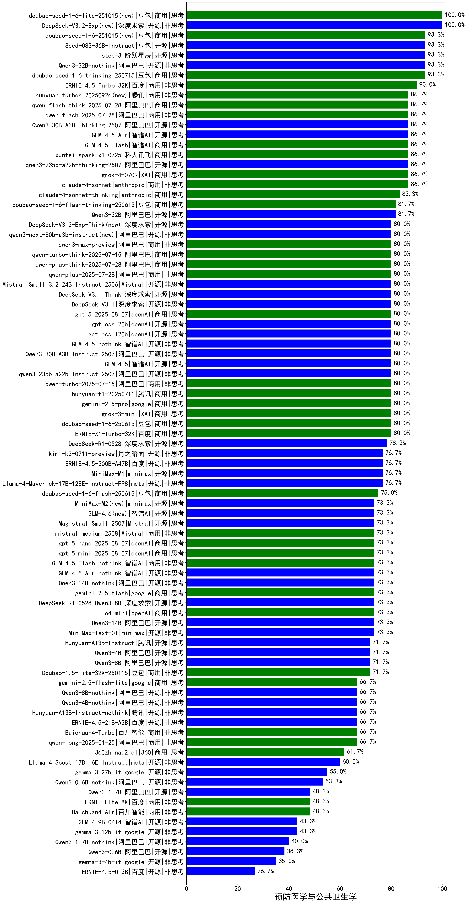

| 类别 |机构| 大模型                         | 预防医学与公共卫生学 | 排名 |
|-----|----|--------------------------|---------|----|
|商用|百度|ERNIE-4.5-Turbo-32K|90.0%|1|
|商用|anthropic|claude-4-sonnet|86.7%|2|
|商用|豆包|Doubao-1.5-pro-32k-250115|85.3%|3|
|商用|豆包|doubao-seed-1-6-thinking-250615(new)|85.0%|4|
|开源|腾讯|hunyuan-large|84.8%|5|
|商用|豆包|Doubao-1.5-thinking-pro|83.3%|6|
|商用|anthropic|claude-4-sonnet-thinking|83.3%|7|
|商用|腾讯|hunyuan-turbo|83.0%|8|
|开源|深度求索|DeepSeek-R1|82.7%|9|
|开源|阿里巴巴|Qwen3-30B-A3B|81.7%|10|
|开源|深度求索|deepseek-chat-v3-0324|81.7%|11|
|商用|豆包|doubao-seed-1-6-flash-thinking-250615(new)|81.7%|12|
|开源|阿里巴巴|Qwen3-32B|81.7%|13|
|商用|豆包|Doubao-1.5-lite-32k-250115|80.7%|14|
|商用|百度|ERNIE-X1-Turbo-32K|80.0%|15|
|商用|openAI|gpt-4.1|80.0%|16|
|商用|豆包|doubao-seed-1-6-250615(new)|80.0%|17|
|商用|腾讯|hunyuan-turbos-20250604(new)|80.0%|18|
|商用|阿里巴巴|qwq-plus-2025-03-05|79.2%|19|
|商用|科大讯飞|xunfei-spark-max|78.3%|20|
|开源|深度求索|DeepSeek-R1-0528|78.3%|21|
|商用|月之暗面|kimi-latest-8k|78.3%|22|
|开源|阿里巴巴|qwq-32b|78.3%|23|
|商用|阶跃星辰|step-r1-v-mini|78.3%|24|
|商用|阿里巴巴|qwen-plus-think-2025-04-28|78.3%|25|
|商用|阿里巴巴|qwen-turbo-think-2025-04-28|78.3%|26|
|开源|meta|Llama-4-Maverick-17B-128E-Instruct-FP8|78.3%|27|
|商用|阿里巴巴|qwen2.5-max|78.2%|28|
|商用|奇虎360|360gpt2-pro|77.8%|29|
|商用|腾讯|hunyuan-standard|77.2%|30|
|商用|科大讯飞|xunfei-spark-pro|77.0%|31|
|开源|智谱AI|GLM-Z1-32B-0414|76.7%|32|
|开源|阿里巴巴|Qwen3-235B-A22B|76.7%|33|
|商用|智谱AI|GLM-Z1-Air|76.7%|34|
|商用|google|gemini-2.5-flash-preview-05-20|76.7%|35|
|商用|openAI|gpt-4.1-mini|76.7%|36|
|开源|minimax|MiniMax-M1(new)|76.7%|37|
|开源|百度|ERNIE-4.5-300B-A47B(new)|76.7%|38|
|商用|智谱AI|GLM-Z1-AirX|76.7%|39|
|商用|腾讯|hunyuan-t1-20250529|76.7%|40|
|商用|阿里巴巴|qwen-long-2025-01-25|76.3%|41|
|开源|minimax|MiniMax-Text-01|75.5%|42|
|商用|智谱AI|GLM-4-Plus|75.3%|43|
|商用|科大讯飞|xunfei-4.0Ultra|75.0%|44|
|商用|科大讯飞|xunfei-spark-x1|75.0%|45|
|商用|智谱AI|GLM-Z1-Flash|75.0%|46|
|商用|豆包|doubao-seed-1-6-flash-250615(new)|75.0%|47|
|商用|零一万物|yi-lightning|74.7%|48|
|开源|阿里巴巴|qwen2.5-32b-instruct|74.0%|49|
|开源|深度求索|DeepSeek-R1-Distill-Qwen-32B|73.7%|50|
|商用|百川智能|Baichuan4-Turbo|73.5%|51|
|开源|阿里巴巴|Qwen3-14B|73.3%|52|
|商用|openAI|o4-mini|73.3%|53|
|开源|深度求索|DeepSeek-R1-0528-Qwen3-8B|73.3%|54|
|商用|google|gemini-2.5-pro-preview-05-06|73.3%|55|
|商用|奇虎360|360gpt-turbo|72.8%|56|
|开源|阿里巴巴|qwen2.5-72b-instruct|72.7%|57|
|开源|深度求索|DeepSeek-R1-Distill-Qwen-14B|72.0%|58|
|开源|阿里巴巴|Qwen3-4B|71.7%|59|
|开源|腾讯|Hunyuan-A13B-Instruct(new)|71.7%|60|
|开源|阿里巴巴|Qwen3-8B|71.7%|61|
|开源|阿里巴巴|qwen2.5-14b-instruct|71.2%|62|
|商用|奇虎360|360zhinao2-o1|70.7%|63|
|商用|商汤|SenseChat-5-beta|70.3%|64|
|开源|阿里巴巴|qwen2.5-7b-instruct|70.2%|65|
|商用|阿里巴巴|qwen-plus-2025-04-28|70.0%|66|
|商用|openAI|chatgpt-4o-latest|69.7%|67|
|商用|商汤|SenseChat-Turbo-1202|68.7%|68|
|商用|百度|ERNIE-3.5-8K|68.2%|69|
|商用|奇虎360|360gpt2-o1|68.0%|70|
|商用|智谱AI|GLM-4-AirX|67.8%|71|
|商用|商汤|SenseChat-5-1202|67.7%|72|
|开源|上海人工智能实验室|internlm2_5-7b-chat|67.5%|73|
|商用|Mistral|mistral-large|67.2%|74|
|商用|智谱AI|GLM-4-Air|66.7%|75|
|开源|百度|ERNIE-4.5-21B-A3B(new)|66.7%|76|
|商用|阿里巴巴|qwen-turbo-2025-04-28|65.0%|77|
|商用|阶跃星辰|step-2-mini|65.0%|78|
|商用|月之暗面|moonshot-v1-8k|64.7%|79|
|商用|智谱AI|GLM-4-Flash|64.0%|80|
|商用|智谱AI|GLM-4-FlashX|63.8%|81|
|商用|OpenAI|gpt-4o-mini|63.0%|82|
|开源|Google|gemma-3-27b-it|62.7%|83|
|商用|Mistral|mistral-small|62.3%|84|
|商用|智谱AI|GLM-4-Long|62.2%|85|
|商用|百川智能|Baichuan4-Air|61.8%|86|
|开源|meta|Llama-4-Scout-17B-16E-Instruct|60.0%|87|
|开源|智谱AI|GLM-Z1-9B-0414|60.0%|88|
|开源|阿里巴巴|qwen2.5-3b-instruct|59.5%|89|
|商用|百度|ERNIE-Lite-8K|58.0%|90|
|开源|微软|phi-4|57.2%|91|
|开源|智谱AI|GLM-4-32B-0414|56.7%|92|
|开源|Mistral|Mistral-Small-3.1-24B-Instruct-2503|56.7%|93|
|商用|百度|ERNIE-Speed-8K|56.2%|94|
|开源|Google|gemma-3-12b-it|55.8%|95|
|商用|智谱AI|GLM-Z1-FlashX|55.0%|96|
|开源|阿里巴巴|qwen2.5-1.5b-instruct|52.0%|97|
|开源|阿里巴巴|Qwen3-1.7B|48.3%|98|
|商用|Mistral|ministral-8b|47.5%|99|
|开源|智谱AI|GLM-Z1-Rumination-32B-0414|45.0%|100|
|开源|智谱AI|GLM-4-9B-0414|43.3%|101|
|开源|Google|gemma-3-4b-it|43.3%|102|
|商用|Mistral|ministral-3b|40.2%|103|
|开源|阿里巴巴|Qwen3-0.6B|38.3%|104|
|开源|阿里巴巴|qwen2.5-0.5b-instruct|36.8%|105|
|商用|科大讯飞|xunfei-spark-lite|36.0%|106|
|商用|百度|ERNIE-Tiny-8K|29.5%|107|
|开源|百度|ERNIE-4.5-0.3B(new)|26.7%|108|

