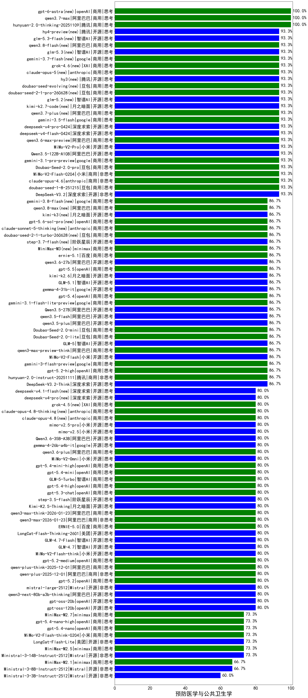

|类别|机构|大模型|【预防医学与公共卫生学】准确率|平均耗时|平均消耗token|花费/千次（元）|排名（准确率）|
|---|---|-----|-------------------|-------|-----------|-----------|-----------|
|商用|openAI|gpt-6-astra(new)|100.0%|8s|231|54.8|1|
|商用|阿里巴巴|qwen3.7-max|100.0%|24s|1171|40.3|2|
|商用|阿里巴巴|qwen3.6-max-preview|93.3%|50s|1452|74.9|3|
|商用|阿里巴巴|qwen3.7-plus|93.3%|19s|955|7.2|4|
|开源|智谱AI|glm-5.2|93.3%|38s|1432|38.5|5|
|商用|豆包|doubao-seed-2-1-pro-260628|93.3%|164s|6327|187.0|6|
|商用|豆包|doubao-seed-evolving|93.3%|265s|6700|198.2|7|
|开源|小米|MiMo-V2-Pro|93.3%|291s|1020|16.9|8|
|开源|腾讯|hy3|93.3%|54s|200|0.6|9|
|开源|阿里巴巴|Qwen3.5-122B-A10B|93.3%|204s|2607|16.3|10|
|开源|深度求索|deepseek-v4-flash-0424|93.3%|20s|655|1.2|11|
|商用|google|gemini-3.1-pro-preview|93.3%|63s|1619|132.4|12|
|商用|anthropic|claude-opus-5(new)|93.3%|12s|702|106.5|13|
|商用|google|gemini-3.5-flash|93.3%|8s|1273|76.1|14|
|商用|XAI|grok-4.6(new)|93.3%|28s|1610|59.8|15|
|商用|豆包|Doubao-Seed-2.0-pro|93.3%|208s|1003|14.5|16|
|商用|google|gemini-3.7-flash(new)|93.3%|5s|663|15.8|17|
|商用|小米|MiMo-V2-Flash-0204|93.3%|230s|487|0.9|18|
|开源|智谱AI|glm-5.3(new)|93.3%|29s|871|22.8|19|
|商用|阿里巴巴|qwen3.8-flash(new)|93.3%|39s|2433|6.3|20|
|开源|智谱AI|glm-5.3-flash(new)|93.3%|46s|1369|3.7|21|
|商用|anthropic|claude-opus-4.6|93.3%|12s|627|93.2|22|
|开源|腾讯|hy4-preview(new)|93.3%|61s|2819|49.7|23|
|开源|深度求索|deepseek-v4-pro-0424|93.3%|28s|951|22.0|24|
|开源|深度求索|DeepSeek-V3.2|93.3%|93s|283|0.8|25|
|开源|月之暗面|kimi-k2.7-code|93.3%|15s|705|17.6|26|
|商用|百度|ernie-5.1|86.7%|50s|1077|18.3|27|
|开源|阿里巴巴|qwen3.6-27b|86.7%|23s|1441|24.8|28|
|商用|openAI|gpt-5.5|86.7%|8s|442|76.1|29|
|商用|minimax|MiniMax-M3|86.7%|30s|774|10.0|30|
|开源|月之暗面|kimi-k2.6|86.7%|82s|1548|40.3|31|
|开源|阶跃星辰|step-3.7-flash|86.7%|59s|1791|14.0|32|
|商用|豆包|doubao-seed-2-1-turbo-260628|86.7%|162s|5646|83.3|33|
|商用|anthropic|claude-sonnet-5-thinking|86.7%|14s|810|50.1|34|
|商用|openAI|gpt-5.6-sol-pro|86.7%|31s|3029|219.3|35|
|商用|阿里巴巴|qwen3.8-max(new)|86.7%|17s|670|21.4|36|
|商用|google|gemini-3.8-flash(new)|86.7%|11s|668|31.8|37|
|开源|小米|mimo-v2.6-pro(new)|86.7%|254s|772|4.4|38|
|开源|小米|mimo-v2.6-flash(new)|86.7%|194s|778|1.5|39|
|商用|openAI|gpt-6-sol(new)|86.7%|102s|225|10.5|40|
|开源|月之暗面|kimi-k3(new)|86.7%|36s|823|70.3|41|
|商用|XAI|grok-4.7(new)|86.7%|68s|5069|176.1|42|
|商用|google|gemini-3.1-flash-lite-preview|86.7%|15s|392|3.4|43|
|开源|智谱AI|GLM-5|86.7%|201s|1937|33.8|44|
|商用|openAI|gpt-5.4|86.7%|8s|254|18.7|45|
|开源|阿里巴巴|qwen3.5-flash|86.7%|138s|2594|5.0|46|
|开源|阿里巴巴|qwen3.5-plus|86.7%|35s|2705|12.7|47|
|商用|豆包|Doubao-Seed-2.0-mini|86.7%|471s|2029|3.8|48|
|商用|豆包|Doubao-Seed-2.0-lite|86.7%|184s|835|2.6|49|
|开源|阿里巴巴|Qwen3.5-27B|86.7%|314s|2469|11.5|50|
|开源|google|gemma-4-31b-it|86.7%|85s|499|1.2|51|
|开源|智谱AI|GLM-5.1|86.7%|71s|1329|30.6|52|
|开源|深度求索|DeepSeek-V3.2-Think|86.7%|74s|1054|3.1|53|
|商用|阿里巴巴|qwen3-max-think-2026-01-23|80.0%|146s|2185|21.2|54|
|开源|深度求索|deepseek-v4.1-flash(new)|80.0%|33s|1866|14.3|55|
|商用|XAI|grok-4.5|80.0%|82s|1693|63.3|56|
|开源|阶跃星辰|step-3.5-flash|80.0%|19s|1169|2.3|57|
|商用|阿里巴巴|qwen3-max-2026-01-23|80.0%|65s|368|3.1|58|
|开源|深度求索|deepseek-v4-pro(new)|80.0%|382s|775|18.2|59|
|商用|百度|ERNIE-5.0|80.0%|137s|1454|33.7|60|
|商用|openAI|gpt-6-luna(new)|80.0%|242s|378|1.1|61|
|开源|月之暗面|Kimi-K2.5-Thinking|80.0%|330s|1805|36.7|62|
|开源|小米|mimo-v2.5|80.0%|27s|1220|13.5|63|
|开源|小米|mimo-v2.5-pro|80.0%|45s|2015|37.8|64|
|商用|openAI|gpt-5.3-chat|80.0%|22s|349|26.2|65|
|开源|openAI|gpt-oss-20b|80.0%|86s|687|0.7|66|
|开源|阿里巴巴|Qwen3.6-35B-A3B|80.0%|76s|1500|15.5|67|
|开源|google|gemma-4-26b-a4b-it|80.0%|70s|572|1.4|68|
|商用|阿里巴巴|qwen3.6-plus|80.0%|39s|1407|16.1|69|
|开源|小米|MiMo-V2-Omni|80.0%|315s|1077|11.5|70|
|商用|anthropic|claude-opus-4.8|80.0%|10s|540|78.1|71|
|开源|openAI|gpt-oss-120b|80.0%|23s|549|1.4|72|
|商用|anthropic|claude-opus-4.8-thinking|80.0%|19s|1400|228.6|73|
|商用|openAI|gpt-5.4-mini-high|80.0%|113s|694|19.4|74|
|商用|openAI|gpt-5.4-mini|80.0%|7s|243|5.2|75|
|商用|智谱AI|GLM-5-Turbo|80.0%|33s|1161|24.3|76|
|商用|openAI|gpt-5.4-high|80.0%|18s|600|55.4|77|
|商用|minimax|MiniMax-M2.5|73.3%|23s|1110|8.7|78|
|开源|美团|LongCat-Flash-Lite|73.3%|169s|400|0.0|79|
|商用|openAI|gpt-5.4-nano-high|73.3%|12s|327|2.2|80|
|商用|minimax|MiniMax-M2.7|73.3%|31s|1322|10.4|81|
|商用|小米|MiMo-V2-Flash-think-0204|73.3%|416s|1512|3.0|82|
|商用|openAI|gpt-5.4-nano|73.3%|36s|250|1.5|83|

