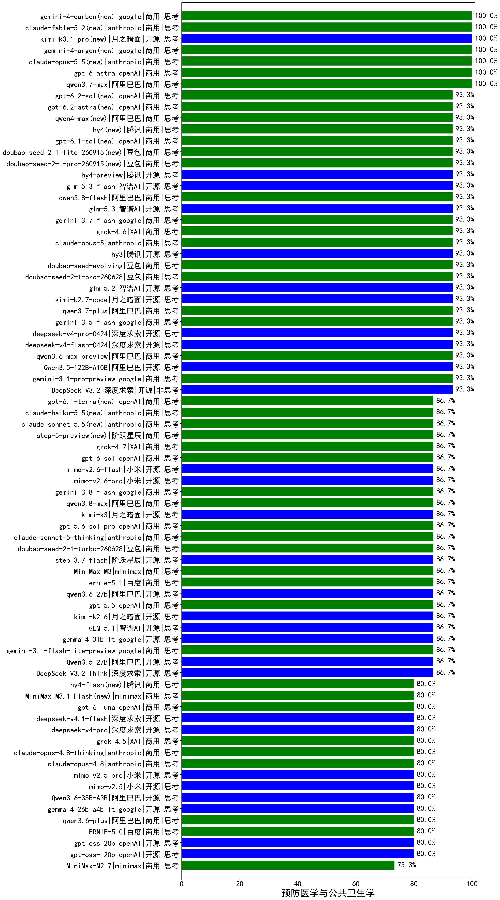

|类别|机构|大模型|【预防医学与公共卫生学】准确率|平均耗时|平均消耗token|花费/千次（元）|排名（准确率）|
|---|---|-----|-------------------|-------|-----------|-----------|-----------|
|商用|openAI|gpt-6-astra(new)|100.0%|8s|231|54.8|1|
|商用|google|gemini-4-carbon(new)|100.0%|24s|1152|149.5|2|
|商用|anthropic|claude-fable-5.2(new)|100.0%|29s|555|128.6|3|
|开源|月之暗面|kimi-k3.1-pro(new)|100.0%|38s|1371|85.0|4|
|商用|google|gemini-4-argon(new)|100.0%|23s|407|45.2|5|
|商用|anthropic|claude-opus-5.5(new)|100.0%|13s|633|75.3|6|
|商用|阿里巴巴|qwen3.7-max|100.0%|24s|1171|40.3|7|
|开源|智谱AI|glm-5.3(new)|93.3%|29s|871|22.8|8|
|开源|月之暗面|kimi-k2.7-code|93.3%|15s|705|17.6|9|
|开源|智谱AI|glm-5.2|93.3%|38s|1432|38.5|10|
|商用|豆包|doubao-seed-2-1-pro-260628|93.3%|164s|6327|187.0|11|
|商用|豆包|doubao-seed-evolving|93.3%|265s|6700|198.2|12|
|商用|anthropic|claude-opus-5|93.3%|12s|702|106.5|13|
|商用|XAI|grok-4.6|93.3%|28s|1610|59.8|14|
|商用|google|gemini-3.7-flash|93.3%|5s|663|15.8|15|
|开源|腾讯|hy3|93.3%|54s|200|0.6|16|
|商用|阿里巴巴|qwen3.8-flash(new)|93.3%|39s|2433|6.3|17|
|开源|智谱AI|glm-5.3-flash(new)|93.3%|46s|1369|3.7|18|
|开源|腾讯|hy4-preview(new)|93.3%|61s|2819|49.7|19|
|商用|豆包|doubao-seed-2-1-pro-260915(new)|93.3%|37s|1112|30.6|20|
|商用|豆包|doubao-seed-2-1-lite-260915(new)|93.3%|154s|1153|2.9|21|
|商用|openAI|gpt-6.1-sol(new)|93.3%|11s|206|9.2|22|
|商用|腾讯|hy4(new)|93.3%|62s|2867|50.6|23|
|商用|阿里巴巴|qwen3.7-plus|93.3%|19s|955|7.2|24|
|商用|阿里巴巴|qwen4-max(new)|93.3%|122s|513|13.6|25|
|商用|google|gemini-3.5-flash|93.3%|8s|1273|76.1|26|
|商用|google|gemini-3.1-pro-preview|93.3%|63s|1619|132.4|27|
|开源|阿里巴巴|Qwen3.5-122B-A10B|93.3%|204s|2607|16.3|28|
|商用|阿里巴巴|qwen3.6-max-preview|93.3%|50s|1452|74.9|29|
|开源|深度求索|deepseek-v4-pro-0424|93.3%|28s|951|22.0|30|
|开源|深度求索|deepseek-v4-flash-0424|93.3%|20s|655|1.2|31|
|开源|深度求索|DeepSeek-V3.2|93.3%|93s|283|0.8|32|
|商用|anthropic|claude-haiku-5.5(new)|86.7%|7s|671|2.0|33|
|开源|阿里巴巴|Qwen3.5-27B|86.7%|314s|2469|11.5|34|
|商用|openAI|gpt-6.1-terra(new)|86.7%|4s|235|5.6|35|
|商用|anthropic|claude-sonnet-5.5(new)|86.7%|7s|551|31.9|36|
|开源|深度求索|DeepSeek-V3.2-Think|86.7%|74s|1054|3.1|37|
|商用|阶跃星辰|step-5-preview(new)|86.7%|19s|971|18.4|38|
|商用|google|gemini-3.1-flash-lite-preview|86.7%|15s|392|3.4|39|
|商用|XAI|grok-4.7(new)|86.7%|68s|5069|176.1|40|
|商用|openAI|gpt-6-sol(new)|86.7%|102s|225|10.5|41|
|开源|小米|mimo-v2.6-flash(new)|86.7%|194s|778|1.5|42|
|开源|小米|mimo-v2.6-pro(new)|86.7%|254s|772|4.4|43|
|开源|google|gemma-4-31b-it|86.7%|85s|499|1.2|44|
|开源|智谱AI|GLM-5.1|86.7%|71s|1329|30.6|45|
|商用|google|gemini-3.8-flash(new)|86.7%|11s|668|31.8|46|
|开源|月之暗面|kimi-k2.6|86.7%|82s|1548|40.3|47|
|商用|anthropic|claude-sonnet-5-thinking|86.7%|14s|810|50.1|48|
|商用|minimax|MiniMax-M3|86.7%|30s|774|10.0|49|
|商用|百度|ernie-5.1|86.7%|50s|1077|18.3|50|
|开源|阶跃星辰|step-3.7-flash|86.7%|59s|1791|14.0|51|
|商用|阿里巴巴|qwen3.8-max|86.7%|17s|670|21.4|52|
|开源|月之暗面|kimi-k3|86.7%|36s|823|70.3|53|
|商用|openAI|gpt-5.6-sol-pro|86.7%|31s|3029|219.3|54|
|开源|阿里巴巴|qwen3.6-27b|86.7%|23s|1441|24.8|55|
|商用|openAI|gpt-5.5|86.7%|8s|442|76.1|56|
|商用|豆包|doubao-seed-2-1-turbo-260628|86.7%|162s|5646|83.3|57|
|商用|腾讯|hy4-flash(new)|80.0%|32s|1045|2.0|58|
|商用|百度|ERNIE-5.0|80.0%|137s|1454|33.7|59|
|商用|anthropic|claude-opus-4.8-thinking|80.0%|19s|1400|228.6|60|
|商用|minimax|MiniMax-M3.1-Flash(new)|80.0%|20s|1090|3.6|61|
|商用|XAI|grok-4.5|80.0%|82s|1693|63.3|62|
|开源|openAI|gpt-oss-20b|80.0%|86s|687|0.7|63|
|开源|阿里巴巴|Qwen3.6-35B-A3B|80.0%|76s|1500|15.5|64|
|商用|阿里巴巴|qwen3.6-plus|80.0%|39s|1407|16.1|65|
|商用|openAI|gpt-6-luna(new)|80.0%|242s|378|1.1|66|
|开源|小米|mimo-v2.5-pro|80.0%|45s|2015|37.8|67|
|开源|深度求索|deepseek-v4-pro|80.0%|382s|775|18.2|68|
|开源|深度求索|deepseek-v4.1-flash(new)|80.0%|33s|1866|14.3|69|
|开源|google|gemma-4-26b-a4b-it|80.0%|70s|572|1.4|70|
|商用|anthropic|claude-opus-4.8|80.0%|10s|540|78.1|71|
|开源|小米|mimo-v2.5|80.0%|27s|1220|13.5|72|
|开源|openAI|gpt-oss-120b|80.0%|23s|549|1.4|73|
|商用|minimax|MiniMax-M2.7|73.3%|31s|1322|10.4|74|

