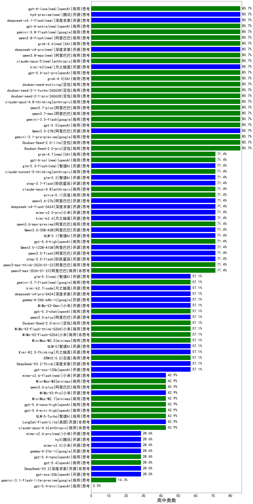

|类别|机构|大模型|【高中奥数】准确率|平均耗时|平均消耗token|花费/千次（元）|排名（准确率）|
|---|---|-----|-------------------|-------|-----------|-----------|-----------|
|商用|google|gemini-3.1-pro-preview|85.7%|270s|20303|1723.3|1|
|开源|月之暗面|kimi-k3(new)|85.7%|270s|8033|789.0|2|
|商用|阿里巴巴|qwen3.7-plus|85.7%|656s|36319|289.9|3|
|商用|anthropic|claude-opus-4.8-thinking|85.7%|143s|11597|2009.7|4|
|商用|openAI|gpt-5.5|85.7%|106s|4921|1015.2|5|
|商用|豆包|doubao-seed-2-1-pro-260628|85.7%|1100s|51333|1536.6|6|
|商用|豆包|doubao-seed-2-1-turbo-260628|85.7%|815s|47747|714.5|7|
|开源|阿里巴巴|Qwen3.5-27B|85.7%|537s|35306|169.0|8|
|商用|豆包|doubao-seed-evolving|85.7%|938s|49001|1466.6|9|
|商用|XAI|grok-4.5|85.7%|441s|25952|1081.6|10|
|商用|豆包|Doubao-Seed-2.0-lite|85.7%|944s|7064|25.0|11|
|商用|google|gemini-3.5-flash|85.7%|66s|15746|987.2|12|
|商用|openAI|gpt-5.6-sol-pro|85.7%|87s|16571|1904.1|13|
|商用|豆包|Doubao-Seed-2.0-pro|85.7%|829s|4446|69.3|14|
|商用|anthropic|claude-opus-5(new)|85.7%|86s|7058|1215.2|15|
|商用|阿里巴巴|qwen3.8-max(new)|85.7%|567s|26461|949.1|16|
|开源|深度求索|deepseek-v4-pro(new)|85.7%|431s|31189|838.9|17|
|商用|XAI|grok-4.6(new)|85.7%|453s|23724|988.0|18|
|商用|阿里巴巴|qwen3.8-flash(new)|85.7%|444s|37733|101.6|19|
|商用|google|gemini-3.8-flash(new)|85.7%|40s|9478|493.7|20|
|商用|openAI|gpt-6-astra(new)|85.7%|47s|1390|457.2|21|
|开源|深度求索|deepseek-v4.1-flash(new)|85.7%|180s|21106|168.1|22|
|开源|腾讯|hy4-preview(new)|85.7%|281s|19771|354.6|23|
|商用|openAI|gpt-6-luna(new)|85.7%|448s|7033|24.3|24|
|商用|阿里巴巴|qwen3.7-max|85.7%|501s|28988|1041.0|25|
|开源|小米|mimo-v2.5-pro|71.4%|525s|29350|611.4|26|
|开源|深度求索|deepseek-v4-flash-0424|71.4%|379s|28227|56.4|27|
|商用|阿里巴巴|qwen3.6-max-preview|71.4%|448s|16711|897.6|28|
|开源|阿里巴巴|qwen3.6-27b|71.4%|644s|44284|795.5|29|
|商用|百度|ernie-5.1|71.4%|304s|12189|218.1|30|
|开源|月之暗面|kimi-k2.6|71.4%|1326s|38493|1037.2|31|
|商用|anthropic|claude-opus-4.8|71.4%|34s|2753|462.1|32|
|开源|阶跃星辰|step-3.7-flash|71.4%|432s|59289|479.5|33|
|开源|智谱AI|glm-5.2|71.4%|524s|24578|686.1|34|
|开源|智谱AI|GLM-5.1|71.4%|468s|23948|573.0|35|
|商用|anthropic|claude-sonnet-5-thinking|71.4%|44s|4228|288.1|36|
|开源|智谱AI|glm-5.3-flash(new)|71.4%|1144s|57049|159.5|37|
|开源|阿里巴巴|Qwen3.6-35B-A3B|71.4%|222s|38856|418.7|38|
|商用|openAI|gpt-6-sol(new)|71.4%|160s|2762|187.5|39|
|开源|阿里巴巴|qwen3.5-flash|71.4%|525s|33211|66.2|40|
|商用|阿里巴巴|qwen3-max-think-2026-01-23|71.4%|564s|21000|209.2|41|
|商用|openAI|gpt-5.4-high|71.4%|185s|9723|1011.8|42|
|开源|阶跃星辰|step-3.5-flash|71.4%|194s|40384|84.7|43|
|开源|阿里巴巴|Qwen3.5-122B-A10B|71.4%|391s|39152|250.0|44|
|商用|阿里巴巴|qwen3-max-2026-01-23|71.4%|142s|5854|57.7|45|
|开源|月之暗面|Kimi-K2.5-Thinking|57.1%|868s|36747|770.0|46|
|商用|百度|ERNIE-5.0|57.1%|1112s|29806|713.8|47|
|开源|智谱AI|glm-5.3(new)|57.1%|800s|39284|1097.8|48|
|商用|openAI|gpt-5.3-chat|57.1%|31s|2511|237.1|49|
|开源|智谱AI|GLM-5|57.1%|486s|18601|333.5|50|
|商用|minimax|MiniMax-M2.5|57.1%|404s|27241|228.0|51|
|商用|小米|MiMo-V2-Flash-0204|57.1%|598s|4585|9.5|52|
|商用|小米|MiMo-V2-Flash-think-0204|57.1%|305s|22007|46.0|53|
|商用|豆包|Doubao-Seed-2.0-mini|57.1%|291s|21224|42.2|54|
|开源|深度求索|DeepSeek-V3.2-Think|57.1%|638s|18239|54.6|55|
|开源|阿里巴巴|qwen3.5-plus|57.1%|372s|33639|161.0|56|
|商用|google|gemini-3.7-flash(new)|57.1%|20s|5672|147.0|57|
|开源|google|gemma-4-26b-a4b-it|57.1%|66s|1751|4.7|58|
|开源|openAI|gpt-oss-120b|57.1%|19s|3994|12.6|59|
|开源|小米|MiMo-V2-Omni|57.1%|241s|21657|299.3|60|
|开源|深度求索|deepseek-v4-pro-0424|57.1%|478s|22774|545.3|61|
|开源|月之暗面|kimi-k2.7-code|57.1%|381s|8533|228.1|62|
|商用|anthropic|claude-opus-4.6|42.9%|23s|1406|227.9|63|
|开源|小米|mimo-v2.6-flash(new)|42.9%|932s|41771|83.4|64|
|商用|阿里巴巴|qwen3.6-plus|42.9%|401s|25555|305.8|65|
|开源|小米|MiMo-V2-Pro|42.9%|504s|31480|656.2|66|
|商用|minimax|MiniMax-M2.7|42.9%|622s|27524|230.4|67|
|商用|openAI|gpt-5.4-nano-high|42.9%|933s|24456|177.9|68|
|商用|openAI|gpt-5.4-mini-high|42.9%|515s|26925|845.2|69|
|开源|美团|LongCat-Flash-Lite|42.9%|147s|5901|0.0|70|
|商用|minimax|MiniMax-M3|42.9%|1117s|9044|148.5|71|
|商用|智谱AI|GLM-5-Turbo|42.9%|242s|26830|588.6|72|
|商用|openAI|gpt-5.4-nano|28.6%|233s|868|6.8|73|
|开源|腾讯|hy3|28.6%|91s|3604|14.1|74|
|商用|openAI|gpt-5.4|28.6%|23s|1492|147.4|75|
|开源|小米|mimo-v2.5|28.6%|273s|24665|341.4|76|
|开源|openAI|gpt-oss-20b|28.6%|639s|8931|10.2|77|
|开源|小米|mimo-v2.6-pro(new)|28.6%|885s|42827|256.6|78|
|开源|google|gemma-4-31b-it|28.6%|334s|1442|3.9|79|
|开源|深度求索|DeepSeek-V3.2|28.6%|140s|4419|13.2|80|
|商用|google|gemini-3.1-flash-lite-preview|14.3%|8s|1111|10.9|81|
|商用|openAI|gpt-5.4-mini|0.0%|128s|787|22.0|82|

