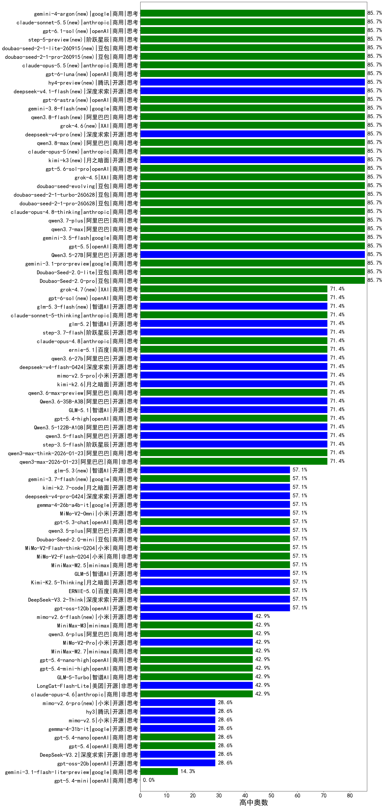

|类别|机构|大模型|【高中奥数】准确率|平均耗时|平均消耗token|花费/千次（元）|排名（准确率）|
|---|---|-----|-------------------|-------|-----------|-----------|-----------|
|商用|豆包|doubao-seed-2-1-pro-260628|85.7%|1100s|51333|1536.6|1|
|商用|阿里巴巴|qwen3.7-plus|85.7%|656s|36319|289.9|2|
|商用|豆包|doubao-seed-2-1-turbo-260628|85.7%|815s|47747|714.5|3|
|商用|豆包|doubao-seed-evolving|85.7%|938s|49001|1466.6|4|
|商用|XAI|grok-4.5|85.7%|441s|25952|1081.6|5|
|商用|openAI|gpt-5.6-sol-pro|85.7%|87s|16571|1904.1|6|
|开源|月之暗面|kimi-k3|85.7%|270s|8033|789.0|7|
|商用|anthropic|claude-opus-5|85.7%|86s|7058|1215.2|8|
|商用|阿里巴巴|qwen3.8-max|85.7%|567s|26461|949.1|9|
|开源|深度求索|deepseek-v4-pro|85.7%|431s|31189|838.9|10|
|商用|XAI|grok-4.6|85.7%|453s|23724|988.0|11|
|商用|阿里巴巴|qwen3.8-flash(new)|85.7%|444s|37733|101.6|12|
|商用|google|gemini-3.8-flash(new)|85.7%|40s|9478|493.7|13|
|商用|openAI|gpt-6-astra(new)|85.7%|47s|1390|457.2|14|
|开源|深度求索|deepseek-v4.1-flash(new)|85.7%|180s|21106|168.1|15|
|开源|腾讯|hy4-preview(new)|85.7%|281s|19771|354.6|16|
|商用|openAI|gpt-6-luna(new)|85.7%|448s|7033|24.3|17|
|商用|anthropic|claude-opus-5.5(new)|85.7%|30s|2531|338.4|18|
|商用|豆包|doubao-seed-2-1-pro-260915(new)|85.7%|210s|7653|226.2|19|
|商用|豆包|doubao-seed-2-1-lite-260915(new)|85.7%|241s|11160|29.9|20|
|商用|阶跃星辰|step-5-preview(new)|85.7%|210s|16365|325.9|21|
|商用|openAI|gpt-6.1-sol(new)|85.7%|18s|1157|75.1|22|
|商用|anthropic|claude-sonnet-5.5(new)|85.7%|24s|2243|149.0|23|
|商用|google|gemini-4-argon(new)|85.7%|46s|3299|448.2|24|
|商用|anthropic|claude-haiku-5.5(new)|85.7%|34s|6780|23.3|25|
|商用|anthropic|claude-opus-4.8-thinking|85.7%|143s|11597|2009.7|26|
|商用|minimax|MiniMax-M3.1-Flash(new)|85.7%|161s|9136|35.7|27|
|商用|openAI|gpt-5.5|85.7%|106s|4921|1015.2|28|
|商用|阿里巴巴|qwen3.7-max|85.7%|501s|28988|1041.0|29|
|商用|google|gemini-3.5-flash|85.7%|66s|15746|987.2|30|
|商用|google|gemini-3.1-pro-preview|85.7%|270s|20303|1723.3|31|
|开源|阿里巴巴|Qwen3.5-27B|85.7%|537s|35306|169.0|32|
|开源|深度求索|deepseek-v4-flash-0424|71.4%|379s|28227|56.4|33|
|开源|阿里巴巴|Qwen3.6-35B-A3B|71.4%|222s|38856|418.7|34|
|开源|智谱AI|glm-5.3-flash(new)|71.4%|1144s|57049|159.5|35|
|商用|anthropic|claude-opus-4.8|71.4%|34s|2753|462.1|36|
|商用|openAI|gpt-6-sol(new)|71.4%|160s|2762|187.5|37|
|商用|XAI|grok-4.7(new)|71.4%|423s|29070|1183.5|38|
|开源|月之暗面|kimi-k2.6|71.4%|1326s|38493|1037.2|39|
|开源|阿里巴巴|Qwen3.5-122B-A10B|71.4%|391s|39152|250.0|40|
|开源|小米|mimo-v2.5-pro|71.4%|525s|29350|611.4|41|
|商用|阿里巴巴|qwen3.6-max-preview|71.4%|448s|16711|897.6|42|
|开源|阿里巴巴|qwen3.6-27b|71.4%|644s|44284|795.5|43|
|商用|anthropic|claude-sonnet-5-thinking|71.4%|44s|4228|288.1|44|
|商用|百度|ernie-5.1|71.4%|304s|12189|218.1|45|
|开源|智谱AI|glm-5.2|71.4%|524s|24578|686.1|46|
|开源|阶跃星辰|step-3.7-flash|71.4%|432s|59289|479.5|47|
|开源|智谱AI|GLM-5.1|71.4%|468s|23948|573.0|48|
|开源|google|gemma-4-26b-a4b-it|57.1%|66s|1751|4.7|49|
|商用|百度|ERNIE-5.0|57.1%|1112s|29806|713.8|50|
|开源|深度求索|DeepSeek-V3.2-Think|57.1%|638s|18239|54.6|51|
|开源|openAI|gpt-oss-120b|57.1%|19s|3994|12.6|52|
|开源|智谱AI|glm-5.3(new)|57.1%|800s|39284|1097.8|53|
|商用|google|gemini-3.7-flash|57.1%|20s|5672|147.0|54|
|开源|深度求索|deepseek-v4-pro-0424|57.1%|478s|22774|545.3|55|
|开源|月之暗面|kimi-k2.7-code|57.1%|381s|8533|228.1|56|
|开源|小米|mimo-v2.6-flash(new)|42.9%|932s|41771|83.4|57|
|商用|阿里巴巴|qwen3.6-plus|42.9%|401s|25555|305.8|58|
|商用|minimax|MiniMax-M2.7|42.9%|622s|27524|230.4|59|
|商用|minimax|MiniMax-M3|42.9%|1117s|9044|148.5|60|
|开源|google|gemma-4-31b-it|28.6%|334s|1442|3.9|61|
|开源|小米|mimo-v2.6-pro(new)|28.6%|885s|42827|256.6|62|
|开源|小米|mimo-v2.5|28.6%|273s|24665|341.4|63|
|开源|腾讯|hy3|28.6%|91s|3604|14.1|64|
|开源|openAI|gpt-oss-20b|28.6%|639s|8931|10.2|65|
|开源|深度求索|DeepSeek-V3.2|28.6%|140s|4419|13.2|66|
|商用|google|gemini-3.1-flash-lite-preview|14.3%|8s|1111|10.9|67|

