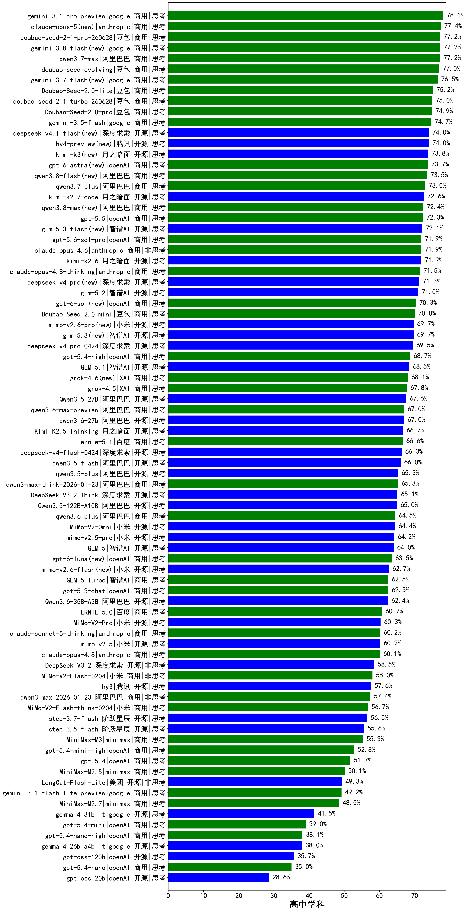

|类别|机构|大模型|【高中学科】准确率|平均耗时|平均消耗token|花费/千次（元）|排名（准确率）|
|---|---|-----|-------------------|-------|-----------|-----------|-----------|
|商用|google|gemini-3.1-pro-preview|78.1%|56s|3357|273.2|1|
|商用|anthropic|claude-opus-5(new)|77.4%|15s|1029|142.3|2|
|商用|豆包|doubao-seed-2-1-pro-260628(new)|77.2%|313s|13486|399.6|3|
|商用|google|gemini-3.8-flash(new)|77.2%|17s|1369|64.3|4|
|商用|阿里巴巴|qwen3.7-max|77.2%|80s|4158|145.7|5|
|商用|豆包|doubao-seed-evolving(new)|77.0%|295s|12416|367.5|6|
|商用|google|gemini-3.7-flash(new)|76.5%|7s|1160|26.6|7|
|商用|豆包|Doubao-Seed-2.0-lite|75.2%|286s|1586|5.1|8|
|商用|豆包|doubao-seed-2-1-turbo-260628(new)|75.0%|292s|10776|159.2|9|
|商用|豆包|Doubao-Seed-2.0-pro|74.9%|291s|1493|21.2|10|
|商用|google|gemini-3.5-flash|74.7%|14s|2643|157.0|11|
|商用|腾讯|hunyuan-2.0-thinking-20251109|74.4%|38s|2427|9.3|12|
|开源|深度求索|deepseek-v4.1-flash(new)|74.0%|22s|2973|22.7|13|
|开源|腾讯|hy4-preview(new)|74.0%|113s|7088|125.6|14|
|开源|月之暗面|kimi-k3(new)|73.8%|82s|1951|176.3|15|
|商用|openAI|gpt-6-astra(new)|73.7%|16s|521|126.3|16|
|商用|阿里巴巴|qwen3.8-flash(new)|73.5%|93s|5754|15.1|17|
|商用|阿里巴巴|qwen3.7-plus(new)|73.0%|125s|6787|53.3|18|
|开源|月之暗面|kimi-k2.7-code(new)|72.6%|62s|2745|70.9|19|
|商用|google|gemini-3-flash-preview|72.5%|88s|3558|72.6|20|
|商用|阿里巴巴|qwen3.8-max(new)|72.4%|118s|4947|173.2|21|
|商用|openAI|gpt-5.5|72.3%|17s|1103|196.6|22|
|开源|智谱AI|glm-5.3-flash(new)|72.1%|200s|6100|16.7|23|
|商用|openAI|gpt-5.6-sol-pro(new)|71.9%|30s|5568|503.9|24|
|商用|anthropic|claude-opus-4.6|71.9%|24s|961|131.4|25|
|开源|月之暗面|kimi-k2.6|71.9%|263s|5901|153.4|26|
|商用|anthropic|claude-opus-4.8-thinking(new)|71.5%|20s|1681|256.4|27|
|开源|深度求索|deepseek-v4-pro(new)|71.3%|120s|3447|88.9|28|
|开源|智谱AI|glm-5.2(new)|71.0%|111s|4844|132.2|29|
|商用|豆包|Doubao-Seed-2.0-mini|70.0%|500s|4055|7.7|30|
|开源|智谱AI|glm-5.3(new)|69.7%|231s|5856|160.5|31|
|开源|深度求索|deepseek-v4-pro-0424|69.5%|100s|3331|78.1|32|
|商用|openAI|gpt-5.4-high|68.7%|24s|1491|139.2|33|
|开源|智谱AI|GLM-5.1|68.5%|278s|4479|104.5|34|
|商用|豆包|doubao-seed-1-8-251215|68.5%|39s|1233|8.4|35|
|商用|XAI|grok-4.6(new)|68.1%|150s|3758|147.4|36|
|商用|XAI|grok-4.5(new)|67.8%|110s|4981|198.8|37|
|开源|阿里巴巴|Qwen3.5-27B|67.6%|436s|7624|35.9|38|
|商用|阿里巴巴|qwen3.6-max-preview|67.0%|99s|3176|164.0|39|
|开源|阿里巴巴|qwen3.6-27b|67.0%|54s|3519|60.8|40|
|开源|月之暗面|Kimi-K2.5-Thinking|66.7%|473s|6177|127.0|41|
|商用|百度|ernie-5.1|66.6%|69s|2758|47.3|42|
|开源|深度求索|deepseek-v4-flash-0424|66.3%|60s|2536|4.9|43|
|开源|阿里巴巴|qwen3.5-flash|66.0%|520s|7157|14.0|44|
|开源|阿里巴巴|qwen3.5-plus|65.3%|69s|5864|27.5|45|
|商用|阿里巴巴|qwen3-max-think-2026-01-23|65.3%|345s|6234|61.0|46|
|开源|深度求索|DeepSeek-V3.2-Think|65.1%|196s|3307|9.8|47|
|开源|阿里巴巴|Qwen3.5-122B-A10B|65.0%|513s|6553|41.0|48|
|商用|阿里巴巴|qwen3.6-plus|64.5%|73s|3386|39.0|49|
|开源|小米|MiMo-V2-Omni|64.4%|358s|3660|46.5|50|
|开源|小米|mimo-v2.5-pro|64.2%|85s|4314|84.7|51|
|开源|智谱AI|GLM-5|64.0%|166s|4655|81.5|52|
|商用|阿里巴巴|qwen-plus-think-2025-12-01|63.4%|104s|4931|38.2|53|
|商用|腾讯|hunyuan-2.0-instruct-20251111|63.3%|26s|920|1.6|54|
|商用|智谱AI|GLM-5-Turbo|62.5%|66s|3657|77.7|55|
|商用|openAI|gpt-5.3-chat|62.5%|24s|794|60.8|56|
|开源|阿里巴巴|Qwen3.6-35B-A3B|62.4%|119s|3551|36.8|57|
|开源|阿里巴巴|qwen3-next-80b-a3b-thinking|62.0%|194s|5557|21.7|58|
|商用|百度|ERNIE-5.0|60.7%|278s|5007|117.5|59|
|开源|小米|MiMo-V2-Pro|60.3%|296s|2522|47.1|60|
|开源|小米|mimo-v2.5|60.2%|72s|3703|47.2|61|
|商用|anthropic|claude-sonnet-5-thinking(new)|60.2%|26s|2011|125.5|62|
|商用|anthropic|claude-opus-4.8(new)|60.1%|10s|828|107.2|63|
|商用|阿里巴巴|qwen3-max-preview-think|59.9%|261s|4686|109.3|64|
|商用|openAI|gpt-5.2-high|58.8%|37s|1562|137.9|65|
|开源|深度求索|DeepSeek-V3.2|58.5%|70s|902|2.6|66|
|商用|小米|MiMo-V2-Flash-0204|58.0%|408s|1438|2.7|67|
|商用|阿里巴巴|qwen-plus-2025-12-01|57.8%|47s|1970|3.7|68|
|开源|腾讯|hy3(new)|57.6%|64s|582|1.9|69|
|商用|阿里巴巴|qwen3-max-2026-01-23|57.4%|72s|1542|14.1|70|
|商用|小米|MiMo-V2-Flash-think-0204|56.7%|543s|4601|9.4|71|
|开源|阶跃星辰|step-3.7-flash(new)|56.5%|567s|6500|51.5|72|
|开源|智谱AI|GLM-4.7|56.1%|129s|4256|57.8|73|
|商用|openAI|gpt-5.2-medium|55.7%|28s|1184|100.3|74|
|开源|阶跃星辰|step-3.5-flash|55.6%|42s|6809|14.1|75|
|商用|minimax|MiniMax-M3(new)|55.3%|102s|3208|49.8|76|
|开源|美团|LongCat-Flash-Thinking-2601|54.6%|238s|5854|0.0|77|
|开源|小米|MiMo-V2-Flash|53.0%|55s|2059|0.0|78|
|商用|openAI|gpt-5.4-mini-high|52.8%|75s|2490|73.2|79|
|商用|openAI|gpt-5.4|51.7%|20s|591|44.6|80|
|商用|minimax|MiniMax-M2.5|50.1%|66s|3724|30.1|81|
|开源|美团|LongCat-Flash-Lite|49.3%|275s|1437|0.0|82|
|商用|google|gemini-3.1-flash-lite-preview|49.2%|26s|668|5.4|83|
|商用|minimax|MiniMax-M2.7|48.5%|115s|4926|40.2|84|
|开源|小米|MiMo-V2-Flash-think|46.9%|119s|5028|0.0|85|
|商用|minimax|MiniMax-M2.1|45.3%|145s|4838|39.4|86|
|开源|Mistral|mistral-large-2512|44.3%|19s|992|9.0|87|
|开源|google|gemma-4-31b-it|41.5%|115s|817|1.9|88|
|商用|openAI|gpt-5.2|41.5%|8s|485|30.9|89|
|商用|openAI|gpt-5.4-mini|39.0%|47s|488|10.1|90|
|商用|openAI|gpt-5.4-nano-high|38.1%|121s|2388|19.4|91|
|开源|google|gemma-4-26b-a4b-it|38.0%|78s|1008|2.5|92|
|开源|智谱AI|GLM-4.7-Flash|36.3%|1678s|9722|0.0|93|
|开源|openAI|gpt-oss-120b|35.7%|132s|1269|3.5|94|
|商用|openAI|gpt-5.4-nano|35.0%|70s|558|3.4|95|
|开源|openAI|gpt-oss-20b|28.6%|148s|2408|2.6|96|
|开源|Mistral|Ministral-3-8B-Instruct-2512|26.0%|10s|1309|1.4|97|
|开源|Mistral|Ministral-3-14B-Instruct-2512|24.6%|17s|1648|2.3|98|
|开源|Mistral|Ministral-3-3B-Instruct-2512|24.0%|12s|1861|1.3|99|

