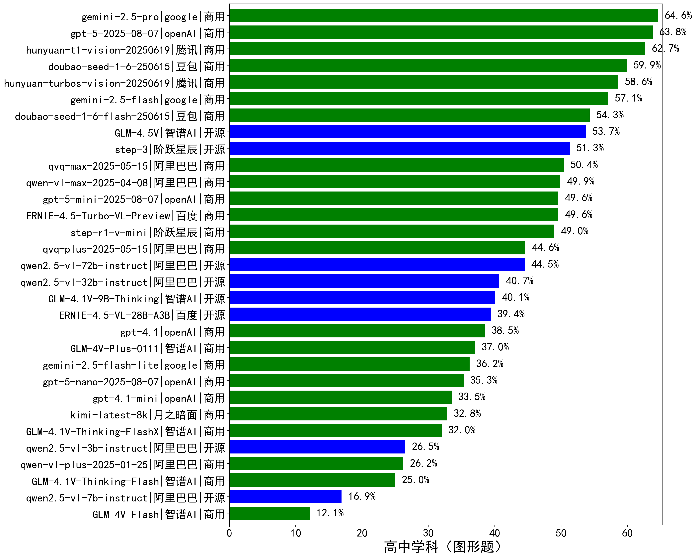

|类别|机构|大模型|【高中学科（图形题）】准确率|平均耗时|平均消耗token|花费/千次（元）|排名（准确率）|
|---|---|-----|-------------------|-------|-----------|-----------|-----------|
|商用|腾讯|hunyuan-t1-vision-20250619|62.7%|/|/|/|1|
|商用|豆包|doubao-seed-1-6-250615|59.9%|/|/|/|2|
|商用|腾讯|hunyuan-turbos-vision-20250619|58.6%|/|/|/|3|
|商用|豆包|doubao-seed-1-6-flash-250615|54.3%|/|/|/|4|
|开源|智谱AI|GLM-4.5V|53.7%|/|/|/|5|
|开源|阶跃星辰|step-3|51.3%|/|/|/|6|
|商用|阿里巴巴|qvq-max-2025-05-15|50.4%|/|/|/|7|
|商用|阿里巴巴|qwen-vl-max-2025-04-08|49.9%|/|/|/|8|
|商用|百度|ERNIE-4.5-Turbo-VL-Preview|49.6%|/|/|/|9|
|商用|阶跃星辰|step-r1-v-mini|49.0%|/|/|/|10|
|商用|阿里巴巴|qvq-plus-2025-05-15|44.6%|/|/|/|11|
|开源|阿里巴巴|qwen2.5-vl-72b-instruct|44.5%|/|/|/|12|
|开源|阿里巴巴|qwen2.5-vl-32b-instruct|40.7%|/|/|/|13|
|开源|智谱AI|GLM-4.1V-9B-Thinking|40.1%|/|/|/|14|
|开源|百度|ERNIE-4.5-VL-28B-A3B|39.4%|/|/|/|15|
|商用|openAI|gpt-4.1|38.5%|/|/|/|16|
|商用|智谱AI|GLM-4V-Plus-0111|37.0%|/|/|/|17|
|商用|openAI|gpt-4.1-mini|33.5%|/|/|/|18|
|商用|月之暗面|kimi-latest-8k|32.8%|/|/|/|19|
|商用|智谱AI|GLM-4.1V-Thinking-FlashX|32.0%|/|/|/|20|
|开源|阿里巴巴|qwen2.5-vl-3b-instruct|26.5%|/|/|/|21|
|商用|阿里巴巴|qwen-vl-plus-2025-01-25|26.2%|/|/|/|22|
|商用|智谱AI|GLM-4.1V-Thinking-Flash|25.0%|/|/|/|23|
|开源|阿里巴巴|qwen2.5-vl-7b-instruct|16.9%|/|/|/|24|
|商用|智谱AI|GLM-4V-Flash|12.1%|/|/|/|25|

