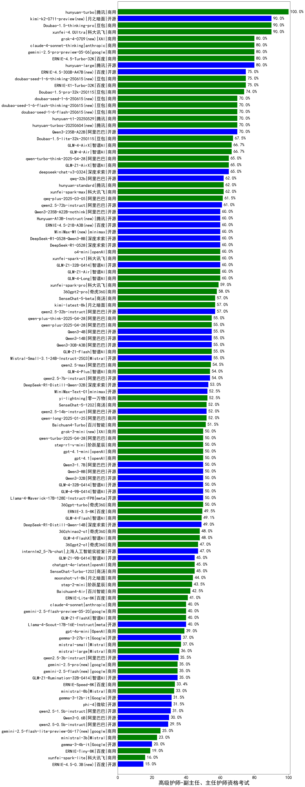

|类别|机构|大模型|【高级护师-副主任、主任护师资格考试】准确率|平均耗时|平均消耗token|花费/千次（元）|排名（准确率）|
|---|---|-----|-------------------|-------|-----------|-----------|-----------|
|开源|月之暗面|kimi-k2-0711-preview|90.0%|19s|349|4.8|1|
|开源|深度求索|DeepSeek-V3.1|80.0%|18s|336|3.6|2|
|商用|阿里巴巴|qwen3-max-preview|80.0%|11s|381|7.9|3|
|开源|深度求索|DeepSeek-V3.2-Exp(new)|80.0%|482s|253|0.7|4|
|商用|XAI|grok-4-0709|80.0%|177s|1687|177.4|5|
|开源|阿里巴巴|qwen3-235b-a22b-instruct-2507|80.0%|9s|390|2.7|6|
|商用|豆包|doubao-seed-1-6-thinking-250715|80.0%|31s|924|6.9|7|
|商用|腾讯|hunyuan-turbos-20250926(new)|80.0%|11s|453|0.8|8|
|商用|anthropic|claude-4-sonnet-thinking|80.0%|43s|1094|109.7|9|
|商用|百度|ERNIE-4.5-Turbo-32K|80.0%|22s|522|1.6|10|
|开源|豆包|Seed-OSS-36B-Instruct|80.0%|89s|1603|6.3|11|
|商用|豆包|doubao-seed-1-6-251015(new)|80.0%|9s|622|4.3|12|
|开源|阿里巴巴|Qwen3-8B-nothink|80.0%|20s|372|0.0|13|
|商用|腾讯|hunyuan-t1-20250711|80.0%|19s|1234|4.6|14|
|商用|openAI|gpt-5.1(new)|80.0%|108s|188|9.0|15|
|开源|深度求索|DeepSeek-V3.1-Think|80.0%|41s|740|8.4|16|
|商用|openAI|gpt-5-2025-08-07|80.0%|64s|153|7.1|17|
|商用|豆包|doubao-seed-1-6-lite-251015(new)|80.0%|24s|797|1.7|18|
|商用|阿里巴巴|qwen-plus-2025-07-28|80.0%|8s|363|0.6|19|
|开源|Mistral|Mistral-Small-3.2-24B-Instruct-2506|80.0%|20s|470|0.9|20|
|商用|豆包|Doubao-1.5-lite-32k-250115|75.0%|5s|187|0.1|21|
|开源|百度|ERNIE-4.5-300B-A47B|75.0%|23s|345|2.4|22|
|商用|百度|ERNIE-X1-Turbo-32K|75.0%|65s|1557|6.1|23|
|商用|豆包|doubao-seed-1-6-250615|70.0%|126s|394|2.5|24|
|商用|豆包|doubao-seed-1-6-flash-thinking-250615|70.0%|6s|520|0.6|25|
|商用|豆包|doubao-seed-1-6-flash-250615|70.0%|4s|310|0.4|26|
|开源|阿里巴巴|Qwen3-30B-A3B-Thinking-2507|70.0%|66s|2307|6.3|27|
|商用|阿里巴巴|qwen-plus-think-2025-07-28|60.0%|/|3488|27.4|28|
|开源|阿里巴巴|Qwen3-1.7B-nothink|60.0%|9s|398|1.0|29|
|开源|阿里巴巴|qwen3-next-80b-a3b-instruct|60.0%|7s|476|1.7|30|
|商用|科大讯飞|xunfei-spark-x1-0725|60.0%|/|883|10.6|31|
|开源|智谱AI|GLM-4.5-Air-nothink|60.0%|10s|777|4.3|32|
|开源|阿里巴巴|qwen3-235b-a22b-thinking-2507|60.0%|58s|3516|69.1|33|
|商用|阿里巴巴|qwen-turbo-2025-07-15|60.0%|7s|319|0.2|34|
|商用|智谱AI|GLM-4.5-Flash-nothink|60.0%|21s|885|0.0|35|
|开源|阿里巴巴|Qwen3-32B-nothink|60.0%|257s|429|1.5|36|
|商用|Mistral|mistral-medium-2508|60.0%|21s|486|6.1|37|
|开源|腾讯|Hunyuan-A13B-Instruct-nothink|60.0%|10s|369|1.3|38|
|商用|阿里巴巴|qwen-turbo-think-2025-07-15|60.0%|/|2067|6.0|39|
|开源|阿里巴巴|Qwen3-30B-A3B-Instruct-2507|60.0%|4s|462|1.2|40|
|商用|阿里巴巴|qwen-long-2025-01-25|60.0%|7s|300|0.5|41|
|开源|腾讯|Hunyuan-A13B-Instruct|60.0%|89s|809|3.1|42|
|开源|深度求索|DeepSeek-V3.2-Exp-Think(new)|60.0%|484s|933|2.7|43|
|商用|阿里巴巴|qwen-flash-think-2025-07-28|60.0%|24s|2557|3.7|44|
|开源|百度|ERNIE-4.5-21B-A3B|60.0%|60s|313|0.0|45|
|开源|minimax|MiniMax-M1|60.0%|282s|3537|25.1|46|
|商用|百川智能|Baichuan4-Turbo|60.0%|/|/|/|47|
|商用|openAI|gpt-5.1-medium(new)|60.0%|187s|632|40.6|48|
|开源|深度求索|DeepSeek-R1-0528-Qwen3-8B|60.0%|125s|1528|0.0|49|
|开源|深度求索|DeepSeek-R1-0528|60.0%|220s|1607|25.0|50|
|商用|openAI|o4-mini|60.0%|26s|665|19.4|51|
|开源|月之暗面|Kimi-K2-Thinking(new)|60.0%|162s|2100|32.9|52|
|开源|阿里巴巴|Qwen3-14B|55.0%|33s|1698|3.3|53|
|开源|阿里巴巴|Qwen3-4B|55.0%|26s|1914|5.6|54|
|开源|阿里巴巴|Qwen3-8B|50.0%|114s|3450|0.0|55|
|开源|阿里巴巴|Qwen3-32B|50.0%|38s|1494|5.8|56|
|开源|智谱AI|GLM-4-9B-0414|50.0%|12s|404|0.0|57|
|开源|阿里巴巴|Qwen3-1.7B|50.0%|22s|2267|6.6|58|
|商用|百度|ERNIE-Lite-8K|50.0%|/|/|/|59|
|开源|minimax|MiniMax-Text-01|50.0%|11s|872|7.0|60|
|商用|百川智能|Baichuan4-Air|50.0%|/|/|/|61|
|商用|XAI|grok-3-mini|50.0%|103s|956|3.4|62|
|商用|360|360zhinao2-o1|45.0%|/|/|/|63|
|开源|minimax|MiniMax-M2(new)|40.0%|16s|1055|8.3|64|
|开源|智谱AI|GLM-4.6(new)|40.0%|44s|1890|25.8|65|
|开源|Mistral|Magistral-Small-2507|40.0%|93s|9040|97.7|66|
|商用|google|gemini-2.5-flash-lite|40.0%|2s|402|1.0|67|
|商用|anthropic|claude-haiku-4.5-thinking(new)|40.0%|40s|2269|78.3|68|
|开源|openAI|gpt-oss-20b|40.0%|12s|1695|1.9|69|
|开源|openAI|gpt-oss-120b|40.0%|10s|580|1.6|70|
|开源|智谱AI|GLM-4.5-nothink|40.0%|18s|674|8.7|71|
|开源|google|gemma-3-27b-it|40.0%|/|/|/|72|
|开源|智谱AI|GLM-4.5|40.0%|73s|1430|19.4|73|
|开源|智谱AI|GLM-4.5-Air|40.0%|48s|2241|13.1|74|
|商用|智谱AI|GLM-4.5-Flash|40.0%|23s|1292|0.0|75|
|开源|阿里巴巴|Qwen3-4B-nothink|40.0%|13s|341|0.8|76|
|开源|meta|Llama-4-Scout-17B-16E-Instruct|40.0%|9s|489|1.0|77|
|开源|meta|Llama-4-Maverick-17B-128E-Instruct-FP8|40.0%|9s|466|1.8|78|
|商用|anthropic|claude-4-sonnet|40.0%|46s|529|48.2|79|
|商用|google|gemini-2.5-pro|35.0%|40s|2395|169.6|80|
|商用|google|gemini-2.5-flash|35.0%|11s|1577|27.6|81|
|开源|阿里巴巴|Qwen3-0.6B|30.0%|16s|1106|3.1|82|
|开源|google|gemma-3-12b-it|30.0%|/|/|/|83|
|商用|anthropic|claude-haiku-4.5(new)|20.0%|10s|555|17.1|84|
|商用|阿里巴巴|qwen-flash-2025-07-28|20.0%|9s|447|0.6|85|
|商用|openAI|gpt-5-nano-2025-08-07|20.0%|110s|1178|3.2|86|
|开源|阿里巴巴|Qwen3-14B-nothink|20.0%|8s|433|0.8|87|
|开源|阶跃星辰|step-3|20.0%|113s|2238|8.8|88|
|商用|openAI|gpt-5-mini-2025-08-07|20.0%|41s|919|12.4|89|
|开源|阿里巴巴|Qwen3-0.6B-nothink|20.0%|3s|199|0.4|90|
|开源|百度|ERNIE-4.5-0.3B|15.0%|58s|378|0.0|91|
|开源|google|gemma-3-4b-it|15.0%|/|/|/|92|

