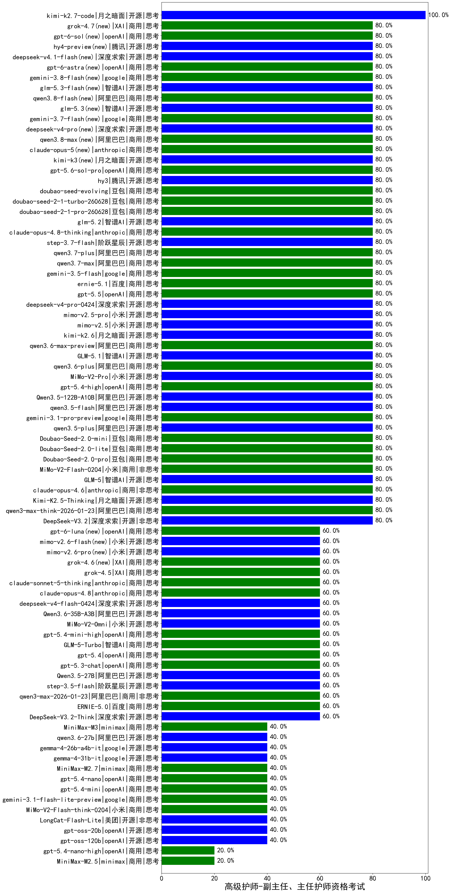

|类别|机构|大模型|【高级护师-副主任、主任护师资格考试】准确率|平均耗时|平均消耗token|花费/千次（元）|排名（准确率）|
|---|---|-----|-------------------|-------|-----------|-----------|-----------|
|开源|月之暗面|kimi-k2.7-code|100.0%|29s|1056|27.3|1|
|开源|月之暗面|kimi-k2.6|80.0%|78s|1321|34.5|2|
|商用|阿里巴巴|qwen3.7-max|80.0%|21s|1002|34.5|3|
|商用|豆包|doubao-seed-2-1-pro-260628|80.0%|152s|7639|226.7|4|
|开源|智谱AI|glm-5.2|80.0%|121s|2941|81.0|5|
|商用|anthropic|claude-opus-4.8-thinking|80.0%|12s|744|117.8|6|
|开源|阶跃星辰|step-3.7-flash|80.0%|53s|4369|34.9|7|
|商用|阿里巴巴|qwen3.7-plus|80.0%|25s|1202|9.2|8|
|商用|google|gemini-3.5-flash|80.0%|10s|1139|68.5|9|
|商用|阿里巴巴|qwen3.6-plus|80.0%|30s|1488|17.3|10|
|商用|百度|ernie-5.1|80.0%|20s|689|11.6|11|
|商用|openAI|gpt-5.5|80.0%|8s|371|65.8|12|
|开源|深度求索|deepseek-v4-pro-0424|80.0%|25s|709|16.3|13|
|开源|小米|mimo-v2.5-pro|80.0%|15s|853|13.6|14|
|开源|小米|mimo-v2.5|80.0%|22s|1594|18.9|15|
|商用|阿里巴巴|qwen3.6-max-preview|80.0%|56s|1574|82.1|16|
|商用|豆包|doubao-seed-2-1-turbo-260628|80.0%|175s|7593|112.7|17|
|商用|豆包|doubao-seed-evolving|80.0%|256s|5399|159.5|18|
|开源|腾讯|hy3|80.0%|19s|185|0.5|19|
|商用|openAI|gpt-5.6-sol-pro|80.0%|19s|3675|321.0|20|
|开源|月之暗面|kimi-k3(new)|80.0%|48s|887|77.8|21|
|商用|anthropic|claude-opus-5(new)|80.0%|14s|713|112.4|22|
|商用|阿里巴巴|qwen3.8-max(new)|80.0%|55s|2352|82.2|23|
|开源|深度求索|deepseek-v4-pro(new)|80.0%|24s|928|22.6|24|
|商用|google|gemini-3.7-flash(new)|80.0%|5s|587|14.1|25|
|开源|智谱AI|glm-5.3(new)|80.0%|113s|2842|78.3|26|
|商用|阿里巴巴|qwen3.8-flash(new)|80.0%|139s|1061|2.6|27|
|开源|智谱AI|glm-5.3-flash(new)|80.0%|59s|2347|6.4|28|
|商用|google|gemini-3.8-flash(new)|80.0%|18s|699|34.1|29|
|商用|openAI|gpt-6-astra(new)|80.0%|10s|225|59.4|30|
|开源|深度求索|deepseek-v4.1-flash(new)|80.0%|33s|778|5.7|31|
|开源|腾讯|hy4-preview(new)|80.0%|90s|5424|96.8|32|
|商用|openAI|gpt-6-sol(new)|80.0%|253s|301|17.1|33|
|开源|智谱AI|GLM-5.1|80.0%|167s|1232|28.5|34|
|商用|XAI|grok-4.7(new)|80.0%|30s|2981|88.9|35|
|开源|阿里巴巴|qwen3.5-plus|80.0%|28s|2190|10.3|36|
|商用|小米|MiMo-V2-Flash-0204|80.0%|181s|356|0.6|37|
|开源|深度求索|DeepSeek-V3.2|80.0%|9s|273|0.8|38|
|开源|小米|MiMo-V2-Pro|80.0%|510s|1029|17.3|39|
|商用|google|gemini-3.1-pro-preview|80.0%|27s|1094|88.9|40|
|开源|阿里巴巴|qwen3.5-flash|80.0%|253s|3504|6.9|41|
|商用|豆包|Doubao-Seed-2.0-lite|80.0%|255s|951|3.1|42|
|开源|阿里巴巴|Qwen3.5-122B-A10B|80.0%|130s|2953|18.5|43|
|商用|豆包|Doubao-Seed-2.0-pro|80.0%|269s|1153|17.1|44|
|商用|阿里巴巴|qwen3-max-think-2026-01-23|80.0%|101s|2696|26.4|45|
|开源|月之暗面|Kimi-K2.5-Thinking|80.0%|461s|2245|46.1|46|
|商用|豆包|Doubao-Seed-2.0-mini|80.0%|160s|2539|4.9|47|
|商用|anthropic|claude-opus-4.6|80.0%|11s|542|82.1|48|
|商用|openAI|gpt-5.4-high|80.0%|12s|698|67.2|49|
|开源|智谱AI|GLM-5|80.0%|88s|1613|28.2|50|
|商用|XAI|grok-4.5|60.0%|73s|1402|51.5|51|
|开源|阶跃星辰|step-3.5-flash|60.0%|23s|3367|7.0|52|
|商用|XAI|grok-4.6(new)|60.0%|31s|1501|55.7|53|
|商用|阿里巴巴|qwen3-max-2026-01-23|60.0%|77s|458|4.1|54|
|商用|百度|ERNIE-5.0|60.0%|129s|2559|60.5|55|
|开源|深度求索|DeepSeek-V3.2-Think|60.0%|171s|1323|3.9|56|
|开源|小米|mimo-v2.6-pro(new)|60.0%|32s|1115|6.5|57|
|开源|小米|mimo-v2.6-flash(new)|60.0%|356s|1025|2.0|58|
|商用|openAI|gpt-6-luna(new)|60.0%|556s|472|1.5|59|
|商用|anthropic|claude-sonnet-5-thinking|60.0%|19s|708|44.6|60|
|开源|小米|MiMo-V2-Omni|60.0%|403s|1295|14.7|61|
|商用|openAI|gpt-5.4-mini-high|60.0%|16s|827|24.2|62|
|商用|openAI|gpt-5.3-chat|60.0%|5s|347|28.0|63|
|开源|阿里巴巴|Qwen3.6-35B-A3B|60.0%|110s|1491|15.5|64|
|商用|anthropic|claude-opus-4.8|60.0%|13s|558|85.3|65|
|商用|openAI|gpt-5.4|60.0%|3s|195|14.3|66|
|商用|智谱AI|GLM-5-Turbo|60.0%|26s|1424|30.3|67|
|开源|阿里巴巴|Qwen3.5-27B|60.0%|331s|2778|13.1|68|
|开源|深度求索|deepseek-v4-flash-0424|60.0%|36s|1092|2.1|69|
|开源|google|gemma-4-31b-it|40.0%|46s|521|1.3|70|
|开源|google|gemma-4-26b-a4b-it|40.0%|63s|554|1.4|71|
|商用|minimax|MiniMax-M2.7|40.0%|50s|1984|16.1|72|
|开源|openAI|gpt-oss-20b|40.0%|12s|1695|1.9|73|
|商用|openAI|gpt-5.4-nano|40.0%|49s|182|1.1|74|
|开源|阿里巴巴|qwen3.6-27b|40.0%|26s|1421|24.6|75|
|商用|openAI|gpt-5.4-mini|40.0%|7s|179|3.8|76|
|开源|美团|LongCat-Flash-Lite|40.0%|41s|329|0.0|77|
|商用|minimax|MiniMax-M3|40.0%|27s|763|10.0|78|
|商用|小米|MiMo-V2-Flash-think-0204|40.0%|135s|1797|3.7|79|
|商用|google|gemini-3.1-flash-lite-preview|40.0%|37s|388|3.5|80|
|开源|openAI|gpt-oss-120b|40.0%|10s|580|1.6|81|
|商用|minimax|MiniMax-M2.5|20.0%|31s|1642|13.2|82|
|商用|openAI|gpt-5.4-nano-high|20.0%|83s|502|3.9|83|

