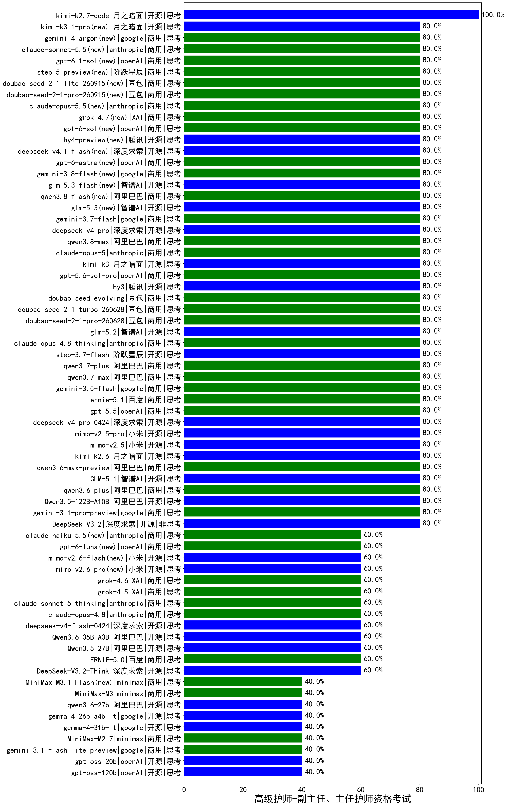

|类别|机构|大模型|【高级护师-副主任、主任护师资格考试】准确率|平均耗时|平均消耗token|花费/千次（元）|排名（准确率）|
|---|---|-----|-------------------|-------|-----------|-----------|-----------|
|开源|月之暗面|kimi-k2.7-code|100.0%|29s|1056|27.3|1|
|商用|豆包|doubao-seed-2-1-pro-260628|80.0%|152s|7639|226.7|2|
|商用|anthropic|claude-opus-5|80.0%|14s|713|112.4|3|
|商用|anthropic|claude-opus-5.5(new)|80.0%|14s|687|86.0|4|
|商用|anthropic|claude-opus-4.8-thinking|80.0%|12s|744|117.8|5|
|开源|智谱AI|glm-5.2|80.0%|121s|2941|81.0|6|
|商用|豆包|doubao-seed-2-1-pro-260915(new)|80.0%|49s|1400|39.6|7|
|商用|豆包|doubao-seed-2-1-turbo-260628|80.0%|175s|7593|112.7|8|
|商用|豆包|doubao-seed-evolving|80.0%|256s|5399|159.5|9|
|开源|腾讯|hy3|80.0%|19s|185|0.5|10|
|商用|openAI|gpt-5.6-sol-pro|80.0%|19s|3675|321.0|11|
|开源|月之暗面|kimi-k3|80.0%|48s|887|77.8|12|
|商用|阿里巴巴|qwen3.8-max|80.0%|55s|2352|82.2|13|
|商用|豆包|doubao-seed-2-1-lite-260915(new)|80.0%|116s|2017|5.3|14|
|开源|深度求索|deepseek-v4-pro|80.0%|24s|928|22.6|15|
|商用|google|gemini-3.7-flash|80.0%|5s|587|14.1|16|
|开源|智谱AI|glm-5.3(new)|80.0%|113s|2842|78.3|17|
|商用|阿里巴巴|qwen3.8-flash(new)|80.0%|139s|1061|2.6|18|
|开源|智谱AI|glm-5.3-flash(new)|80.0%|59s|2347|6.4|19|
|商用|google|gemini-3.8-flash(new)|80.0%|18s|699|34.1|20|
|商用|openAI|gpt-6-astra(new)|80.0%|10s|225|59.4|21|
|开源|深度求索|deepseek-v4.1-flash(new)|80.0%|33s|778|5.7|22|
|开源|腾讯|hy4-preview(new)|80.0%|90s|5424|96.8|23|
|商用|openAI|gpt-6-sol(new)|80.0%|253s|301|17.1|24|
|商用|阿里巴巴|qwen3.7-plus|80.0%|25s|1202|9.2|25|
|开源|阶跃星辰|step-3.7-flash|80.0%|53s|4369|34.9|26|
|商用|openAI|gpt-6.1-sol(new)|80.0%|6s|182|8.8|27|
|开源|月之暗面|kimi-k2.6|80.0%|78s|1321|34.5|28|
|开源|深度求索|DeepSeek-V3.2|80.0%|9s|273|0.8|29|
|商用|google|gemini-3.1-pro-preview|80.0%|27s|1094|88.9|30|
|开源|阿里巴巴|Qwen3.5-122B-A10B|80.0%|130s|2953|18.5|31|
|商用|google|gemini-4-argon(new)|80.0%|11s|310|33.5|32|
|商用|阿里巴巴|qwen3.6-plus|80.0%|30s|1488|17.3|33|
|商用|anthropic|claude-sonnet-5.5(new)|80.0%|8s|631|39.1|34|
|商用|阿里巴巴|qwen3.7-max|80.0%|21s|1002|34.5|35|
|开源|智谱AI|GLM-5.1|80.0%|167s|1232|28.5|36|
|商用|阿里巴巴|qwen3.6-max-preview|80.0%|56s|1574|82.1|37|
|商用|XAI|grok-4.7(new)|80.0%|30s|2981|88.9|38|
|商用|阶跃星辰|step-5-preview(new)|80.0%|57s|4404|87.2|39|
|商用|百度|ernie-5.1|80.0%|20s|689|11.6|40|
|商用|google|gemini-3.5-flash|80.0%|10s|1139|68.5|41|
|开源|小米|mimo-v2.5|80.0%|22s|1594|18.9|42|
|开源|小米|mimo-v2.5-pro|80.0%|15s|853|13.6|43|
|开源|深度求索|deepseek-v4-pro-0424|80.0%|25s|709|16.3|44|
|商用|openAI|gpt-5.5|80.0%|8s|371|65.8|45|
|商用|openAI|gpt-6-luna(new)|60.0%|556s|472|1.5|46|
|开源|小米|mimo-v2.6-flash(new)|60.0%|356s|1025|2.0|47|
|开源|小米|mimo-v2.6-pro(new)|60.0%|32s|1115|6.5|48|
|开源|深度求索|DeepSeek-V3.2-Think|60.0%|171s|1323|3.9|49|
|商用|百度|ERNIE-5.0|60.0%|129s|2559|60.5|50|
|商用|XAI|grok-4.5|60.0%|73s|1402|51.5|51|
|开源|阿里巴巴|Qwen3.5-27B|60.0%|331s|2778|13.1|52|
|商用|anthropic|claude-sonnet-5-thinking|60.0%|19s|708|44.6|53|
|商用|anthropic|claude-haiku-5.5(new)|60.0%|7s|680|2.1|54|
|商用|XAI|grok-4.6|60.0%|31s|1501|55.7|55|
|开源|深度求索|deepseek-v4-flash-0424|60.0%|36s|1092|2.1|56|
|开源|阿里巴巴|Qwen3.6-35B-A3B|60.0%|110s|1491|15.5|57|
|商用|anthropic|claude-opus-4.8|60.0%|13s|558|85.3|58|
|开源|openAI|gpt-oss-120b|40.0%|10s|580|1.6|59|
|开源|openAI|gpt-oss-20b|40.0%|12s|1695|1.9|60|
|商用|minimax|MiniMax-M3|40.0%|27s|763|10.0|61|
|开源|阿里巴巴|qwen3.6-27b|40.0%|26s|1421|24.6|62|
|开源|google|gemma-4-26b-a4b-it|40.0%|63s|554|1.4|63|
|开源|google|gemma-4-31b-it|40.0%|46s|521|1.3|64|
|商用|minimax|MiniMax-M2.7|40.0%|50s|1984|16.1|65|
|商用|google|gemini-3.1-flash-lite-preview|40.0%|37s|388|3.5|66|
|商用|minimax|MiniMax-M3.1-Flash(new)|40.0%|33s|1983|7.2|67|

