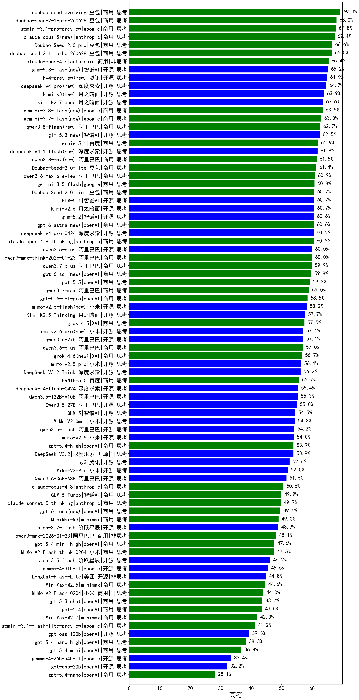

|类别|机构|大模型|【高考】准确率|平均耗时|平均消耗token|花费/千次（元）|排名（准确率）|
|---|---|-----|-------------------|-------|-----------|-----------|-----------|
|商用|豆包|doubao-seed-evolving(new)|69.3%|323s|13345|394.4|1|
|商用|豆包|doubao-seed-2-1-pro-260628(new)|68.0%|346s|14348|424.6|2|
|商用|google|gemini-3.1-pro-preview|67.8%|66s|3731|302.3|3|
|商用|anthropic|claude-opus-5(new)|67.4%|17s|1173|160.7|4|
|商用|豆包|Doubao-Seed-2.0-pro|66.6%|322s|1617|22.7|5|
|商用|豆包|doubao-seed-2-1-turbo-260628(new)|66.5%|272s|11713|172.8|6|
|商用|anthropic|claude-opus-4.6|65.4%|19s|1044|140.4|7|
|开源|智谱AI|glm-5.3-flash(new)|65.2%|191s|7398|20.3|8|
|开源|腾讯|hy4-preview(new)|64.9%|128s|7555|133.5|9|
|开源|深度求索|deepseek-v4-pro(new)|64.7%|117s|3797|97.7|10|
|开源|月之暗面|kimi-k3(new)|63.9%|116s|2430|221.3|11|
|开源|月之暗面|kimi-k2.7-code(new)|63.6%|83s|3211|82.7|12|
|商用|google|gemini-3.8-flash(new)|63.5%|20s|1670|78.7|13|
|商用|google|gemini-3.7-flash(new)|63.0%|12s|1324|30.3|14|
|商用|腾讯|hunyuan-2.0-instruct-20251111|62.9%|27s|1108|1.9|15|
|商用|阿里巴巴|qwen3.8-flash(new)|62.7%|98s|5848|15.3|16|
|开源|智谱AI|glm-5.3(new)|62.5%|195s|6768|185.4|17|
|商用|百度|ernie-5.1|61.9%|63s|2523|42.5|18|
|开源|深度求索|deepseek-v4.1-flash(new)|61.8%|32s|3221|24.5|19|
|商用|阿里巴巴|qwen3.8-max(new)|61.5%|114s|5043|175.7|20|
|商用|豆包|Doubao-Seed-2.0-lite|61.4%|328s|1744|5.5|21|
|商用|阿里巴巴|qwen3.6-max-preview|60.9%|111s|3519|180.8|22|
|商用|google|gemini-3.5-flash|60.8%|18s|3032|179.8|23|
|商用|豆包|Doubao-Seed-2.0-mini|60.7%|411s|4035|7.6|24|
|开源|智谱AI|GLM-5.1|60.7%|287s|4725|109.8|25|
|开源|月之暗面|kimi-k2.6|60.7%|258s|5239|136.9|26|
|开源|智谱AI|glm-5.2(new)|60.6%|123s|5724|156.1|27|
|商用|openAI|gpt-6-astra(new)|60.6%|17s|563|131.8|28|
|开源|深度求索|deepseek-v4-pro-0424|60.5%|103s|3388|79.0|29|
|商用|腾讯|hunyuan-2.0-thinking-20251109|60.5%|47s|2993|11.3|30|
|商用|anthropic|claude-opus-4.8-thinking(new)|60.5%|21s|1766|264.6|31|
|商用|豆包|doubao-seed-1-8-251215|60.2%|41s|1330|8.9|32|
|开源|阿里巴巴|qwen3.5-plus|60.0%|69s|5904|27.5|33|
|商用|阿里巴巴|qwen3-max-think-2026-01-23|60.0%|271s|5988|58.2|34|
|商用|阿里巴巴|qwen3.7-plus(new)|59.9%|109s|5972|46.5|35|
|商用|openAI|gpt-5.5|59.2%|26s|1198|210.6|36|
|商用|阿里巴巴|qwen3.7-max|59.0%|65s|3558|123.2|37|
|商用|google|gemini-3-flash-preview|59.0%|107s|3773|76.6|38|
|商用|openAI|gpt-5.6-sol-pro(new)|58.5%|33s|5728|511.8|39|
|开源|月之暗面|Kimi-K2.5-Thinking|57.7%|464s|5708|116.6|40|
|商用|XAI|grok-4.5(new)|57.5%|99s|5015|199.2|41|
|开源|阿里巴巴|qwen3.6-27b|57.1%|70s|4713|81.8|42|
|商用|阿里巴巴|qwen3.6-plus|57.0%|84s|4109|47.3|43|
|商用|XAI|grok-4.6(new)|56.7%|230s|4046|158.5|44|
|开源|小米|mimo-v2.5-pro|56.4%|82s|4359|85.1|45|
|开源|深度求索|DeepSeek-V3.2-Think|56.2%|190s|3256|9.6|46|
|商用|阿里巴巴|qwen-plus-think-2025-12-01|55.7%|122s|4709|36.1|47|
|商用|百度|ERNIE-5.0|55.7%|289s|4821|112.3|48|
|开源|深度求索|deepseek-v4-flash-0424|55.4%|70s|2732|5.3|49|
|开源|阿里巴巴|Qwen3.5-122B-A10B|55.3%|442s|6735|42.0|50|
|开源|阿里巴巴|qwen3-next-80b-a3b-thinking|55.3%|176s|5303|20.6|51|
|开源|阿里巴巴|Qwen3.5-27B|55.0%|457s|6685|31.2|52|
|开源|智谱AI|GLM-5|54.5%|203s|5257|91.8|53|
|开源|小米|MiMo-V2-Omni|54.3%|401s|3444|43.1|54|
|商用|阿里巴巴|qwen3-max-preview-think|54.3%|218s|4644|107.6|55|
|开源|阿里巴巴|qwen3.5-flash|54.2%|451s|6836|13.3|56|
|开源|小米|mimo-v2.5|54.0%|55s|3506|44.0|57|
|商用|openAI|gpt-5.4-high|53.9%|36s|1795|168.1|58|
|开源|深度求索|DeepSeek-V3.2|53.9%|88s|960|2.7|59|
|开源|美团|LongCat-Flash-Thinking-2601|53.7%|193s|6194|0.0|60|
|开源|腾讯|hy3(new)|52.6%|75s|597|1.8|61|
|开源|小米|MiMo-V2-Pro|52.0%|216s|2517|46.5|62|
|开源|阿里巴巴|Qwen3.6-35B-A3B|51.6%|84s|3875|40.0|63|
|商用|anthropic|claude-opus-4.8(new)|50.6%|10s|866|107.1|64|
|商用|智谱AI|GLM-5-Turbo|49.9%|75s|4604|97.9|65|
|商用|anthropic|claude-sonnet-5-thinking(new)|49.7%|26s|2006|122.7|66|
|商用|minimax|MiniMax-M3(new)|49.0%|135s|4047|63.3|67|
|开源|阶跃星辰|step-3.7-flash(new)|48.9%|82s|6128|48.3|68|
|开源|小米|MiMo-V2-Flash-think|48.9%|101s|4861|0.0|69|
|商用|阿里巴巴|qwen3-max-2026-01-23|48.1%|126s|1701|15.4|70|
|商用|openAI|gpt-5.4-mini-high|47.6%|100s|2756|80.7|71|
|开源|Mistral|mistral-large-2512|47.6%|19s|1032|9.2|72|
|商用|小米|MiMo-V2-Flash-think-0204|47.5%|615s|4380|8.9|73|
|商用|阿里巴巴|qwen-plus-2025-12-01|47.5%|48s|2099|3.9|74|
|开源|小米|MiMo-V2-Flash|47.2%|63s|1606|0.0|75|
|开源|阶跃星辰|step-3.5-flash|46.2%|54s|6821|14.0|76|
|商用|openAI|gpt-5.2-high|46.1%|34s|1499|128.7|77|
|开源|智谱AI|GLM-4.7|45.8%|128s|4641|62.8|78|
|开源|google|gemma-4-31b-it|45.5%|111s|888|2.1|79|
|商用|openAI|gpt-5.2-medium|45.1%|21s|1119|90.9|80|
|开源|美团|LongCat-Flash-Lite|44.8%|314s|1719|0.0|81|
|商用|minimax|MiniMax-M2.5|44.6%|70s|3851|31.0|82|
|商用|小米|MiMo-V2-Flash-0204|44.0%|377s|1510|2.8|83|
|商用|openAI|gpt-5.3-chat|43.7%|22s|803|58.6|84|
|商用|openAI|gpt-5.4|43.5%|10s|599|42.4|85|
|商用|minimax|MiniMax-M2.7|42.0%|106s|4569|37.0|86|
|商用|google|gemini-3.1-flash-lite-preview|41.2%|18s|726|5.8|87|
|开源|openAI|gpt-oss-120b|39.3%|96s|1245|3.3|88|
|商用|openAI|gpt-5.4-nano-high|38.3%|84s|1876|14.7|89|
|商用|minimax|MiniMax-M2.1|37.0%|156s|4504|36.4|90|
|商用|openAI|gpt-5.2|36.8%|9s|524|31.8|91|
|商用|openAI|gpt-5.4-mini|36.8%|47s|518|10.2|92|
|开源|智谱AI|GLM-4.7-Flash|34.2%|1430s|10356|0.0|93|
|开源|google|gemma-4-26b-a4b-it|33.4%|96s|1096|2.6|94|
|开源|Mistral|Ministral-3-14B-Instruct-2512|33.1%|22s|2288|3.3|95|
|开源|Mistral|Ministral-3-3B-Instruct-2512|32.6%|18s|2862|2.0|96|
|开源|openAI|gpt-oss-20b|32.2%|127s|2141|2.2|97|
|开源|Mistral|Ministral-3-8B-Instruct-2512|28.5%|19s|2343|2.5|98|
|商用|openAI|gpt-5.4-nano|28.1%|35s|602|3.6|99|

