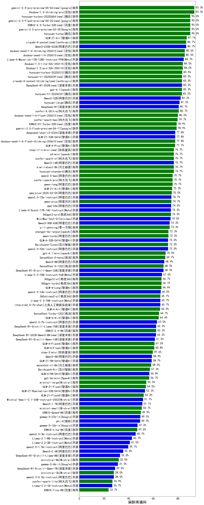

|类别|机构|大模型|【麻醉疼痛科】准确率|平均耗时|平均消耗token|花费/千次（元）|排名（准确率）|
|---|---|-----|-------------------|-------|-----------|-----------|-----------|
|开源|阿里巴巴|qwen3-235b-a22b-thinking-2507(new)|100.0%|103s|2667|51.6|1|
|商用|豆包|doubao-seed-1-6-thinking-250715(new)|100.0%|35s|1108|8.2|2|
|商用|阿里巴巴|qwen-plus-2025-07-14(new)|100.0%|14s|598|1.1|3|
|开源|智谱AI|GLM-4.5(new)|93.3%|66s|2033|27.5|4|
|商用|科大讯飞|xunfei-spark-x1-0725(new)|93.3%|/|933|11.2|5|
|商用|阿里巴巴|qwen-turbo-2025-07-15(new)|93.3%|8s|455|0.2|6|
|开源|阿里巴巴|qwen3-235b-a22b-instruct-2507(new)|93.3%|15s|640|4.5|7|
|开源|月之暗面|kimi-k2-0711-preview(new)|93.3%|37s|648|9.4|8|
|开源|阿里巴巴|Qwen3-235B-A22B-nothink|93.3%|21s|509|4.4|9|
|商用|百度|ERNIE-4.5-Turbo-32K|90.0%|23s|578|1.7|10|
|商用|anthropic|claude-4-sonnet-thinking|90.0%|48s|1226|121.0|11|
|商用|腾讯|hunyuan-turbos-20250604|88.3%|44s|456|0.8|12|
|商用|豆包|doubao-seed-1-6-250615|88.3%|79s|477|3.1|13|
|商用|豆包|doubao-seed-1-6-thinking-250615|88.3%|31s|1304|9.9|14|
|商用|anthropic|claude-4-sonnet|86.7%|44s|622|55.4|15|
|开源|meta|Llama-4-Maverick-17B-128E-Instruct-FP8|86.7%|7s|520|2.0|16|
|商用|google|gemini-2.5-pro(new)|86.7%|32s|2385|167.9|17|
|商用|智谱AI|GLM-4.5-Flash(new)|86.7%|26s|1477|0.0|18|
|商用|腾讯|hunyuan-t1-20250711(new)|86.7%|40s|2253|8.6|19|
|开源|华为|pangu-pro-moe(new)|86.7%|83s|1478|5.6|20|
|商用|豆包|Doubao-1.5-lite-32k-250115|84.0%|7s|187|0.1|21|
|商用|豆包|Doubao-1.5-pro-32k-250115|84.0%|10s|365|0.6|22|
|商用|XAI|grok-4-0709(new)|83.3%|346s|1398|144.2|23|
|开源|百度|ERNIE-4.5-300B-A47B(new)|83.3%|28s|325|2.1|24|
|商用|智谱AI|GLM-Z1-Air|83.3%|50s|1458|0.7|25|
|商用|openAI|gpt-4.1|83.3%|10s|335|15.0|26|
|商用|阿里巴巴|qwen-plus-think-2025-04-28|83.3%|122s|2036|15.7|27|
|商用|百度|ERNIE-X1-Turbo-32K|81.7%|110s|2104|8.2|28|
|商用|豆包|doubao-seed-1-6-flash-250615|81.7%|4s|293|0.3|29|
|开源|深度求索|DeepSeek-R1-0528|81.7%|246s|1858|28.8|30|
|商用|科大讯飞|xunfei-spark-x1|81.7%|45s|1300|15.6|31|
|开源|阿里巴巴|Qwen3-32B|81.7%|30s|1139|4.3|32|
|开源|minimax|MiniMax-M1(new)|81.7%|172s|2276|16.9|33|
|开源|腾讯|hunyuan-large|81.3%|13s|360|3.7|34|
|商用|科大讯飞|xunfei-4.0Ultra|80.7%|5s|132|9.3|35|
|开源|阿里巴巴|Qwen3-32B-nothink|80.0%|23s|608|2.1|36|
|商用|google|gemini-2.5-flash(new)|80.0%|11s|1892|33.0|37|
|商用|阿里巴巴|qwen-plus-2025-04-28|80.0%|165s|483|0.9|38|
|开源|阿里巴巴|Qwen3-235B-A22B|80.0%|137s|1982|19.2|39|
|开源|深度求索|deepseek-chat-v3-0324|80.0%|145s|357|2.4|40|
|开源|阿里巴巴|Qwen3-30B-A3B-Instruct-2507(new)|80.0%|6s|778|2.1|41|
|开源|智谱AI|GLM-4.5-Air(new)|80.0%|27s|1513|8.6|42|
|开源|阿里巴巴|Qwen3-30B-A3B-Thinking-2507(new)|80.0%|84s|3456|9.5|43|
|开源|阿里巴巴|Qwen3-14B-nothink|80.0%|22s|649|1.1|44|
|商用|科大讯飞|xunfei-spark-max|79.7%|5s|136|4.1|45|
|开源|智谱AI|GLM-Z1-32B-0414|78.3%|186s|2142|8.3|46|
|商用|智谱AI|GLM-Z1-AirX|78.3%|27s|1865|12.5|47|
|商用|豆包|doubao-seed-1-6-flash-thinking-250615|78.3%|7s|577|0.7|48|
|商用|智谱AI|GLM-4-Plus|77.7%|16s|292|1.5|49|
|商用|阿里巴巴|qwen-turbo-think-2025-04-28|76.7%|163s|2299|6.7|50|
|开源|智谱AI|GLM-4-32B-0414|76.7%|22s|410|0.8|51|
|商用|腾讯|hunyuan-standard|76.7%|/|/|/|52|
|商用|月之暗面|kimi-latest-8k|76.7%|18s|513|6.2|53|
|商用|openAI|o4-mini|76.7%|35s|1086|32.2|54|
|开源|阿里巴巴|Qwen3-30B-A3B|76.7%|36s|1823|4.9|55|
|开源|阿里巴巴|Qwen3-14B|76.7%|32s|1741|3.4|56|
|商用|阿里巴巴|qwen2.5-max|75.7%|19s|462|3.9|57|
|商用|阿里巴巴|qwen-long-2025-01-25|75.7%|97s|376|0.6|58|
|商用|科大讯飞|xunfei-spark-pro|75.7%|/|/|/|59|
|商用|阿里巴巴|qwq-plus-2025-03-05|75.0%|65s|2696|10.6|60|
|开源|阿里巴巴|qwen2.5-72b-instruct|74.7%|12s|285|2.8|61|
|开源|阿里巴巴|qwq-32b|74.5%|49s|2613|15.4|62|
|商用|奇虎360|360gpt2-pro|74.3%|9s|259|1.0|63|
|开源|minimax|MiniMax-Text-01|74.0%|15s|906|7.3|64|
|商用|阶跃星辰|step-r1-v-mini|73.3%|216s|1868|14.4|65|
|开源|腾讯|Hunyuan-A13B-Instruct-nothink(new)|73.3%|13s|395|1.3|66|
|开源|meta|Llama-4-Scout-17B-16E-Instruct|73.3%|10s|616|1.2|67|
|商用|零一万物|yi-lightning|73.3%|/|/|/|68|
|商用|智谱AI|GLM-Z1-Flash|73.3%|23s|2168|0.0|69|
|商用|openAI|chatgpt-4o-latest|72.3%|/|/|/|70|
|商用|百川智能|Baichuan4-Turbo|72.0%|/|/|/|71|
|开源|阿里巴巴|qwen2.5-32b-instruct|72.0%|9s|260|1.2|72|
|商用|google|gemini-2.5-flash-lite-preview-06-17(new)|70.0%|2s|547|1.4|73|
|商用|openAI|gpt-4.1-mini|70.0%|10s|456|4.4|74|
|商用|XAI|grok-3-mini(new)|70.0%|149s|1191|4.2|75|
|开源|百度|ERNIE-4.5-21B-A3B(new)|70.0%|23s|309|0.0|76|
|商用|阿里巴巴|qwen-turbo-2025-04-28|70.0%|7s|455|0.2|77|
|商用|商汤|SenseChat-5-beta|69.7%|22s|349|6.1|78|
|开源|腾讯|Hunyuan-A13B-Instruct(new)|68.3%|54s|1149|4.4|79|
|开源|深度求索|DeepSeek-R1-Distill-Qwen-32B|68.3%|35s|749|0.9|80|
|商用|商汤|SenseChat-5-1202|68.3%|/|/|/|81|
|开源|阿里巴巴|Qwen3-8B-nothink|66.7%|115s|532|0.0|82|
|开源|阿里巴巴|Qwen3-4B-nothink|66.7%|14s|515|1.3|83|
|商用|奇虎360|360gpt-turbo|66.7%|/|/|/|84|
|商用|奇虎360|360gpt2-o1|66.7%|17s|332|13.8|85|
|商用|智谱AI|GLM-4-Long|66.6%|12s|365|0.4|86|
|开源|阿里巴巴|qwen2.5-14b-instruct|66.0%|11s|269|0.6|87|
|开源|上海人工智能实验室|internlm2_5-7b-chat|65.7%|/|/|/|88|
|商用|奇虎360|360zhinao2-o1|65.7%|/|/|/|89|
|商用|智谱AI|GLM-4-Air|65.5%|14s|276|0.1|90|
|开源|阿里巴巴|Qwen3-8B|65.0%|161s|4516|0.0|91|
|开源|智谱AI|GLM-4-9B-0414|65.0%|13s|482|0.0|92|
|商用|商汤|SenseChat-Turbo-1202|64.7%|/|/|/|93|
|商用|智谱AI|GLM-4-AirX|64.4%|10s|277|2.8|94|
|开源|深度求索|DeepSeek-R1-0528-Qwen3-8B|63.3%|294s|1733|0.0|95|
|开源|阿里巴巴|Qwen3-4B|63.3%|25s|2120|6.1|96|
|开源|阿里巴巴|qwen2.5-7b-instruct|63.0%|7s|299|0.3|97|
|商用|百度|ERNIE-3.5-8K|62.3%|25s|385|0.7|98|
|开源|深度求索|DeepSeek-R1-Distill-Qwen-14B|61.3%|/|/|/|99|
|商用|智谱AI|GLM-4-FlashX|61.0%|11s|313|0.0|100|
|商用|智谱AI|GLM-4-Flash|60.8%|7s|317|0.0|101|
|开源|阿里巴巴|Qwen3-30B-A3B-nothink|60.0%|15s|508|1.2|102|
|商用|阶跃星辰|step-2-mini|59.6%|7s|356|0.6|103|
|商用|百川智能|Baichuan4-Air|57.3%|/|/|/|104|
|商用|OpenAI|gpt-4o-mini|56.7%|/|/|/|105|
|开源|智谱AI|GLM-Z1-9B-0414|56.7%|104s|3197|0.0|106|
|开源|Mistral|Mistral-Small-3.1-24B-Instruct-2503|55.0%|/|/|/|107|
|商用|Mistral|mistral-large|54.3%|/|/|/|108|
|开源|智谱AI|GLM-Z1-Rumination-32B-0414|53.3%|23s|1189|3.1|109|
|开源|阿里巴巴|Qwen3-1.7B-nothink|53.3%|11s|508|1.3|110|
|开源|阿里巴巴|Qwen3-1.7B|51.7%|22s|2192|6.3|111|
|商用|Mistral|mistral-small|50.7%|/|/|/|112|
|商用|百度|ERNIE-Speed-8K|49.9%|/|/|/|113|
|开源|Google|gemma-3-27b-it|49.5%|/|/|/|114|
|开源|微软|phi-4|49.3%|/|/|/|115|
|商用|智谱AI|GLM-Z1-FlashX|48.3%|26s|1705|0.3|116|
|开源|Google|gemma-3-12b-it|47.2%|/|/|/|117|
|商用|百度|ERNIE-Lite-8K|47.0%|/|/|/|118|
|开源|阿里巴巴|qwen2.5-3b-instruct|45.7%|6s|310|0.2|119|
|开源|阿里巴巴|qwen2.5-1.5b-instruct|39.7%|5s|171|0.0|120|
|开源|阿里巴巴|Qwen3-0.6B|33.3%|8s|1280|3.6|121|
|开源|阿里巴巴|Qwen3-0.6B-nothink|33.3%|7s|283|0.6|122|
|商用|Mistral|ministral-8b|32.0%|/|/|/|123|
|开源|Google|gemma-3-4b-it|31.3%|/|/|/|124|
|商用|Mistral|ministral-3b|28.0%|/|/|/|125|
|开源|阿里巴巴|qwen2.5-0.5b-instruct|28.0%|5s|309|0.0|126|
|商用|科大讯飞|xunfei-spark-lite|26.9%|/|/|/|127|
|商用|百度|ERNIE-Tiny-8K|23.7%|/|/|/|128|
|开源|百度|ERNIE-4.5-0.3B(new)|23.3%|40s|399|0.0|129|

