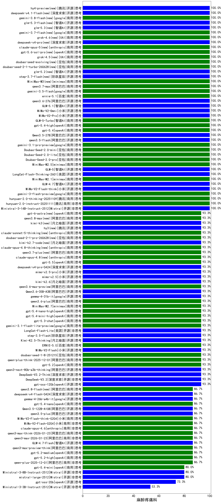

|类别|机构|大模型|【麻醉疼痛科】准确率|平均耗时|平均消耗token|花费/千次（元）|排名（准确率）|
|---|---|-----|-------------------|-------|-----------|-----------|-----------|
|开源|腾讯|hy4-preview(new)|100.0%|40s|2504|43.9|1|
|开源|小米|MiMo-V2-Pro|100.0%|81s|1143|19.3|2|
|商用|豆包|doubao-seed-evolving(new)|100.0%|304s|7833|232.0|3|
|商用|豆包|doubao-seed-2-1-turbo-260628(new)|100.0%|163s|5748|84.7|4|
|开源|智谱AI|glm-5.2(new)|100.0%|40s|1809|48.8|5|
|开源|智谱AI|GLM-5.1|100.0%|164s|1475|33.8|6|
|开源|智谱AI|GLM-5|100.0%|63s|1854|32.2|7|
|商用|minimax|MiniMax-M2.5|100.0%|34s|1638|13.0|8|
|开源|阶跃星辰|step-3.7-flash(new)|100.0%|30s|2566|20.2|9|
|商用|minimax|MiniMax-M3(new)|100.0%|29s|785|10.0|10|
|商用|豆包|Doubao-Seed-2.0-pro|100.0%|184s|882|12.5|11|
|商用|豆包|Doubao-Seed-2.0-lite|100.0%|168s|855|2.7|12|
|商用|豆包|Doubao-Seed-2.0-mini|100.0%|327s|1497|2.8|13|
|开源|阿里巴巴|qwen3.6-27b|100.0%|29s|1770|30.5|14|
|商用|google|gemini-3.1-pro-preview|100.0%|58s|1855|151.6|15|
|开源|阿里巴巴|qwen3.5-flash|100.0%|237s|3447|6.7|16|
|开源|阿里巴巴|Qwen3.5-27B|100.0%|330s|2763|12.9|17|
|商用|阿里巴巴|qwen3.7-max|100.0%|20s|1018|34.5|18|
|商用|google|gemini-3.5-flash|100.0%|8s|1417|84.5|19|
|商用|百度|ernie-5.1|100.0%|33s|897|15.0|20|
|商用|openAI|gpt-5.4|100.0%|5s|343|26.4|21|
|商用|智谱AI|GLM-5-Turbo|100.0%|35s|1519|32.0|22|
|开源|美团|LongCat-Flash-Thinking-2601|100.0%|215s|2372|0.0|23|
|商用|openAI|gpt-5.4-high|100.0%|10s|580|51.2|24|
|开源|智谱AI|glm-5.3-flash(new)|100.0%|83s|1757|4.7|25|
|开源|智谱AI|glm-5.3(new)|100.0%|63s|1720|46.3|26|
|商用|google|gemini-3.7-flash(new)|100.0%|10s|802|19.1|27|
|商用|腾讯|hunyuan-2.0-instruct-20251111|100.0%|11s|429|0.7|28|
|商用|腾讯|hunyuan-2.0-thinking-20251109|100.0%|14s|841|3.1|29|
|商用|XAI|grok-4.6(new)|100.0%|434s|1718|64.1|30|
|开源|深度求索|deepseek-v4-pro(new)|100.0%|23s|743|17.2|31|
|商用|minimax|MiniMax-M2.1|100.0%|91s|1381|10.9|32|
|商用|google|gemini-3.8-flash(new)|100.0%|25s|802|38.3|33|
|商用|anthropic|claude-opus-5(new)|100.0%|17s|721|106.9|34|
|开源|小米|MiMo-V2-Omni|100.0%|72s|1347|15.1|35|
|商用|google|gemini-3-flash-preview|100.0%|40s|1549|31.4|36|
|商用|openAI|gpt-5.6-sol-pro(new)|100.0%|30s|3354|254.6|37|
|商用|XAI|grok-4.5(new)|100.0%|89s|1676|62.3|38|
|开源|深度求索|deepseek-v4.1-flash(new)|100.0%|8s|1129|8.4|39|
|开源|小米|MiMo-V2-Flash-think|100.0%|27s|1893|0.0|40|
|开源|智谱AI|GLM-4.7|100.0%|49s|1831|24.7|41|
|开源|Mistral|Ministral-3-14B-Instruct-2512|100.0%|7s|661|0.9|42|
|商用|阿里巴巴|qwen3.6-max-preview|93.3%|58s|1799|93.2|43|
|开源|小米|mimo-v2.5|93.3%|27s|1469|16.8|44|
|商用|openAI|gpt-5.5|93.3%|7s|452|75.6|45|
|开源|深度求索|deepseek-v4-pro-0424|93.3%|65s|2077|48.9|46|
|开源|小米|mimo-v2.5-pro|93.3%|22s|1329|23.2|47|
|开源|月之暗面|kimi-k2.6|93.3%|77s|1615|41.9|48|
|开源|月之暗面|kimi-k2.7-code(new)|93.3%|20s|649|15.8|49|
|商用|anthropic|claude-opus-4.8(new)|93.3%|11s|633|91.6|50|
|商用|阿里巴巴|qwen3.7-plus(new)|93.3%|26s|1318|10.0|51|
|商用|anthropic|claude-opus-4.8-thinking(new)|93.3%|15s|890|136.5|52|
|商用|豆包|doubao-seed-2-1-pro-260628(new)|93.3%|240s|7489|221.7|53|
|商用|anthropic|claude-sonnet-5-thinking(new)|93.3%|14s|829|50.4|54|
|开源|腾讯|hy3(new)|93.3%|55s|270|0.8|55|
|开源|月之暗面|kimi-k3(new)|93.3%|36s|562|43.3|56|
|商用|阿里巴巴|qwen3.8-max(new)|93.3%|32s|1493|50.7|57|
|商用|openAI|gpt-6-astra(new)|93.3%|12s|296|73.0|58|
|开源|阿里巴巴|Qwen3.6-35B-A3B|93.3%|77s|2082|21.7|59|
|开源|openAI|gpt-oss-120b|93.3%|81s|750|2.0|60|
|商用|豆包|doubao-seed-1-8-251215|93.3%|22s|658|4.4|61|
|开源|google|gemma-4-31b-it|93.3%|62s|546|1.3|62|
|开源|阶跃星辰|step-3.5-flash|93.3%|19s|1473|3.0|63|
|开源|美团|LongCat-Flash-Lite|93.3%|167s|587|0.0|64|
|商用|阿里巴巴|qwen-plus-think-2025-12-01|93.3%|54s|2065|15.8|65|
|商用|百度|ERNIE-5.0|93.3%|235s|1952|45.5|66|
|商用|openAI|gpt-5.2|93.3%|10s|273|17.6|67|
|开源|小米|MiMo-V2-Flash|93.3%|180s|534|0.0|68|
|商用|google|gemini-3.1-flash-lite-preview|93.3%|7s|431|3.7|69|
|商用|openAI|gpt-5.3-chat|93.3%|17s|427|32.4|70|
|开源|阿里巴巴|qwen3-next-80b-a3b-thinking|93.3%|161s|3006|11.7|71|
|商用|openAI|gpt-5.4-mini-high|93.3%|111s|680|18.5|72|
|开源|深度求索|DeepSeek-V3.2-Think|93.3%|168s|1274|3.7|73|
|开源|深度求索|DeepSeek-V3.2|93.3%|65s|377|1.1|74|
|商用|openAI|gpt-5.4-nano-high|93.3%|12s|641|4.8|75|
|商用|minimax|MiniMax-M2.7|93.3%|60s|2440|19.8|76|
|商用|阿里巴巴|qwen3.6-plus|93.3%|34s|1640|18.8|77|
|开源|月之暗面|Kimi-K2.5-Thinking|93.3%|414s|1974|40.0|78|
|商用|openAI|gpt-5.2-medium|86.7%|8s|357|25.9|79|
|开源|google|gemma-4-26b-a4b-it|86.7%|56s|621|1.5|80|
|商用|openAI|gpt-5.2-high|86.7%|7s|438|34.0|81|
|商用|阿里巴巴|qwen-plus-2025-12-01|86.7%|21s|889|1.7|82|
|商用|阿里巴巴|qwen3.8-flash(new)|86.7%|30s|1904|4.9|83|
|商用|阿里巴巴|qwen3-max-think-2026-01-23|86.7%|182s|2904|28.3|84|
|商用|阿里巴巴|qwen3-max-preview-think|86.7%|156s|2293|53.3|85|
|开源|智谱AI|GLM-4.7-Flash|86.7%|915s|2571|0.0|86|
|商用|阿里巴巴|qwen3-max-2026-01-23|86.7%|54s|618|5.5|87|
|商用|anthropic|claude-opus-4.6|86.7%|15s|689|101.3|88|
|商用|小米|MiMo-V2-Flash-0204|86.7%|314s|618|1.1|89|
|商用|小米|MiMo-V2-Flash-think-0204|86.7%|847s|2136|4.3|90|
|开源|阿里巴巴|qwen3.5-plus|86.7%|34s|2609|12.2|91|
|开源|阿里巴巴|Qwen3.5-122B-A10B|86.7%|273s|3215|20.1|92|
|商用|openAI|gpt-5.4-nano|86.7%|88s|308|1.9|93|
|开源|深度求索|deepseek-v4-flash-0424|86.7%|33s|641|1.2|94|
|开源|Mistral|Ministral-3-8B-Instruct-2512|80.0%|7s|666|0.7|95|
|开源|Mistral|mistral-large-2512|80.0%|14s|577|5.2|96|
|商用|openAI|gpt-5.4-mini|80.0%|13s|300|6.6|97|
|开源|openAI|gpt-oss-20b|73.3%|13s|1435|1.5|98|
|开源|Mistral|Ministral-3-3B-Instruct-2512|53.3%|13s|1152|0.8|99|

