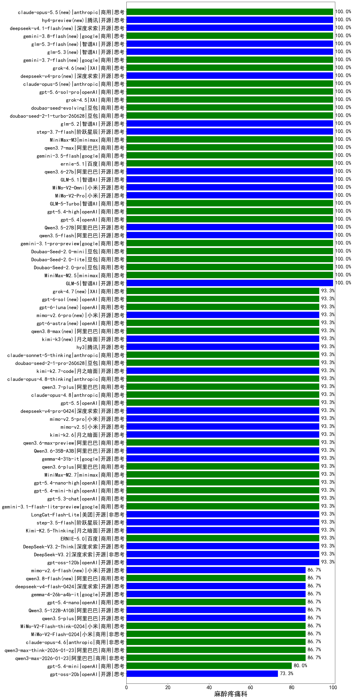

|类别|机构|大模型|【麻醉疼痛科】准确率|平均耗时|平均消耗token|花费/千次（元）|排名（准确率）|
|---|---|-----|-------------------|-------|-----------|-----------|-----------|
|商用|anthropic|claude-opus-5.5(new)|100.0%|42s|728|86.3|1|
|开源|阿里巴巴|qwen3.5-flash|100.0%|237s|3447|6.7|2|
|开源|深度求索|deepseek-v4-pro(new)|100.0%|23s|743|17.2|3|
|商用|google|gemini-3.5-flash|100.0%|8s|1417|84.5|4|
|商用|openAI|gpt-5.4|100.0%|5s|343|26.4|5|
|商用|openAI|gpt-5.4-high|100.0%|10s|580|51.2|6|
|商用|智谱AI|GLM-5-Turbo|100.0%|35s|1519|32.0|7|
|商用|openAI|gpt-5.6-sol-pro|100.0%|30s|3354|254.6|8|
|商用|XAI|grok-4.5|100.0%|89s|1676|62.3|9|
|开源|小米|MiMo-V2-Pro|100.0%|81s|1143|19.3|10|
|开源|小米|MiMo-V2-Omni|100.0%|72s|1347|15.1|11|
|商用|豆包|doubao-seed-evolving|100.0%|304s|7833|232.0|12|
|商用|豆包|doubao-seed-2-1-turbo-260628|100.0%|163s|5748|84.7|13|
|开源|智谱AI|GLM-5.1|100.0%|164s|1475|33.8|14|
|开源|智谱AI|glm-5.2|100.0%|40s|1809|48.8|15|
|开源|阶跃星辰|step-3.7-flash|100.0%|30s|2566|20.2|16|
|商用|minimax|MiniMax-M3|100.0%|29s|785|10.0|17|
|商用|阿里巴巴|qwen3.7-max|100.0%|20s|1018|34.5|18|
|开源|阿里巴巴|qwen3.6-27b|100.0%|29s|1770|30.5|19|
|开源|阿里巴巴|Qwen3.5-27B|100.0%|330s|2763|12.9|20|
|商用|anthropic|claude-opus-5(new)|100.0%|17s|721|106.9|21|
|商用|google|gemini-3.1-pro-preview|100.0%|58s|1855|151.6|22|
|开源|智谱AI|glm-5.3(new)|100.0%|63s|1720|46.3|23|
|开源|腾讯|hy4-preview(new)|100.0%|40s|2504|43.9|24|
|开源|深度求索|deepseek-v4.1-flash(new)|100.0%|8s|1129|8.4|25|
|商用|XAI|grok-4.6(new)|100.0%|434s|1718|64.1|26|
|开源|智谱AI|GLM-5|100.0%|63s|1854|32.2|27|
|商用|minimax|MiniMax-M2.5|100.0%|34s|1638|13.0|28|
|开源|智谱AI|glm-5.3-flash(new)|100.0%|83s|1757|4.7|29|
|商用|google|gemini-3.8-flash(new)|100.0%|25s|802|38.3|30|
|商用|百度|ernie-5.1|100.0%|33s|897|15.0|31|
|商用|google|gemini-3.7-flash(new)|100.0%|10s|802|19.1|32|
|商用|豆包|Doubao-Seed-2.0-pro|100.0%|184s|882|12.5|33|
|商用|豆包|Doubao-Seed-2.0-lite|100.0%|168s|855|2.7|34|
|商用|豆包|Doubao-Seed-2.0-mini|100.0%|327s|1497|2.8|35|
|开源|小米|mimo-v2.6-pro(new)|93.3%|104s|6029|35.9|36|
|商用|XAI|grok-4.7(new)|93.3%|37s|3467|108.5|37|
|商用|openAI|gpt-6-sol(new)|93.3%|121s|244|10.9|38|
|商用|anthropic|claude-opus-4.8|93.3%|11s|633|91.6|39|
|商用|openAI|gpt-6-luna(new)|93.3%|226s|637|1.9|40|
|商用|阿里巴巴|qwen3.7-plus|93.3%|26s|1318|10.0|41|
|开源|月之暗面|kimi-k3(new)|93.3%|36s|562|43.3|42|
|商用|anthropic|claude-opus-4.8-thinking|93.3%|15s|890|136.5|43|
|开源|月之暗面|kimi-k2.7-code|93.3%|20s|649|15.8|44|
|开源|腾讯|hy3|93.3%|55s|270|0.8|45|
|商用|豆包|doubao-seed-2-1-pro-260628|93.3%|240s|7489|221.7|46|
|商用|openAI|gpt-6-astra(new)|93.3%|12s|296|73.0|47|
|商用|anthropic|claude-sonnet-5-thinking|93.3%|14s|829|50.4|48|
|商用|阿里巴巴|qwen3.8-max(new)|93.3%|32s|1493|50.7|49|
|开源|openAI|gpt-oss-120b|93.3%|81s|750|2.0|50|
|商用|openAI|gpt-5.5|93.3%|7s|452|75.6|51|
|商用|openAI|gpt-5.4-nano-high|93.3%|12s|641|4.8|52|
|开源|深度求索|DeepSeek-V3.2|93.3%|65s|377|1.1|53|
|开源|深度求索|DeepSeek-V3.2-Think|93.3%|168s|1274|3.7|54|
|商用|百度|ERNIE-5.0|93.3%|235s|1952|45.5|55|
|开源|月之暗面|Kimi-K2.5-Thinking|93.3%|414s|1974|40.0|56|
|开源|阶跃星辰|step-3.5-flash|93.3%|19s|1473|3.0|57|
|开源|美团|LongCat-Flash-Lite|93.3%|167s|587|0.0|58|
|开源|深度求索|deepseek-v4-pro-0424|93.3%|65s|2077|48.9|59|
|商用|openAI|gpt-5.3-chat|93.3%|17s|427|32.4|60|
|商用|openAI|gpt-5.4-mini-high|93.3%|111s|680|18.5|61|
|商用|google|gemini-3.1-flash-lite-preview|93.3%|7s|431|3.7|62|
|商用|minimax|MiniMax-M2.7|93.3%|60s|2440|19.8|63|
|商用|阿里巴巴|qwen3.6-max-preview|93.3%|58s|1799|93.2|64|
|开源|小米|mimo-v2.5-pro|93.3%|22s|1329|23.2|65|
|开源|月之暗面|kimi-k2.6|93.3%|77s|1615|41.9|66|
|开源|阿里巴巴|Qwen3.6-35B-A3B|93.3%|77s|2082|21.7|67|
|开源|google|gemma-4-31b-it|93.3%|62s|546|1.3|68|
|商用|阿里巴巴|qwen3.6-plus|93.3%|34s|1640|18.8|69|
|开源|小米|mimo-v2.5|93.3%|27s|1469|16.8|70|
|商用|小米|MiMo-V2-Flash-think-0204|86.7%|847s|2136|4.3|71|
|商用|小米|MiMo-V2-Flash-0204|86.7%|314s|618|1.1|72|
|商用|阿里巴巴|qwen3.8-flash(new)|86.7%|30s|1904|4.9|73|
|商用|openAI|gpt-5.4-nano|86.7%|88s|308|1.9|74|
|商用|anthropic|claude-opus-4.6|86.7%|15s|689|101.3|75|
|开源|阿里巴巴|Qwen3.5-122B-A10B|86.7%|273s|3215|20.1|76|
|商用|阿里巴巴|qwen3-max-think-2026-01-23|86.7%|182s|2904|28.3|77|
|商用|阿里巴巴|qwen3-max-2026-01-23|86.7%|54s|618|5.5|78|
|开源|小米|mimo-v2.6-flash(new)|86.7%|165s|866|1.6|79|
|开源|阿里巴巴|qwen3.5-plus|86.7%|34s|2609|12.2|80|
|开源|深度求索|deepseek-v4-flash-0424|86.7%|33s|641|1.2|81|
|开源|google|gemma-4-26b-a4b-it|86.7%|56s|621|1.5|82|
|商用|openAI|gpt-5.4-mini|80.0%|13s|300|6.6|83|
|开源|openAI|gpt-oss-20b|73.3%|13s|1435|1.5|84|

